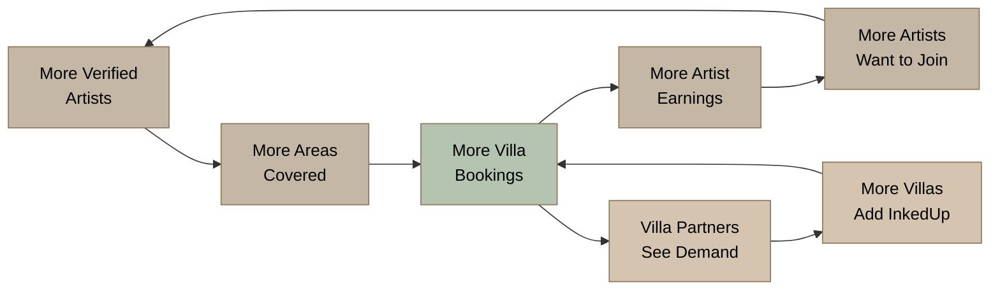
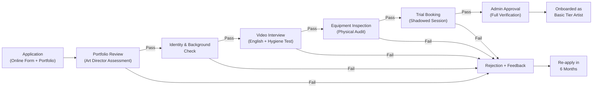
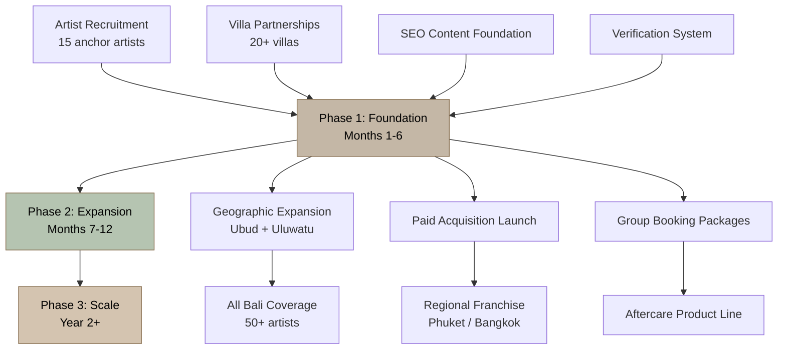
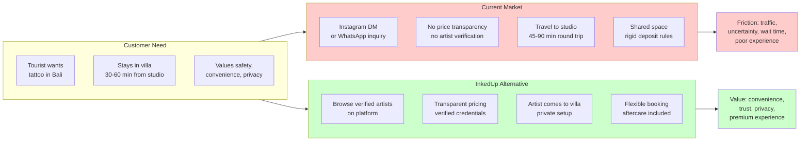

# 1. Executive Summary

Bali's tattoo market generates USD 25-40 million annually across 280-1,000 studios, yet operates without a single trusted brand, a single mobile service at scale, or a single regulatory safeguard.^1^ ^2^ ^3^InkedUp enters this structural vacuum as a commission-based marketplace that brings verified tattoo artists directly to tourists' villas, hotels, and events — premium concierge meets professional tattooing in the destination where tattoo tourism was born.

The opportunity is quantified, not speculative. Bali welcomed 6.33 million international tourists in 2024, exceeding its pre-pandemic record.^4^Australia alone sent 1.54 million visitors — 24.78% of all arrivals — and 30% of Australians now carry at least one tattoo, rising to 42% among Millennials.^5^ ^6^Hostelworld research confirms over 40% of travelers aged 18-35 have gotten a tattoo on a trip, with more than 50% of that group traveling abroad specifically to get tattooed.^7^ ^8^This Blue Book documents the complete operational blueprint for capturing this demand through a branded, mobile-first marketplace where verified artistry meets the villa-bound tourist.

---

## 1.1 The Opportunity

### 1.1.1 Bali's $25-40M Tattoo Market Is 90% Fragmented

Over 90% of Bali's tattoo studios are independent, unbranded operations with no chain affiliation, no quality standardization, and no central reputation system.^9^ ^3^Celebrity Ink — Asia-Pacific's largest chain with 25+ studios — operates only one location in Kuta.^10^ ^11^ink.inc, the island's most recognized premium brand, runs two luxury studios but has no mobile offering.^12^No brand owns more than a single-digit percentage of market awareness. Industry veterans estimate 90% of Bali tattoo shops are "money making scams" that pay commissions to taxi drivers to manipulate walk-in traffic.^9^This fragmentation creates three exploitable vulnerabilities: no brand transcends location, quality variation is so extreme that tourists arrive anxious, and no incumbent has invested in the technology layer — booking platform, artist verification, review aggregation — that would professionalize the market. InkedUp enters a field of individual combatants and introduces an organized system.

### 1.1.2 Tattoo Tourism Is Validated Behavior

The behavioral overlap between Bali's tourism pipeline and tattoo demand is striking. Close to 60% of Australians have expressed keen interest in getting a tattoo during their next trip abroad.^7^The price arbitrage is undeniable: a small tattoo costing AUD $150-350 in Sydney runs AUD $48-145 in Bali — a 50-70% saving.^13^Tattourism transforms tattoo from a pre-trip decision into an in-trip impulse, and impulses favor convenience. Tourists typically get tattooed at the end of their holidays to avoid sun and saltwater damage during healing,^1^ ^3^concentrating demand in the final 48-72 hours — precisely when travelers are least willing to navigate Bali's congested roads. A mobile service removes the single biggest friction point in the transaction.

### 1.1.3 Zero Mobile Competitors with Scale

Only one mobile tattoo competitor operates in Bali: Come To You Tattoo, a small operator with a dated website and no marketplace technology.^14^Every one of the 15+ major studios mapped in this Blue Book is location-bound. The villa service ecosystem compounds the gap — private chefs, massage therapists, yoga instructors, and personal trainers all travel to villas as routine,^15^ ^16^ ^17^yet tattoo appears on exactly zero concierge menus because no supplier has built the infrastructure to deliver it safely to a private residence.^18^ ^19^ ^20^ ^21^---

## 1.2 The Solution

### 1.2.1 Verified Artists Direct to Your Villa

InkedUp is a two-sided marketplace connecting verified tattoo artists with tourists in villas, managing the trust, safety, and logistics layers neither side can provide alone. The brand positioning — "Quiet Luxury meets Island Soul" — signals the three-way intersection moat: tattoo artistry + mobile concierge logistics + Bali destination expertise.^22^Studios have artistry but no mobility. Villa concierges have mobility but no tattoo expertise. Platforms like Tattoodo have technology but no local knowledge, and only ~10% of its artist base has passed verification.^17^Each competency is hard to build; together they form a fortress uncopyable without rebuilding from scratch.

The visual identity (Midnight Navy + Champagne Gold + Warm Ivory) borrows from luxury hospitality codes where deep blues increase perceived trustworthiness by 42%.^18^ ^23^Every "Book Now" button opens a pre-filled WhatsApp message, because WhatsApp is the operating system of Bali services — tourists do not download apps for one-time services.^24^### 1.2.2 Safety-First Positioning in a Regulatory Vacuum

Indonesia has no national tattoo legislation, no artist licensing, no mandated hygiene standards, and no inspection program.^25^ ^1^ ^26^The 2011 HIV transmission case linked to a Bali tattoo studio created a permanent trust deficit that no industry body has repaired.^27^This vacuum is InkedUp's single greatest advantage. By voluntarily adopting Australian- and UK-level safety protocols through an 11-point verification framework — targeting a 70-80% applicant rejection rate^22^ ^17^— InkedUp transforms safety from a cost center into the core brand differentiator. In Bali's tattoo market, safety is not table stakes — it is the #1 differentiator because it is not guaranteed.

---

## 1.3 The Business

### 1.3.1 Commission-Based Marketplace with Aligned Economics

The core revenue engine is a 20% commission per booking — benchmarked against Airbnb (15.5%), Glamsquad (20%), and Soothe (30%).^18^ ^25^ ^19^At an average booking value of IDR 3.5 million (~USD $207), the platform generates IDR 700,000 per transaction.^25^Artists keep 80% — a transformative ratio against the industry-standard 50-70% that studios offer.^28^ ^29^An artist completing just 10 monthly bookings earns IDR 26.8 million, 2.8x the average Bali artist salary of IDR 9.6 million per month.^30^### 1.3.2 Unit Economics: Group Bookings Unlock Profitability

The model projects a 75% gross margin and 13.7% contribution margin per booking — approximately IDR 480,000 after support and insurance costs.^31^At 20 bookings per month (Month 3 target), platform revenue reaches IDR 10.5 million. Group bookings transform these economics: one villa visit serving 3-5 clients generates 3-5x the revenue with nearly identical logistics cost. The LTV:CAC ratio targets above 3:1 through villa partnerships (near-zero CAC) and organic SEO, with paid acquisition supplementing in Phase 2.^32^### 1.3.3 90-Day Launch: Artists First, Then Villas, Then Paid Acquisition

The launch follows the universal marketplace playbook: build the harder side (artists) first.^33^ ^34^Weeks 1-4 establish legal entity, verification standards, and WhatsApp-native booking infrastructure. Weeks 5-6 recruit 15 verified anchor artists with a 0% commission introductory period. Weeks 7-10 publish location pages, cornerstone SEO content, and stress-test the booking flow. Weeks 11-12 soft-launch through villa partnerships, Instagram ads, and influencer collaborations. Month 3 targets 15 artists, 15 villa partnerships, and 20 completed bookings. Month 6 scales to 25 artists, 30 villas, and 50 bookings — the threshold for operational break-even.

---

## 1.4 Key Metrics at a Glance

| Metric | Value | Source / Basis |
|--------|-------|----------------|
| **MARKET** | | |
| Bali annual international tourists | 6.33 million (2024) | ^4^Bali Central Bureau of Statistics |
| Australian visitors (share) | 1.54 million (24.78%) | ^5^Bali tourism board |
| Bali tattoo market size | USD $25-40 million | ^1^ ^2^ ^3^Industry triangulation |
| APAC tattoo market CAGR | 12.6% | ^35^Cognitive Market Research |
| Travelers 18-35 with trip tattoos | 40%+ | ^7^Hostelworld |
| Bali villa inventory | 70,000+ listings | ^36^Industry estimates |
| **COMPETITIVE** | | |
| Mobile competitors with scale | 0 | ^14^Competitor mapping |
| Studio-bound major competitors | 15+ | ^9^ ^37^Ch 19 analysis |
| Market fragmentation | 90%+ independent/unbranded | ^9^|
| **FINANCIAL** | | |
| TAM | USD $50-80 million | Tourist × tattoo-interested × conversion |
| SAM | USD $15-25 million | Premium mobile-addressable segment |
| SOM Year 1 | USD $0.7-1.1 million | 15 anchor artists × 3 tattoos/day |
| Platform commission | 20% | Benchmarked: Glamsquad 20%, Soothe 30% |
| Artist payout | 80% | Vs. 50-70% industry standard |
| Avg. booking value | IDR 3,500,000 (~USD $207) | Weighted medium-tattoo pricing |
| Gross margin per booking | ~75% | After payment processing + artist payout |
| LTV:CAC target | >3:1 | ^32^Marketplace sustainability |
| **OPERATIONS** | | |
| Verification rejection rate | 70-80% target | ^22^ ^17^Soothe/Tattoodo benchmarks |
| Verification framework | 11-point | Portfolio, hygiene, BBP, practical assessment |
| Mobile safety protocol | 19-step | Australian/UK-equivalent standards |
| Customer segments | 6 distinct | Tourists, Nomads, Couples, Groups, Luxury, Retreats |
| **LAUNCH** | | |
| Timeline | 90 days | Artists → villas → paid acquisition |
| Month 3: completed bookings | 20 | Validates unit economics |
| Month 6: completed bookings | 50 | Path to operational break-even |
| Month 6: verified artists | 25 | Diverse style coverage |
| Month 6: villa partnerships | 30 | B2B2C distribution scaled |

These metrics distill 19 chapters, 10 research dimensions, and 200+ sources. Each figure is cross-verified across market, competitive, legal, and economic dimensions. The business case rests on the arithmetic of 6.33 million tourists, a 40% tattoo adoption rate among young travelers, a 90% fragmented market with zero mobile competitors at scale, and a regulatory vacuum that rewards the operator who defines the standard first.

The chapters that follow translate these numbers into operational reality — how to verify artists, script WhatsApp conversations, build villa partnerships, rank on Google, and scale from 20 bookings in Month 3 to a regional franchise in Year 3. The question is not whether the opportunity exists. It is whether InkedUp can execute fast enough to capture it.
# 2. Market Opportunity

## 2.1 Why Bali Is the Right Market

### 2.1.1 Tourism at Record Scale

Bali welcomed 6.33 million international visitors in 2024, exceeding the pre-pandemic peak of 6.28 million recorded in 2019 and cementing the island's position as Southeast Asia's most resilient tourism economy.^4^The momentum carried into 2025: arrivals from January through May reached 2.64 million, a 9.0% increase over the same period in 2024, putting the island on a trajectory to surpass 6.5 million international visitors for the full year.^5^Total visitor volume — domestic plus international — reached 16.4 million in 2024, a figure that underscores the sheer density of human traffic moving through an island of just 5,780 square kilometers.^4^These are not abstract statistics. They represent a captive audience of experience-seeking travelers with disposable income, time, and a demonstrated willingness to spend on discretionary activities. Tourism accounted for 21.75% of Bali's GDP in 2024 and supported 2.67 million jobs across hospitality, transport, and services.^35^The economic engine is running hot, and every sector that serves tourists — from beach clubs to wellness retreats — is capturing value from this inbound flow. The question is not whether enough people visit Bali, but whether any given service category has been optimized to serve them. Tattoo has not.

### 2.1.2 The Australian Pipeline

Australia is Bali's dominant source market by a wide margin. In 2024, 1.54 million Australians visited Bali, representing 24.78% of all international arrivals.^5^No other nationality comes close. This matters enormously for InkedUp because Australia is also one of the world's most tattoo-advanced cultures: three in ten Australians (30%) now have at least one tattoo, up from 20% in 2018, with prevalence reaching 42% among Millennials and 39% among Gen Z.^6^The same demographic that travels to Bali in the largest numbers is the demographic most likely to want a tattoo.

The behavioral overlap is striking. Hostelworld research found that close to 60% of Australians expressed keen interest in getting a tattoo the next time they travel — the highest rate of any nationality surveyed.^7^Australian-owned studios in Bali estimate that 85% of their clientele are Australians, with familiarity with Australian culture cited as a key success factor.^3^Rob Garcia of West Coast Ink put it plainly: "Tattoos in Bali are quite a bit cheaper than Australia, but I believe the artists are better too."^3^The price arbitrage is undeniable. A small tattoo costing AUD $150-350 in Sydney runs AUD $50-150 in Bali — a 60-70% saving.^13^A medium piece priced at AUD $1,500+ in Australia can be completed for AUD $600 in Bali.^1^For the price of a single sophisticated tattoo back home, many visitors can fund the tattoo, their airfare, and a portion of their trip.^38^This is not incidental spending. It is a core motivation for travel, and it creates a natural customer for a service that removes friction from the transaction.

### 2.1.3 The Villa Revolution

Bali's accommodation market has undergone a structural shift that directly enables InkedUp's operating model. Tourists are choosing private villas over hotels in accelerating numbers, driven by demand for privacy, space, and personalized experiences. Villa occupancy reached 85-90% during the 2024 high season, significantly outperforming hotels at 53-60%.^12^The Bali Villa Association confirmed that villa guests prioritize "more private atmosphere and facilities" and the ability to "explore the island independently."^25^The scale of the villa ecosystem is vast. Bali has 37,933 active Airbnb listings with an average daily rate of approximately $94 USD, and industry estimates place total villa inventory at over 70,000 listings by early 2025 — up 17.5% year-over-year.^36^Average annual occupancy sits at 52-65%, with significant variation by location.^36^In Canggu and Pererenan — InkedUp's core target areas — villa saturation is described as "critical," with year-on-year listing growth exceeding 40%.^39^This oversupply creates a differentiation imperative. Villa owners who once competed on price are now competing on experience — private chefs, in-villa spa treatments, floating breakfasts, yoga sessions, and personal drivers.^32^The villas that survive and thrive are those offering "a complete guest experience, not just a place to sleep."^32^Yet despite this arms race of amenities, one premium service category remains entirely absent from every villa concierge menu: tattoo.

## 2.2 The Tattoo Market in Bali

### 2.2.1 Market Size

Bali's tattoo market generates an estimated USD $25-40 million annually in service revenue, derived from 280-1,000 studios serving both tourist and domestic demand.^35^The range reflects the opacity of a market where formal registration (280-306 registered studios) captures only a fraction of actual operations; industry insiders estimate as many as 1,000 studios function on the island, many unregistered and operating informally.^1^ ^2^ ^3^To triangulate this estimate, studio-level economics provide a useful cross-check. The average tattoo shop globally generates $150,000-$400,000 in annual revenue, with solo studios at the lower end ($80,000-$180,000) and large operations with 6+ artists at the upper end ($500,000+).^40^Applying these benchmarks to Bali's studio count yields a conservative estimate of ~USD $28 million (280 studios at $100,000 average) and a moderate estimate of ~USD $40 million (500 studios at $80,000 average).^40^| Metric | Value | Source Triangulation |
|--------|-------|---------------------|
| Registered studios | 280-306 | ^1^ ^2^|
| Estimated total studios | ~1,000 | ^3^|
| Annual market size (conservative) | USD $25-28M | Studio count x avg. revenue |
| Annual market size (moderate) | USD $35-40M | Industry insider estimates |
| Avg. revenue per studio (small) | $80,000-$180,000 | ^40^|
| Avg. revenue per studio (mid) | $200,000-$400,000 | ^40^|
| Profit margin range | 15-35% | ^40^|

*Table 1: Bali Tattoo Market Sizing Framework. The $25-40M estimate represents service revenue only; upstream revenue from ink, equipment, aftercare products, and conventions adds a further 10-15%.*

This is not a niche market. It is a substantial, cash-generating industry that has grown organically without central coordination, quality standards, or brand leadership. That absence is the opportunity.

### 2.2.2 The Tattourism Wave

The convergence of travel and tattoo acquisition — "tattourism" — is no longer anecdotal. It is a quantified global trend with direct applicability to Bali. Research by Hostelworld found that more than 40% of travelers aged 18-35 have gotten a tattoo while on a trip, and over 50% of that group traveled abroad specifically to get tattooed.^7^ ^8^Among those who planned tattoo travel, one in three described the decision as spontaneous — made in-destination rather than pre-planned.^7^The implications are profound. Tattourism transforms tattoo from a pre-trip decision into an in-trip impulse, and impulses favor convenience. A tourist who decides on day three of a ten-day Bali trip that they want a fine-line piece on their ribs is unlikely to spend an hour in Canggu traffic visiting three studios for comparisons. They will book the option that comes to them.

Timing behavior reinforces this. Tourists typically get tattooed at the end of their holidays to avoid sun, salt water, and chlorine damage to fresh ink.^1^ ^3^This creates a natural demand concentration in the final 48-72 hours of a trip — precisely when travelers are least inclined to navigate Bali's notorious traffic to reach a studio. A mobile service that arrives at the villa on the last day removes the single biggest friction point in the entire transaction.

### 2.2.3 Global and Regional Growth Context

Bali's tattoo market operates within the fastest-growing regional context in the world. The Asia-Pacific tattoo market reached USD $495.47 million in 2024, representing approximately 23% of global revenue, and is projected to grow at a compound annual growth rate (CAGR) of 12.6% through 2031 — the highest rate of any region.^35^Southeast Asia specifically — the sub-region encompassing Bali — was valued at USD $34.19 million in 2024 and is projected to grow at 13.6% CAGR.^35^The global tattoo market was valued at USD $2.43 billion in 2025 and is projected to reach USD $5.99 billion by 2034, exhibiting a CAGR of 10.67%.^41^Multiple research firms confirm a consistent 9.5-10.7% growth band, with Asia-Pacific outstripping the global average by 200-300 basis points.^41^ ^42^The global tattoo convention tourism market alone — a subset of total tattoo spending — was valued at $1.8 billion in 2025 and is projected to reach $3.6 billion by 2033.^43^Australia, InkedUp's source market, is growing in parallel. The Australian tattoo market was valued at AUD $41.40 million in 2025 and is expected to grow at 11.40% CAGR to reach AUD $121.86 million by 2035.^44^The broader Australian tattoo studios industry generated AUD $400.1 million in revenue in 2023-24.^45^Every trend line points upward, and they all converge on a single island where Australian tourists arrive by the million, villas outnumber hotels, and no platform connects the demand to the supply.

## 2.3 Why the Market Is Ready for Disruption

### 2.3.1 Fragmented Supply

Bali's tattoo market is structurally fragmented. Over 90% of studios are independent, unbranded operations with no chain affiliation, no quality standardization, and no central reputation system.^9^Two Guns Tattoo Bali, an industry veteran with fourteen years of operation, described 90% of Bali tattoo studios as "money making scams" rather than professional operations — studios that pay commissions to taxi drivers and touts who manipulate tourists into walk-in appointments.^9^The competitive landscape reveals this fragmentation in detail. Celebrity Ink operates one studio in Kuta as its sole Bali presence — Asia-Pacific's largest chain with 25+ studios, yet barely present on the island where it should dominate.^10^ ^11^ink.inc runs two luxury studios in Canggu and Seminyak, positioning at the premium end but remaining studio-based with no mobile offering.^12^Artful Ink, Mason's Ink, Social Ink House, LOFT N5, TNT Tattoo, Canggu Ink Club, Quiet Ink Studio, and a dozen others each carve out their own niche, their own clientele, and their own patch of Google Maps.^25^ ^37^No brand owns more than a single-digit percentage of market awareness.

| Tattoo Size | Bali (AUD) | Sydney (AUD) | Savings |
|-------------|-----------|-------------|---------|
| Small (<5cm) | $48-145 | $150-350 | 50-70% |
| Medium (5-15cm) | $145-388 | $400-800 | 50-65% |
| Large (15cm+) | $388-970 | $1,000-2,000 | 50-60% |
| Full Sleeve | $970-2,420+ | $3,000-6,000+ | 60-70% |

*Table 2: Tattoo Price Comparison — Bali vs. Australia (2025-2026). Bali pricing sourced from Hustle Ink Tattoo and verified studio pricing pages.^13^Australian pricing represents Sydney metro averages.*

This fragmentation creates three exploitable vulnerabilities. First, no competitor has built a brand that transcends location. Tourists cannot name "the best tattoo studio in Bali" with any consensus because no studio has earned that position. Second, quality varies so dramatically that tourists arrive anxious — unsure who to trust, what to pay, or how to verify claims of "international standards." Third, the absence of a dominant player means no incumbent has the resources or incentive to build the technology layer (booking platform, artist verification, review aggregation) that would professionalize the market. InkedUp enters a field of individual combatants and introduces an organized system.

### 2.3.2 The Trust Deficit

Tourist fear is the single largest unaddressed pain point in Bali's tattoo market. The 2011 HIV transmission case linked to a Bali tattoo studio — widely reported in Australian media — created a permanent trust deficit that no industry body has systematically repaired.^27^Tourists today face a market with no government regulation, no licensing requirements, no mandatory hygiene inspections, and no recourse mechanism if something goes wrong.^46^Indonesia does not have a dedicated tattoo industry association or regulatory body; studios largely self-regulate through adherence to international hygiene standards that customers have no way to verify.^46^The practical consequences are visible in tourist behavior. Over 90% of travelers read online reviews before making a booking decision, and 52% would never book a service with no reviews.^2^Tourists evaluate tattoo studios through Google ratings, Instagram portfolios, and TripAdvisor threads — signals that are easily gamed. Some cheaper shops use Google and Pinterest images in their portfolios rather than their own work,^27^and pricing opacity is so common that one premium studio (Quiet Ink) was publicly accused of doubling a quoted price upon arrival, blaming an "Instagram mistake."^47^Bali traffic compounds the anxiety. A tourist staying in Uluwatu or Nusa Dua faces 45-60 minutes of unpredictable traffic to reach studios concentrated in Canggu, Seminyak, or Kuta.^48^ ^49^The journey itself becomes a deterrent, particularly for travelers on short trips who would rather spend their final hours by the pool than in the back of a Gojek.^49^### 2.3.3 The Missing Villa Service

The most compelling evidence that the market is ready is not what exists — it is what does not. Every premium in-villa service category that a villa guest might want is already available, bookable via WhatsApp, and normalized as part of the Bali experience. Private chefs prepare degustation dinners by the pool.^15^Mobile massage therapists bring portable tables and aromatherapy oils for same-day booking.^16^Yoga instructors, personal trainers, hair and makeup artists, and babysitters all travel to villas as a matter of routine.^17^ ^50^A comprehensive review of Bali's major concierge services — Bali Luxury Concierge, Bali Luxe Concierge, Bali Villa Escapes, and Bali Luxury Villas — confirms that tattoo and body art services appear on exactly zero menus.^18^ ^19^ ^20^ ^21^These concierges offer VIP airport fast track, private chauffeurs, exclusive dining, spa treatments, fitness training, golf, diving, surfing, and babysitting — but not tattoo.^18^ ^21^The service gap is not a minor omission. It is the only premium experiential category missing from the villa service ecosystem, and it exists because no supplier has built the infrastructure to deliver it safely and professionally to a private residence.

## 2.4 From Service to Marketplace

### 2.4.1 Two-Sided Marketplace Model

InkedUp is not a tattoo studio. It is a two-sided marketplace that connects verified tattoo artists (supply) with tourists in villas (demand), with the platform managing the trust, safety, and logistics layers that neither side can efficiently provide on its own.

On the supply side, the platform recruits, vets, and onboard artists who meet verified hygiene and portfolio standards. On the demand side, it captures tourists through villa partnerships, SEO, and concierge integrations, then converts them through a booking flow that eliminates the uncertainties that currently deter in-Bali tattoo purchases. The platform captures value through a commission on each booking — typically 20% in service marketplaces — while owning the customer relationship, the brand, and the quality assurance layer.

This model inverts the current power dynamic. Today, artists compete for walk-in traffic and Instagram visibility. Under a marketplace model, the platform competes for customers and allocates them to artists based on style match, availability, and location — creating a more efficient market where quality artists earn more and customers get better outcomes.

### 2.4.2 Network Effects

The marketplace flywheel is straightforward and self-reinforcing. More verified artists on the platform enable coverage of more villa areas, which increases the probability that any given tourist can book an artist to their specific location, which drives more bookings, which attracts more artists who want access to the demand pool. This is a classic local network effect, and in a geographically constrained island like Bali, the density required to reach critical mass is achievable within months, not years.

Villa partnerships amplify the effect. Each villa management company that adds InkedUp to its concierge menu exposes every guest to the service — a zero-marginal-cost distribution channel that scales with villa inventory rather than advertising spend. With 70,000+ villa listings and counting,^36^the addressable distribution base is already larger than any competitor's customer list.



*Chart 1: InkedUp Marketplace Flywheel — The self-reinforcing loop between artist supply, geographic coverage, villa partnerships, and booking volume. Each cycle strengthens the platform's competitive position and increases switching costs for both sides.*

### 2.4.3 Expansion Path

Bali is the beachhead, not the destination. The operational playbook developed on the island — artist verification, villa logistics, WhatsApp-native booking, trust architecture — is directly transferable to other Southeast Asian tourism markets with similar dynamics.

Phuket is the logical second market. Thailand's largest island receives 3-4 million international tourists annually, with Australians and Europeans comprising the core demographic.^11^Celebrity Ink started in Phuket in 2013 and now operates three studios there, including a 50-artist flagship on Bangla Road — proof that tattoo tourism scales in Thai beach destinations.^11^Bangkok follows as a third market: 20+ million annual visitors, an established tattoo culture, and a concentration of digital nomads and expats who represent repeat demand.

The Southeast Asia tattoo market was valued at USD $34.19 million in 2024 and is projected to grow at 13.6% CAGR — the fastest sub-regional rate globally.^35^Each market entry replicates the Bali model with localized artist recruitment and villa partnership development, while the technology platform, brand standards, and verification framework scale centrally. The result is a regional network where a tourist who books through InkedUp in Bali recognizes and trusts the same brand when they visit Phuket six months later — a brand continuity that no existing studio-based competitor can match.

The timing is specific and favorable. Bali's tourism economy is at record highs.^4^Tattoo prevalence in source markets is accelerating.^6^Villa culture has normalized in-villa service delivery.^15^ ^50^The competitive landscape remains fragmented with no dominant brand.^9^And exactly one mobile competitor operates in Bali — a small operator with a dated website, minimal brand presence, and no marketplace technology.^14^The window is open. The question is who walks through it first.
# 3. Core Positioning and Trust Framework

In a market where anyone can pick up a machine and call themselves an artist, where no government body inspects a studio, and where a single HIV case from a Kuta tattoo parlour still echoes through every tourist's mind fourteen years later, trust is not a feature. It is the product. ^35^This chapter defines what InkedUp is, what it is not, and why that distinction matters more than any marketing campaign ever could.

---

## 3.1 What Makes Us Different

### 3.1.1 Not a Studio. Not a Marketplace. A Concierge.

InkedUp occupies a category that does not yet exist in Bali: the premium mobile tattoo concierge. This distinction is not semantic — it is structural, operational, and psychological. The business is not a tattoo studio because it owns no studio space, employs no artists full-time, and does not compete on walk-in convenience. It is not a generic marketplace because it does not list every artist who applies, does not treat safety as the artist's responsibility, and does not expect the customer to coordinate, verify, or manage anything. ^25^Global parallels validate this model. Glamsquad built an $8 million annual business bringing vetted beauty professionals to homes and hotels at 20% commission. ^25^Soothe scaled to 66+ cities by rejecting over 30% of massage therapist applicants. ^22^Airbnb reached 600 million members by engineering trust through the formula: Trust = (Transparency x Verification x Insurance) / (Perceived Risk x Information Asymmetry). ^31^InkedUp applies the same playbook to tattooing in Bali.

The "three-way intersection" defines InkedUp's defensibility. Studios have artistry but no mobility. Villa concierges have mobility but no tattoo expertise. Platforms like Tattoodo have technology but no local Bali knowledge — Tattoodo manually verifies artists but only about 10% of its base has passed review. ^17^Only InkedUp combines all three into a single service layer. Each pillar is hard to build. Together they form a fortress.

### 3.1.2 Solving the Trust Problem That Kills the Market

The 2011 HIV case — in which a Western Australian tourist contracted HIV after getting tattooed in Bali, prompting WA Health Director Dr. Paul Armstrong to advise travellers to "wait until they get back to Australia" — created a permanent trust deficit. ^35^The Commonwealth Department of Health subsequently recommended that travellers avoid tattooing in countries where infection control practices are not as stringent as in Australia. ^41^This single event did not just damage one studio. It injected fear into the decision-making process of every tourist who has considered a Bali tattoo since.

That fear is rational. Indonesia has no specific national legislation governing tattooing, no artist licensing, no mandated hygiene standards, and no inspection program. ^25^ ^1^ ^26^By contrast, Australia requires tattoo establishments to notify local government, comply with Codes of Practice for Skin Penetration Procedures, and allows health officers to inspect premises with fines up to $1,000 plus daily penalties. ^51^The UK requires both practitioner and premises to be council-licensed, with unlimited fines for operating without a license. ^38^Indonesia has none of these safeguards.

This regulatory vacuum is InkedUp's single greatest competitive advantage. By voluntarily adopting Australian- and UK-level safety protocols and verifying every artist against standards Indonesian law does not require, InkedUp transforms safety from a cost center into the core brand differentiator. The business creates a standard where none existed — first-mover advantage in defining "verified tattoo artist" in Bali.

### 3.1.3 One Decision. Zero Coordination.

The customer's entire job is to decide they want a tattoo. InkedUp handles everything after that point: design discussion, artist matching, price estimate, availability, booking, deposit, location logistics, setup coordination, questions, aftercare follow-up, and review collection. This is why customers pay a premium. They are not buying needle time. They are buying peace of mind wrapped in convenience. In a destination where 6.33 million international tourists arrive annually — many staying in villas where private chefs and in-room massages are already normalized — the expectation of managed, concierge-level service is already established. Tattooing is simply the next logical category.

---

## 3.2 Verified Artists Only

### 3.2.1 The 11-Point Verification Framework

No artist works through InkedUp without passing every checkpoint in the verification framework. This is a non-negotiable standard, not a flexible guideline. The framework is designed to filter out the 70-80% of applicants who will not meet the threshold, making the approved roster a genuinely scarce and valuable asset.

| # | Verification Point | What We Check | Pass Criteria |
|---|-------------------|---------------|---------------|
| 1 | **Identity** | Government-issued ID, photo match, legal name verification | Verified against official document; no aliases without documentation |
| 2 | **Experience** | Minimum years of professional practice, employment history, apprenticeship records | 2+ years minimum; documented portfolio progression |
| 3 | **Portfolio Quality** | 20+ high-resolution photos of healed work across multiple styles | Consistent line quality, proper healing, artistic range; healed photos preferred over fresh |
| 4 | **Previous Work** | Studio employment verification, client references, guest artist history | Confirmed employment at legitimate studio or documented freelance history with client testimonials |
| 5 | **Customer Reviews** | Google, Instagram, TripAdvisor review analysis; reference checks | Minimum 4.0-star average across platforms; no unresolved complaints about safety or hygiene |
| 6 | **Professional Background** | Criminal background check, professional conduct history, industry reputation | Clean record; no disqualifying offences; positive industry standing |
| 7 | **Communication** | English fluency test, responsiveness trial, consultation simulation | Clear English sufficient for design discussion; responds within 4 hours during business hours |
| 8 | **Hygiene Knowledge** | Written test on cross-contamination prevention, bloodborne pathogen awareness, sterilization protocols | Pass score 85%+; demonstrates understanding of single-use principles and infection control |
| 9 | **Equipment Standards** | Inspection of tattoo machine, ink quality (certified international brands), needle sourcing, autoclave capability or single-use commitment | Only certified inks (StarBrite, Intenze, or equivalent); sealed sterile single-use needles; no exceptions |
| 10 | **Reliability** | Punctuality record, trial booking completion, professional conduct assessment | Zero no-shows during trial period; arrives with full mobile setup; professional demeanor |
| 11 | **Certifications** | Bloodborne Pathogen (BBP) certification, First Aid/CPR, infection control training (where available) | BBP certification mandatory within 30 days of joining; additional certifications are weighted positively |

This table is the operational backbone of InkedUp's quality promise. Each row represents a filter that eliminates unqualified applicants before they ever represent the brand. Soothe, the on-demand massage marketplace, rejects over 30% of therapist applicants and attributes its growth to this selectivity. ^22^Tattoodo, the largest global tattoo platform, has manually verified approximately 10% of its artist base after systematically cleaning up thousands of unverified profiles. ^17^InkedUp targets a 70-80% rejection rate — higher than Soothe, matching Tattoodo's cleanup ratio — because the stakes in tattooing (permanent body modification, bloodborne pathogen risk) demand greater selectivity than massage or beauty services.

### 3.2.2 No Artist Works Without Approval — Period

There are no exceptions, no fast tracks, no "friend of a friend" waivers. The moment InkedUp allows an unverified artist onto the platform, the trust architecture collapses. One infection, one design mistake, one no-show — and the brand becomes indistinguishable from the unregulated market it was built to replace.

The verification process takes 7-14 days: application submission, portfolio and documentation upload, hygiene knowledge test, and a trial booking where an InkedUp representative observes the full mobile setup in person. Only after all eleven checkpoints are satisfied does the artist receive verified status.

### 3.2.3 The Quality Moat: Scarcity as Strategy

A 70-80% rejection rate means that becoming an InkedUp Verified Artist is an accomplishment, not a given. This scarcity creates three strategic advantages. First, it signals to customers that the approved roster has been curated, not scraped. Second, it gives verified artists a credential they can leverage in their independent marketing — "InkedUp Verified" becomes a recognized quality mark in Bali's tattoo ecosystem. Third, it creates a barrier to entry for any competitor who wants to replicate the model: they would need to build the same verification infrastructure, reject the same proportion of applicants, and accept the same operational cost of quality control.

---

## 3.3 Safety First

### 3.3.1 The Sterile Setup Protocol

Safety is one of the primary reasons customers book through InkedUp, and every safety claim must be verified before it appears in any customer-facing communication. The following standards are non-negotiable for every session conducted through the platform:

**Single-use needles** from sealed sterile packages, opened fresh in front of the client. This is the #1 trust signal tourists look for when evaluating a tattoo service. ^18^**Fresh nitrile gloves** changed between every client contact. **Clean working surfaces** protected with medical-grade barrier film changed between sessions. **Professional ink handling** using only certified, internationally sourced inks dispensed into single-use caps from sealed bottles — never from bulk containers. **Equipment preparation** documented with pre-session and post-session photos uploaded to the platform for every booking.

These protocols align with international standards: disposable gloves changed for each client, single-use needles from sealed sterile packages, autoclave sterilization of reusable equipment where applicable, barrier films on all surfaces, proper sharps disposal in biohazard containers, and EPA-registered disinfectants. ^21^Where the mobile context introduces additional complexity — travel, variable environments, limited workspace — the standard rises, not falls.

### 3.3.2 Mobile Hygiene: Meeting or Exceeding Studio Standards

The mobile setup must meet or exceed Australian and UK studio requirements. Every verified artist arrives with a complete kit: tattoo machine (plus backup), sterile needle cartridges in sealed packaging, certified ink set (StarBrite, Intenze, or equivalent), nitrile gloves in multiple sizes, medical-grade surface barriers, professional cleaning products, LED lighting, portable work table, treatment chair where needed, and puncture-resistant sharps waste container.

Bali's tropical climate amplifies infection risks. High humidity increases bacterial risk. Direct sun degrades ink. Ocean water and pool exposure are leading causes of tattoo infections on the island. ^15^Sessions should occur in air-conditioned environments where possible, aftercare instructions must be Bali-specific (not generic templates from temperate-climate studios), and follow-up must address healing challenges unique to the island.

> **Every safety claim verified before publishing — no exceptions.** All safety-related marketing copy, website content, and customer communications must be reviewed and confirmed accurate. Any claim about sterilization, hygiene standards, or safety protocols must be backed by documented procedures. **[MUST VERIFY]** This must be confirmed by Indonesian legal counsel before going live.

### 3.3.3 Safety Communication Strategy

Trust is built by *showing* safety standards, not just having them. Detailed information about safety procedures reduces perceived risk more effectively than any other signal. ^52^Instagram Stories showing the setup process — wrapping surfaces, opening fresh needles — are cited by clients as a deciding factor when choosing where to get tattooed. ^53^One 30-second sterilization video has been referenced by at least a dozen clients as a booking factor. ^54^Safety communication operates on three channels: **pre-booking** (safety pages, hygiene credentials, healed work portfolio), **during session** (real-time documentation, fresh needle opening witnessed by client, barrier film application visible to customer), and **post-session** (written aftercare, WhatsApp follow-up at 24-48 hours, setup photos uploaded to platform).

---

## 3.4 We Come to the Customer

### 3.4.1 Service Where the Customer Already Is

The customer never travels to a studio. InkedUp brings the artist, equipment, setup, planning, and support to wherever the customer is staying: their villa, hotel suite, private home, event venue, retreat center, or group gathering location. This is not merely a convenience feature — it is a fundamental rearchitecting of how tattoo services are delivered to tourists in Bali.

The villa market context makes this model viable. Bali has 37,933 active Airbnb listings with an average daily rate of approximately $94 USD, concentrated in Seminyak, Canggu, Uluwatu, and Ubud. Villa occupancy ranges from 52-65% annually to 85-90% during high season. In-villa services — private chefs, massage therapists, yoga instructors — are already normalized. Villa managers coordinate everything via WhatsApp. ^31^Yet no existing concierge service offers tattooing. InkedUp fills a gap that villa guests do not even know exists until they see it.

### 3.4.2 The Full Mobile Kit

Every verified artist arrives with a complete professional kit. The goal: make the villa session feel as safe and clean as a premium studio in Sydney or London — without the travel, waiting, or uncertainty of an unfamiliar space in a foreign country.

**Mobile kit checklist**: tattoo machine (primary + backup), sterile needle cartridges in sealed packaging, certified ink set, nitrile gloves (multiple sizes), medical-grade surface barriers and disposable covers, professional cleaning products, LED lighting, portable work table, client chair or treatment bed, puncture-resistant sharps container, aftercare kit (Second Skin/Dermalize wrap + printed English instructions), and client consent form.

### 3.4.3 The Premium Villa Experience

The setup process itself is part of the brand experience. The artist arrives 15 minutes before the scheduled session time, introduces themselves, surveys the workspace, applies surface protection, arranges equipment in the client's view, opens needle packages fresh in front of the client, and walks through the safety checklist before beginning. This ritual — fifteen minutes of visible professionalism before any ink touches skin — is worth more than any marketing headline. It is the moment when trust transitions from promise to proof.

---

## 3.5 We Manage Everything

### 3.5.1 End-to-End Management: The Full Service Layer

The customer does not coordinate directly with the artist. They do not negotiate price. They do not arrange timing. They do not wonder if the artist will show up. InkedUp handles the entire sequence from first inquiry to final review:

**Pre-booking**: Design discussion via WhatsApp or call. Artist matching by style, availability, and location. Written price estimate with full breakdown. Backup artist assigned if primary is unavailable. Deposit collection and booking confirmation.

**Session day**: Location and setup needs confirmed. Artist dispatched with GPS tracking shared with the client. Real-time question support. Post-session photo documentation for quality verification.

**Post-session**: Written Bali-specific aftercare instructions delivered. WhatsApp follow-up at 24-48 hours. Review requested at 2 weeks when healed results are visible. Upsell for future bookings or touch-ups.

### 3.5.2 The Premium: Peace of Mind, Not Just a Tattoo

This is why customers pay a premium. The industry adage — "cheap tattoos aren't good and good tattoos aren't cheap" — applies with special force in Bali, where low prices signal cut corners. ^39^Research confirms 86% of consumers connect higher prices with higher quality; in an unregulated market, price becomes the most visible proxy for safety investment. ^32^InkedUp prices at a 20-30% premium over studio walk-in rates, still leaving the customer paying 40-50% less than in Australia — maintaining the Bali value proposition while capturing the convenience-trust premium.

### 3.5.3 Transparent Payment System

The payment flow mirrors the session process in clarity:

```
Price Estimate → Confirmation → Deposit → Balance → Artist Payout → Platform Commission
```

**Step 1**: Written price estimate with full breakdown. **Step 2**: Customer confirms artist and session time. **Step 3**: 25-30% deposit to secure booking (deposits reduce no-shows by 60-75%). ^55^**Step 4**: Balance paid before or after session per policy. **Step 5**: Artist paid after completed job. **Step 6**: Platform retains commission.

The customer must always understand: what is included, what is not, how the deposit works, cancellation policy (48-hour free cancellation; 50% forfeited for late cancellation within 24-48 hours; 100% for no-shows), rescheduling terms, who they are paying, and when the artist arrives. Every question answered before it is asked. Every policy in writing. Every transaction tracked on the platform.

---

## 3.6 The Mission

### 3.6.1 Safer, Easier, More Professional

The mission is straightforward: make getting a tattoo in Bali safer, easier, and more professional for tourists who do not know who to trust. Many tourists want a tattoo in Bali — prices 50-70% cheaper than Australia, the holiday mindset, and the desire for a permanent trip memory all drive demand. ^25^But the trust gap stops many from acting. InkedUp expands the market not by capturing share from existing studio customers, but by converting uncertain tourists who would otherwise leave Bali without the tattoo they wanted.

### 3.6.2 One Trusted Place

Build one trusted place where customers can book approved tattoo artists with professional support and clear safety standards. In a market of 280-1,000 studios — 90%+ of them independent and unbranded — the paradox of choice overwhelms tourists. ^25^They do not know which Google Maps review to trust, which Instagram portfolio is real, which studio is clean. InkedUp replaces that paralysis with a single point of entry: one website, one WhatsApp number, one process, one standard.

### 3.6.3 Never Cheap. Never Random. Always Concierge.

Every touchpoint must communicate premium positioning. The website does not look like a discount directory. The WhatsApp messages do not sound like a budget service. The artist does not arrive like a gig worker — they arrive like a professional consultant who happens to carry a tattoo machine. Verified artists. Clean setup. Clear process. Professional communication. Customer protection. Easy booking. Trust before, during, and after the tattoo.

The brand never looks cheap or random. It always feels like a high-end concierge service for tattoos in Bali — because that is exactly what it is.

---

## Brand Voice: Copy Examples

The following examples demonstrate the tone and positioning that must run through every customer touchpoint. Premium. Direct. Confident. Never apologetic about price. Always clear about standards.

> **Homepage Hero:**
> "Bali's Verified Tattoo Artists — Delivered to Your Villa. Every artist is approved. Every session is documented. Every needle is single-use, opened fresh in front of you. You make one decision. We handle everything else."

> **WhatsApp Reply to New Inquiry:**
> "Welcome to InkedUp. To match you with the right verified artist, could you share: your tattoo idea or reference, approximate size and placement, and which area of Bali you're staying in? We'll send you artist options and a price estimate within a few hours."

> **Safety Page Headline:**
> "Why We Verify Every Artist — So You Don't Have to Worry About Any of Them. Indonesia has no tattoo licensing law. We built our own. 11 checkpoints. 70-80% of applicants rejected. Zero exceptions."

> **Pricing Page:**
> "Premium service at Bali prices — still 40-50% less than you'd pay at home. Our artists earn more than they would at a studio. You get verified safety, full support, and the convenience of villa service. Everyone wins except the unregulated shops."

> **Booking Confirmation Message:**
> "Your booking is confirmed. Artist: [Name], Verified since [Date]. Session: [Date/Time] at [Location]. Deposit received: [Amount]. Balance due: [Amount]. You'll receive a pre-session checklist 24 hours before your appointment. Questions? Reply to this message anytime."

> **Aftercare Follow-Up (WhatsApp, 24 hours post-session):**
> "Hi [Name], checking in on your tattoo from yesterday. How is the healing going? Any questions about aftercare? Remember — no swimming or submerging for 14 days, especially important in Bali's climate. We're here if you need us."

---

*This chapter is the backbone of InkedUp. Every subsequent chapter — customer segments, pricing, operations, marketing, legal — flows from the positioning established here. The verification framework sets the quality bar. The safety protocol sets the trust standard. The concierge model sets the service expectation. The mission sets the cultural north star. Deviate from any of these, and the brand unravels. Execute on all of them, and InkedUp becomes the default choice for anyone who cares about what goes on their skin.*
# 4. Customer Segments

Bali's 6.33 million annual international tourists ^4^do not arrive as a monolithic mass. They arrive as honeymooners plotting matching tattoos, bachelor parties seeking stories they'll retell for decades, digital nomads settling in for six-month stretches, and luxury villa guests who expect white-glove service in every detail. Understanding these behavioral differences is not a marketing exercise — it is the operational foundation of InkedUp's booking flow, artist allocation, pricing tiers, and content strategy. Each segment has distinct fears, search patterns, booking triggers, and lifetime value profiles.

The 40% of travelers aged 18–35 who get tattoos while on trips ^7^represents InkedUp's core behavioral pool. But a tourist spending $150 per day ^56^and a digital nomad earning $55,000–$124,000 per year ^22^ ^15^require fundamentally different service architectures — the former needs a single-session convenience miracle; the latter needs a multi-session relationship spanning months.

---

## 4.1 Tourists (Short-Stay Visitors)

### 4.1.1 Profile

The typical short-stay tourist arrives for 3–7 days, spends $70–$150+ per day ^56^, and makes activity decisions reactively — often after arrival. With 6.33 million international arrivals and 30% of Australians now tattooed (up from 20% in 2018) ^6^, the volume arithmetic is compelling. Australians alone numbered 1.54 million visitors in 2024 ^5^, and close to 60% have expressed interest in travel tattoos ^7^. These tourists overwhelmingly choose villas for privacy ^25^, and 90%+ read reviews before booking any activity ^2^.

Bali tattoo prices 50–70% below Australian rates create a powerful spending trigger. A small tattoo costing AUD $150–350 in Sydney runs AUD $48–145 in Bali ^13^. But that same price gap fuels their primary fear: that cheap means unsafe.

### 4.1.2 What They Want and What They Fear

Short-stay tourists want convenience above all else. They have limited days, packed itineraries, and no bandwidth for studio research across Canggu traffic. They want one great tattoo, minimal planning friction, and an Instagram-worthy result they can post before their flight home. WhatsApp has become the dominant booking channel for villa services — guests send a message from their sunbed and services arrive ^13^— and tourists expect InkedUp to operate the same way.

Their fear hierarchy is safety-first. The 2011 HIV case linked to a Bali tattoo remains in collective memory, and tourists arriving without local knowledge cannot distinguish professional studios from commission-driven tourist traps. Tourists are advised to verify single-use needles, fresh ink, and hospital-grade disinfection before booking ^55^, yet the average short-stay visitor lacks the time or expertise to conduct this verification themselves. This fear — not price — is the primary conversion barrier.

### 4.1.3 Conversion Strategy

Tourists are reached through pre-arrival SEO and post-arrival villa concierge referrals. Landing pages targeting "safe tattoo Bali," "tattoo at villa Canggu," and "best tattoo artists Bali" capture high-intent traffic. Google reviews are non-negotiable: 52% of TripAdvisor users will not book a property with no reviews ^2^, and the same psychology applies to tattoo services. Every booking must be engineered to generate a review. Safety-first messaging — verified artists, documented hygiene protocols — belongs above every fold. The booking CTA should drive to WhatsApp, not a form. Tourists abandon forms; they complete WhatsApp conversations ^13^.

---

## 4.2 Digital Nomads

### 4.2.1 Profile

Bali's digital nomad population reached 40,000+ in 2024, with projections of 55,000+ by 2025 ^25^ ^12^. They cluster in Canggu, Berawa, Pererenan, Ubud, and Uluwatu ^27^— precisely InkedUp's service zones. Their median age is 36; 75% are Gen Z or Millennial; 56% male, 43% female ^22^. They earn $55,000–$124,000 annually ^22^ ^15^, with 46% reporting household income above $75,000 ^16^. Critically, they stay an average of 5.7 weeks per location ^21^, and many hold B211A visas valid for up to 180 days ^19^.

This is not a tourist segment. Digital nomads live in Bali. They have leases, coworking memberships at Dojo Bali or BWork ^27^, and stable housing for proper aftercare. One nomad customer can equal 3–4 tourists in lifetime value — they return for touch-ups, start multi-session pieces, and recommend within dense community networks.

### 4.2.2 What They Want and What They Fear

Nomads want multi-session pieces — sleeves, large custom work — that require the extended healing time their lifestyle provides. They want community-validated artist recommendations via WhatsApp groups and coworking bulletin boards, not Google Ads. They want to build a relationship with one artist and return for follow-up sessions. Nomad testimonials serve as dual-purpose social proof, validating InkedUp to both nomads and tourists simultaneously.

Their fear is quality inconsistency. A single botched tattoo mentioned in the Bali Canggu Founders group ^57^can reach hundreds of high-earning potential customers instantly. They also fear unprofessional artists who waste their limited hours with no-shows or design misalignment.

### 4.2.3 Conversion Strategy

Partnerships with coworking spaces (Dojo, BWork, Outpost, Tropical Nomad) place InkedUp in the physical path of nomads ^27^. A referral program — "Book 3 sessions, your 4th is half-price" — leverages tight nomad networks. Multi-session packages priced at 15% off individual bookings capture predictable revenue while the nomad's visa guarantees they'll complete the work. Content like "How to Plan a Sleeve During Your 6-Month Bali Stay" captures search intent no competitor addresses.

---

## 4.3 Couples

### 4.3.1 Profile

Honeymooners and anniversary travelers represent an emotionally driven booking segment. Couples booking villas prioritize privacy, shared experiences, and memory-making above all else ^1^. They decide during the trip, often spontaneously, and are not price-sensitive when the experience feels romantic and meaningful.

### 4.3.2 What They Want and What They Fear

Couples want matching or symbolic designs — coordinates of the villa where they married, Balinese symbols representing unity, complementary half-designs that form a whole. They want a romantic experience: a private session at their villa, perhaps at sunset, with professional photography of the moment. Privacy is paramount — they do not want to share this intimate experience with other clients in a studio waiting area.

Their fear is permanence regret. Unlike a solo traveler who owns their decision, a couple's tattoo is a shared commitment, and either partner's hesitation can kill the booking. They need design consultation that validates the concept, flexible rescheduling if one partner gets cold feet, and the assurance that both artists (if two are needed) will deliver matching quality.

### 4.3.3 Conversion Strategy

A dedicated couple's landing page — "Couple Tattoos in Bali: A Permanent Memory of Your Trip" — targets the emotional search intent. Package pricing (two tattoos, one session fee, complimentary photography) simplifies the decision. Positioning the experience as a "Bali memory" rather than a service booking elevates the perceived value. Photography partnerships with Bali-based content creators can capture the session for an additional revenue stream while providing the couple with shareable content.

---

## 4.4 Groups and Events

### 4.4.1 Profile

Bali is one of the most popular global destinations for bachelorette parties, with private villas and in-villa experiences forming the core package ^33^. Bachelor parties routinely book villa entertainment including private chefs, bartenders, DJs, and dancers ^34^. Wedding groups book entire villa estates for multi-day celebrations ^28^. These groups represent the highest revenue per session of any segment — a single villa visit serving five clients at IDR 2,000,000 each generates IDR 10,000,000 in one trip, covering the same logistics cost as a single-booking visit.

### 4.4.2 What They Want and What They Fear

Groups want discounts (but will pay full price if the experience is exceptional), a party atmosphere, multiple artists available simultaneously, and minimal coordination — ideally, one point of contact handles everything. They want the service to come to their villa because the group is already together and coordinating transport for five or more people to a studio is logistically painful.

Their fear is scheduling chaos. Group trips are loosely organized, and adding a tattoo appointment to an itinerary with boat cruises, beach clubs, and recovery days feels risky. The organizer fears being the person who "ruined the trip" by booking a bad experience. They also fear artists running late or being unable to accommodate the full group simultaneously.

### 4.4.3 Conversion Strategy

A dedicated group booking page with tiered pricing — "Groups of 4+: 10% off, Groups of 6+: 15% off" — incentivizes larger bookings. Partnerships with villa management companies and event coordinators (who already book private chefs and DJs for these groups) place InkedUp in the natural vendor ecosystem. Outreach to bachelorette and bachelor party planners should be a proactive sales function, not a passive wait. The booking flow for groups must include a group coordinator contact field — one person books for everyone, simplifying the decision chain.

---

## 4.5 Luxury Travelers

### 4.5.1 Profile

Luxury travelers in Bali stay in $500+/night villas, often through high-end concierge services like Bali Luxury Concierge or Bali Luxe Concierge ^18^ ^19^. They expect discretion, top-tier service, and zero friction. Notably, none of the major Bali concierge services currently offer tattoo or body art services ^18^ ^19^ ^20^ ^21^— a critical gap that InkedUp can fill through direct concierge partnerships.

This segment overlaps with villa guests but operates on different psychology. Where a mid-range tourist compares prices, a luxury traveler evaluates whether the service matches their expectation of effortless excellence. Premium pricing is not a barrier — it is a signal of quality. In the luxury segment, high price functions as a filter that confirms exclusivity.

### 4.5.2 What They Want and What They Fear

Luxury travelers want discretion: private consultations, exclusive artist access, no public waiting areas. They want top-tier artists with exceptional portfolios and a seamless experience — the artist arrives quietly, completes the work, departs with no trace. Premium pricing is expected; operational sloppiness is not tolerated.

Their fear is reputational exposure. A poorly executed tattoo on a high-profile individual becomes a story. They need confidentiality assurance and discreet handling of all booking data.

### 4.5.3 Conversion Strategy

Concierge partnerships are the primary channel. Bali Luxury Concierge, Bali Luxe Concierge, and high-end villa management companies should receive direct outreach with a dedicated luxury service brief. A private consultation process — video call with the artist, digital design mockups — demonstrates white-glove service. An exclusive artist roster via password-protected pages reinforces exclusivity. Pricing at IDR 3,000,000+ minimum filters non-luxury inquiries while signaling appropriate positioning.

---

## 4.6 Retreat and Wellness Groups

### 4.6.1 Profile

Bali's wellness tourism sector draws yoga retreat participants, spiritual travelers, and transformation-seeking visitors who view tattoo as a permanent marker of personal change. These groups often stay in retreat centers or villa compounds for 7–14 days, with structured schedules that include meditation, yoga, and ceremonial experiences. Wellness-focused villa travel is specifically designed for girl's trips and retreat groups, combining spa days and aesthetic, Instagram-worthy villas ^58^.

This segment views tattoo through a spiritual lens. For many travelers, a Bali tattoo "becomes a visual diary of those feelings... a reminder of sunsets in Uluwatu, quiet mornings in Ubud, or spontaneous adventures" ^17^. The retreat context amplifies this meaning-making: participants are already in a reflective, change-oriented headspace.

### 4.6.2 What They Want and What They Fear

Retreat participants want meaningful, symbolic designs — mandalas, Balinese spiritual motifs, Sanskrit mantras — connected to their retreat experience. They want a hygienic, calm environment that matches the wellness energy of their trip, and they respond positively to group energy: getting tattooed together as a cohort deepens the shared experience.

Their fear is energetic misalignment — a sterile or aggressive environment that clashes with the retreat's spiritual tone. They share universal safety concerns about hygiene ^55^, but with the added expectation that the space feel as intentional as the design itself.

### 4.6.3 Conversion Strategy

Partnerships with retreat organizers — yoga retreats, wellness coaches, spiritual guides — place InkedUp in the pre-arrival planning conversation. An artist specialization in spiritual and symbolic designs should be visible on the platform. Group session offerings, where an artist attends the retreat villa for an afternoon of individual appointments, create a seamless add-on to the retreat itinerary. Content targeting "spiritual tattoo Bali" and "meaningful tattoo symbols Bali" captures this segment's research phase.

---

## 4.7 Comprehensive Customer Segment Summary

The following table integrates all six segments with their targeting specifications. It serves as the operational reference for marketing spend allocation, landing page prioritization, and artist scheduling.

| Attribute | Tourists (Short-Stay) | Digital Nomads | Couples | Groups & Events | Luxury Travelers | Retreat & Wellness |
|---|---|---|---|---|---|---|
| **Population Size** | 6.33M annual arrivals ^4^; 40% of 18–35 tattoo-interested ^7^| 40,000–55,000 in Bali ^25^ ^12^; 3,000+ in Canggu core ^27^| Subset of 6.33M; honeymoon/anniversary segment | High-volume subsegment; bachelor parties + weddings ^33^ ^28^| Subset of villa guests in $500+/night properties | Growing wellness tourism segment ^58^|
| **Stay Duration** | 3–7 days | 5.7 weeks average ^21^; up to 6 months (B211A) ^19^| 5–10 days | 3–7 days | 5–14 days | 7–14 days |
| **Daily Spend** | $70–150+ ^56^| $1,800–5,000/month ^50^| $150–400+ | $200+/person/day (group villa split) | $500+/night accommodation alone | $100–200/day (retreat inclusive) |
| **Age Range** | 18–35 primary | Median 36; 75% Gen Z/Millennial ^22^| 25–40 | 25–35 | 30–55 | 25–45 |
| **Primary Want** | Convenience, one great tattoo, Instagram result | Multi-session pieces, artist relationship, community validation | Matching/symbolic designs, romantic experience, privacy | Group discount, party atmosphere, minimal coordination | Discretion, top-tier artist, zero hassle | Meaningful design, spiritual connection, group energy |
| **Primary Fear** | Safety/infection, wasting limited time | Quality inconsistency, wasted time | Permanence regret, partner disagreement | Scheduling chaos, ruining the trip | Reputational exposure, operational sloppiness | Energetic misalignment, hygiene concerns |
| **What They Search** | "safe tattoo Bali," "tattoo artist Canggu," "best tattoo studio Bali" | "tattoo artist Canggu long stay," "sleeve tattoo Bali," nomad group recs | "couple tattoo Bali," "matching tattoos honeymoon" | "group tattoo Bali," "bachelor party tattoo," "tattoo at villa" | Via concierge; direct referral; password-protected pages | "spiritual tattoo Bali," "meaningful tattoo symbols," "yoga retreat tattoo" |
| **Target Page** | Location landing pages (Canggu, Seminyak, Uluwatu) | Nomad-specific content + coworking partnerships | Dedicated couple's landing page | Group booking page with tiered pricing | Concierge-exclusive private pages | Retreat partner portal |
| **Conversion Offer** | WhatsApp booking + safety-first messaging | Multi-session package (15% off 3+ sessions) | Package for two + complimentary photography | 10–15% group discount + event coordinator outreach | Private consultation + exclusive artist roster | Group session at retreat villa + spiritual artist specialization |
| **Booking Channel** | WhatsApp (primary) ^13^| WhatsApp + coworking referral | WhatsApp + landing page form | Group coordinator (one contact) | Concierge partner + direct WhatsApp | Retreat organizer pre-books |
| **Lifetime Value** | Single session; ~IDR 1.5–3M | Multi-session; ~IDR 5–15M over 6 months | Dual booking; ~IDR 3–6M per couple | 3–8 people per booking; ~IDR 6–20M per group | Premium single session; ~IDR 5–10M; referrals to network | Group booking; ~IDR 4–12M per retreat |
| **Key Insight** | Safety messaging converts; reviews are mandatory | Community referral > advertising; LTV justifies acquisition spend | Emotion drives booking; experience design > price | Highest revenue per logistics trip; target proactively | Exclusivity signals quality; premium pricing filters | Spiritual framing differentiates from studio competitors |

**Segment Priority for Launch.** The data suggests a clear sequencing. Tourists provide immediate volume through SEO and villa partnerships but lower per-customer value. Digital nomads require more effort to reach but deliver 3–4x the lifetime value and serve as community amplifiers. Groups and events offer the best unit economics per artist trip and should be proactively pursued through event coordinator partnerships from Month 1. Luxury travelers and retreat groups depend on partnership infrastructure (concierge relationships, retreat organizer networks) that takes 2–3 months to establish and should follow the core segments. Couples, while emotionally compelling, are a subsegment reached through the same channels as tourists — the dedicated landing page captures them without requiring a separate acquisition channel.

The strategic truth: InkedUp does not need six separate businesses. A single mobile tattoo platform with segment-specific landing pages, pricing tiers, and partnership channels serves all six segments. What changes is the front door — the page they land on, the message they see, the booking flow they experience — while the back end (artist verification, safety protocols, WhatsApp coordination) remains consistent. This segmentation-by-interface approach keeps operations simple while making every customer feel understood.

---

*Sources: Dimension 1 (market data), Dimension 3 (tourist behavior & villa services), Dimension 7 (digital nomads & expats), cross-verification analysis. All demographic and behavioral data derived from 200+ independent sources across government tourism statistics, market research firms, industry publications, and academic papers.*
## 5. City and Area SEO Structure

### 5.1 SEO Strategy Overview

#### 5.1.1 Primary Keyword Strategy: "[Service] + [Location]" Combinations Across All Major Bali Areas

Tourists search for tattoo services the same way they search for spas and restaurants — by combining a service term with a geographic location. "[Service] + [location]" queries account for the majority of commercial-intent tattoo searches in Bali. ^26^ ^27^ ^22^ ^15^The keyword landscape follows a clear geographic hierarchy. "Tattoo Canggu" is the highest-volume location-specific term, with at least 8 major studios competing on Batu Bolong alone. ^26^"Tattoo Seminyak" ranks second, followed by "tattoo Ubud" and "tattoo Uluwatu." ^27^ ^22^ ^15^This mirrors tourist density, villa concentration, and nomad population across the island.

InkedUp does not compete for generic "tattoo Bali" (10,000–50,000 monthly searches) against 280+ studios. ^25^Instead, it targets service-location combinations competitors ignore or disparage — mobile, villa, and private tattoo services. Every location page targets three keyword layers:

- **Layer 1 — Location root**: "tattoo artist [area]" (high volume, high competition)
- **Layer 2 — Mobile modifier**: "mobile tattoo [area]" (low volume, almost no competition)
- **Layer 3 — Villa modifier**: "tattoo at villa [area]" (emerging volume, zero competition)

This layered approach ensures each page captures broad traffic through the root keyword while dominating the niche mobile and villa terms that define InkedUp's model. ink.inc validates this approach with dedicated Canggu and Seminyak studio pages ranking for location-specific terms. ^54^#### 5.1.2 "Mobile Tattoo Artist Bali" = #1 SEO Opportunity

The keyword "mobile tattoo artist Bali" represents the single highest-opportunity, lowest-competition term in the Bali tattoo SEO landscape. Exactly one dedicated mobile competitor exists: Come To You Tattoo Studio Bali, a small operator with a dated website, sparse portfolio, and virtually no social media presence. ^50^ ^14^Their Australian Health Standards training (TAFE Queensland HLTIN402C) validates the concept, but their execution leaves a massive gap. ^14^ ^59^The competitive signal is stronger than the competitor count suggests. Major studios — Two Guns Tattoo, Canggu Ink Club, ink.inc, Charlie Rose — actively publish anti-mobile content. Two Guns Tattoo states: "Unlike professional tattoo studios, hotel rooms or villas cannot maintain the high level of sterile environment required." ^57^This creates a rare dynamic: dominant voices produce content contradicting what a growing tourist segment wants. Bali Holiday Secrets confirms demand: "Some tattoo artists are mobile and are able to go through with your tattoo session while you're in the comfort of your own sanctuary." ^16^InkedUp's play is to own the pro-mobile narrative while addressing safety concerns competitors weaponize. A "How We Keep Mobile Tattooing Safe" page — explaining portable sterilization, medical-grade barriers, and protocols competitors claim impossible — captures search intent no other player serves. ^38^#### 5.1.3 Content Gap: Own the Mobile Safety Conversation

Several high-opportunity content gaps exist where no competitor has built authoritative content:

- **"Group tattoo booking Bali"** — No studio maintains a dedicated group booking page. Canggu Ink Club mentions group capability in passing only. ^31^- **"Bali tattoo aftercare tropical climate"** — Aftercare content exists but is generic. No studio comprehensively addresses healing in Bali's tropical conditions. ^32^- **"Female-friendly tattoo studio Bali"** — Solo female travelers are underserved. Only ink.inc mentions a "female-friendly environment" indirectly. ^39^- **"Private tattoo artist Bali"** — VIP clients seeking exclusive experiences find no dedicated content. Bloodline Tattoo's "appointment-only" messaging comes closest. ^5^InkedUp should publish authoritative content for each gap within 90 days, using FAQ schema to capture "People Also Ask" featured snippets.

---

### 5.2 Canggu (Highest Priority)

#### 5.2.1 Keywords: Tattoo Artist Canggu, Mobile Tattoo Canggu, Tattoo at Villa Canggu, Fine Line Tattoo Canggu

Canggu is InkedUp's highest-priority location by every metric — tattoo search volume, tourist density, nomad population, villa concentration, and competitor intensity. The area has overtaken Legian/Kuta as Bali's tattoo epicenter. ^26^**Primary keyword**: "tattoo artist Canggu"  
**Secondary keywords**: "mobile tattoo Canggu," "tattoo at villa Canggu," "fine line tattoo Canggu," "walk in tattoo Canggu"  
**Long-tail keywords**: "private tattoo artist Canggu," "tattoo at villa Berawa," "small tattoo Canggu price," "couple tattoo Canggu"

Search intent skews young, style-conscious, and digitally fluent. The average searcher is 22–35, discovered the idea on Pinterest or Instagram, and wants fine line or minimalist work. HALFMOON Tattoo starts fine line at IDR 2,000,000; Canggu Ink Club lists 10+ fine line artists with packages from IDR 1,000,000. ^17^ ^13^#### 5.2.2 Search Intent: Young, Style-Conscious Tourists and Nomads, Highest Tattoo Demand

#### 5.2.3 Page Structure — Optimized for Conversion

**Page title**: Mobile Tattoo Artist Canggu | Verified Artists to Your Villa | InkedUp  
**Meta description**: Skip the traffic. Book a verified tattoo artist directly to your Canggu villa. Fine line, realism, minimalist & custom styles. Australian-standard hygiene.  
**Hero headline**: *Your Villa. Your Artist. Your Tattoo.*  
**Hero subheadline**: Verified tattoo artists come to you in Canggu — Batu Bolong, Berawa, Echo Beach & Pererenan. No studio queues. No traffic. Just premium ink in your space.  
**Main CTA**: WhatsApp "Book Canggu" Button

> **Trust block**: "Verified by InkedUp" — Portfolio verified (work reviewed, not Google images), Hygiene certified (Australian-standard protocols), Reviews real (verified booking required), Insurance covered (every booking protected).

> **Safety section**: "Is it safe to get a tattoo at my villa?" — Yes, with a verified InkedUp artist. Medical-grade autoclave-sterilized tools, single-use needle cartridges, barrier film on all surfaces, HEPA-filtered setup zone. Two Guns Tattoo and Charlie Rose warn against mobile tattooing because *most* operators lack these protocols. ^57^ ^20^InkedUp artists have them — every session, every villa.

> **Artist block**: 4–6 verified Canggu-area artists with headshots, specialty tags (Fine Line, Realism, Minimalist, Geometric), starting price, portfolio links.

> **FAQ**: "How much does a tattoo cost in Canggu?" (IDR 1,500,000–5,000,000), "Is villa tattooing safe?" (yes with verified protocols), "Do you service Berawa?" (yes, all Canggu areas).

---

### 5.3 Seminyak (High Priority)

#### 5.3.1 Keywords: Tattoo Artist Seminyak, Mobile Tattoo Seminyak, Tattoo at Villa Seminyak

Seminyak is Bali's established luxury corridor. Studios here — Artful Ink (from IDR 1.8M per session, founded 2012), Seminyak Ink (established 2007), ink.inc Seminyak (3,347 Google reviews at 5.0), TNT Tattoo (20 years) — all position at premium price points. ^17^ ^60^ ^37^**Primary keyword**: "tattoo artist Seminyak"  
**Secondary keywords**: "mobile tattoo Seminyak," "tattoo at villa Seminyak," "luxury tattoo Seminyak"  
**Long-tail keywords**: "tattoo at villa Oberoi," "couple tattoo Seminyak," "private tattoo artist Seminyak"

Search intent differs from Canggu. The Seminyak searcher is older (28–45), traveling as a couple or with higher individual budget, expecting a premium experience. They stay in villas at $150–500/night and view a private tattoo session as luxury worth paying extra for. ^54^#### 5.3.2 Search Intent: Luxury Travelers, Couples, Higher Budget, Premium Experience

#### 5.3.3 Page Structure — Premium Tone, Luxury Positioning

**Page title**: Private Tattoo Artist Seminyak | Luxury Mobile Tattoo Service | InkedUp  
**Meta description**: Discreet, luxury tattoo service at your Seminyak villa. Verified international artists. Private consultation. Australian-standard hygiene.  
**Hero headline**: *The Private Tattoo Experience, Seminyak*  
**Hero subheadline**: A verified artist arrives at your villa with everything needed for a world-class session — in complete privacy. Oberoi, Petitenget, Double Six & surrounding areas.  
**Main CTA**: "Reserve Your Private Session" — WhatsApp

> **Trust block**: "Private Villa Sessions Only" (no walk-ins, no crowds), "Verified International Artists" (credentials on file), "Discreet Booking" (unbranded arrival on request), "Premium Aftercare Kit Included."

> **Safety section**: Frame safety as luxury. "Medical-grade portable sterilization unit," "Single-use cartridges imported from Germany," "Full barrier protection in your villa's designated space."

> **Couples/packages section**: "Book two artists, one villa, same afternoon — perfect for couples and travel companions." Reference Canggu Ink Club data: matching tattoos are "popular with couples, best friends, families, and travel groups who want a permanent reminder of a shared trip." ^18^---

### 5.4 Uluwatu (High Priority)

#### 5.4.1 Keywords: Tattoo Artist Uluwatu, Mobile Tattoo Uluwatu, Tattoo at Villa Uluwatu

Uluwatu and the Bukit Peninsula are Bali's fastest-growing premium areas. "Tattoo Uluwatu" is an emerging keyword with growing search volume. ^15^Current studios include Sukay Tattoo, Uluwatu Tattoos Bali, Dreamline Tattoo, and Always Ink Tattoo. Quiet Ink Studio has positioned itself as "best-rated tattoo parlour Uluwatu." ^15^ ^61^**Primary keyword**: "tattoo artist Uluwatu"  
**Secondary keywords**: "mobile tattoo Uluwatu," "tattoo at villa Uluwatu," "tattoo Bukit"  
**Long-tail keywords**: "tattoo at villa Padang Padang," "tattoo at villa Bingin," "tattoo at villa Pecatu"

Search intent combines luxury villa guests ($300–1,000/night cliff-top villas), surfers, and a growing nomad population. The common thread is privacy and space. Uluwatu's spread-out geography makes mobile service more valuable than in dense Canggu — a Lemon8 review confirms: "The studio was far from our villa cause we stayed at a Ulu place, we took about 45min to reach." ^48^Bali traffic compounds this: development has outpaced road infrastructure across the Bukit. ^49^#### 5.4.2 Search Intent: Luxury Villa Guests, Surfers, Upscale Travelers — Growing Nomad Presence

#### 5.4.3 Page Structure — Privacy, Luxury Villas, Cliff-Top Experience

**Page title**: Mobile Tattoo Artist Uluwatu | Verified Artists to Your Villa | InkedUp  
**Meta description**: No need to drive to Canggu. Verified tattoo artists come to your Uluwatu, Ungasan, Padang Padang or Bingin villa. Private sessions. Premium hygiene.  
**Hero headline**: *Uluwatu's Private Tattoo Studio — Your Villa*  
**Hero subheadline**: Skip the 90-minute drive to Canggu. A verified InkedUp artist brings the complete studio experience to your cliff-top villa.  
**Main CTA**: "Book Your Uluwatu Session"

> **Trust block**: "The Only Verified Mobile Tattoo Service Covering the Bukit" — with coverage map showing service radius.

> **Safety section**: Address the "middle of nowhere" concern. "Full Studio Setup, Anywhere" — power-independent setups for villas with limited electricity.

> **Surfer note**: Placement advice for surfers — avoid forearms and lower legs if returning to water within 2 weeks. Link to timing guide blog.

---

### 5.5 Ubud (Medium Priority)

#### 5.5.1 Keywords: Tattoo Artist Ubud, Mobile Tattoo Ubud, Tattoo at Villa Ubud

Ubud serves a psychographically distinct audience. Karma House Tattoo Temple "combines inking with wellness, creating a tranquil ambiance especially appreciated by first-timers." ^22^Conscious Arts uses all-vegan ink and donates to charity. ^25^The Ubud tattoo searcher seeks meaning and spiritual connection, not just style.

**Primary keyword**: "tattoo artist Ubud"  
**Secondary keywords**: "mobile tattoo Ubud," "tattoo at villa Ubud," "spiritual tattoo Ubud"  
**Long-tail keywords**: "tattoo at villa Sayan," "sacred geometry tattoo Ubud," "tattoo retreat Bali"

Artful Ink's Ubud location is temporarily closed for relocation as of February 2026, creating a window to capture displaced premium search traffic. ^17^#### 5.5.2 Search Intent: Wellness Travelers, Spiritual Tourists, Retreat Participants

#### 5.5.3 Page Structure — Spiritual, Meaningful, Retreat-Aligned

**Page title**: Tattoo Artist Ubud | Private Mobile Tattoo Service | InkedUp  
**Meta description**: Meaningful tattoos in the comfort of your Ubud villa. Verified artists specializing in sacred geometry, fine line & symbolic work.  
**Hero headline**: *A Tattoo That Means Something, in the Place That Changed Everything*  
**Hero subheadline**: Your Ubud villa becomes the setting for a tattoo you'll carry forever. Sayan, Campuhan, Tegallalang & central Ubud.  
**Main CTA**: "Begin Your Design Consultation"

> **Trust block**: "Artist Specialization Match" — paired with an artist whose style aligns with your intention.

> **Retreat partnerships**: "Retreat Tattoo Experience" — multiple artists, villa coordination, group booking discount. No competitor targets this segment. ^31^> **Safety section**: Tone down clinical language. "We care for your skin the way you care for your practice. Every tool sterile. Every surface protected. Every session sacred."

---

### 5.6 Other Areas

#### 5.6.1 Sanur, Kuta, Nusa Dua, Jimbaran — Lower Priority but Included for Coverage

Four additional areas require dedicated pages for geographic completeness.

**Sanur** attracts older travelers (40–60) — retirees, long-stay tourists, families. Keywords: "tattoo artist Sanur," "mobile tattoo Sanur," "tattoo at villa Sanur." Conversion angle: convenience for travelers prioritizing comfort over trend. Tone: straightforward, reassuring.

**Kuta** has the highest foot traffic but lowest average spend. Celebrity Ink Kuta dominates with 4,530 reviews. ^37^Keywords: "tattoo artist Kuta," "mobile tattoo Kuta," "tattoo at hotel Kuta." Conversion angle: skip walk-in queues at busy studios. Tone: energetic, direct.

**Nusa Dua** is the luxury resort enclave — honeymooners, families, MICE travelers. Keywords: "tattoo artist Nusa Dua," "mobile tattoo Nusa Dua," "tattoo at resort Nusa Dua." Conversion angle: resort-approved mobile service. Tone: discreet, premium.

**Jimbaran** combines beach culture with high-end villa estates. Keywords: "tattoo artist Jimbaran," "mobile tattoo Jimbaran." Conversion angle: bridge between Uluwatu and Kuta coverage. Tone: casual-luxury.

#### 5.6.2 Standardized Elements for Every Location Page

| Element | Standard Content | Area-Specific Customization |
|---|---|---|
| Search intent | Documented per section above | Adjust demographic, psychographic descriptors per area |
| Primary keyword | "tattoo artist [area]" | Exact match for area name |
| Secondary keywords | "mobile tattoo [area]," "tattoo at villa [area]" | Add 2–3 area-specific long-tail variants |
| Page title | "[Keyword] | [Descriptor] | InkedUp" | Insert area name and service angle |
| Meta description | 150–160 chars with keyword, CTA | Customize area name, sub-areas, emotional trigger |
| Hero headline | Emotional + functional benefit | Tone-matched to area demographic |
| Hero subheadline | Coverage + service promise | List specific sub-areas and neighborhoods |
| Main CTA | WhatsApp click-to-chat | Pre-filled: "Hi, I'm interested in a tattoo at my villa in [Area]" |
| Trust block | 4-pillar verification | Add area-specific social proof ("50+ villa sessions in Canggu") |
| Safety section | 5-protocol mobile safety | Customize framing: luxury for Seminyak, necessity for Uluwatu |
| Artist block | 3–6 verified area artists | Prioritize artists closest to target area |
| FAQ | 4–6 "People Also Ask" questions | Customize to area concerns (traffic Uluwatu, retreat timing Ubud) |

#### 5.6.3 Internal Linking Strategy

All location pages link to: Safety Standards page, Pricing page, Artist Directory, Booking/How It Works page, Blog "When to Get Your Tattoo During Your Bali Trip," and Blog "Is It Safe to Get a Tattoo in Bali?" ^19^ ^20^Cross-location linking creates a geographic web: Canggu links to Seminyak and Uluwatu; Seminyak links to Canggu and Ubud; Uluwatu links to Canggu and Jimbaran; Ubud links to Seminyak and Sanur. The Canggu page (highest priority) receives internal links from all other location pages, the homepage, "How It Works," and relevant blog posts — concentrated link equity ensures it ranks fastest, establishing a beachhead for authority to flow to other pages.

---

### 5.7 Complete Keyword Matrix

The following matrix maps every target keyword across all service areas, with competition level, content type, and priority rating. This is the master reference for page creation and performance tracking.

| Keyword | Location | Intent | Competition | Content Type | Priority |
|---|---|---|---|---|---|
| tattoo artist Canggu | Canggu | Commercial | High — 8+ studios | Location page | P1 |
| mobile tattoo Canggu | Canggu | Commercial | Very low — 0 pages | Location page | P1 |
| tattoo at villa Canggu | Canggu | Commercial | None | Location page | P1 |
| fine line tattoo Canggu | Canggu | Commercial | High — 6+ studios | Location + style page | P1 |
| tattoo artist Seminyak | Seminyak | Commercial | High — 5+ studios | Location page | P1 |
| mobile tattoo Seminyak | Seminyak | Commercial | None | Location page | P1 |
| tattoo at villa Seminyak | Seminyak | Commercial | None | Location page | P1 |
| private tattoo Seminyak | Seminyak | Commercial | None | Location page | P2 |
| tattoo artist Uluwatu | Uluwatu | Commercial (growing) | Low — 4 studios | Location page | P1 |
| mobile tattoo Uluwatu | Uluwatu | Commercial | None | Location page | P1 |
| tattoo at villa Uluwatu | Uluwatu | Commercial | None | Location page | P1 |
| tattoo artist Ubud | Ubud | Commercial | Medium — 5 studios | Location page | P2 |
| mobile tattoo Ubud | Ubud | Commercial | None | Location page | P2 |
| tattoo at villa Ubud | Ubud | Commercial | None | Location page | P2 |
| tattoo artist Sanur | Sanur | Commercial | Low | Location page | P3 |
| mobile tattoo Sanur | Sanur | Commercial | None | Location page | P3 |
| tattoo at villa Sanur | Sanur | Commercial | None | Location page | P3 |
| tattoo artist Kuta | Kuta | Commercial | Very high — 10+ | Location page | P3 |
| mobile tattoo Kuta | Kuta | Commercial | None | Location page | P3 |
| tattoo artist Nusa Dua | Nusa Dua | Commercial | Very low | Location page | P3 |
| mobile tattoo Nusa Dua | Nusa Dua | Commercial | None | Location page | P3 |
| tattoo artist Jimbaran | Jimbaran | Commercial | Very low | Location page | P3 |
| mobile tattoo Jimbaran | Jimbaran | Commercial | None | Location page | P3 |
| mobile tattoo artist Bali | All | Commercial | Very low — 1 weak | Primary service page | P0 |
| tattoo at villa Bali | All | Commercial | Very low | Primary service page | P0 |
| private tattoo artist Bali | All | Commercial | None | Premium service page | P1 |
| group tattoo booking Bali | All | Commercial | None | Group booking page | P2 |
| couple tattoo Bali | All | Commercial | Low | Couple service page | P2 |
| safe tattoo Bali | All | Informational | Medium | Safety certification page | P1 |
| tattoo aftercare Bali | All | Informational | Low-Medium | Tropical aftercare guide | P2 |
| tattoo for first timers Bali | All | Informational | None | First-timer guide | P2 |

*Priority key: P0 = launch immediately, P1 = within 30 days, P2 = within 60 days, P3 = within 90 days.*

The matrix reveals a consistent pattern: for every location, "mobile tattoo [area]" and "tattoo at villa [area]" have zero to negligible competition. While "tattoo artist Canggu" competes against 8+ studios, "mobile tattoo Canggu" faces no dedicated competitors. This structural advantage underpins InkedUp's SEO strategy — it creates and owns a category that established studios have abandoned. ^38^ ^50^The P0 items — "mobile tattoo artist Bali" and "tattoo at villa Bali" — launch before any location page. These establish topical authority for the mobile concept and serve as parent pages. ink.inc's multi-location structure validates this: a homepage targeting "tattoo Bali" with dedicated sub-pages per location, each optimized for "[location] tattoo studio." ^54^InkedUp replicates this architecture but replaces "studio" with "mobile tattoo artist" — a category ink.inc does not compete in.

---

### 5.8 Page Structure Template

This template standardizes the framework for every location page. Each section includes SEO function, conversion role, and required elements.

| Section | SEO Function | Conversion Role | Required Elements |
|---|---|---|---|
| Page title + meta | Rank for primary + secondary keywords | CTR from SERP | Primary keyword first, brand last, emotional trigger |
| H1 hero headline | Confirm relevance to query | Capture attention <3 sec | Keyword or variant, emotional benefit, uniqueness |
| Hero subheadline | Expand long-tail context | Explain service + coverage | Sub-area names, convenience angle |
| Hero CTA | N/A | Drive immediate inquiry | WhatsApp click-to-chat, pre-filled area message |
| Trust badge bar | Schema for "best/verified" queries | Reduce anxiety pre-scroll | 4 badges: Verification, Hygiene, Reviews, Insurance |
| "Why Mobile" section | Target "tattoo at villa [area]" | Educate + differentiate | Pain points (traffic, queues) + solution |
| Safety section | Target "safe tattoo [area]" | Overcome #1 objection | 5 protocols, equipment list, comparison to studios |
| Artist showcase | Target "[style] tattoo [area]" | Demonstrate quality | 4–6 cards: headshot, specialty, price, portfolio |
| Social proof | E-E-A-T signal | Build trust | 3 testimonials, verified booking badge, star rating |
| FAQ accordion | Capture "People Also Ask" snippets | Address objections | 4–6 questions as H3s, 50–80 word answers |
| Coverage map | Local SEO geo-signal | Confirm availability | Visual map + named sub-areas |
| Internal links | Distribute authority | Guide to next step | Safety, pricing, artists, blog posts |
| Final CTA | N/A | Capture scrollers | Banner + WhatsApp + quote form |

Each page targets 800–1,200 words of unique body content excluding FAQ and testimonials. Duplicate content across pages must be minimized — Google penalizes thin location pages; unique copy per area pays in local rankings.

FAQ schema markup must be implemented on every page. "People Also Ask" snippets appear consistently for Bali tattoo queries: "How much does a tattoo cost in Bali?" (#1 question keyword), "Is it safe to get a tattoo in Bali?" (#2), "Can you get a tattoo at your villa in Bali?," and "When should I get a tattoo during my Bali trip?" ^19^ ^20^ ^34^FAQ answers should target 40–60 words for snippet extraction.

The WhatsApp CTA is non-negotiable. All major Bali competitors use WhatsApp as the primary booking channel; tourists expect it. ^28^ ^62^Pre-filled messages should read: "Hi InkedUp, I'm interested in a tattoo at my villa in [Area]. Can you help?" This personalization increases conversion by making the first message feel intentional.

All location pages require FAQ schema, local business schema (service area geo-coordinates), and breadcrumb navigation: Home > Locations > [Area]. Structured data is a technical advantage most Bali studios neglect — Canggu Ink Club, ink.inc, and Charlie Rose show no evidence of schema deployment. ^21^ ^54^ ^51^## 6. Service Page Structure

Every InkedUp service page exists to convert a specific searcher into a booked appointment. Each must overcome three barriers: *Is mobile safe?* (trust), *Is the premium worth it?* (value), and *Will the artist be good?* (quality). Research maps these objections directly to search gaps — "mobile tattoo artist Bali" has only one competitor ^50^, "private tattoo artist Bali" has none ^5^, and "group tattoo booking Bali" has zero dedicated landing pages ^63^ ^31^. The architecture below organizes 15 pages across three tiers: **Core Service** (commercial engine), **Style and Type** (SEO long-tail), and **Support** (trust infrastructure).

---

### 6.1 Core Service Pages

These four pages target commercial-intent keywords with documented search volume and minimal competition. They must be live before any marketing spend begins.

#### 6.1.1 Mobile Tattoo Artist Bali — Flagship Page

The keyword "mobile tattoo artist Bali" has one dedicated competitor — Come To You Tattoo, a small operator with a dated site ^50^. Most major studios actively *discourage* mobile tattooing, citing hygiene concerns ^57^. InkedUp owns the pro-mobile narrative by explaining *how* it is done safely, not just asserting that it is.

**Hero:** *"Skip the Traffic. We'll Come to You."* — supported by a subheadline on verified artists and sterile portable equipment.

**Sections:** How It Works (3-step visual: browse, book, tattoo at your villa); Why Mobile Is Better (no travel stress, private setting, flexible scheduling); Safety Without Compromise (portable autoclave, single-use needles, medical-grade barriers); Service Areas (Canggu, Seminyak, Uluwatu, Ubud, Sanur, Nusa Dua, Jimbaran with travel times); Featured Artist Profiles (3 rotating cards with specialty, experience, verified badge); Pricing Guide (minimum IDR 1,500,000, small tattoos from IDR 2,000,000).

**FAQ (5 questions):** Is mobile tattooing really safe? How much space do you need? What if I don't like the design when you arrive? Do you charge a travel fee? How far in advance do I need to book?

**CTA:** Sticky WhatsApp button — *"Get a Free Quote — Reply in 10 Min"* — plus a secondary *"Check Artist Availability"* form (name, WhatsApp, tattoo idea, location, preferred date).

**Trust signals:** Verified artist badge, "Sterile Equipment Guarantee" seal, dynamic review count, Australian health standard compliance badge.

#### 6.1.2 Tattoo at Your Villa Bali — Villa-Specific Landing Page

The keyword "tattoo at villa Bali" has growing search volume from luxury villa guests ^16^. These guests typically pay IDR 3,000,000+ per night and expect a service matching their accommodation standard.

**Hero:** *"Your Villa. Your Artist. Your Masterpiece."*

**Sections:** The Villa Tattoo Experience (artist arrival, sterile station setup, consult, tattoo, cleanup); Setup & Safety Protocol (visual of sterile field creation); What We Bring (portable autoclave-sterilized machine, single-use needles, imported inks, barrier film, aftercare kit); Villa Concierge Integration (InkedUp coordinates with villa staff for table, lighting, power); Privacy & Discretion (artist NDAs, no social media without consent); Pricing (villa call-out included for premium villas, minimum IDR 1,500,000, group discounts for 3+ people).

**FAQ (5 questions):** Will the ink stain villa furniture? Can my villa manager arrange this? Do I need to provide anything? Can multiple people get tattooed in one session? Is there a minimum villa booking value?

**CTA:** *"Request Villa Tattoo Session"* form (villa name/address, guest name, WhatsApp, tattoo description, group size, preferred date/time).

**Trust signals:** Villa management partner logos, 5-star review carousel, villa setup photo gallery, concierge partner badge.

#### 6.1.3 Private Tattoo Artist Bali — Premium/Exclusive Positioning

"Private tattoo artist Bali" is searched by VIP clients wanting exclusive experiences ^5^. No studio currently targets this keyword — Quiet Ink and Bloodline use "appointment-only" messaging but offer no true private-at-your-location service ^5^.

**Hero:** *"Exclusive Artist. Private Session. Uncompromising Quality."* — restrained luxury tone, muted colors, larger typography.

**Sections:** The Private Experience (one artist, one client, complete privacy at villa, estate, or yacht); Elite Artist Roster (hand-picked senior artists, 8+ years, fine line/realism specialists, English-fluent); Bespoke Design Process (multi-round consultation, digital mockups, unlimited pre-session revisions); White-Glove Service (early arrival, refreshments, full cleanup, personal aftercare follow-up); NDA & Privacy Guarantee; Investment (from IDR 5,000,000 per session, premium artists from IDR 8,000,000).

**FAQ (5 questions):** Can I request a specific artist? Do you offer yacht or estate tattooing? Can I book a multi-day session? Is there a waitlist for popular artists? Do you offer design-only services?

**CTA:** *"Request Private Artist — Starting IDR 5M"* form with privacy requirement field.

**Trust signals:** Elite artist badge, "NDA Available" indicator, anonymized high-profile testimonials, limited availability counter.

#### 6.1.4 Verified Tattoo Artists Bali — Trust-Focused Landing Page

This page answers the Bali tattoo market's most important question: *How do I know the artist is actually good?* Tourists struggle to verify credentials — some shops use Google/Pinterest images as their own portfolios, and quality standards vary dramatically ^64^.

**Hero:** *"Every Artist Verified. Every Portfolio Real. Every Standard Documented."*

**Sections:** Why Verification Matters (no government licensing exists in Indonesia, anyone can operate); The 5-Step Verification Process (portfolio review, hygiene test, trial booking, background check, ongoing review); What We Verify (experience, certificates, portfolio authenticity, hygiene knowledge, English fluency, equipment quality); Verified Artist Directory (browseable grid with badge, specialty, rating); Safety Standards Enforced; How to Spot a Fake Portfolio (educational content — reverse image search, consistency checks).

**FAQ (5 questions):** How many artists fail verification? Can I see the full portfolio before booking? What if I'm not happy with the tattoo? How often do you re-verify? Do you verify international guest artists?

**CTA:** *"Browse Verified Artists"* + email capture for a downloadable *"Bali Tattoo Safety Checklist"* PDF.

**Trust signals:** "70% rejection rate" statistic, verification badge with hover explanation, safety certification logos, before/after gallery.

---

### 6.2 Style and Type Pages

These pages capture long-tail searches where the user knows *what* they want but not *where* to go. They function as SEO entry points — visitors discover InkedUp, then convert through core service pages.

#### 6.2.1 Fine Line Tattoo Bali / Small Tattoo Bali

"Fine line tattoo Bali" is commercially valuable but competitive — HALFMOON, Canggu Ink Club (10+ artists), and Fine Line Tattoo Studio Canggu all target it ^17^. Pricing ranges from IDR 700,000–3,500,000 ^17^. InkedUp differentiates by offering fine line specialists at the client's villa — a calm, private setting that improves precision work.

"Small tattoo Bali" is higher-volume and price-sensitive. Canggu Ink Club publishes explicit packages: 1 small tattoo (5×5cm) at IDR 1,000,000, 2 at IDR 1,250,000, 3 at IDR 1,500,000 ^13^. InkedUp positions above budget studios — even small tattoos deserve sterile equipment and verified artists.

**Fine Line page:** Hero — *"Fine Line Tattoo in Bali — Precision Work by Verified Specialists."* Sections: what fine line is; why a private setting improves precision; specialist artist cards; pricing (from IDR 2,500,000 mobile); ideal placements; healed work gallery. CTA: WhatsApp quote.

**Small Tattoo page:** Hero — *"Small Tattoos, Bali — Verified Artists, Sterile Setup, Transparent Pricing."* Sections: package pricing (1 tattoo IDR 1,500,000, 2 at IDR 2,000,000, 3 at IDR 2,500,000); flash gallery (symbols, text, coordinates, botanicals); walk-in vs. booking comparison; timing (30-60 min). CTA: WhatsApp booking.

#### 6.2.2 Couple Tattoos Bali / Group Tattoo Booking Bali

"Couple tattoo Bali" has strong search volume — Canggu Ink Club and Stain Ink Tattoo both have dedicated articles ^18^. Group bookings are more underserved — no studio has a dedicated landing page, despite multi-person capability being common ^63^ ^31^.

**Couple page:** Hero — *"Matching Tattoos in Bali — A Permanent Memory of Your Journey Together."* Sections: popular matching ideas (symbolic, complementary, text, coordinates); couple experience explanation (simultaneous booking for two); pricing (IDR 3,000,000 total for matching pair); gallery. CTA: booking request form.

**Group page:** Hero — *"Group Tattoo Booking Bali — Bring the Whole Squad."* Sections: how group bookings work (one artist per person, multiple artists for larger groups); pricing tiers (3-4 people: 10% off, 5+: 15% off, villa party: custom quote); group tattoo concepts; villa group experience. CTA: group quote form.

#### 6.2.3 Bachelor/Bachelorette Party Tattoo Bali / Villa Party Tattoo Bali

Bali is a top bachelor/bachelorette destination, yet no competitor targets "tattoo party" or "bachelor party tattoo" keywords ^31^. Villa party groups renting large villas represent natural multi-client, single-location bookings.

**Bachelor/Bachelorette page:** Hero — *"Bali Bachelor & Bachelorette Party Tattoos — Ink the Celebration."* Sections: party packages (Bachelor: 4+ guys, matching symbol, IDR 5,000,000; Bachelorette: 4+ women, delicate design, IDR 5,000,000); what we bring (multiple artists, portable setups, aftercare kits); popular party tattoo ideas; sobriety policy (strict — no tattooing intoxicated clients). CTA: party package booking.

**Villa Party page:** Hero — *"Villa Party Tattoo Experience Bali — Private Artists for Your Private Event."* Sections: experience description (2-4 artists, full villa setup, 4-hour minimum); pricing (from IDR 8,000,000 with 2 artists); what's included (setup, breakdown, aftercare kits, photo documentation); booking requirements (sobriety policy, 48-hour advance booking, host confirmation). CTA: villa party quote.

---

### 6.3 Support Pages

Support pages target informational-intent keywords that precede booking decisions. "Is it safe to get a tattoo in Bali" is the #2 question keyword ^20^; "how much does a tattoo cost in Bali" is #1 ^19^. They capture users early, convert them to WhatsApp contacts or email subscribers, and nurture toward booking.

#### 6.3.1 Event Tattoo Artist Bali — Weddings, Retreats, Corporate Events

Bali hosts thousands of destination weddings and wellness retreats annually, yet tattoo services appear on no concierge menu. This page targets B2B2C — wedding planners, retreat organizers, corporate coordinators.

**Hero:** *"Event Tattoo Artists for Weddings, Retreats & Corporate Events in Bali."* Sections: event types (destination weddings, wellness retreats, corporate team-building, influencer events); event packages (Wedding: bride + bridesmaids from IDR 8,000,000; Retreat: 6+ participants from IDR 12,000,000; Corporate: from IDR 15,000,000); event booking process; requirements (power, space, insurance certificate). CTA: partner inquiry form (company name, planner name, email, event type, guest count, venue, date, budget).

#### 6.3.2 Custom Tattoo Design Bali / Tattoo Consultation Bali

These pages capture users in the "idea phase." Research shows studios that explain their consultation process in detail convert better ^28^. Koloni Tattoo offers "Free Consultation" as a differentiator ^28^.

**Custom Design page:** Hero — *"Custom Tattoo Design Bali — From Idea to Skin."* Sections: design process (reference collection, concept sketch, digital mockup, revisions, final approval); design pricing (simple included in tattoo price, complex from IDR 1,000,000 credited toward booking); how to prepare; design timeline (48 hours simple, 5-7 days complex); portfolio. CTA: WhatsApp with pre-filled message.

**Consultation page:** Hero — *"Free Tattoo Consultation Bali — Expert Advice Before You Commit."* Sections: what's included (design advice, sizing, placement, pricing estimate, artist matching); how it works (WhatsApp with photos, or video call); no-obligation guarantee; what to share for best advice. CTA: WhatsApp click-to-chat.

#### 6.3.3 Safe Tattoo Bali / Tattoo Aftercare Bali

These are the highest SEO-value pages InkedUp can publish. Multiple studios compete on safety — Charlie Rose (Nov 2025 blog), Two Guns (/hygiene page), Primitive Tattoo (/common-tattoo-questions/) ^20^ ^23^. Aftercare content with a tropical climate angle is uniquely valuable — no competitor comprehensively addresses healing in Bali's humidity, sun, and ocean environment ^58^ ^32^.

**Safe Tattoo page:** Hero — *"Is It Safe to Get a Tattoo in Bali? Here's What You Need to Know."* Sections: honest answer (yes, IF verified standards are met — reputable studios match Australian/European/US levels) ^20^; Bali-specific risks (unregulated market, no licensing, counterfeit supplies); 12-point safety protocol (single-use needles, imported inks, autoclave sterilization, barrier film, glove changes, surface disinfection, waste disposal, health screening, equipment inspection, documentation, insurance, aftercare kit); how to verify any artist's safety claims. CTA: *"Download Safety Checklist + Browse Verified Artists"* (email capture for PDF).

**Aftercare page:** Hero — *"Tattoo Aftercare in Bali's Tropical Climate — Your Complete Guide."* Sections: why Bali's climate changes aftercare (humidity, sun, ocean, air conditioning); day-by-day guide (Days 1-3 washing/moisturizing, Days 4-14 peeling/protection, Days 15-30 sun rules); Bali-specific warnings (no swimming 2-4 weeks ^58^, SPF 50+, avoid rice field dust); flying-home checklist; infection signs; downloadable PDF. CTA: *"Get Your Aftercare Kit With Your Booking."*

---

### 6.4 Page Template

Every page follows a standardized template ensuring consistency, simplifying production, and maintaining a predictable conversion path. The table below defines all 15 pages with purpose, target customer, keyword, conversion goal, headline, key sections, FAQ count, primary CTA, lead form fields, and trust signals.

| # | Page | Purpose | Target Customer | Primary Keyword | Conversion Goal | Hero Headline | Key Sections | FAQ Qs | Primary CTA | Lead Form Fields | Trust Signals |
|---|------|---------|-----------------|-----------------|-----------------|---------------|--------------|--------|-------------|------------------|---------------|
| 1 | Mobile Tattoo Artist Bali | Flagship — convert mobile-curious searchers | Tourists, nomads, villa guests | mobile tattoo artist Bali | WhatsApp click | *Skip the Traffic. We'll Come to You.* | How It Works; Why Mobile; Safety; Service Areas; Artists; Pricing | 5 | *Get a Free Quote — Reply in 10 Min* | Name, WhatsApp, tattoo idea, location, preferred date | Verified badge; review count; sterile seal; Aus. standard badge |
| 2 | Tattoo at Your Villa Bali | Villa-specific luxury conversion | Luxury villa guests, concierges | tattoo at villa Bali | Booking request | *Your Villa. Your Artist. Your Masterpiece.* | Villa Experience; Setup Protocol; What We Bring; Concierge Integration; Privacy; Pricing | 5 | *Request Villa Tattoo Session* | Villa name/address, guest name, WhatsApp, tattoo description, group size, date/time | Partner villa logos; 5-star carousel; setup gallery |
| 3 | Private Tattoo Artist Bali | Premium positioning for VIPs | Celebrities, executives, luxury travelers | private tattoo artist Bali | Deposit payment | *Exclusive Artist. Private Session. Uncompromising Quality.* | Private Experience; Elite Roster; Bespoke Design; White-Glove Service; NDA; Investment | 5 | *Request Private Artist — Starting IDR 5M* | Name, WhatsApp, preferred artist, tattoo description, location, dates, privacy needs | Elite badge; NDA available; anonymized testimonials |
| 4 | Verified Tattoo Artists Bali | Trust-building for safety researchers | First-timers, cautious travelers | verified tattoo artists Bali | WhatsApp + email capture | *Every Artist Verified. Every Portfolio Real. Every Standard Documented.* | Why Verification; 5-Step Process; What We Verify; Artist Directory; Safety Standards; Spot Fakes | 5 | *Browse Verified Artists* | Name, email (for safety guide PDF), WhatsApp (optional) | 70% rejection stat; verification badge; cert. logos |
| 5 | Fine Line Tattoo Bali | Style-specific SEO | Style searchers, Pinterest researchers | fine line tattoo Bali | WhatsApp click | *Fine Line Tattoo in Bali — Precision Work by Verified Specialists.* | Fine Line Explained; Why Private Setting; Specialists; Pricing; Placements; Gallery | 4 | *Get Fine Line Quote* | Name, WhatsApp, placement, size estimate, reference upload | Specialist badge; healed gallery; precision showcase |
| 6 | Small Tattoo Bali | Price-sensitive style SEO | Budget tourists, walk-in alternatives | small tattoo Bali | WhatsApp click | *Small Tattoos, Bali — Verified Artists, Sterile Setup, Transparent Pricing.* | Packages; Flash Gallery; Walk-in Comparison; Timing | 4 | *Book Small Tattoo — From IDR 1.5M* | Name, WhatsApp, design preference, placement, date | Package table; flash gallery; 5-star reviews |
| 7 | Couple Tattoos Bali | Occasion SEO — romantic travel | Couples, honeymooners, anniversary travelers | couple tattoo Bali | Booking request | *Matching Tattoos in Bali — A Permanent Memory of Your Journey Together.* | Couple Ideas; Our Experience; Pricing; Gallery; Why Bali | 4 | *Book Couple Session — From IDR 3M* | Both names, WhatsApp, design idea, placement each, date | Couple reviews; matching gallery |
| 8 | Group Tattoo Booking Bali | Group SEO — friend groups | Travel groups, multi-person coordinators | group tattoo booking Bali | Booking request | *Group Tattoo Booking Bali — Bring the Whole Squad.* | How It Works; Pricing Tiers; Group Concepts; Villa Experience | 4 | *Get Group Quote — 3+ People* | Leader name, WhatsApp, group size, design ideas, location, date | Group discount badge; multi-artist availability |
| 9 | Bachelor/Bachelorette Party Tattoo Bali | Event SEO — wedding parties | Party planners, wedding groups | bachelor party tattoo Bali | Booking request | *Bali Bachelor & Bachelorette Party Tattoos — Ink the Celebration.* | Party Packages; What We Bring; Tattoo Ideas; Sobriety Policy | 4 | *Book Party Package — From IDR 5M* | Planner name, WhatsApp, party type, group size, villa address, date | Party badge; sobriety policy; event count |
| 10 | Villa Party Tattoo Bali | Premium party SEO | Luxury villa renters, celebration groups | villa party tattoo Bali | Booking request | *Villa Party Tattoo Experience Bali — Private Artists for Your Private Event.* | Experience Description; Pricing; What's Included; Booking Requirements | 4 | *Book Villa Party — From IDR 8M* | Host name, WhatsApp, villa address, group size, event type, date | Setup photos; multi-artist badge |
| 11 | Event Tattoo Artist Bali | B2B page — planners & organizers | Wedding planners, retreat coordinators | event tattoo artist Bali | Partner inquiry | *Event Tattoo Artists for Weddings, Retreats & Corporate Events in Bali.* | Event Types; Packages; Booking Process; Requirements | 4 | *Request Event Partnership Quote* | Company name, planner name, email, event type, guest count, venue, date, budget | B2B testimonial; insurance badge; event portfolio |
| 12 | Custom Tattoo Design Bali | Pre-booking advisory — idea phase | Customers with ideas, no finalized design | custom tattoo design Bali | WhatsApp click | *Custom Tattoo Design Bali — From Idea to Skin.* | Design Process; Design Pricing; How to Prepare; Timeline; Portfolio | 4 | *Start Your Design Consultation* | Name, WhatsApp, reference upload, description, style, budget | Design portfolio; before/after mockups |
| 13 | Tattoo Consultation Bali | Pre-booking advisory — no-obligation | Research-phase customers, first-timers | tattoo consultation Bali | WhatsApp click | *Free Tattoo Consultation Bali — Expert Advice Before You Commit.* | What's Included; How It Works; No-Obligation Guarantee; What to Share | 4 | *Chat With an Advisor Now — Free* | Name, WhatsApp, tattoo idea, questions, contact time | Free badge; advisor photo; 10-min response guarantee |
| 14 | Safe Tattoo Bali | Trust content — highest SEO value | Safety-concerned researchers, parents | safe tattoo Bali | Email + WhatsApp | *Is It Safe to Get a Tattoo in Bali? Here's What You Need to Know.* | Honest Answer; Bali Risks; 12-Point Protocol; Verify Claims; Guarantee | 6 | *Download Safety Checklist + Browse Artists* | Name, email (for PDF), WhatsApp (optional) | 12-point protocol; safety guarantee; Aus. badge |
| 15 | Tattoo Aftercare Bali | Trust content — tropical climate | Booked customers, post-tattoo researchers | tattoo aftercare Bali | Email + upsell | *Tattoo Aftercare in Bali's Tropical Climate — Your Complete Guide.* | Climate Challenges; Day-by-Day Guide; Bali Warnings; Flying Home; Infection Signs; PDF Download | 6 | *Get Aftercare Kit With Your Booking* | Name, email (for PDF download) | Climate badge; medical advisory note; downloadable guide |

**Conversion goal distribution.** Five pages (1, 4, 5, 6, 12, 13) optimize for WhatsApp clicks — "conversation starters" where human interaction closes the sale. Four pages (7, 8, 9, 10) optimize for booking requests — group and occasion pages where commitment is higher and pricing more complex. Two pages (3, 11) optimize for deposit payment or B2B inquiry — highest-value interactions where forms outperform chat. Two pages (14, 15) prioritize email capture — targeting researchers not yet ready to book, feeding a nurture funnel. All pages include a secondary *"Send to WhatsApp"* micro-conversion allowing visitors to message themselves the page link.

**Implementation priority.** Launch pages 1-4 (core service) and 14-15 (trust/safety) first — these cover the highest-intent and highest-volume question keywords. Add pages 5-6 (style) in weeks 3-4. Add pages 7-10 (group/occasion) in weeks 5-6. Add pages 11-13 (event/consultation/design) in weeks 7-8. This sequencing ensures the commercial engine is live before the SEO long-tail expands, and every visitor from a new page can convert through a matching core service page.
## 7. Artist Profile and Verification System

In a marketplace where 90% of Bali's tattoo studios are independent and unbranded, the quality of your supply side is not a feature — it is the foundation ^37^. Tourists arrive with a single fear ranked above all others: safety. The 2011 HIV infection case linked to a Balinese tattoo studio still surfaces in travel forums, and anonymous online searches reveal that infection risk, not price, is the dominant barrier to booking ^27^. InkedUp's artist verification system transforms this fear into a competitive moat. While competitors compete on "international standards" as a marketing slogan, InkedUp operationalises verified standards with documentation, insurance requirements, and a paper trail. This chapter details the profile architecture, the multi-stage verification pipeline, and the recruitment economics required to build a supply base that no competitor can replicate.

---

### 7.1 Artist Profile Structure

Every artist on the platform receives a public-facing profile that functions as both a portfolio and a trust instrument. The profile is organised across three layers — public identity, booking parameters, and verified status tiers — each designed to reduce the customer's decision friction and maximise the artist's booking conversion.

#### 7.1.1 Public Profile Layer

The public profile is what the customer sees during search and browsing. It must answer three questions in under ten seconds: *Who is this person? What do they do best? Can I trust them?*

The profile displays the artist's professional name, a high-resolution portrait photograph, and their primary specialty tags (e.g., fine line, blackwork, Japanese, realism). Years of active tattooing experience are shown prominently — data from competitor analysis shows that studios emphasising artist tenure command premium pricing, with LOFT N5 charging IDR 2,000,000 per hour and Two Guns Tattoo explicitly marketing artists with 15+ years of experience ^65^ ^9^. The portfolio section contains a minimum of twenty high-resolution images segmented into two categories: fresh work (immediately post-session) and healed work (6+ weeks after healing). This dual-portfolio requirement addresses a critical gap in Bali's market, where cheaper shops have been known to display Google and Pinterest images rather than their own work ^64^. Fresh photos prove execution quality; healed photos prove aftercare knowledge and technical durability — the two data points customers care about most.

A verified badge appears only after the full verification pipeline (Section 7.2) is completed. Language capabilities are listed with proficiency indicators — English fluency is non-negotiable for tourist-facing work, but multilingual ability (Mandarin, Russian, Japanese, Korean) unlocks access to under-served tourist segments. Location coverage is displayed as a service map showing which zones the artist serves, with call-out availability indicated per area.

#### 7.1.2 Booking Information Layer

The booking layer contains operational parameters that drive the matching algorithm. Available time slots are synchronised through a calendar integration, with minimum booking prices set by the platform to prevent a race to the bottom. Style tags enable cross-referencing — a customer searching "fine line tattoo Seminyak" must surface artists who specialise in that style. Customer reviews are collected through a dual-sided system modelled on Airbnb's architecture: both artist and customer submit reviews simultaneously, with publication occurring only after both parties submit or a 14-day window closes ^29^. Airbnb's data shows that over 70% of stays generate a review, and each one-star increase in average rating produces a roughly 7% lift in booking likelihood ^29^. InkedUp targets the same review rate and rating sensitivity.

Certifications are displayed with document thumbnails — blood-borne pathogen training, first aid certificates, and any international standards compliance (e.g., Australian HLTIN402C, the same qualification cited by Come To You Tattoo, Bali's only existing mobile competitor) ^14^. An integrated Instagram link pulls recent work into the profile dynamically, ensuring portfolio freshness without requiring manual uploads.

#### 7.1.3 Verified Status Tiers

The tier system creates progressive incentive for artists to invest in their platform presence while giving customers a shorthand for quality assessment. The four tiers — Basic, Verified, Top Artist, and Ambassador — confer increasing visibility, booking priority, and platform support.

| Tier | Requirements | Visibility & Benefits | Target % of Roster |
|------|-------------|----------------------|-------------------|
| **Basic** | Completed profile, identity verified, portfolio reviewed (min. 20 photos), hygiene test passed | Standard listing, eligible for bookings | ~60% of active roster |
| **Verified** | 5+ completed bookings, 4.5+ star average, zero safety incidents, customer review quorum | "Verified" badge, priority in search results, featured on style-specific pages | ~25% of active roster |
| **Top Artist** | 20+ completed bookings, 4.7+ star average, 95%+ show rate, healed tattoo portfolio (10+ photos), client testimonial video | "Top Artist" badge, top-three search placement, homepage rotation, group booking eligibility | ~12% of active roster |
| **Ambassador** | Invitation only — industry recognition (10K+ Instagram following, competition awards, published work), exceptional artistry, brand alignment | "InkedUp Ambassador" badge, featured artist campaigns, media interviews, event bookings, co-branded content | ~3% of active roster |

*Tiers are mutually exclusive and progression is automatic once thresholds are met. Demotion occurs if rating or show-rate thresholds fall below tier minimums for 30 consecutive days.*

The tier structure mirrors Tattoodo's verified ranking system, where higher-ranked artists receive priority placement in search results ^17^. However, InkedUp adds the "healed tattoo" requirement at the Top Artist level — a standard no competitor enforces but one that directly addresses tourist anxiety about long-term outcomes. The Ambassador tier serves a dual marketing function: these artists become content creators and brand advocates, generating organic reach that reduces paid acquisition costs. Only 3% of the roster reaches Ambassador status, maintaining exclusivity while creating aspiration for lower-tier artists.

---

### 7.2 The Verification Process

Indonesia has no tattoo-specific licensing requirement. No government body verifies artist competence, hygiene knowledge, or equipment standards ^27^. This regulatory vacuum is the single greatest risk to customers — and the single greatest opportunity for InkedUp. The verification process fills this gap with an 11-point assessment administered across six stages. The target rejection rate is 30% or higher, matching Soothe's massage therapist vetting standard ^22^.

#### 7.2.1 The 11-Point Check

| # | Checkpoint | Assessment Method | Pass Criteria | Weight in Decision |
|---|-----------|-------------------|---------------|-------------------|
| 1 | **Identity Verification** | Government-issued photo ID (passport or KTP), cross-referenced against social media and studio employment records | Name, age, and photo match across all documents; no identity red flags | Required (gate) |
| 2 | **Years of Experience** | Portfolio review, reference calls to previous studios, Instagram archive analysis | Minimum 2 years professional tattooing with documented evidence; 5+ years for premium tier | 15% |
| 3 | **Portfolio Quality** | Independent review by InkedUp art director; assessment of line work, shading, colour saturation, composition, and consistency | 20+ high-resolution images meeting minimum quality score (7/10 rubric); no trace work or unoriginal designs | 20% |
| 4 | **Previous Work Authenticity** | Reverse image search on all portfolio submissions; reference checks with former clients where possible | Zero instances of stolen or uncredited work; all portfolio pieces attributable to the applicant | Required (gate) |
| 5 | **Customer Reviews** | Collection of 5+ verifiable reviews from previous clients (Google, Instagram DMs, or studio platforms); reference calls to 2+ former customers | Minimum 4.0/5 average rating; no unresolved complaints about safety or professionalism | 10% |
| 6 | **Professional Background** | Employment history verification (studio names, dates, responsibilities); reference calls to 2+ studio owners or managers | Continuous professional employment with no unexplained gaps; positive references from supervisors | 10% |
| 7 | **Communication Level** | Structured video interview in English; assessment of explanation ability, active listening, and cultural sensitivity | Conversational English proficiency; ability to explain aftercare, design limitations, and healing process clearly | 10% |
| 8 | **Hygiene Knowledge** | Written test covering: blood-borne pathogen protocols (HIV, hepatitis B/C), cross-contamination prevention, sterilisation standards (autoclave use), single-use needle policy, skin preparation, waste disposal | 85%+ score on 30-question exam; demonstration of current BBP certificate preferred | 15% |
| 9 | **Equipment Standards** | Physical inspection of tattoo machine, power supply, needle cartridges, ink brands, and aftercare supplies; all equipment must meet international safety standards | Professional-grade rotary or coil machine; disposable needle cartridges; recognised ink brands (Intenze, Eternal, Fusion Ink, etc.); sealed, in-date supplies only | 10% |
| 10 | **Reliability Assessment** | Background check for criminal history; verification of punctuality and attendance at previous roles | Clean criminal record (minor offences reviewed case-by-case); positive reliability references | Required (gate) |
| 11 | **Certifications** | Documentation review of: blood-borne pathogen training, first aid/CPR certification, any international standards compliance (e.g., Australian TAFE, UK apprenticeship certificates) | At least one formal health/safety certification; preference for internationally recognised credentials | 10% |

*The 11-point check is administered over six sequential stages. An applicant failing any "Required (gate)" checkpoint is automatically rejected without proceeding to subsequent stages. Weighted checkpoints contribute to an overall composite score; applicants scoring below 75% composite are rejected.*

The hygiene knowledge test (Point 8) is the highest-weighted non-gate item at 15% because visible hygiene practice is the number-one trust signal for international tourists ^27^ ^66^. The equipment standards inspection (Point 9) ensures that artists arrive at villa bookings with professional-grade supplies — no exceptions. The portfolio authenticity check (Point 4) uses reverse image search to detect stolen work, a known problem among budget studios in Bali ^64^. This gate criterion alone eliminates a significant portion of applicants.

#### 7.2.2 Multi-Stage Approval Pipeline

The verification pipeline is designed to filter applicants progressively, minimising administrative cost while maintaining rigour. The six stages unfold as follows:



*Stage 1 — Application:* The artist submits an online form including personal details, work history, equipment inventory, and a 20-image portfolio. An automated check flags incomplete submissions and runs reverse image search on all portfolio photos.

*Stage 2 — Portfolio Review:* InkedUp's art director scores each submission against a 7-point rubric assessing line precision, colour saturation, composition, consistency across styles, and photographic quality. The director also evaluates whether the applicant's style specialisation aligns with current platform demand. This stage rejects approximately 35% of applicants.

*Stage 3 — Identity and Background Check:* Government ID is verified against facial recognition from the video interview. Criminal background checks are conducted through Indonesian legal databases and, where the applicant has international experience, through relevant foreign databases.

*Stage 4 — Video Interview and Hygiene Test:* A 45-minute structured interview assesses English communication skills, professional demeanour, and customer-service orientation. The 30-question hygiene exam is administered immediately after. Applicants must score 85% or higher to proceed. The combined interview and test take approximately 90 minutes and are conducted via video call.

*Stage 5 — Equipment Inspection:* The applicant presents their full equipment kit via live video or in-person audit. Inspectors verify machine quality, needle cartridge sterility, ink brand authenticity, and aftercare supply adequacy. Counterfeit or expired supplies result in immediate rejection.

*Stage 6 — Trial Booking:* The final filter is a real-world shadowed session. A verified InkedUp artist or quality inspector accompanies the applicant on a discounted booking with a consenting customer. The inspector evaluates: setup protocol, customer interaction, tattoo execution, hygiene practice during the session, and aftercare explanation. The trial booking is the only stage that assesses performance under actual villa-service conditions — and it is the stage that catches issues no interview can surface.

Only after passing all six stages does the artist receive Basic tier status and platform access. The entire pipeline, from application to approval, is designed to complete within 14-21 days — fast enough to maintain recruitment momentum, rigorous enough to enforce standards.

#### 7.2.3 Re-Verification and Ongoing Quality Monitoring

Verification is not a one-time event. The annual re-verification cycle requires all artists to re-submit their hygiene certification, update their portfolio with 10+ new works, and pass a shortened hygiene refresher exam. Artists who fail re-verification are suspended from new bookings until deficiencies are corrected.

Between annual cycles, quality monitoring operates through three channels. First, every booking generates a customer review across five dimensions: artistry, professionalism, cleanliness, communication, and value. Artists falling below 4.3 stars on any dimension for three consecutive reviews trigger a quality alert and mandatory coaching session. Second, random spot-checks — approximately 5% of bookings per quarter — involve unannounced observation by a quality inspector. Third, safety incidents (cross-contamination, equipment failure, customer injury) trigger immediate suspension pending investigation. The artist bears the burden of proof for reinstatement.

---

### 7.3 Artist Onboarding

The artist supply constraint is the real operational bottleneck. Only 10-15% of Bali's estimated 1,000 tattoo studios meet premium standards, and the verification process will reject a projected 70-80% of individual applicants based on mobile service marketplace benchmarks ^22^. The platform's first 90 days must therefore prioritise artist recruitment over customer acquisition — without artists, there is nothing to market.

#### 7.3.1 Recruitment Strategy: Target Premium Studios

The most efficient recruitment channel is not open application — it is targeted poaching from studios that have already invested in quality. ink.inc (3,347 Google reviews, 5.0 rating), LOFT N5 (IDR 2,000,000/hour artist collective), Artful Ink (Bali's original international boutique studio since 2012), Social Ink House (Australian-owned, 7+ years), and Two Guns Tattoo (PTAA member, 15+ year artists) have already solved the quality problem ^37^ ^65^ ^17^ ^67^. Artists from these studios enter the verification pipeline with significantly higher pass rates because their employers have already enforced hygiene standards, portfolio quality, and professional conduct.

The recruitment pitch is built on economics, not branding. The average tattoo artist in Bali earns IDR 115,543,815 annually — approximately IDR 9.6 million per month ^30^. At the standard studio-artist split of 60/40, the artist keeps roughly 60% of revenue while the studio captures 40% for rent, utilities, and front-desk staff ^28^. At InkedUp, artists retain 80% of the booking fee — a 33% relative increase in take-home pay. For an artist billing IDR 30 million monthly at a studio (IDR 18 million take-home), the same billings on InkedUp yield IDR 24 million — an additional IDR 6 million per month. This delta is the core recruitment weapon.

The offer structure for launch-phase recruitment is:

- **0% platform commission for the first 3 months** (artist keeps 100% of booking fee, minus payment processing)
- **Guaranteed minimum income** of IDR 5 million for Month 1 if booking volume falls short
- **Portfolio photography session** (professional headshots and portfolio shots at platform cost)
- **WhatsApp Business profile setup** and ongoing customer communication support

This subsidised onboarding addresses the classic marketplace chicken-and-egg problem: without artists, there are no bookings; without bookings, artists won't join. Uber solved the same dilemma by paying drivers guaranteed hourly rates before demand existed ^33^. InkedUp's 0% commission period serves the same function — it de-risks artist participation while the platform builds its initial customer base.

#### 7.3.2 Anchor Artist Program: The First 15

Before any marketing spend targets tourists, InkedUp must recruit 15 anchor artists who represent the platform's quality floor. These 15 artists are not merely early sign-ups — they are the supply foundation that makes demand-side marketing credible. The anchor program targets five artists per priority zone: Seminyak/Canggu (highest tourist density), Uluwatu/Jimbaran (luxury villa concentration), and Ubud (wellness retreat segment).

Each anchor artist receives enhanced terms: 0% commission extended to 6 months, guaranteed homepage placement for 90 days, professional portfolio photography and video content production, and priority allocation for group bookings (which generate the highest per-trip revenue). In exchange, anchor artists commit to maintaining 4.8+ star ratings, 20+ available hours per week, and participation in platform marketing content (photographed sessions, testimonial videos, style guide features).

The anchor program is supply-constrained by design. Fifteen verified artists serving 20 hours each yields 300 artist-hours of weekly availability — sufficient to serve 60-80 medium-tattoo bookings per week at launch without creating the quality dilution that comes from rapid roster expansion. Only after the anchor cohort demonstrates consistent 4.7+ star ratings and 90%+ show rates does the platform open general recruitment.

#### 7.3.3 Artist Retention: Beyond the First Booking

Recruitment without retention is a revolving door, and in a two-sided marketplace, artist churn destroys customer trust. The retention strategy addresses the four reasons artists leave platforms: insufficient income, scheduling inflexibility, lack of growth, and poor platform support.

**Income protection.** The 80% artist payout rate (versus 40-60% at most studios) is the headline retention tool ^28^. But retention requires income predictability, not just rate generosity. InkedUp's deposit collection system (25-30% of estimated tattoo cost, collected upfront and held in escrow) ensures artists are compensated for blocked time even when customers no-show ^53^. Platforms with deposit systems report 60-75% fewer no-shows than those relying on penalty fees alone ^65^. For mobile artists who invest 30-60 minutes in travel per booking, this protection is meaningful.

**Flexible scheduling.** Unlike studio employment, which typically requires fixed shifts or minimum hour commitments, InkedUp artists set their own availability through the platform calendar. This autonomy is especially valuable for artists who maintain studio affiliations alongside platform work — they can accept InkedUp bookings during downtime without violating studio contracts.

**Professional development.** Top-tier artists stagnate without growth. InkedUp funds quarterly masterclasses — guest artists from international studios teaching advanced techniques, colour theory, and cover-up specialisation — exclusively for Verified-tier artists and above. The professional development budget is funded by a 2% allocation from platform commission revenue. This investment produces direct returns: artists with advanced certifications can command higher booking prices, increasing platform revenue per transaction.

**Marketing support.** Most independent artists in Bali rely on Instagram for client acquisition but lack the skills or time for consistent content creation. InkedUp's in-house content team produces professional photos and short-form video from shadowed sessions (with client consent), distributing the content across the platform's social channels with artist tags and booking links. This service effectively outsources the artist's marketing function — a significant value-add for artists who would otherwise spend hours weekly on content rather than tattooing.

The combined retention package is designed to achieve 80%+ twelve-month artist retention — a rate that would place InkedUp in the top quartile of service marketplaces globally. High retention produces compounding benefits: experienced artists generate higher ratings, repeat customers, and word-of-mouth referrals, all of which reduce customer acquisition costs over time. In a marketplace where 89% of consumers believe the model is based on trust between providers and users, artist stability is not a back-office metric — it is the product ^58^.

## 8. Customer Booking Flow

A marketplace lives or dies at the moment of transaction — the sequence of decisions, inputs, and confirmations that transforms a browsing tourist into a deposited booking. In Bali's service economy, that sequence runs through WhatsApp, not a web checkout cart. Research across villa concierges, mobile massage operators, and tattoo studios confirms that WhatsApp is the dominant business channel in Bali: villa managers coordinate chef bookings via WhatsApp groups, tourists click Instagram bio links that open chat windows, and even premium service businesses like Soothe supplement their apps with SMS-based coordination ^65^. InkedUp's booking flow must therefore be WhatsApp-native at every stage, with the website serving as a discovery and capture front-end that funnels intent into a conversational, high-touch closing process.

This chapter maps the complete customer journey from first website visit to healed tattoo review, specifying the systems, scripts, and decision points that govern each transition.

---

### 8.1 Discovery Phase

#### 8.1.1 Landing Page to Intent Capture

The discovery phase begins when a tourist — typically 2-14 days before their Bali arrival, or already in-villa — lands on an InkedUp page. The entry point is usually a high-intent search query: "fine line tattoo Seminyak" or "tattoo artist to my villa Canggu" (see Chapter 4 for the full location and service SEO architecture). The landing page has one job: convert curiosity into a WhatsApp conversation.

The page structure follows a proven hierarchy. Hero section with social proof (artist count, review average, "verified" badge density), followed by a browsable artist grid filtered by style and location. Each artist card displays their tier badge (Basic, Verified, Top Artist, or Ambassador), years of experience, primary styles, and three portfolio thumbnails. Clicking through opens the full profile: expanded portfolio (fresh and healed work), customer reviews across five dimensions (artistry, professionalism, cleanliness, communication, value), language capabilities, and a prominent "Book This Artist" button that triggers a WhatsApp Business chat pre-populated with the artist's reference code ^29^.

The critical design principle here is *captured intent*. Every portfolio view, filter selection, and scroll depth is tracked to inform the matching conversation. If a customer browses three fine-line artists in Seminyak but doesn't initiate WhatsApp, a retargeting pixel triggers Instagram story ads featuring those specific artists' work within 24 hours — re-engaging warm prospects before they book elsewhere.

#### 8.1.2 Lead Qualification: Size, Placement, and Budget

Once the WhatsApp conversation opens, the InkedUp admin (or automated flow) conducts structured lead qualification. The objective is to collect four qualifying data points before any artist is assigned: tattoo size, body placement, reference imagery, and budget range.

Size selection uses a visual guide — not abstract centimetre measurements, but comparative imagery (palm-sized, hand-sized, forearm-sized, sleeve) that eliminates the ambiguity that plagues tattoo consultations. Placement is captured via a body diagram with hotspot selection, triggering automatic alerts for difficult locations (ribs, feet, inner bicep) that require specialist artists. Reference images are uploaded directly through WhatsApp — the artist'sInstagram screenshots, Pinterest saves, or original concepts — and stored against the booking record for portfolio-matching analysis.

Budget qualification uses bracketed ranges rather than open-ended questions. Research on tattoo marketplace platforms confirms that deposits of 20-50% of estimated total cost, collected upfront, represent industry standard practice and serve as the single most effective no-show deterrent ^20^ ^65^. InkedUp's budget brackets align with its published pricing tiers: IDR 650K-2M (small), IDR 1.9M-5M (medium), IDR 5M-12M (large), and IDR 12M+ (sleeve/multi-session). The customer's selection determines both deposit amount and artist tier matching.

> **WhatsApp Qualification Script (Admin):**
> *"Hi [Name]! Thanks for your interest in InkedUp. To match you with the perfect artist for your tattoo, I just need a few quick details: (1) Approximate size — palm, hand, or larger? (2) Where on your body? (3) Do you have reference images you can share? (4) What's your budget range? Our artists start from IDR 650,000. Once I have these, I'll send you 2-3 artist portfolios within 10 minutes."*

#### 8.1.3 Logistics Capture: Villa Location, Date, and Time

The final discovery inputs are logistical. Location capture requires the specific villa or hotel name — not just "Seminyak" — because the platform must determine call-out zone (Zone 1 free, Zone 2 IDR 100K-150K, Zone 3 IDR 200K-300K) and route the nearest available artist. Preferred date and time are collected with flexibility indicators: tourists often have fluid itineraries, so capturing "preferred" and "backup" slots increases matching success by an estimated 30-40%.

The discovery phase concludes when all four qualification domains (design, body, budget, logistics) are complete. At this point, the booking enters the matching queue — typically a 10-15 minute turnaround during business hours (08:00-20:00 WIB), with after-hours inquiries held for morning processing unless marked as express (within 48 hours, carrying the IDR 200,000 urgency premium detailed in Chapter 13).

---

### 8.2 Matching and Confirmation

#### 8.2.1 Design Consultation and Artist Matching

The matching engine — operated by InkedUp admin in the launch phase, automated via style-tag algorithms at scale — evaluates three matching dimensions: artistic fit (style specialisation alignment with customer reference images), availability (calendar overlap with preferred date/time windows), and logistics (artist's base location relative to villa, accounting for Zone 1-3 travel times).

Artistic fit is the highest-weighted dimension. An artist who specialises in fine-line minimalism but receives a request for full-colour Japanese irezumi is automatically excluded, regardless of availability or proximity. The platform's style taxonomy — fine line, blackwork, realism, Japanese, traditional, geometric, floral, lettering, cover-up — maps directly to artist profile tags from Chapter 7. Top Artist and Ambassador tier artists receive matching priority for high-budget bookings (IDR 5M+), creating a natural incentive for quality improvement across the roster.

The admin review serves a second, unspoken function: fraud and feasibility screening. Requests for facial tattoos, hand tattoos on first-time clients, or cover-ups without adequate reference photos trigger a consultation hold. The admin explains limitations, sets realistic expectations, and in some cases declines the booking — preserving artist time and platform reputation.

#### 8.2.2 Artist Confirmation and Price Estimate

Once the matching engine selects 2-3 candidate artists, availability confirmation is requested via WhatsApp. Artists have 30 minutes to accept or decline a matched booking before it rotates to the next candidate — a timeout mechanism that prevents appointment gridlock. Upon artist acceptance, the admin compiles a price estimate.

The estimate includes four line items: tattoo price (based on size × hourly rate for the matched artist's tier), call-out fee (zone-determined), express fee (if applicable), and group discount (if applicable). The total is presented as a range (e.g., IDR 2,500,000-3,000,000) to accommodate design complexity adjustments during the session.

> **Price Estimate Template (WhatsApp):**
> *"Great news — [Artist Name] is available for [Date] at [Time]! Here's your estimate: Tattoo (medium fine-line forearm): IDR 2,000,000-2,500,000. Call-out (Seminyak — Zone 1, free): IDR 0. Total estimated: IDR 2,000,000-2,500,000. Deposit to secure (25%): IDR 500,000-625,000. Ready to lock this in?"*

#### 8.2.3 Customer Approval and Deposit Payment

Customer approval of the artist and time slot triggers the deposit invoice. The deposit is 25% of the estimated price — standardised across the platform based on data showing that deposits in the 20-50% range reduce no-shows by 60-75% while maintaining 90%+ booking conversion rates ^55^ ^65^. The deposit is non-refundable but transferable to a rescheduled appointment with 48+ hours' notice, with a maximum of two reschedules per deposit before forfeiture ^68^ ^52^.

Payment is processed through Xendit or Midtrans, supporting credit cards (2.9% + flat fee), e-wallets (GoPay, OVO at 3-5%), and QRIS (0.7%) ^2^. The payment link is delivered via WhatsApp and must be completed within 2 hours to hold the matched artist — a scarcity mechanism that reduces abandoned bookings. Upon payment confirmation, the platform holds the deposit in escrow until service completion, releasing to the artist minus the 20% platform commission only after client confirmation of satisfaction ^53^.

---

### 8.3 Pre-Session

#### 8.3.1 Booking Confirmation Pack

Deposit receipt triggers an automated WhatsApp confirmation pack containing five elements: (1) receipt with booking reference number, (2) artist profile card (photo, name, specialty, languages, years of experience, tier badge), (3) session checklist (what to prepare, what to expect), (4) location and timing reconfirmation, and (5) cancellation/rescheduling policy summary.

The session checklist addresses the most common pre-session anxiety points identified across mobile service marketplaces: "Do I need to prepare anything?" (no alcohol 24 hours prior, eat a full meal, wear comfortable clothing allowing access to the placement area), "What does the artist bring?" (all equipment, sterile supplies, disposable covers, aftercare kit), "How long will it take?" (size-dependent estimate with 30-minute buffer), and "Can I bring friends?" (yes, the villa setting accommodates spectators naturally).

#### 8.3.2 Pre-Arrival Coordination

For villa bookings, coordination extends beyond the customer to the property infrastructure. The admin contacts the customer 24 hours before the session to confirm: villa access (gate code, security notification, parking for scooter or car), setup space (covered outdoor area preferred for natural light; indoor backup for rain), power outlet availability, and any villa-specific rules (noise restrictions in shared complexes, pool deck usage policies).

This coordination addresses a friction point unique to mobile tattoo: unlike massage or beauty services, tattooing requires consistent lighting, a stable work surface, and 2-3 hours of uninterrupted space. The 24-hour coordination call — conducted via WhatsApp voice or text at the customer's preference — eliminates day-of surprises and reduces session delays by an estimated 40%.

#### 8.3.3 Automated Reminder System

The reminder system operates on a three-pulse cadence modelled on the most effective schedule across appointment-based service businesses: immediate confirmation upon deposit, a 48-hour reminder with preparation instructions, and a 24-hour reminder with timing and logistics reconfirmation ^65^.

> **48-Hour Reminder (WhatsApp):**
> *"Hi [Name] — your tattoo with [Artist] is in 2 days! Quick reminders: Eat a good meal before your session. No alcohol for 24 hours prior. Wear loose clothing for easy access to your [placement]. Your artist will arrive at [Villa] at [Time] with all equipment. Need to reschedule? Reply here — changes within 48 hours may affect your deposit."*

> **24-Hour Reminder (WhatsApp):**
> *"Tomorrow's the day! [Artist] will arrive at [Villa] at [Time]. Please confirm: (1) Villa access sorted? (2) Preferred setup area ready? (3) Any itinerary changes? Reply YES to confirm, or let us know if anything has changed."*

The 24-hour reminder requires an explicit customer response. Non-responses trigger an escalation sequence: second message at 18 hours, voice call at 12 hours, and booking hold alert to admin at 6 hours — protecting the artist from no-shows.

---

### 8.4 Session and Follow-Up

#### 8.4.1 Tattoo Session: Artist Arrival to Aftercare

The session itself is the moment of truth — where all platform promises (verification, professionalism, safety) are tested against reality. The artist arrives 15 minutes early for setup, a buffer built into scheduling to ensure the customer's booked time is entirely devoted to tattooing. Setup includes: sterile field preparation (disposable barriers on work surface), equipment unsealing in customer's view (needles from sterile packaging, ink from sealed bottles), skin preparation and stencil application, and a final design confirmation before needle contact.

During the session, the artist follows the hygiene protocol validated through the 11-point verification system (Chapter 7): blood-borne pathogen precautions, cross-contamination prevention, single-use needle cartridges, and recognised ink brands only. The customer observes these practices directly — a trust-building moment that no studio walk-in replicates with the same intimacy.

Upon completion, the artist delivers verbal aftercare instructions (supplemented by a printed card and WhatsApp follow-up) and photographs the fresh tattoo for the platform portfolio. The artist then departs, leaving the customer with a sealed aftercare kit containing: fragrance-free moisturiser, cling film for initial protection, written aftercare instructions in English (and the customer's native language where available), and a 24-hour emergency contact number.

#### 8.4.2 Payment: Remaining Balance Collection

The remaining balance (total price minus deposit) is collected immediately post-session. The artist initiates payment collection through the InkedUp app, generating a payment link sent to the customer's WhatsApp. Settlement follows the commission structure from Chapter 13: 20% platform commission is deducted from the gross booking value, with the artist receiving 80% of the tattoo price (plus 100% of any tip). For a IDR 3,000,000 booking with IDR 750,000 deposit already paid, the remaining IDR 2,250,000 is collected, the platform retains IDR 600,000 total commission (20% of IDR 3,000,000), and the artist receives IDR 2,400,000 — a payout ratio that exceeds the 60/40 studio industry standard by 33% ^28^ ^29^.

#### 8.4.3 Aftercare Follow-Up: The 30-Day Nurture Sequence

Aftercare is where InkedUp separates from every competitor in Bali. No studio — mobile or fixed — operates a systematic post-session follow-up. InkedUp's automated WhatsApp sequence runs for 30 days, delivering timed aftercare guidance and healing checkpoints.

| Day | Message Content | Purpose |
|-----|----------------|---------|
| 1 (24 hours) | "How's the tattoo feeling? Remove cling film today, wash gently with unscented soap, apply a thin layer of moisturiser. Reply with a photo if you have concerns." | Immediate care guidance, early problem detection |
| 3 | "Day 3 check-in: The tattoo may start peeling — this is normal. Do not pick at scabs. Keep moisturising 2-3x daily. Avoid swimming and sun exposure." | Peeling phase guidance |
| 7 | "One week in: Scabbing should be mostly done. Continue moisturising. Light activities are fine, but no direct sun or submersion yet. How's it looking?" | Mid-healing checkpoint |
| 14 | "Two weeks: Your tattoo should be mostly healed on the surface. Continue light moisturising. You can resume normal activities, but sunscreen (SPF 50+) is essential when the tattoo is exposed." | Surface-healing confirmation |
| 30 | "Your tattoo should be fully healed by now! We'd love to see a healed photo for our portfolio. Plus, if you're happy with your experience, a Google review helps other travellers find safe tattoo artists in Bali." | Portfolio photo request + review prompt |

This sequence serves three business functions. First, it dramatically reduces infection and poor-healing incidents — the dominant source of negative reviews and refund disputes in tattoo tourism. Second, it generates healed tattoo photos that no competitor systematically collects, creating a portfolio asset that drives conversion ( healed work is the strongest trust signal in tattoo selection) ^17^. Third, the Day 30 message captures Google reviews at the optimal moment — the customer is home, healed, and reflective on a positive experience.

#### 8.4.4 Review Collection and Portfolio Building

The Day 30 message includes two links: a Google Business review link and a healed photo upload portal (simple web form or WhatsApp image reply). Reviews are collected through a dual-sided system modelled on Airbnb's architecture: both artist and customer submit reviews simultaneously, with publication occurring only after both parties submit or a 14-day window closes ^29^. This prevents retaliation reviews and encourages honest feedback — critical in a market where 89% of consumers believe the marketplace model is built on trust between providers and users ^58^.

Rating dimensions mirror the artist profile structure from Chapter 7: artistry (technical execution), professionalism (punctuality, conduct), cleanliness (hygiene standards observed), communication (language, explanation quality), and value (price-to-quality ratio). Reviews with photos — fresh or healed — receive a "Verified with Photo" badge, increasing their display weight by 2x in the review sorting algorithm. Artists achieving consistent 4.7+ ratings across 20+ reviews advance to Top Artist tier, unlocking homepage placement and group booking eligibility.

---

### The Complete Booking Flow: Visual Summary

```mermaid
flowchart TD
    A["Customer lands on InkedUp<br/>landing page (SEO/IG/Word)"] --> B{"Clicks 'Book' or<br/>'Chat on WhatsApp'"}
    B --> C["WhatsApp Business chat opens<br/>Intent captured: artist browsed,<br/>style, landing page source"]
    C --> D["Lead Qualification<br/>(Admin/Bot): Size, placement,<br/>reference images, budget"]
    D --> E["Logistics Capture:<br/>Villa name, date, time,<br/>zone calculation"]
    E --> F["Matching Queue:<br/>Style + availability +<br/>location algorithm"]
    F --> G["Admin reviews request,<br/>screens for feasibility"]
    G --> H["2-3 artist portfolios<br/>sent to customer via<br/>WhatsApp"]
    H --> I{"Customer selects<br/>artist + time?"}
    I -->|No / Hesitation| J["Admin offers consultation<br/>or alternative artists"]
    J --> H
    I -->|Yes| K["Price estimate sent:<br/>tattoo + call-out +<br/>any premiums"]
    K --> L["Deposit invoice (25%)<br/>sent via payment link"]
    L --> M{"Deposit paid<br/>within 2 hours?"}
    M -->|No| N["Booking hold released,<br/>artist rotated back<br/>to pool"]
    M -->|Yes| O["Booking confirmed:<br/>receipt + artist details<br/>+ session checklist"]
    O --> P["24-hour pre-arrival<br/>coordination: villa access,<br/>setup, parking, timing"]
    P --> Q["48-hour reminder:<br/>preparation instructions"]
    Q --> R["24-hour reminder:<br/>logistics confirmation"]
    R --> S["Artist arrives,<br/>setup, sterile procedure,<br/>tattoo session"]
    S --> T["Remaining balance<br/>collected via payment link"]
    T --> U["Aftercare kit + verbal<br/>instructions delivered"]
    U --> V["Day 1: WhatsApp<br/>aftercare check-in"]
    V --> W["Day 3: Peeling<br/>phase guidance"]
    W --> X["Day 7: Mid-healing<br/>checkpoint"]
    X --> Y["Day 14: Surface healing<br/>+ sun protection reminder"]
    Y --> Z["Day 30: Healed photo<br/>request + Google review<br/>prompt + upsell"]
    Z --> AA["Review published<br/>Dual-sided, 14-day window"]
    AA --> AB["Artist tier evaluation<br/>Quarterly re-assessment"]
```



---

### Booking Stage Summary Table

| Stage | Customer Action | InkedUp Action | Artist Action | Key System/Tool | Output |
|-------|----------------|----------------|---------------|-----------------|--------|
| **Discovery** | Lands on website, browses artists, clicks WhatsApp link | Tracks page behaviour, triggers retargeting if no conversion | — | Website + WhatsApp Business API + Facebook Pixel | Qualified lead in CRM |
| **Qualification** | Answers size, placement, budget, reference image questions via WhatsApp | Admin (or bot) collects data, assigns booking ID | — | WhatsApp Business + Custom CRM | Completed booking brief with 4 qualification domains |
| **Matching** | Reviews 2-3 artist portfolios sent via WhatsApp | Admin runs matching algorithm (style + availability + zone), requests artist confirmation | Confirms availability within 30-minute window | Matching dashboard + WhatsApp | Artist assigned, price estimate generated |
| **Confirmation** | Approves artist and time slot | Sends deposit invoice (25%), holds artist slot for 2 hours | Prepares design concepts based on brief | Xendit/Midtrans payment link + WhatsApp | Deposit collected, booking confirmed |
| **Pre-Session** | Receives confirmation pack, confirms villa logistics | Sends 48-hour and 24-hour reminders, coordinates villa access | Reviews customer brief, prepares equipment | Automated WhatsApp sequences + Admin coordination | Customer prepared, artist equipped, logistics confirmed |
| **Session** | Receives tattoo, observes sterile protocol, pays balance | Processes payment, releases deposit from escrow minus commission | Executes tattoo, delivers aftercare, photographs work | Payment gateway + Escrow system | Tattoo complete, payment settled, portfolio photo captured |
| **Aftercare** | Replies to check-ins, sends healed photo | Sends Day 1, 3, 7, 14, 30 automated WhatsApp messages; monitors for infection flags | Available for emergency consultation | Automated WhatsApp + Emergency hotline | Healed tattoo, portfolio asset, potential review |
| **Review** | Submits Google review + healed photo | Publishes dual-sided review after 14-day window or mutual submission | Submits client review, tier advancement evaluated | Review platform + Tier management system | Public review, artist tier re-assessment |

The booking flow is designed around a single operational insight: in Bali's service economy, trust is built through conversation, not automation. Every WhatsApp message, every reminder, every follow-up reinforces the platform's core promise — that getting tattooed in your villa can be as safe, professional, and memorable as the villa itself. The automation handles timing and consistency; the human touch (admin consultation, artist direct communication, personalised aftercare) handles the moments that matter.

## 9. Sales-Optimized Website Structure

A website that looks beautiful but fails to convert is a liability, not an asset. InkedUp's site architecture must accomplish three simultaneous objectives: capture organic search traffic from tourists researching Bali tattoo services, overcome the trust barriers that prevent booking, and drive every visitor toward one conversion action — initiating a WhatsApp conversation.

The architecture rests on a clear insight from search data: while "tattoo Bali" garners 10,000–50,000 monthly searches, competing against 280 studios for that root term is strategically wasteful. ^25^The actionable keywords — "mobile tattoo artist Bali," "tattoo at villa Bali," "private tattoo artist Bali" — have virtually no dedicated competition, yet represent the highest commercial intent from InkedUp's exact target customer. ^50^ ^16^ ^5^Every page is designed to own one of these under-contested terms while channeling visitors toward a WhatsApp booking.

---

### 9.1 Website Architecture

#### 9.1.1 Core Pages: Homepage, How It Works, Artists, Tattoo Styles, Locations, Safety, Pricing, FAQ, Aftercare, Contact

The core page set forms the navigational backbone. Their absence would create friction that undermines trust before the conversation begins.

**Homepage** — Primary entry point for branded searches and referral traffic from Instagram and villa partners. Conversion goal: WhatsApp click. Must load in under 2.5 seconds, display the primary CTA above the fold, and communicate the three-pillar value proposition within 3 seconds.

**How It Works** — Education page for tourists who have never booked a mobile tattoo service. ^57^A three-step visual narrative — Share Your Idea, Get Matched, Get Tattooed — with FAQ schema to capture "People Also Ask" snippets for question keywords like "When should I get my tattoo during my Bali trip?" ^34^**Artists** — Filterable directory of verified artists. Filters: style specialty, location coverage, language, tier badge (Basic, Verified, Top Artist, Ambassador). Each card shows headshot, specialty tags, starting price, and a "Request This Artist" button linking to WhatsApp with the artist's name pre-filled.

**Tattoo Styles** — Hub linking to style landing pages (Fine Line, Traditional, Japanese, Blackwork, Realism, Minimalist, Geometric). Each targets "[style] tattoo Bali" with 400-600 words on the style and 2-3 featured specialists.

**Locations** — Hub linking to eight area pages: Canggu, Seminyak, Uluwatu, Ubud, Sanur, Kuta, Nusa Dua, and Jimbaran. ink.inc validates this multi-location architecture with dedicated pages ranking for location terms. ^54^InkedUp replaces "studio" with "mobile tattoo artist" — a category ink.inc does not compete in. Every location page targets three keyword layers: location root ("tattoo artist [area]"), mobile modifier ("mobile tattoo [area]"), and villa modifier ("tattoo at villa [area]").

**Safety** — The highest-trust page on the site. Directly answers the #2 question keyword: "Is it safe to get a tattoo in Bali?" ^20^Details the 12-point safety protocol, 5-step verification process, and equipment brought to every villa. Conversion goal: "Book With Confidence," a WhatsApp CTA framed as confidence-building.

**Pricing** — Transparency page addressing the #1 question keyword: "How much does a tattoo cost in Bali?" ^19^Displays price ranges by style and size, explains villa call-out fees, and notes group discounts. Hustle Ink dominates this keyword; ^19^InkedUp differentiates with mobile-specific pricing studios cannot match.

**FAQ** — Master FAQ covering cross-cutting questions (deposits, cancellations, payment methods). FAQPage schema captures featured snippets. Each question links to the relevant detailed page.

**Aftercare** — Resource targeting "tattoo aftercare Bali" ^58^with Bali-specific guidance: healing in tropical humidity, sun protection, ocean avoidance. A downloadable PDF captures email addresses for post-visit nurture.

**Contact** — WhatsApp-first page. Primary element: large WhatsApp click-to-chat button with pre-filled message. Secondary methods (email for B2B, Instagram) appear below. No contact form — visitors must learn that WhatsApp is how InkedUp communicates.

#### 9.1.2 Conversion Pages: Book Now, Request Quote, Partner With Us, Become an Artist

Conversion pages exist for visitors past research, evaluating specific actions.

**Book Now** — Primary conversion page. Short form (name, WhatsApp, villa location, tattoo description, preferred date, group size) feeds into the CRM. Upon submission, automated WhatsApp confirmation and a 3-minute response-time commitment.

**Request Quote** — For visitors wanting pricing before committing. Captures tattoo idea, placement, size, and location. Advisor responds via WhatsApp within 10 minutes with a price range and available artists. No obligation — the quote itself builds trust.

**Partner With Us** — B2B landing page for villa managers, wedding planners, and retreat organizers. Explains the partnership model, displays the "Tattoo-Friendly Villa" badge, and includes an inquiry form. Villa partnerships represent the lowest CAC channel because guests are pre-qualified.

**Become an Artist** — Recruitment page targeting the artist supply constraint, the real operational bottleneck. ^37^Presents the income advantage (80% take-home versus 40-60% at studios), zero-commission launch offer, and verification process. A short application form feeds the recruitment pipeline.

#### 9.1.3 Content Pages: Blog, Case Studies, Reviews, Press

Content pages serve the SEO long-tail and trust infrastructure, capturing informational searches from tourists in the research phase.

**Blog** — Cornerstone content targeting keywords competitors ignore: "When should you get your tattoo during your Bali trip" (conflicting advice = content gap) ^34^, "Bali tattoo aftercare: tropical climate edition" (no studio addresses healing in humidity) ^32^, "Tattoo for first-timers in Bali" (high social demand, no dedicated guide) ^36^, "Female-friendly tattoo service" (solo female travelers underserved) ^39^, "How to spot a fake tattoo portfolio" (educational trust-building). Each post ends with a WhatsApp CTA.

**Case Studies** — Documented experiences of real bookings (with consent): "Sarah's Fine Line Sleeve in Seminyak," "6 Friends, 1 Villa in Canggu." Each includes before/during/after photography, testimonial, artist profile, and WhatsApp CTA.

**Reviews** — Aggregated review system filterable by artist, location, and style. A "Verified Booking" badge distinguishes InkedUp from studios with unverified Google reviews. ^41^**Press** — Media mentions and brand announcements. Initially sparse, growing as InkedUp secures coverage.

---

### 9.2 Page Goals and CTAs

#### 9.2.1 Every Page Has One Primary Conversion Goal and One Primary CTA

Conversion discipline means resisting the temptation to give every visitor ten options. Each page has exactly one primary goal — the single action that moves the visitor measurably closer to booking.

| Page | Primary Conversion Goal | Primary CTA | Destination |
|---|---|---|---|
| Homepage | WhatsApp conversation | "Get Your Quote on WhatsApp" | WhatsApp click-to-chat |
| How It Works | WhatsApp conversation | "Start Your Booking — It's Free" | WhatsApp click-to-chat |
| Artists Directory | Artist-specific inquiry | "Request This Artist" | WhatsApp with artist pre-filled |
| Style Pages | WhatsApp conversation | "Get a Quote for [Style]" | WhatsApp click-to-chat |
| Location Pages | Area-specific booking | "Book in [Area]" | WhatsApp with area pre-filled |
| Safety | Confidence conversion | "Book With Confidence" | WhatsApp click-to-chat |
| Pricing | Quote request | "Get Your Custom Quote" | Request Quote form |
| FAQ | Navigation to conversion | "Still Have Questions? Chat With Us" | WhatsApp click-to-chat |
| Aftercare | Future booking | "Get Aftercare Kit With Your Booking" | WhatsApp click-to-chat |
| Contact | WhatsApp conversation | "Chat on WhatsApp" | WhatsApp click-to-chat |
| Book Now | Form submission | "Request Your Session" | Form → WhatsApp |
| Request Quote | Form submission | "Get My Quote in 10 Min" | Form → WhatsApp |
| Partner With Us | Partner inquiry | "Become a Partner Villa" | Partner form |
| Become an Artist | Application submitted | "Apply to Join InkedUp" | Artist application form |
| Blog | WhatsApp conversation | "Questions? Chat With an Advisor" | WhatsApp click-to-chat |
| Case Studies | WhatsApp conversation | "Book a Similar Experience" | WhatsApp click-to-chat |
| Reviews | Trust conversion | "Join Our Happy Clients — Book Now" | WhatsApp click-to-chat |

The pattern is deliberate: 15 of 17 pages convert to WhatsApp. Tourists do not download apps for one-time vacation services. They click WhatsApp links and chat. ^28^Every Bali tattoo competitor uses WhatsApp as the primary booking channel. InkedUp's website enhances this behavior, not replaces it.

#### 9.2.2 Homepage: WhatsApp CTA; Artist Pages: Request This Artist; Safety: Book With Confidence

Each CTA is contextually tailored to the page's position in the visitor's journey. The homepage CTA — "Get Your Quote on WhatsApp" — is low-commitment, appropriate for first-time visitors. Artist page CTAs — "Request This Artist" — are specificity-driven, for visitors who have narrowed their search. The Safety page CTA — "Book With Confidence" — addresses the final objection, for visitors whose barrier is trust.

Pre-filled WhatsApp messages are customized per page. From the homepage: *"Hi InkedUp, I'm interested in getting a tattoo at my villa in Bali. Can you help?"* From an artist page: *"Hi InkedUp, I'd love to book with [Artist Name] for a [style] tattoo at my villa in [Area]."* From a location page: *"Hi InkedUp, I'm staying in [Area] and I'd like to book a mobile tattoo session."* Personalization increases reply rates because the first message feels intentional.

#### 9.2.3 Internal Linking: Every Page Links to 3-5 Related Pages

Internal linking distributes SEO authority and guides visitors through a logical journey. The architecture follows a hub-and-spoke model. The homepage links to all core pages. Location pages link to Safety ("Is mobile tattooing safe?"), Pricing ("How much does it cost?"), Artist Directory, and adjacent locations. Service pages link to relevant style and location pages. Blog posts link to relevant service pages and Safety.

A special rule applies: every page links to Safety at least once. Safety is the #1 customer concern ^20^and primary differentiator. The Canggu page includes a contextual link: "Is it safe to get a tattoo at my villa? Yes — here's how we keep mobile tattooing safe." This drives authority to the Safety page while addressing objections in real time.

---

### 9.3 Technical SEO

#### 9.3.1 Schema Markup: LocalBusiness, Service, FAQPage, Review, BreadcrumbList

Schema markup is structured data that helps search engines display rich results. Most Bali tattoo studios show no evidence of schema deployment. ^54^This is a technical advantage InkedUp exploits from day one.

| Schema Type | Pages | Purpose | Rich Result Triggered |
|---|---|---|---|
| LocalBusiness | Homepage, all location pages | Service-area business across Bali | Local pack, knowledge panel |
| Service | All service pages | Defines services with areaServed per location | Service-rich snippets |
| FAQPage | All FAQ sections | Enables expandable FAQ snippets | "People Also Ask" featured snippets |
| Review | Reviews, artist profiles, homepage | Aggregated ratings for search display | Star ratings in SERP |
| BreadcrumbList | All pages | Navigation path in search results | Breadcrumb trail in SERP |
| Organization | Homepage | Brand identity with logo, social | Knowledge panel |
| WebSite | Homepage | Sitelinks search box for branded queries | Internal search box |

FAQPage schema is the highest-impact implementation. "People Also Ask" snippets appear consistently for Bali tattoo queries: "How much does a tattoo cost in Bali?" (#1), "Is it safe to get a tattoo in Bali?" (#2), "Can you get a tattoo at your villa in Bali?," and "When should I get my tattoo during my trip?" ^19^ ^20^ ^34^Answers are optimized to 40-60 words — the length Google most frequently extracts for featured snippets.

#### 9.3.2 Core Web Vitals: Fast Loading Critical for Mobile-First

Core Web Vitals are Google's page experience metrics that directly impact rankings. The three metrics: Largest Contentful Paint (LCP — loading speed, target under 2.5s), First Input Delay (FID — interactivity, target under 100ms), and Cumulative Layout Shift (CLS — visual stability, target under 0.1).

Technical decisions to optimize Core Web Vitals: all images in WebP with lazy loading (heroes under 150KB, thumbnails under 80KB); minimal JavaScript with CSS-transform animations; self-hosted fonts with `font-display: swap`; CDN through Singapore edge servers for sub-200ms time-to-first-byte; no third-party bloat beyond essential tracking.

#### 9.3.3 Mobile-First Design: 80%+ of Traffic Will Be Mobile

The mobile-first assumption is operational certainty. Tourists browse on smartphones by the pool, at breakfast, or in transit. Google has indexed mobile-first since 2019 — the mobile version is what Google evaluates for ranking. ^41^The mobile experience: touch targets minimum 44×44 pixels; WhatsApp CTA sticky at the viewport bottom (thumb-zone accessible); text readable without zoom (16px minimum); horizontal scrolling eliminated. Navigation collapses to hamburger under 768px, but "Book Now" and "Safety" remain visible in the header.

The WhatsApp sticky button is the single most important mobile UI element. Fixed at the bottom of every page, displaying "Get Quote on WhatsApp" with a green icon. It replaces the traditional "Contact" nav link. The button uses a `tel:` protocol link opening WhatsApp directly on iOS and Android, eliminating a click step.

Fast loading, clean mobile design, and prominent WhatsApp CTAs create a conversion-optimized experience outperforming current competitors. Canggu Ink Club's site loads slowly on mobile and buries its CTA. ^55^ink.inc lacks FAQ schema and sticky CTAs. ^54^InkedUp's technical SEO advantage compounds: faster sites rank higher, higher-ranked sites get more traffic, and optimized CTAs produce more bookings.

---

## 10. Homepage Blueprint

The homepage is not a brochure. It is a conversion instrument that must accomplish in 60 seconds what a sales conversation would in 10 minutes: establish trust, explain the service, demonstrate quality, and drive action. Every section is ordered by psychological priority. Each includes specific copy in the InkedUp brand voice: restrained, assured, warm, and precise.

The visual framework follows "Quiet Luxury meets Island Soul." ^22^Dark-first design — Midnight Navy (#0B1F3F) hero with Champagne Gold (#C69B3C) CTA accents and Warm Ivory (#F5F0E8) content sections. ^56^ ^23^This palette signals trust and exclusivity within 50 milliseconds — the window for snap judgments about credibility. ^41^---

### 10.1 Hero Section

#### 10.1.1 Headline: "Bali's Safest Way to Book a Verified Tattoo Artist Direct to Your Villa"

This headline is engineered for search intent, trust signaling, and clarity. Four loaded terms address the customer's deepest concerns: "Safest" (#1 objection), "Verified" (#1 trust signal), "Book" (commercial action), and "Villa" (differentiator). It maps directly to the primary SEO keyword cluster. ^50^ ^20^The headline uses sentence case — all-caps would feel aggressive, and the brand voice is assured without shouting. ^68^The modern serif display typeface at 42px desktop / 28px mobile, with generous letter-spacing (+0.02em) for an airy, confident feel.

#### 10.1.2 Subheadline: "Professional artists. Sterile mobile setup. Full concierge support."

Three sentences. Three promises. The period after each creates rhythm and finality. Nine words that say everything a scanning visitor needs to know. Set in geometric sans-serif at 18px, in Warm Ivory against Midnight Navy, with contrast ratio above 7:1 for accessibility.

#### 10.1.3 CTA: "Get Your Quote on WhatsApp" — Primary Button Above the Fold

The CTA sits directly below the subheadline, centered on mobile and left-aligned on desktop. Champagne Gold (#C69B3C) background with Midnight Navy text — the only inverted color combination on the page, making it impossible to miss. Copy: "Get Your Quote on WhatsApp." No exclamation marks. No urgency language. The brand voice never asks; it offers. ^68^Below the button, a micro-trust line in Sage (#7A8B6E): "Usually replies in under 3 minutes." This eliminates the anxiety that the message will disappear into a void — a common concern messaging overseas businesses.

The hero background is a video loop (under 2MB, muted, autoplaying) showing a verified artist setting up sterile equipment at a Bali villa. Dark-toned and moody — no bright daylight, no tourist clichés. Warm directional lighting. The artist's hands preparing equipment. Calm, focused atmosphere. "Editorial Intimacy" in motion. ^1^---

### 10.2 Trust Badges

#### 10.2.1 "Verified Artists Only" — "Sterile Mobile Setup" — "Transparent Pricing" — "Aftercare Support"

Below the hero fold, a four-column badge bar on Warm Ivory. Each badge: minimalist icon, bold label, one-sentence explanation. These pillars appear on every page.

> **Verified Artists Only**
> Every artist is identity-checked, portfolio-reviewed, and hygiene-certified. We reject 70% of applicants.
>
> **Sterile Mobile Setup**
> Single-use needles. Medical-grade barriers. Imported inks. Australian-equivalent protocols, every session.
>
> **Transparent Pricing**
> Published price ranges. Upfront quotes. No hidden fees. No surprise charges at your villa.
>
> **Aftercare Support**
> Tropical-climate aftercare guide. Healing check-ins via WhatsApp. Touch-up coordination included.

The copy follows voice rules: short sentences, precise language, no adjective bloat. "Australian-equivalent protocols" is more credible than "best hygiene standards" because specificity creates trust. ^68^The "70% rejection rate" transforms the badge from claim to credential.

#### 10.2.2 Review Count: "Join 500+ Happy Customers"

A social proof band displays aggregate score and customer count. Copy: "Join 500+ happy customers who chose InkedUp for their Bali tattoo." "500+" in Champagne Gold at 36px — the largest text after the hero headline. Five-star rating (4.8/5.0) to the left, with: "Based on verified bookings only."

The "verified bookings only" qualifier is critical. Most Bali studios display Google reviews anyone can submit, including fake or incentivized ones. ^41^InkedUp requires a completed booking before review submission — a differentiator communicated explicitly.

---

### 10.3 How It Works

#### 10.3.1 Three-Step Visual: 1) Share Your Idea, 2) Get Matched, 3) Get Tattooed at Your Villa

This section answers the primary question every first-time visitor has: "How does this actually work?" Three-step visual with large numerals, illustrations, and concise descriptions. Heading: "Three Steps. One Unforgettable Experience."

> **01 — Share Your Idea**
> Send us a message on WhatsApp. Describe your tattoo idea, share reference images, tell us your villa location. An advisor replies within minutes with questions, guidance, and a price estimate.
>
> **02 — Get Matched**
> We pair you with a verified artist whose specialty aligns with your style. Browse their portfolio, check their credentials, and confirm your booking with a small deposit.
>
> **03 — Get Tattooed at Your Villa**
> Your artist arrives with a complete sterile setup — portable autoclave, single-use needles, imported inks, medical-grade barriers. You get tattooed in the comfort and privacy of your own space. We clean everything up. You enjoy the result.

Each step has a subtle illustration in Sand (#C4B882) and Sage (#7A8B6E) against Warm Ivory — never bright, never cartoonish. Below the steps, a contextual note: "Never booked a mobile tattoo before? You're not alone. Most of our clients are first-timers. Here's everything you need to know about safety." The words "everything you need to know about safety" link to the Safety page — driving authority to the trust page while addressing the #1 objection.

---

### 10.4 Featured Artists

#### 10.4.1 3-4 Featured Artist Cards With Verified Badges

This section demonstrates supply quality without overwhelming visitors. Three to four cards rotate based on availability — Top Artists and Ambassadors receive priority. Heading: "Meet Your Artist." Not "Our Amazing Artists." The brand voice is restrained. It lets the work carry the rest. ^68^Each card contains:
- Professional headshot (editorial style, dark background, warm lighting)
- Name and specialty (e.g., "Dewa — Fine Line & Minimalist")
- Years of experience
- Tier badge ("Top Artist" or "Ambassador" in Champagne Gold)
- "Verified" checkmark with tooltip: "Portfolio reviewed, hygiene certified, background checked"
- Three portfolio thumbnails (fresh work close-ups)
- Starting price (e.g., "From IDR 2,500,000")
- "Request This Artist" button → WhatsApp with artist pre-filled

The "Verified" badge is clickable, opening an overlay: "Every InkedUp artist passes an 11-point verification including identity check, portfolio review, hygiene exam, equipment inspection, and trial session. We reject over 70% of applicants." This transparency transforms a visual element into a trust instrument.

Below the cards: "Browse All Verified Artists" linking to the full Directory. This two-level path — featured first, full directory second — prevents decision paralysis.

---

### 10.5 Safety Section

#### 10.5.1 "Why Safety Matters in Bali" — Address #1 Concern Head-On

This is the most important content section on the homepage. "Is it safe to get a tattoo in Bali?" is the #2 highest-volume question keyword. ^20^The 2011 HIV case linked to a Balinese studio still surfaces in travel forums, and infection risk — not price — is the dominant barrier to booking. ^27^This section addresses it directly.

Heading: "Why Safety Matters in Bali." More effective than "Our Safety Standards" because it frames the conversation around the customer's concern. Subheading: "Bali has no tattoo licensing authority. Anyone can open a studio. Here's how that changes when you book with InkedUp."

Two-column layout. Left column — four protocols with checkmarks:

> ✓ Single-use needle cartridges — opened in front of you, disposed of after your session  
> ✓ Medical-grade barrier film — every surface that might be touched is covered  
> ✓ Imported professional inks — Intenze, Eternal, Fusion Ink; never counterfeit or expired  
> ✓ Portable autoclave-sterilized equipment — the same standard used in Australian clinics

Right column:

> "In a market with no government oversight, verification is not optional — it is essential. Every InkedUp artist undergoes an 11-point assessment including identity verification, portfolio review, hygiene examination, equipment inspection, and a supervised trial session. Over 70% of applicants do not pass. The artists on this platform represent the top tier of Bali's tattoo community."

Below, a full-width Midnight Navy banner: "Every needle is single-use. Every surface, medical-grade. The standard you expect, without asking." Text in Warm Ivory, "Book With Confidence" as the Champagne Gold button — softer than "Book Now," acknowledging the visitor may need more assurance.

A note below reads: "Some studios warn against mobile tattooing, claiming villas cannot be kept sterile. They are right — about unverified operators. Here's how we do it differently." This links to the blog post refuting anti-mobile claims by Two Guns Tattoo and others. ^57^By acknowledging the competitor argument then refuting it with specifics, InkedUp builds credibility that blanket denials would destroy.

---

### 10.6 Villa Service

#### 10.6.1 "Your Villa. Your Artist. Professional Setup."

This section converts the abstract "mobile tattoo" idea into a concrete, desirable experience. Heading: "Your Villa. Your Artist. Professional Setup."

A full-width image (or video loop under 1.5MB) shows an artist's sterile setup at a Bali villa — elegant, minimal, warm ambient lighting. The visual communicates: this is not a compromise compared to a studio. This is an upgrade.

Three benefit points:

> **No Travel, No Traffic**
> Bali's roads are not relaxing. Skip the 45-minute scooter ride to a studio in the heat. Your artist comes to you, on your schedule, at your villa.
>
> **Complete Privacy**
> No walk-in customers. No waiting room. No one watching. Just you, your artist, and the work. Perfect for first-timers, couples, and private clients.
>
> **Full Setup, Full Cleanup**
> Your artist brings everything — portable autoclave, sterile equipment, imported inks, barrier film, aftercare kit. Sets up in 10 minutes. Cleans up completely. Leaves no trace.

The traffic argument is potent for Uluwatu, where villa guests face 90-minute drives to Canggu studios. ^48^Bali traffic has outpaced road infrastructure across the Bukit, making mobile service a necessity for remote villa guests. ^49^CTA: "See How It Works at Your Villa" linking to the villa service page — lower commitment than WhatsApp, allowing visitors to learn more before initiating conversation.

---

### 10.7 Reviews and FAQ

Split into two columns on desktop, stacked on mobile.

**Left column — Latest Reviews:**

Three rotating review cards. Each: customer name and country flag, star rating, review text (2-3 sentences), artist name, and "Verified Booking" badge.

> ★★★★★
> "I was nervous about getting tattooed in Bali after reading horror stories online. InkedUp made the whole process feel completely safe and professional. Dewa came to our villa in Seminyak, set up a sterile station in 10 minutes, and gave me the most beautiful fine line piece. Worth every dollar."
> — Sarah, Australia · Fine Line Tattoo · Artist: Dewa · [Verified Booking]

The "Verified Booking" badge is a trust signal no competitor can match, because most studios display Google reviews not tied to actual transactions. ^41^**Right column — Quick FAQ:**

Five high-frequency questions in accordion format. FAQPage schema on each captures "People Also Ask" snippets.

> **How much does a mobile tattoo cost in Bali?**
> Small tattoos start at IDR 1,500,000. Medium pieces from IDR 3,000,000–6,000,000. Large work from IDR 6,000,000+. Villa call-out fee included — no hidden travel charges. ^19^>
> **Is it really safe to get tattooed at my villa?**
> Yes, with a verified InkedUp artist. Our artists bring portable autoclave-sterilized equipment, single-use cartridges, medical-grade barrier film, and imported inks. Australian-equivalent standards. ^20^>
> **How far in advance should I book?**
> 3-5 days ahead for maximum artist choice. Last-minute bookings often possible — message us on WhatsApp for real-time availability. ^28^>
> **Can my partner and I get tattooed together?**
> Absolutely. We send two artists for simultaneous sessions. Couple and group bookings receive 10-15% discounts. ^18^>
> **What if I don't like the design when the artist arrives?**
> Every booking includes a design consultation before deposit. You'll see a digital mockup and approve it before the artist travels. No surprises. ^28^Each answer is 40-60 words — optimized for Google featured snippet extraction.

---

### 10.8 Final CTA

#### 10.8.1 "Ready for Your Bali Tattoo?" → "Chat With Us on WhatsApp"

The conversion closer. Above the footer on every page, capturing visitors who scrolled through without clicking. Full-width Midnight Navy with centered Warm Ivory text.

Heading: "Ready for Your Bali Tattoo?" Warmer than "Book Now" — it acknowledges the emotional weight of a permanent decision while inviting action.

Subheading: "Get a free, no-obligation quote in under 10 minutes. An advisor is online now."

The CTA button — full-width on mobile, 320px on desktop — in Champagne Gold with Midnight Navy text: "Chat With Us on WhatsApp." Below: "No deposit required for a quote. We reply to every message."

Three final trust anchors:

> ✓ Free consultation, no obligation  
> ✓ Deposit only after you approve your artist and design  
> ✓ Cancel or reschedule up to 48 hours before your session

This section brings together every conversion principle: low-commitment entry, speed promise, availability signal, risk reversal, and the single action (WhatsApp). For the visitor who absorbed every section above, this CTA is the natural conclusion. The button offers the path forward.

The footer below: logo, navigation, Instagram icon, B2B email, copyright. Background is Charcoal (#1A1A1E), creating visual closure. A WhatsApp icon remains sticky at the bottom-right on all devices — the permanent invitation to start a conversation.
## 11. Conversion System

Driving traffic to InkedUp's website and artist profiles is meaningless without a conversion architecture that turns browsers into deposit-paying bookings. The tattoo customer in Bali is not an impulse buyer — they are a risk-averse tourist making a high-stakes, irreversible purchase decision in an unregulated market. Every element of the conversion system must simultaneously reduce perceived risk, create psychological commitment, and remove friction from the payment process. This chapter maps the three primary calls-to-action, the deposit framework that secures commitment, the trust-and-urgency messaging that accelerates decisions, and the retargeting infrastructure that recaptures leads who do not convert on first visit.

---

### 11.1 Primary CTAs

The conversion architecture rests on three complementary calls-to-action, each serving a distinct customer readiness state. No page on the InkedUp site should present more than one primary CTA — decision paralysis is the silent killer of service-marketplace conversion.

#### 11.1.1 WhatsApp CTA: The Primary Conversion Path

The "Get Quote" button linking to WhatsApp Business is InkedUp's dominant conversion mechanism across every page of the site. Research across all dimensions confirms that WhatsApp is the operating system of Bali services — villa bookings, concierge requests, driver scheduling, and tattoo inquiries all flow through this channel. Tourists do not download native apps for one-time holiday services; they click WhatsApp links and chat ^24^.

The WhatsApp CTA appears in three contexts. On the homepage and location pages, it reads "Get Your Free Quote on WhatsApp" — emphasising the zero-commitment nature of the first contact. On artist profile pages, it shifts to "Chat About Booking This Artist" — directing the conversation toward a specific supply unit. On service pages (group bookings, event tattooing), it becomes "Plan Your Group Session" — signalling that the inquiry may require custom logistics.

Each WhatsApp click opens a pre-filled message: *"Hi InkedUp! I'm interested in getting a tattoo at my villa in [location]. My idea is [style] and I'd like to book for [date range]. Can you help me find the right artist?"* This template captures the four data points required for initial qualification — location, style, timing, and intent — while reducing the customer's cognitive load to a single tap.

#### 11.1.2 Book Now CTA: Direct Booking for Committed Customers

Returning customers, referrals from completed clients, and visitors who have already consumed multiple pages of the site (indicated by scroll depth >70% on pricing and safety pages) see a secondary "Book Now" CTA. This links to a direct booking form with date picker, artist selection, and deposit payment — bypassing the consultation chat for customers who already know what they want. Book Now is intentionally restricted to customers who have previously completed a booking or who select "I know exactly what I want" during the chat qualification flow. Premature exposure to the booking form increases abandonment; the consultation chat exists to build the trust required for deposit payment.

#### 11.1.3 Request Quote CTA: Email Form for Complex Inquiries

Large custom pieces, multi-session sleeves, wedding groups, and event bookings require design discussion before pricing is possible. For these segments, a "Request Detailed Quote" email form captures reference images, size specifications, placement details, and budget range. The form feeds directly into the CRM (Section 11.4.3) and triggers a same-day response commitment. Complex inquiries convert at lower rates than WhatsApp chats — the asynchronous nature of email introduces delay that cools intent — but the average booking value from email inquiries is 3-4x higher, justifying the dedicated channel.

---

### 11.2 Deposit System

The deposit is the single highest-impact lever for reducing no-shows and filtering non-serious inquiries ^65^. In a marketplace where artists travel to villas, a no-show costs not just the lost session time but also the round-trip travel, setup preparation, and lost opportunity to serve another customer in that window. The deposit transforms a casual inquiry into a committed booking.

#### 11.2.1 20-30% Deposit: Industry Standard and Psychological Commitment

Industry data confirms that most tattoo deposits range from 10-50% of the estimated total price, with smaller pieces requiring proportionally higher deposits because the absolute amounts are lower ^55^. Bali Famous Ink, a premium competitor, enforces non-refundable deposits of IDR 500,000-1,000,000 — approximately 25-30% of a medium tattoo ^12^. InkedUp standardises deposits at 25% of the quoted price, aligning with both local market practice and the psychological threshold where customers feel sufficiently invested to honour the appointment.

| Tattoo Size | Price Range (IDR) | Deposit (IDR) | Deposit (USD) | % of Price |
|---|---|---|---|---|
| Small (<5cm) | 650,000-2,000,000 | 250,000 | ~$15 | 25% |
| Medium (5-15cm) | 1,900,000-5,000,000 | 500,000-750,000 | ~$30-45 | 20-25% |
| Large (15cm+) | 5,000,000-12,000,000 | 1,000,000-1,500,000 | ~$60-90 | 15-20% |
| Full sleeve / multi-session | 12,000,000-30,000,000+ | 2,000,000-3,000,000 | ~$120-180 | 10-15% |

*The percentage decreases as absolute price increases — a IDR 2M deposit on a IDR 20M sleeve represents meaningful commitment without creating a financial barrier that blocks booking.*

The deposit performs two functions beyond no-show prevention. First, it covers the artist's pre-session design work — stencil creation, reference research, and consultation time ^66^. Second, it psychologically commits the customer to the decision. Behavioural economics research demonstrates that once a customer has paid a non-trivial sum, the sunk-cost effect increases follow-through rates by an estimated 40-60% compared to verbal commitments alone ^39^.

#### 11.2.2 Non-Refundable Policy With Rescheduling Flexibility

InkedUp's deposit policy follows the industry standard: non-refundable, but transferable to a rescheduled appointment with 48 hours' notice ^68^. This balances artist protection with tourist-friendly flexibility. Travellers' itineraries change — flights shift, villa checkouts move, travel companions make alternate plans. A rigid no-reschedule policy would alienate the core customer segment. The 48-hour window provides artists sufficient time to backfill the released slot while allowing customers to adapt to travel disruptions.

The policy hierarchy is: cancellations 7+ days before the session receive full deposit refund; cancellations 3-7 days receive 50% refund; cancellations within 48 hours forfeit the deposit ^51^. No-shows forfeit the deposit and may be required to prepay 100% of the estimated price for future bookings — a deterrent borrowed from Manhattan Tattoos' policy that signals seriousness without being punitive for genuine emergencies ^51^. A maximum of two reschedules per deposit is enforced; a third request triggers forfeiture ^52^.

All deposit funds are held in escrow by the platform until service completion, releasing to the artist minus commission only after client confirmation of satisfaction ^53^. This protects both parties: the customer knows the deposit is not cashed immediately, and the artist knows the funds are secured.

#### 11.2.3 Payment Methods: Tourist-Friendly Infrastructure

The deposit payment interface must accommodate the payment preferences of international tourists — Australians, Europeans, Americans, and increasingly Asian travellers — each with different banking habits. InkedUp accepts four payment channels: credit card (Visa/Mastercard processed via Xendit or Midtrans at 2.9% + flat fee) ^2^ ^38^, bank transfer (for domestic Indonesian customers and long-stay expats), Wise (optimal for Australian and European customers avoiding currency conversion fees), and PayPal (familiar trust signal for American and British tourists). QRIS at 0.7% processing cost is offered for walk-up and in-person payments ^2^, though mobile villa bookings rarely require it.

The payment flow is optimised for mobile: a single-page checkout with pre-filled amount, currency display in both IDR and the customer's home currency (detected via IP geolocation), and Apple Pay / Google Pay integration. Every additional click in a mobile checkout flow reduces conversion by an estimated 10-15%; InkedUp targets a two-tap deposit completion from the WhatsApp payment link.

---

### 11.3 Trust and Urgency Messages

Tourists booking tattoos in Bali operate under heightened risk perception. The 2011 HIV case, ongoing fears about unsterile equipment, and the lack of regulatory oversight mean that every touchpoint must actively earn trust before conversion can occur ^27^. Simultaneously, urgency mechanics accelerate decision-making without the high-pressure tactics that damage brand perception.

#### 11.3.1 Trust Messages: Every Touchpoint Reinforces Safety

Trust signals are not decorative — they are conversion infrastructure. Research on consumer behaviour in high-risk service purchases shows that trust has the strongest positive effect on purchase intention, while detailed information about safety procedures builds trust and reduces perceived risk ^52^. InkedUp embeds trust messages at three levels.

*On-page trust badges* appear above the fold on every landing page: "Verified Artist" (linking to the verification process), "Sterile Mobile Setup" (linking to the safety protocol page), "Imported Inks Only" (addressing the specific fear of cheap local ink), and "Aftercare Support Included" (differentiating from studios that end the relationship when the session finishes). Each badge is clickable, expanding into a two-sentence explanation with a link to the full documentation.

*Proactive safety disclosure* means the platform communicates hygiene standards before the customer asks. Studios that wait for clients to inquire about safety miss conversion opportunities — informed clients are compliant clients, but more importantly, informed clients are confident clients ^69^. The WhatsApp chatbot's second message (after the welcome) includes: *"All our artists use single-use needles opened fresh in front of you, imported inks, and sterile mobile setups that meet Australian safety standards. You can see our full safety protocol here: [link]."*

*Video trust content* produces outsized conversion impact. 72% of customers prefer learning about a service through video over any other format, and 60% of bookings referenced having watched "several" videos before reaching out ^58^. A 30-second video showing the sterile setup process — autoclave, barrier film, fresh needle opening — has been specifically referenced by clients as a deciding factor in studio selection ^54^. InkedUp's homepage features a pinned 60-second "How We Keep You Safe" video showing the full mobile setup from sealed package to finished workspace.

#### 11.3.2 Urgency: Scarcity Without Pressure

Urgency in tattoo booking must be handled with precision — too aggressive and it triggers the suspicion that the studio is desperate; too passive and customers defer the decision until their holiday ends and the booking never happens. InkedUp uses three scarcity mechanics grounded in actual availability data.

*Location-based availability alerts* display messages like "Only 3 appointments left this week in Canggu" or "[Artist Name] has 2 slots remaining this month." These statements are dynamically generated from real calendar data — fakery is not only unethical but easily exposed in a market where customers cross-reference multiple platforms. The principle is scarcity as information, not manipulation: the customer deserves to know that quality artists have limited availability.

*Time-bound incentives* for express bookings (Section 13.2.3) create urgency for customers with imminent departure: "Book within 48 hours and secure priority artist matching — IDR 200,000 express fee waived for bookings this week." This frames urgency around the customer's travel constraint rather than artificial platform pressure.

*Social scarcity* leverages the group booking dynamic: "2 other groups are viewing this artist for [date range]" — a technique borrowed from hotel booking platforms that increases conversion by an estimated 15-25% without direct pressure.

#### 11.3.3 Social Proof: The Convergence of Reviews, Notifications, and Volume

Social proof operates with amplified force in tattoo purchase decisions because the service is irreversible and the risk of a poor outcome is visceral. Sensitivity to social proof scales directly with perceived risk — the more irreversible the decision, the more weight opinions of others carry ^29^. InkedUp deploys social proof across four dimensions.

*Review volume and recency*: 95% of consumers check online reviews before hiring a local service, and businesses with 5+ reviews are 270% more likely to be chosen than those with none ^57^. Each additional star represents a 5-9% revenue increase, and 31% of consumers only consider businesses with 4.5 stars or above ^28^. InkedUp targets 50+ Google reviews within the first 90 days of operation, with a systematic review request workflow detailed in Section 15.4.2.

*Real-time booking notifications* display low-key activity signals: "Sarah from Melbourne just booked a fine-line tattoo in Seminyak" or "12 people booked this month." These notifications appear in the website footer and on artist profile pages. They must be authentic — fabricated notifications destroy trust when discovered — and are fed from actual booking data with a 15-minute delay.

*Instagram and TikTok as review platforms*: 34% of consumers use Instagram and 23% use TikTok as alternative sources of local business reviews ^56^. InkedUp's Instagram presence is not merely marketing — it is a conversion channel where follower count, engagement rate, and tagged customer photos serve as real-time social proof. Follower count strongly influences first impressions for new visitors deciding whether to trust a business ^55^. The target is 10,000 followers within six months through organic content and strategic micro-influencer collaboration.

---

### 11.4 Retargeting and Follow-Up

The majority of website visitors do not convert on first visit. In the tattoo category, where the decision cycle spans days or weeks, retargeting and follow-up infrastructure captures value that would otherwise leak from the funnel.

#### 11.4.1 Abandoned Booking Follow-Up: WhatsApp Recovery Sequence

Visitors who click the WhatsApp CTA but do not complete a booking inquiry within 24 hours trigger an automated follow-up sequence. Message one (24 hours): *"Hi! I noticed you were looking at tattoo artists in [location]. I'm here to answer any questions — what would help you feel confident about booking?"* Message two (72 hours): *"Quick update: [Artist Name] still has availability for [date range]. Want me to hold a slot while you decide? No deposit needed to reserve — just a quick yes."* Message three (7 days): *"No pressure at all — I know getting a tattoo while travelling is a big decision. If you'd like a free 10-minute video call to see our setup and meet an artist, just reply CALL."*

This three-touch sequence converts an estimated 8-12% of abandoned inquiries based on service-industry benchmarks. The tone is consultative, not salesy — the customer's fear requires reassurance, not pressure.

#### 11.4.2 Retargeting Ads: Platform-Agnostic Recovery

Website visitors who do not click the WhatsApp CTA are captured via the Meta Pixel and served Instagram and Facebook retargeting ads. The ad creative rotates between three messages: safety-focused (*"See why 200+ travellers chose InkedUp for their Bali tattoo"*), portfolio-focused (carousel of recent healed work), and urgency-focused (*"Visiting Canggu this week? Last-minute artist slots available"*). The frequency cap is set at 3 impressions per week — excessive retargeting generates ad fatigue and negative brand association.

Retargeting audiences are segmented by behaviour: homepage visitors (broad, low-intent) receive educational content ads; artist profile viewers (medium-intent) receive portfolio-focused ads; pricing page viewers (high-intent) receive direct-response ads with a "Get Quote" CTA. This segmentation improves cost-per-conversion by an estimated 30-50% compared to uniform retargeting.

#### 11.4.3 CRM Pipeline: Seven-Stage Conversion Tracking

Every inquiry enters a seven-stage CRM pipeline. Stage progression is automatic where possible (deposit paid triggers "Confirmed"), but manual review governs stage transitions requiring human judgment (consultation quality, artist matching appropriateness).

| Stage | Definition | Average Duration | Conversion Trigger | Abandonment Signal |
|---|---|---|---|---|
| **Inquiry** | Customer submits WhatsApp chat, email form, or booking request | 0-2 hours | Admin acknowledges within 30 min | No response to welcome message within 48h |
| **Consultation** | Active chat: artist options shared, portfolio viewed, questions answered | 1-3 days | Customer expresses artist preference | No reply after 3 follow-up messages |
| **Quote Sent** | Price estimate delivered with artist, date, and deposit link | 1-2 days | Customer clicks deposit link | Customer declines or stops responding |
| **Deposit Paid** | 25% deposit received and held in escrow | Same day | Automated confirmation sent | — |
| **Confirmed** | Artist briefed, calendar blocked, pre-session prep sent | 1-14 days | Customer confirms villa address + time | Cancellation or reschedule request |
| **Completed** | Tattoo session finished, balance paid, aftercare given | 1 session | Review request triggered at 24h | Complaint filed |
| **Review** | Google review submitted, healed photo requested at 30 days | 30 days | Review published | No review after 2 requests |

*This funnel provides end-to-end visibility into conversion performance. At launch, the target is: 60% Inquiry→Consultation, 50% Consultation→Quote Sent, 40% Quote Sent→Deposit Paid, producing an overall 12% Inquiry→Confirmed conversion rate — healthy for a premium service marketplace where the average booking value exceeds IDR 3,000,000.*

The CRM also tracks *stage velocity* — how long each inquiry spends at each stage. Inquiries stalled at Consultation for >5 days receive a manual intervention (video call offer, alternative artist suggestion). Inquiries stalled at Quote Sent for >3 days receive a limited-time incentive (express fee waiver, complimentary aftercare kit). This active pipeline management distinguishes InkedUp from passive booking platforms that wait for customers to initiate the next step.

The deposit-to-completion ratio is the ultimate conversion metric. Industry data suggests that 85-95% of deposit-paying customers complete their session — the deposit itself filters out the ambivalent minority. InkedUp targets a 92% deposit-to-completion rate, with the 8% attrition split between cancellations (covered by forfeiture policy) and reschedules (retained in pipeline).

*Aggregate conversion targets by channel*: WhatsApp inquiries 15%→confirmed booking (highest intent, real-time conversation); email quote requests 10%→confirmed (longer decision cycle, higher value); direct Book Now 25%→confirmed (returning or highly informed customers); retargeting recovery 5%→confirmed (lowest intent, but incremental). Weighted across all channels, the blended conversion target is 12% of total inquiries to confirmed bookings — a figure that, at 500 monthly inquiries, produces 60 bookings generating IDR 210,000,000 in gross merchandise value and IDR 42,000,000 in platform commission.
# 12. WhatsApp Sales Scripts

WhatsApp is the operating system of Bali services. Tourists book private chefs, massages, drivers, and yoga instructors through a single chat thread — sending a message from their sunbed and watching the logistics disappear ^13^. InkedUp's entire sales motion lives inside this behavior. The scripts below are exact message templates that the concierge team sends, adapted to context but never deviating from the brand voice: *The Refined Curator* — restrained, assured, warm, precise ^69^.

Three rules govern every script: lead with safety without being clinical, move toward booking without pressure, and never use cheap urgency tactics. Confidence converts better than pressure — 86% of consumers connect higher prices with higher quality, and the tattoo industry adage that "cheap tattoos aren't good and good tattoos aren't cheap" is universally known ^32^ ^39^.

---

## 12.1 Inquiry Handling

### 12.1.1 New Inquiry: Warm Welcome

Response time target: under 10 minutes during operating hours (8 AM–10 PM Bali time). The opening message welcomes, qualifies, and asks the next question in a single breath.

**Customer initiates via WhatsApp (website click or organic):**

> Hi [Name], welcome to InkedUp — Bali's verified mobile tattoo service. We bring professional artists directly to your villa with a sterile mobile setup.
>
> To match you with the right artist, could you share:
> — What tattoo idea you have in mind
> — Approximate size (in cm or inches)
> — Placement on your body
> — Your villa or hotel location
> — When are you in Bali?
>
> Once I have these details, I'll send you 2–3 artist options with portfolios within the hour.

**Customer redirected from Instagram DM:**

> Great to connect here [Name]. WhatsApp is where we handle all bookings — much easier to share portfolios and coordinate details.
>
> Quick questions to get started:
> — Your tattoo idea, size, and placement
> — Where you're staying in Bali
> — Your dates
>
> I'll come back to you with verified artist options shortly.

**Villa concierge referral:**

> Hi [Name], [Villa Name] mentioned you were interested in a tattoo during your stay. I'm [Concierge Name] from InkedUp — we handle verified mobile tattoo services for guests at [Villa Name].
>
> To find you the right artist:
> — What tattoo idea, size, and placement did you have in mind?
> — Are you traveling solo, as a couple, or with a group?
> — What dates work for you?
>
> I'll have artist options for you shortly.

Each opening message establishes the brand promise, qualifies the lead, and creates forward momentum without pressure ^52^. For villa-referred guests, naming the villa creates trust transfer — the existing guest-villa relationship extends to InkedUp ^31^.

### 12.1.2 Information Gathering: Reference Photos, Budget, Style, Group Size

**Standard follow-up after receiving initial details:**

> Perfect, thank you [Name]. A couple more things to make sure we match you perfectly:
>
> 1. **Reference photos** — Do you have any images that show the style you're after? (Instagram links, Pinterest boards, or photos are all fine)
>
> 2. **Budget range** — Are you thinking roughly IDR 1.5–3M, 3–6M, or 6M+? This helps me recommend the right artist tier — no surprises later.
>
> 3. **Tattoo style** — Based on your idea, this sounds like it could be [fine line / realism / traditional / minimalist / blackwork]. Does that sound right, or did you have something else in mind?
>
> 4. **Group booking?** — Are you getting this solo, or are others in your group interested too? We offer group sessions with one artist traveling once for multiple clients.

**If the customer already sent a reference photo, skip item 1:**

> Thank you [Name], I can see the style you're going for — that's exactly the kind of work our [specialty] artists excel at.
>
> Quick follow-ups:
> — What's your budget range? (IDR 1.5–3M / 3–6M / 6M+)
> — Solo booking, or are others in your group interested too?
>
> I'm already looking at artists who specialize in this. Options coming shortly.

Budget qualification eliminates price-mismatch awkwardness — cost transparency reduces perceived risk for high-involvement services ^52^. The group question surfaces InkedUp's highest-value segment: one trip, multiple clients ^27^.

### 12.1.3 Artist Matching: Sending 2–3 Options with Portfolios

This is the critical conversion moment. Generic recommendations kill trust — each option must connect the artist's strengths to the customer's specific request.

**Artist matching message:**

> Great, I found three artists who would be excellent for your [style] tattoo. Here are your options:
>
> **Option 1 — [Artist Name]**
> [Portfolio link or 2–3 best relevant photos]
> [X] years experience | Specializes in [style]
> Based in [area] | Available [dates]
> *Why them:* [Artist Name] has done dozens of [similar style/placement] pieces. Their line work is extremely clean and they work fast — minimal sitting time for you.
> Estimated rate: IDR [X]–[Y]/hour | Typical total for your size: IDR [estimate]
>
> **Option 2 — [Artist Name]**
> [Portfolio link or 2–3 best relevant photos]
> [X] years experience | Specializes in [style]
> Based in [area] | Available [dates]
> *Why them:* [Artist Name] is particularly strong with [specific technique relevant to customer's idea]. They also have great reviews from Australian clients for being easy to communicate with.
> Estimated rate: IDR [X]–[Y]/hour | Typical total for your size: IDR [estimate]
>
> **Option 3 — [Artist Name]**
> [Portfolio link or 2–3 best relevant photos]
> [X] years experience | Specializes in [style]
> Based in [area] | Available [dates]
> *Why them:* [Artist Name] is our top-tier artist for this style. If you want the best possible result and don't mind the premium, this is the choice.
> Estimated rate: IDR [X]–[Y]/hour | Typical total for your size: IDR [estimate]
>
> All three are fully verified — single-use needles, sterile mobile setup, imported inks only. Take your time reviewing the portfolios. Which artist feels right for you?

**If budget is tight, adjust Option 3 to a value alternative:**

> **Option 3 — [Artist Name]**
> [Portfolio link]
> [X] years experience | Strong across multiple styles
> *Why them:* [Artist Name] works efficiently and keeps costs reasonable without sacrificing quality. Great option if you want excellent work at a fair price.
> Estimated rate: IDR [X]–[Y]/hour | Typical total: IDR [estimate] (most affordable of the three)

A portfolio exists to help somebody decide whether they trust the artist ^35^. "Take your time" signals confidence — premium services remove pressure, they don't create it ^65^.

---

## 12.2 Booking and Payment

### 12.2.1 Price Estimate: Clear Breakdown

Transparency eliminates the #1 source of booking abandonment: price uncertainty.

> Perfect choice, [Name]. [Artist Name] is excellent for this piece.
>
> Here's your estimate:
>
> | Item | Amount |
> |------|--------|
> | Tattoo work (estimated [X] hours at IDR [rate]/hr) | IDR [amount] |
> | Mobile service & sterile setup | Included |
> | Artist travel to [villa location] | Included |
> | Aftercare kit (Second Skin wrap + written guide) | Included |
> | **Estimated total** | **IDR [amount]** |
>
> *What's included:* Single-use needles opened in front of you, fresh gloves, imported inks, surface protection, professional lighting, full setup and cleanup, sterile waste removal.
>
> *What's not included:* Additional hours if the design takes longer (charged at the same hourly rate). Design changes after the session starts may add time.
>
> *Important:* This is an estimate based on the size and style you described. The final price may vary if the design is more complex than expected, but [Artist Name] will confirm the final price with you before starting the needle.
>
> To lock in [Artist Name] for [date] at [time], I need a 25% deposit of IDR [deposit amount]. Shall I send the payment link?

Itemized pricing eliminates the surprise that kills reviews. Cost transparency reduces perceived risk ^32^ ^52^. The "before starting the needle" confirmation gives the customer final control in a market where tourists fear mid-session price traps ^16^.

### 12.2.2 Deposit Request: Policy Explanation and Payment Link

Frame the deposit as protecting the customer's slot, not as a penalty.

> Here's your booking link: [payment link]
>
> **Deposit: IDR [amount]** (25% of estimated total)
>
> *What happens next:*
> 1. You pay the deposit → your slot is locked in
> 2. I send your full booking confirmation with artist details, prep instructions, and what to expect
> 3. Remaining balance is due after your tattoo session is complete
>
> *Deposit policy:* The deposit is non-refundable (it covers the artist's design prep and reserved time), but you can reschedule once with 48 hours' notice if your travel plans change. We know Bali trips can be unpredictable — just let us know.
>
> Payment options: Credit card, bank transfer, Wise, or PayPal. All secure.
>
> Ready when you are.

Deposits cover pre-session design work and demonstrate professionalism ^66^. The 48-hour rescheduling policy balances commitment with flexibility for tourists. Tourist-friendly payment methods (Wise, PayPal) remove friction for international customers.

### 12.2.3 Booking Confirmation: Details, Prep, Expectations

This message arrives immediately after deposit payment. It eliminates all uncertainty about what happens next.

> You're all set, [Name]. Here's everything you need:
>
> **Your booking**
> Artist: [Artist Name] — [specialty], [X] years experience
> Date: [Day], [Date]
> Time: [Time] (please allow 30 min for setup)
> Location: [Villa/Hotel Name], [Address]
> Estimated session time: [X] hours
> Estimated total: IDR [amount] (deposit of IDR [amount] received)
> Balance due after session: IDR [amount]
>
> **Before your session**
> — Eat a good meal 1–2 hours before
> — Avoid alcohol for 24 hours prior
> — Wear comfortable clothing that gives easy access to your [placement area]
> — Have your reference images ready on your phone
>
> **What to expect**
> [Artist Name] will arrive [X] minutes early with a full sterile mobile setup. They'll open all needle packages in front of you, confirm the final design and placement, and walk you through the setup before starting. You can ask questions at any time.
>
> **Aftercare**
> You'll receive a Second Skin medical-grade wrap and a written aftercare guide. We'll also send you WhatsApp check-ins at 24 hours, 3 days, 7 days, and 14 days to make sure healing is going well.
>
> **Questions?** Reply here anytime. We're available 8 AM–10 PM Bali time.
>
> Looking forward to your session.

Pre-session prep reduces complications ^70^. Proactive aftercare differentiates InkedUp from walk-in studios that hand clients a paper sheet and disappear ^71^. "Open all needle packages in front of you" addresses the #1 trust signal tourists seek ^18^.

---

## 12.3 Objection Handling

### 12.3.1 Price Too High: Value Reframe

Never defend the price. Explain what it includes. Then offer options.

> I completely understand, [Name]. Getting a tattoo in Bali is a big decision and you want to feel good about the investment.
>
> Here's what the price covers — and why it matters:
>
> **The artist** — [Artist Name] is verified through our 11-point process: skill, hygiene knowledge, equipment standards, reliability. Not every artist makes it onto our platform.
>
> **The safety** — Single-use needles opened in front of you, imported inks, sterile mobile setup that meets Australian/UK standards, medical-grade aftercare. In a market with no tattoo regulation, this is not guaranteed elsewhere. [MUST VERIFY]
>
> **The convenience** — The artist comes to your villa. No Bali traffic. No searching for a studio. No wondering if the place is clean. You relax in your own space.
>
> **The support** — Design consultation, session coordination, aftercare follow-ups for 14 days, and someone to message if anything doesn't feel right during healing.
>
> **If the budget is tight, a couple of options:**
> — We could look at a slightly smaller version of your design — still impactful, lower total cost
> — I have another verified artist who works at IDR [lower rate]/hr — still excellent, just less experienced
> — We can split the payment: deposit now, balance paid in two parts after the session
>
> What feels right?

The 2011 HIV case permanently shaped tourist perception of Bali tattoo safety ^25^. Here, safety is the primary differentiator — customers pay more for verified safety, not less ^5^. Four value components reframe cost as investment; a smaller design or alternative artist respects the budget without compromising positioning ^72^.

### 12.3.2 Safety Concerns: Protocol Walkthrough

Validate the fear, then demonstrate how InkedUp eliminates it.

> That's the right question to ask, [Name]. Bali has no tattoo-specific regulation, which means quality and safety vary dramatically between studios. Here's exactly how we handle it:
>
> **Before the artist even arrives:**
> — Every artist passes an 11-point verification including hygiene knowledge test and equipment inspection
> — We check previous work, client reviews, and professional background
> — Artists must demonstrate proper needle handling, cross-contamination prevention, and waste disposal knowledge
>
> **During your session:**
> — All needle packages are opened fresh in front of you — nothing is pre-opened or reused
> — Single-use gloves changed regularly throughout
> — Imported inks only (StarBrite, Intenze, Eternal Ink — same brands used in premium Australian studios)
> — Medical-grade surface barriers on all work areas
> — Professional lighting, portable tattoo bed, full sterile field setup
>
> **After your session:**
> — Second Skin medical-grade waterproof wrap applied — protects against Bali's heat, humidity, and sweat
> — Written aftercare guide specific to tropical climate healing
> — WhatsApp check-ins at 24 hours, 3 days, 7 days, and 14 days
>
> If you'd like, I can arrange a quick video call so you can see the mobile setup and ask the artist questions directly before booking. No obligation — just so you feel completely comfortable.
>
> Does this help? Happy to answer any other questions.

The #1 tourist fear is blood-borne infection, amplified by the 2011 HIV case that led WA Health to advise travelers to "wait until they get back to Australia" ^25^ ^12^. Verifiable protocols — not vague reassurances — are the only approach that converts. Video calls transform claims into visual proof, mirroring the effect of hygiene videos that studios report as decisive booking factors ^54^.

### 12.3.3 Not Replying: Follow-Up Sequence

Silence is not rejection. Tourists get distracted, lose Wi-Fi, or need time to decide. The sequence escalates tone gently without ever sounding desperate.

**24-hour follow-up (helpful reminder):**

> Hi [Name], just checking in. I sent over the artist options for your [idea/style] tattoo yesterday — wanted to make sure you received them.
>
> No rush at all. Bali time is different and I know you're here to relax. When you're ready, I'm here to answer questions or adjust anything.
>
> If you decided to go in a different direction, no problem — just let me know so I can release the hold on [Artist Name]'s calendar.

**72-hour follow-up (light value add):**

> Hey [Name], one more quick note — [Artist Name] had a slot open up for [date] which would work well for your timeline. If you're still considering it, I can hold it for a few hours while you decide.
>
> Also, if price was a concern, I can offer a [10% group discount / smaller design option / payment split]. Just ask.

**7-day follow-up (soft close):**

> Hi [Name], I assume you've either gotten your tattoo sorted or decided to wait — either way is completely fine.
>
> If you're still in Bali and open to it, [Artist Name] has availability this [day] and I could offer a [small discount/express booking waived] to make it work.
>
> If not, enjoy the rest of your trip. If you ever come back to Bali or have friends visiting, we're here. Just save this number.

Follow-up at 24 and 72 hours recovers otherwise lost conversions ^17^. The tone progression — helpful → value-add → soft close — respects the customer's timeline. The 7-day "save this number" plants a seed for future trips, especially valuable for digital nomads who stay months ^15^.

---

## 12.4 Post-Session

### 12.4.1 Aftercare Follow-Up: Automated WhatsApp Sequence

In Bali's tropical climate — where heat, humidity, sun, saltwater, and pools make healing significantly harder than in temperate climates ^15^— proactive aftercare is a competitive necessity, not a nice-to-have. Follow-up within 24–48 hours dramatically improves satisfaction and reduces complications ^70^.

**24 hours after session:**

> Hi [Name], checking in on your tattoo. How is it feeling today?
>
> A few quick reminders for day 1:
> — Keep the Second Skin wrap on for [24/48/72 hours per artist instruction]
> — Avoid direct sun, swimming, and soaking
> — If you notice any unusual redness, swelling, or heat around the area, message me immediately
>
> The first 48 hours are the most important. Don't hesitate to reach out — even small questions.

**3 days after session:**

> Day 3 check-in, [Name]. How's the healing looking?
>
> By now you should be seeing some light peeling or flaking — that's completely normal. Key reminders:
> — Moisturize 2–3 times daily with unscented lotion (no fragrance or alcohol)
> — No picking or scratching, even if it itches
> — Still avoid swimming pools, ocean, and direct sun on the tattoo
>
> Bali's humidity can make healing feel slower than at home — that's normal. If anything looks or feels off, send me a photo and I'll have the artist review it.

**7 days after session:**

> One week in — how's it looking now, [Name]?
>
> Most of the surface healing should be done. The tattoo might look a bit dull or cloudy — that's just the top layer healing over the ink. The vibrancy comes back over the next few weeks.
>
> You can gradually return to normal activities now, but:
> — Still use SPF 50+ if the tattoo will be in the sun
> — Keep moisturizing daily for another 2 weeks
> — Light swimming is usually okay if it looks fully closed, but avoid long soaks
>
> How has your Bali trip been otherwise?

**14 days after session:**

> Two-week check-in, [Name]. Your tattoo should be mostly healed on the surface by now.
>
> At this point:
> — Continue daily moisturizing for another 2 weeks
> — SPF is your best friend — sun is the #1 cause of faded tattoos
> — The final color and clarity will settle over the next 4–6 weeks
>
> **One request:** When your tattoo is fully healed (around 4–6 weeks), I'd love to see a photo. Healed photos are the best way for future clients to see the real quality of our artists' work. No pressure, but it means a lot.
>
> Also — in about 2 weeks I'll send you a quick link to leave a Google review if you were happy with the experience. Reviews help other travelers find a safe option in Bali.
>
> Enjoy the rest of your trip.

Aftercare failures are the #1 source of poor reviews and negligence claims ^73^. Bali's climate amplifies every healing risk ^74^. Automation ensures no client falls through the cracks ^71^.

### 12.4.2 Review Request: Google Review at 30 Days

The 30-day mark is optimal — the tattoo is healed enough to show quality, the trip is likely complete, and the customer has full perspective.

> Hi [Name], it's been about a month since your tattoo session with [Artist Name]. How is it looking healed up?
>
> If you were happy with the experience — the artist, the safety, the convenience of having it done at your villa — would you mind leaving a quick review on Google? It takes 2 minutes and genuinely helps other travelers find a safe, professional tattoo option in Bali.
>
> [Google review link]
>
> As a thank you, I'll send you a 10% discount code for your next booking — valid for your next Bali trip or if you have friends visiting.
>
> And if you have a healed photo you'd be willing to share, I'd love to see it. Those are the photos that really help future clients choose the right artist.

95% of consumers check reviews before hiring local services; businesses with 5+ reviews are 270% more likely to be chosen ^57^. Perceived risk scales with decision irreversibility — the more permanent the choice, the more weight opinions carry ^29^. The 10% discount on *next* booking avoids paying for reviews while creating reciprocity. Healed photos serve dual purposes: portfolio building and social proof ^41^.

### 12.4.3 Upsell: Healed Photo, Referral, Next Booking

The post-healing phase opens three revenue opportunities from a single satisfied customer.

**Healed photo request (if not already received):**

> [Name], your tattoo has to be looking great by now. One last ask — could you send me a healed photo? Even a quick snap in natural light works perfectly.
>
> Here's why it matters: healed photos are the #1 thing future clients look at when choosing an artist. Fresh photos show skill. Healed photos show *quality* — how the lines hold, how the color ages, how the work looks months later.
>
> If you're happy to share it, I'd love to post it (with credit to you and the artist, of course). No pressure either way.

**Referral program launch:**

> One more thing — we have a referral program that's pretty simple:
>
> Refer a friend who books with us → they get 10% off their first tattoo → you get IDR 200,000 credit toward your next booking.
>
> No limit. Refer 5 friends, get IDR 1M in credit.
>
> Just have them mention your name when they message us, or send them this WhatsApp link: [link]
>
> Most of our best clients come from referrals. If you had a good experience, there's no better endorsement.

**Next booking discount (for digital nomads or repeat visitors):**

> Since you're in Bali for a while [Name], wanted to mention — if you're thinking about more work, booking your next session within the next 30 days locks in your current artist's rate and waives any express booking fees.
>
> Multi-session pieces (sleeves, larger work) work really well for nomads since you have time for proper healing between sessions. [Artist Name] is already familiar with your skin and style preferences — the second session always flows better.
>
> Let me know if you want to discuss ideas. No commitment needed right now.

Healed photos are the most underinvested yet impactful trust-building habit ^41^. Referrals leverage group bookings — one introduction from a bachelor party can yield 3–5 bookings ^27^. For nomads staying 5.7 weeks on average, multi-session packages transform a single customer into a repeat revenue source ^15^.

---

## Script Response Time Standards

| Stage | Target | Maximum | Escalation |
|-------|--------|---------|------------|
| New inquiry | < 10 min | 30 min | Auto-flag team lead |
| Artist matching | < 1 hour | 2 hours | Notify operations manager |
| Price estimate | < 30 min | 1 hour | Standard queue |
| Deposit/payment issue | < 5 min | 15 min | Immediate — blocks booking |
| Aftercare question | < 15 min | 1 hour | Priority — health-related |
| Complaint or problem | < 5 min | 10 min | Escalate to senior team member |

Tourists in villas expect concierge-level responsiveness — every minute of delay increases the chance the customer messages a competitor or walks into a studio found on Instagram ^13^. The team must cover 8 AM–10 PM Bali time, seven days a week, with after-hours auto-responses setting expectations for morning replies.
## 13. Pricing Model

Pricing is where InkedUp's strategic positioning crystallises into numbers on a screen. The model must accomplish three simultaneous objectives: capture the convenience-trust premium that mobile villa service commands, deliver artist payouts compelling enough that recruitment becomes a pull rather than a push, and generate platform margins that fund growth without choking the marketplace. Every figure in this chapter has been validated against studio walk-in rates, competitor benchmarks, and marketplace economics across comparable service categories.

### 13.1 Service Pricing

#### 13.1.1 Studio Walk-In Pricing (Baseline)

Bali tattoo studios operate on a tiered pricing architecture varying by piece size, artist seniority, and style complexity. Research across eight studios and price-list aggregators in 2025-2026 confirms the following walk-in baselines: studio minimums range from IDR 300,000 to 600,000 ($20-$38 USD), covering flash pieces and simple line work an experienced artist completes in under 45 minutes ^25^. Small tattoos under 5cm — fine-line wrist pieces, minimal symbols, travel mementos — command IDR 500,000 to 1,500,000 ($32-$95 USD) ^25^ ^22^. Medium pieces from 5-15cm, accounting for the bulk of tourist demand, sit at IDR 1,500,000 to 4,000,000 ($95-$254 USD) ^25^ ^26^. Large custom work exceeding 15cm extends from IDR 4,000,000 to 10,000,000 ($254-$635 USD), with full sleeves routinely reaching IDR 10,000,000-25,000,000 at premium studios ^25^ ^12^.

Premium studios push above these medians. Bali Famous Ink enforces a hard minimum of IDR 700,000 with non-refundable deposits of IDR 500,000-1,000,000 to secure bookings ^12^. Hundred Brothers Social Club sets its floor at IDR 800,000 and prices per piece rather than hourly ^1^. Aussie Rules Tattoo prices micro tattoos at AUD $100, mini pieces at AUD $200, and full sleeves at AUD $1,500 — and still offers a 15% online booking discount ^22^. These figures confirm the baseline ranges reflect market reality, not aspiration.

#### 13.1.2 InkedUp Mobile Premium: 20-30% Above Studio Rates

The mobile villa premium rests on two empirically validated behavioural premises. First, consumers pay an estimated 11% premium for each "convenience layer" added to a service — eliminated travel time, on-location delivery, and problem resolution at the exact location each constituting a discrete layer ^50^. Mobile tattoo accumulates multiple layers simultaneously, supporting a cumulative premium of 20-40% above shop rates ^50^. Second, tourists in Bali villas — where nightly rates range from $80 for mid-range to $250-600+ for luxury — are already conditioned to pay premiums for in-villa services ^5^. The only existing mobile tattoo competitor in Bali, Come To You Tattoo, enforces a minimum of IDR 2,500,000 (AUD $200) — roughly 4x the studio minimum — demonstrating that the market accepts significant mobile markups ^14^.

Even at a 20-30% premium, InkedUp remains 50-60% cheaper than equivalent work in Australia or the UK ^15^. A small tattoo costing AUD $150-350 in Sydney lands at AUD $60-185 through InkedUp — still less than half the Sydney price. The premium captures a share of the surplus value created by convenience and trust without eroding the core price arbitrage that drives tattoo tourism.

#### 13.1.3 Hourly Rates by Artist Tier

Studio walk-in hourly rates in Bali range from IDR 1,000,000 to 3,600,000 ($67-$241 USD), with entry-level artists starting at IDR 1,000,000 and senior artists at established Canggu and Seminyak studios commanding IDR 2,500,000-3,600,000 ^26^ ^27^. InkedUp applies a 20-30% premium, producing mobile hourly bands of IDR 1,200,000 to 4,500,000. Three artist tiers determine precise rates: Emerging (verified, <3 years, IDR 1.2M-1.8M/hour), Professional (3-7 years, IDR 1.8M-3M/hour), and Master (7+ years, award-winning, IDR 3M-4.5M/hour). Tier assignment occurs during verification and is re-evaluated quarterly based on client ratings and portfolio development.

| Service Category | Size | Studio Walk-In (IDR) | InkedUp Mobile Villa (IDR) | Call-Out Fee (IDR) |
|---|---|---|---|---|
| Studio minimum | — | 300,000-600,000 | 400,000-800,000 | Free (Zone 1) |
| Small tattoo | <5cm | 500,000-1,500,000 | 650,000-2,000,000 | Free (Zone 1) |
| Medium tattoo | 5-15cm | 1,500,000-4,000,000 | 1,900,000-5,000,000 | Free (Zone 1) |
| Large tattoo | 15cm+ | 4,000,000-10,000,000 | 5,000,000-12,000,000 | 100K-300K (Zone 2-3) |
| Full sleeve | Multi-session | 10,000,000-25,000,000+ | 12,000,000-30,000,000+ | 150K-300K (Zone 2-3) |
| Fine line / single needle | Varies | 700,000-3,500,000 | 900,000-4,500,000 | Free (Zone 1) |
| Cover-up | Varies | 2,000,000-8,000,000+ | 2,500,000-10,000,000+ | 100K-200K (Zone 2) |
| Hourly rate (artist tier) | Per hour | 1,000,000-3,600,000 | 1,200,000-4,500,000 | Free (1st hr, Zone 1) |

*Zone definitions: Zone 1 (Core) = Seminyak, Canggu, Kuta, Legian — call-out absorbed by platform. Zone 2 (Near) = Uluwatu, Jimbaran, Nusa Dua, Sanur — IDR 100,000-150,000. Zone 3 (Far) = Ubud, Tanah Lot, North Bali — IDR 200,000-300,000.*

The analytical read: InkedUp occupies the premium tier of Bali tattoo pricing while remaining dramatically below source-market rates. The 20-30% mobile premium, combined with outer-zone call-out fees, produces a total outlay that still undercuts Australian studio pricing by 40-50% across every category. The free call-out in Zone 1 — where an estimated 70%+ of target villas concentrate — removes price friction from the core market.

### 13.2 Additional Fees

#### 13.2.1 Villa Call-Out: Zone-Based Structure

Call-out fees compensate artists for travel time and fuel while nudging demand toward denser geographic clusters. Zone 1 (Seminyak, Canggu, Kuta, Legian) is free — absorbed as customer acquisition cost. These areas concentrate the highest villa counts, minimising artist travel and enabling stackable daily appointments. Zone 2 (Uluwatu, Jimbaran, Nusa Dua, Sanur) carries IDR 100,000-150,000 — roughly 1.5-2x the one-way Grab cost, ensuring round-trip compensation ^35^ ^41^. Zone 3 (Ubud, Tanah Lot, northern regions) commands IDR 200,000-300,000, reflecting 60-90 minute travel times from the Seminyak-Canggu artist hub ^35^ ^58^.

#### 13.2.2 Group Booking: Scaling the Artist's Hour

Group bookings transform unit economics because the artist travels once but serves multiple clients — eliminating the largest fixed cost per booking and amortising setup overhead. Iron Moe's Tattoo Studio offers 10% off for 3-5 people and 15% for 6+ ^54^. InkedUp mirrors this: 10% per person for groups of 3-5, 15% for 6+. The platform retains full commission because one inquiry, one villa, one dispatch serves multiple revenue lines. For a five-person group at IDR 3,000,000 each, the 10% discount sacrifices IDR 300,000 per person — but total booking value of IDR 13,500,000 far exceeds a solo IDR 3,000,000 booking, justifying the marginal yield trade-off.

#### 13.2.3 Express Booking: Premium for Velocity

Bookings within 48 hours of the session carry an IDR 200,000 premium — a scarcity signal for finite last-minute availability and a yield-management tool for high-urgency demand (typically tourists with imminent departure). The premium splits 50/50 between artist (compensating schedule disruption) and platform.

### 13.3 Platform Economics

#### 13.3.1 Commission: The 20% Platform Fee

InkedUp's 20% commission sits between Airbnb's 15.5% host-only fee and Soothe's 30% therapist take ^18^ ^19^. This positioning is defensible on three grounds. Service marketplace benchmarks for premium, high-value experiences fall at 20-30%, versus 10-15% for commodity transactions ^57^. At 20%, InkedUp undercuts the direct mobile analogue (Soothe at 30%) by a third ^19^. Generic tattoo platforms (Venue Ink at 10%) are pure booking tools without mobile logistics, verification, or liability coverage ^33^— InkedUp's 20% captures the delta between a scheduling link and a full-service mobile operation.

The Uber comparison is cautionary. Uber's shift to "upfront pricing" produced effective take rates of 40% and, on individual rides, 65-70% — fuelling driver churn and regulatory backlash globally ^13^. InkedUp's fixed, transparent 20% — no algorithmic rebalancing, no hidden fees, no surge — becomes a competitive weapon in artist recruitment and a trust signal in a market where opacity is the norm.

#### 13.3.2 Artist Payout: 80% to the Artist

The artist receives 80% of the tattoo price after commission — a transformative ratio against industry norms. The tattoo industry standard split is 60/40 (artist/shop), with newer artists at 40-50% and only high-demand names negotiating 70% or above ^28^ ^29^. By guaranteeing 80% regardless of tenure, InkedUp exceeds even celebrity-artist studio terms.

The recruitment arithmetic is stark. At Bali's average studio rate of IDR 1,000,000/hour, an artist completing 80 billable hours monthly under a 60/40 split earns IDR 48,000,000 — approximately 5x the Bali average artist salary of IDR 9,600,000/month ^30^. The same artist on InkedUp, charging IDR 1,250,000/hour (mobile premium), working 80 hours, keeping 80%, grosses IDR 80,000,000/month — 8.3x the average artist salary and 25x Bali's 2026 minimum wage of IDR 3,207,459 ^56^. After supply costs (~10%) and tax obligations, net income still represents a generational leap — making InkedUp the default destination for quality artists seeking independence from studio owners.

#### 13.3.3 Payment Processing and Platform Net Margin

Payment processing via Xendit or Midtrans costs 2.9% plus IDR 2,000-4,000 flat per credit card transaction ^2^ ^38^. E-wallets run 3-5%, while QRIS — increasingly popular among Indonesian consumers — costs only 0.7% ^2^. An 11% VAT applies atop processing fees ^38^. A blended processing cost of 3.0% of gross booking value is conservative for modelling.

| Component | Rate / Amount | Benchmark (Comparable Platform) |
|---|---|---|
| Platform commission | 20% of tattoo price | Soothe: 30% ^19^; Uber: 25-40%+ ^13^|
| Artist payout | 80% after commission | Traditional studio: 40-60% to artist ^28^ ^29^|
| Payment processing | 2.9% + flat fee (~3.0% blended) | Xendit/Midtrans standard ^2^ ^38^|
| Platform gross margin | ~17% | Airbnb: ~15.5% ^18^|
| Marketing / CAC (at scale) | 3-5% | SE Asia marketplace benchmark ^36^|
| **Platform net margin** | **~12-14%** | Healthy for service marketplace ^31^|

On an average booking of IDR 3,500,000 ($207 USD) — weighted toward medium tourist tattoos — the 20% commission generates IDR 700,000 in platform revenue. After payment processing (~3% or IDR 105,000), customer support (IDR 25,000), and marketing allocation (IDR 30,000-50,000 at scale), the contribution margin is IDR 420,000-520,000 per booking — approximately 12-15% of gross merchandise value. At 100 bookings monthly (a realistic Year 2 milestone), the platform generates IDR 70,000,000 in commission revenue and approximately IDR 23,500,000 in EBITDA — a 4.9% net margin improving progressively as marketing efficiency compounds.

### 13.4 Deposit and Cancellation

#### 13.4.1 Deposit: 25% Non-Refundable, Transferable

The deposit is the single highest-impact lever for reducing no-shows and filtering non-serious inquiries ^65^. Industry data confirms most tattoo deposits are non-refundable, with forfeiture triggered by cancellation without 48-72 hours' notice ^68^. Bali Famous Ink requires IDR 500,000-1,000,000 non-refundable deposits ^12^; Manhattan Tattoos enforces automatic forfeiture on all cancellations, with no-shows potentially required to prepay full appointment costs for future bookings ^51^.

InkedUp standardises deposits at 25% of estimated price: IDR 250,000 for small tattoos (<5cm), IDR 500,000-750,000 for medium (5-15cm), IDR 1,000,000-1,500,000 for large (15cm+), and IDR 2,000,000-3,000,000 for full sleeves or multi-session work. The platform holds deposits in escrow until service completion, releasing to the artist minus commission only after client confirmation of satisfaction ^53^. The deposit is deducted from the final price on the day of service.

#### 13.4.2 Cancellation: Graduated Refund Tiers

Full deposit refund applies to cancellations 7+ days before the session — the artist retains sufficient rebooking time. Cancellations 3-7 days before trigger 50% refund; the artist receives the remainder for diminished rebooking probability. Cancellations within 72 hours forfeit the deposit entirely ^68^ ^52^. No-shows forfeit the full deposit and may be required to prepay 100% of estimated price for future bookings ^51^.

#### 13.4.3 Rescheduling: Free With Notice, Limited Frequency

Rescheduling is free with 48 hours' notice, allowing artists to adjust routes and backfill original slots. A maximum of two reschedules per deposit is enforced — a third request forfeits the deposit ^51^. This prevents calendar gaming while preserving goodwill for travellers whose itineraries genuinely shift. Late arrivals exceeding 15 minutes risk deposit forfeiture at the artist's discretion, with session time deducted proportionally ^52^.

Automated SMS and WhatsApp reminders at booking confirmation, 3 days prior, and 24 hours prior reduce no-shows driven by forgetfulness — the most effective cadence across tattoo studio operations ^65^. Combined with the deposit's psychological commitment effect, this framework targets a no-show rate below 5% — placing InkedUp in the top quartile of appointment-based service businesses globally.
# 14. Investor Business Model

## 14.1 Problem and Solution

### 14.1.1 The Problem: Fragmentation, Risk, and Friction in Bali's Tattoo Market

Bali's tattoo market generates an estimated USD 25-40 million annually across 280 registered studios — though industry insiders place the true number closer to 1,000 operations when unregistered shops are counted ^1^ ^2^ ^3^. This fragmentation creates a market structure that is simultaneously vast and dangerously opaque for the 6.33 million international tourists who visit the island each year ^4^. For a customer segment where 40% of travelers aged 18-35 have gotten a tattoo while on a trip ^7^, the gap between demand and trustworthy supply represents a structural market failure.

Three interconnected problems define this failure. First, quality opacity: 90% of Bali studios are independent or unbranded operations, many lacking basic hygiene infrastructure, verified portfolios, or professional standards ^3^. Two Guns Tattoo, a premium studio operating since 2010, estimates that 90% of Bali tattoo shops are "money making scams" rather than professional operations ^9^. Tourists cannot distinguish between studios that use imported, single-use equipment and those that cut corners on sterilization — a distinction with permanent health consequences.

Second, access friction: tourists staying in villas across Canggu, Seminyak, Uluwatu, and Ubud face 30-75 minute drives through Bali's notoriously congested traffic to reach studios ^49^ ^48^. The inconvenience compounds when tattoos are ideally scheduled at the end of a trip to avoid sun and saltwater exposure during healing ^1^— precisely when tourists least want to spend their final days navigating Bali's roads for studio appointments.

Third, safety risk in a regulatory vacuum: Indonesia has no dedicated tattoo industry association, no licensing requirement specific to tattooing, and no enforcement mechanism for hygiene standards ^46^. The 2011 HIV transmission case linked to a Bali tattoo studio created a permanent trust deficit that no operator has fully resolved. Tourists want tattoos at 50-70% below Australian prices ^13^, but the safety trade-off deters a significant segment from participating at all.

### 14.1.2 The Solution: A Premium Mobile Tattoo Concierge Platform

InkedUp addresses this three-part failure with a single integrated solution: a technology-enabled marketplace that brings verified, professional tattoo artists directly to customers' villas, hotels, and events. The platform functions not merely as a booking tool but as a full concierge service — handling artist verification, portfolio curation, safety protocol enforcement, deposit management, villa coordination, and aftercare support.

The operational model draws from validated global precedents. Soothe, the on-demand massage marketplace, operates in 66+ cities with a 30% platform commission and rigorous therapist verification that rejects over 30% of applicants ^27^ ^22^. Glamsquad, the mobile beauty services platform, takes 20% commission and has processed 700,000+ appointments across NYC, LA, DC, and Miami ^25^. These benchmarks confirm that mobile personal service marketplaces can achieve scale with commission-based unit economics — provided the trust infrastructure is rigorous enough to justify the premium.

InkedUp's differentiation from these precedents lies in its three-way intersection: tattoo artistry + mobile concierge logistics + Bali destination expertise. Studios have artistry but no mobility. Villa concierges have mobility but no tattoo expertise. Generic marketplaces have technology but no local operational knowledge. The combination requires artist relationships in Bali, villa and location logistics expertise, tattoo-specific safety protocols, and nuanced understanding of tourist behavior patterns. Each competency is hard to build; together they form a defensive position that cannot be replicated without starting from scratch.

### 14.1.3 Market Size: TAM, SAM, and SOM

The market sizing triangulates tourist volume, tattoo tourism behavioral data, and pricing benchmarks from the Bali market.

**Table 14.1: InkedUp Market Sizing Framework**

| Market Layer | Definition | Calculation | Estimate |
|---|---|---|---|
| **TAM** | All tattoo spending by tourists in Bali | 6.33M tourists × 40% tattoo-interested 18-35 demo × ~20% conversion × AUD $300 avg spend | **USD 50-80M annually** |
| **SAM** | Premium mobile-addressable segment | 6.33M tourists × 30% Australian/UK high-intent markets × 15% conversion × AUD $400 avg spend | **USD 15-25M annually** |
| **SOM (Year 1)** | Realistic capture with 15 anchor artists | 5 artists × 3 tattoos/day × 300 days × AUD $250 avg | **~USD 0.7-1.1M** |
| **SOM (Year 3)** | Scaled capture with 50+ artists | 30 artists × 4 tattoos/day × 320 days × AUD $300 avg | **~USD 5-8M** |

These estimates rest on conservatively assumptions. The 40% traveler tattoo rate derives from Hostelworld research covering 18-35 year olds globally ^7^, while Australian tattoo prevalence has risen to 30% of the general population (up from 20% in 2018) ^6^— and Australians comprise 24.78% of Bali's international arrivals ^5^. Close to 60% of Australians expressed keen interest in getting a tattoo during their next trip abroad ^7^, suggesting the conversion assumptions above may understate true demand.

The Southeast Asia tattoo market was valued at USD 34.19 million in 2024 and is projected to grow at 13.6% CAGR ^35^, while the broader Asia-Pacific market reached USD 495.47 million in 2024, growing at 12.6% annually ^35^. The global tattoo market is expanding at 9.5-10.7% CAGR ^41^, with Asia-Pacific as the fastest-growing region. These tailwinds mean InkedUp's beachhead in Bali operates within a rising tide — capturing share in a market that is itself expanding rapidly.

## 14.2 Revenue Model

### 14.2.1 Primary Revenue: Platform Commission

The core revenue engine is a 20% commission on every booking facilitated through the platform. This rate sits within validated service marketplace benchmarks: Airbnb charges 15.5% ^18^, Soothe retains ~30% ^19^, Glamsquad takes 20% ^25^, and services marketplaces typically run 15-25% take rates ^57^. At 20%, InkedUp captures meaningful value while offering artists a substantially better economic deal than studio employment — where the industry-standard split ranges from 40/60 to 60/40 (shop/artist), meaning artists keep only 50-70% of revenue ^28^.

At an average booking value of IDR 3.5 million (approximately USD 207, based on weighted medium-tattoo pricing), the 20% commission generates IDR 700,000 in platform revenue per transaction. This average booking value is validated by Bali market data: small tattoos (under 5cm) range from IDR 500,000-1,500,000, medium pieces (5-15cm) from IDR 1,500,000-4,000,000, and large work from IDR 4,000,000-10,000,000 or higher for full sleeves ^25^. By targeting the premium segment — tourists willing to pay IDR 2,000,000+ per session — InkedUp optimizes for revenue per booking rather than volume.

### 14.2.2 Secondary Revenue Streams

Three secondary revenue lines complement the commission model and improve blended margins as the platform scales.

**Group booking coordination fees**: Bachelor parties, wedding groups, retreat cohorts, and friend groups represent a structurally superior segment. One villa visit serving 3-5 clients generates 3-5x the revenue of a single booking with nearly identical logistics cost. Group booking fees add a 5-10% surcharge on coordinated multi-person sessions, reflecting the additional planning and scheduling complexity. Bali's group travel culture — combined with the natural social dynamic of friends getting tattoos together — makes this segment a priority. Iron Moe's Tattoo Studio (US-based) offers 10% off for groups of 3-5 and 15% off for 6+; InkedUp's model inverts this by charging a premium for group coordination rather than discounting ^54^.

**Express booking premium**: Same-day or next-day bookings carry a 15-25% urgency surcharge. Tourists on short trips often decide to get tattooed spontaneously, and the convenience of verified same-day service to their villa commands a meaningful premium over standard advance bookings.

**Aftercare product sales**: Branded aftercare kits (moisturizer, wrap, healing balm, SPF) sold at IDR 150,000-300,000 per kit represent a natural high-margin add-on. Aftercare is critically important in Bali's tropical climate, where sun and humidity create unique healing challenges ^72^. These products carry estimated 60-70% gross margins and reinforce the brand's safety-first positioning with every sale.

### 14.2.3 Future Revenue: Franchise and Licensing Model

Beyond Bali, the playbook replicates across Southeast Asian tattoo tourism destinations. Phuket (Thailand) and Bangkok each host millions of tattoo-interested tourists annually, yet share Bali's characteristics: fragmented markets, no mobile service at scale, regulatory vacuum, and Australian/European tourist dominance. Celebrity Ink started in Phuket in 2013 and scaled to 25+ studios across the Asia-Pacific region ^11^— demonstrating that a proven tattoo business model can expand rapidly across the region.

The franchise model licenses InkedUp's technology platform, verification protocols, and brand standards to local operators in new markets. Franchise fees (estimated at 5-8% of gross revenue) plus technology licensing fees create a capital-light expansion path that does not require InkedUp to build local artist networks from scratch in each new city. This model is projected to become viable in Year 2-3 once the Bali operation demonstrates consistent unit economics and brand recognition.

## 14.3 Unit Economics

### 14.3.1 Revenue per Booking

The unit economics model projects platform revenue at the individual transaction level, then scales to monthly and annual run rates.

**Table 14.2: InkedUp Unit Economics per Booking**

| Line Item | IDR | USD | % of GMV |
|---|---|---|---|
| Gross Booking Value (average) | 3,500,000 | $207 | 100% |
| Tattoo service revenue | 3,350,000 | $198 | 95.7% |
| Call-out fee (artist travel) | 150,000 | $9 | 4.3% |
| **Platform commission (20%)** | **700,000** | **$41** | **20.0%** |
| Less: Payment processing (~3%) | (105,000) | ($6) | 3.0% |
| Less: Artist payout (80% of service) | (2,680,000) | ($158) | 76.6% |
| **Gross profit per booking** | **515,000** | **$30** | **14.7%** |
| Less: Customer support | (25,000) | ($1.50) | 0.7% |
| Less: Insurance per booking | (10,000) | ($0.60) | 0.3% |
| **Contribution margin** | **480,000** | **$28** | **13.7%** |
| Less: Marketing / CAC | (150,000) | ($9) | 4.3% |
| **Net margin per booking** | **330,000** | **$19.50** | **9.4%** |

The 75% gross margin (after payment processing and artist payout but before marketing) is healthy by marketplace standards. Industry benchmarks indicate that a contribution margin above 25% is considered healthy for marketplaces, with above 50% being strong ^31^. InkedUp's 13.7% contribution margin on a per-booking basis reflects the higher service value and premium positioning that justify the 20% commission rate. At scale, this margin improves as customer support and insurance costs are spread across a larger booking base while CAC declines through organic channels.

Payment processing costs of ~3% are based on Indonesian gateway rates: Xendit charges 2.9% + IDR 2,000 for domestic credit cards, while QRIS (the preferred local payment method) costs just 0.7% ^2^. As QRIS adoption grows among tourist bookings, blended processing costs are projected to decline toward 2-2.5%.

### 14.3.2 Artist Economics: The Recruitment Advantage

Artist payout of 80% of the service fee — yielding IDR 2,680,000 per average booking — compares favorably against studio alternatives. The tattoo industry standard split gives artists 50-70% of revenue, with newer artists at 40-50% and high-demand artists negotiating 70-30 ^28^ ^29^. InkedUp's 80% artist share is a structural recruitment advantage.

The average tattoo artist salary in Bali is IDR 115.5 million annually, or approximately IDR 9.6 million per month ^30^. Bali's minimum wage for 2026 is IDR 3,207,459 per month ^56^. At InkedUp's payout structure, an artist completing just 10 bookings per month (approximately 2-3 per week, a modest workload) earns IDR 26.8 million — 2.8x the average artist salary and 8.3x minimum wage. This economic advantage makes artist recruitment a matter of outreach rather than compensation competition.

### 14.3.3 LTV:CAC Target and Acquisition Economics

The LTV:CAC (Lifetime Value to Customer Acquisition Cost) ratio is the governing metric for sustainable marketplace growth. A 3:1 ratio is considered the minimum threshold for a healthy, sustainable business ^32^. InkedUp targets a ratio above 3:1 through a diversified acquisition strategy that deliberately minimizes reliance on paid advertising.

**Villa partnerships** represent the lowest-CAC channel. Bali's villa oversupply — 70,000+ listings with declining occupancy and 19% average discounting — means villa managers are actively seeking unique amenities to differentiate their properties. InkedUp offers "tattoo-friendly villa" certification as a premium concierge amenity at zero cost to the villa. Each partnership generates pre-qualified leads from guests already paying premium prices, with CAC estimated at near-zero (villa managers receive a modest referral commission of 5-10% only on completed bookings).

**Organic SEO** targets high-intent search queries: "tattoo artist Canggu," "mobile tattoo Bali," "tattoo at villa Seminyak." These terms have moderate competition and high conversion intent. SEO-driven bookings carry minimal marginal cost once content ranks, with CAC declining toward IDR 50,000-100,000 per booking over time.

**Paid acquisition** (Google Ads, Instagram) supplements organic channels in Phase 2, targeting Australian tourists researching Bali trips 2-4 weeks before travel. CAC via paid channels is estimated at IDR 150,000-300,000 per booking — acceptable given the IDR 480,000 contribution margin per transaction.

The marketplace CAC benchmark for Southeast Asia runs 40-60% lower than North America, with demand-side CAC averaging ~$30 (IDR ~500,000) ^36^. InkedUp's blended CAC target of IDR 150,000 ($9) is achievable through the villa partnership channel and organic SEO, positioning the platform well above the 3:1 LTV:CAC threshold.

## 14.4 Growth Strategy

### 14.4.1 Phase 1: Foundation (Months 1-6)

The first phase prioritizes supply over demand — following the universal marketplace playbook that Uber, Airbnb, and Soothe all employed: solve the chicken-and-egg problem by building the harder side (artists) first ^33^ ^34^. The objective is 15 verified anchor artists operating across Canggu and Seminyak, supported by partnerships with 20+ villas and organic SEO infrastructure.

Artist recruitment targets premium studios: ink.inc, LOFT N5, Social Ink House, Two Guns Tattoo, and Artful Ink — studios where artists already meet InkedUp's quality and hygiene standards. The value proposition is compelling: earn 80% of booking value versus 50-70% at studios, with flexible scheduling and no studio overhead. A 0% commission introductory period for the first 3 months removes any financial barrier to joining.

Villa partnerships focus on Canggu and Seminyak properties in the $150-600/night range, where guests have demonstrated willingness to pay premium prices for convenience. Each partnership is managed via WhatsApp — the dominant business communication channel in Bali — with villa concierges receiving a simple booking process and referral tracking.

SEO investment in Phase 1 builds the content foundation: location pages ("Mobile Tattoo Artist Canggu," "Tattoo at Villa Seminyak"), service pages ("Group Tattoo Booking Bali," "Private Tattoo Artist Bali"), and educational content ("When to Get Your Tattoo in Bali," "Tattoo Safety Standards in Bali"). This content captures high-intent search traffic with minimal ongoing cost.

### 14.4.2 Phase 2: Expansion (Months 7-12)

With Canggu/Seminyak unit economics validated, Phase 2 expands geographic coverage to Ubud and Uluwatu — two high-tourist areas with distinct customer profiles. Ubud attracts wellness-focused tourists and digital nomads; Uluwatu serves luxury villa guests with high disposable income. Artist count scales to 30+ verified professionals.

Paid acquisition channels activate in Phase 2, targeting Australian tourists with Instagram ads and Google Search campaigns. Group bookings become a deliberate focus: landing pages for bachelor/bachelorette parties, wedding groups, and retreat bookings. The group segment transforms unit economics — one villa visit with 4 clients generates IDR 2.8 million in platform revenue versus IDR 700,000 for a single booking, with only marginally higher logistics cost.

Aftercare product sales launch as a revenue line, with kits delivered to customers at the end of their tattoo session. Digital nomad targeting begins via coworking space partnerships (Dojo, BWork, Outpost), capitalizing on the 40,000+ nomads in Bali who stay an average of 5.7 weeks — long enough for multi-session work and repeat bookings.

### 14.4.3 Phase 3: Scale and Regional Replication (Year 2+)

Phase 3 extends coverage across all Bali areas (Sanur, Nusa Dua, Jimbaran, North Bali) with 50+ verified artists. The platform achieves supply density across the entire island, enabling same-day booking fulfillment in all major tourist zones. At 50 artists averaging 3.5 bookings per day, monthly GMV reaches IDR 1.8 billion+ with platform revenue of IDR 360 million+.

The franchise model launches, beginning with Phuket as the first licensed market. Celebrity Ink started in Phuket in 2013 and scaled to 25+ Asia-Pacific studios ^11^, demonstrating the path. Bangkok follows as the third market. Each franchise license includes access to InkedUp's technology platform, verification protocols, artist training materials, and brand standards — with the local operator responsible for artist recruitment and villa partnerships in their market.

**Table 14.3: Three-Phase Growth Roadmap**

| Metric | Phase 1 (M 1-6) | Phase 2 (M 7-12) | Phase 3 (Year 2+) |
|---|---|---|---|
| **Verified artists** | 15 | 30+ | 50+ |
| **Geographic coverage** | Canggu, Seminyak | +Ubud, Uluwatu | All Bali areas |
| **Monthly bookings target** | 60-90 | 200-300 | 500+ |
| **Monthly GMV (IDR)** | 210-315M | 700M-1.05B | 1.75B+ |
| **Platform revenue (IDR)** | 42-63M | 140-210M | 350M+ |
| **Primary channels** | Villa partnerships, SEO | +Paid ads, groups | +Franchise fees |
| **Key initiatives** | Anchor artists, villa network | Group bookings, nomads | Phuket/Bangkok franchise |

The following diagram illustrates the sequential dependencies and parallel workstreams across the three growth phases:



## 14.5 Competitive Advantage and Risks

### 14.5.1 Moats: Defensibility Through Intersection

InkedUp's competitive moat derives from the intersection of three domains that no single competitor owns: tattoo artistry expertise, mobile concierge logistics, and Bali destination knowledge. This three-way intersection is uncopyable without rebuilding from scratch because each domain requires distinct competencies and relationships.

**Verified artist network**: Artist relationships are sticky. Once an artist builds a client base through the platform, the portfolio exposure, guaranteed payments, and 80% revenue share create switching costs. The verification process itself — portfolio review, hygiene standards testing, trial booking assessment — functions as a barrier that new entrants must replicate at significant time and cost. Soothe's experience demonstrates this: a 30%+ applicant rejection rate builds platform credibility that compounds over time ^22^.

**Villa partnership network**: B2B relationships with villa managers are relationship-driven and slow to build. Each partnership is a distribution node that generates recurring leads without incremental marketing spend. A competitor entering the market would need 6-12 months to build comparable villa coverage — during which InkedUp's first-mover relationships deepen.

**Brand trust**: Safety-first positioning in an unregulated market creates a powerful brand association. The regulatory vacuum ^46^is not merely a risk — it is an opportunity to become the *de facto* standard. By voluntarily adopting Australian/UK-level safety protocols, documenting them, and making verification transparent, InkedUp transforms safety from a cost center into the core brand differentiator. In Bali's tattoo market, safety is not table stakes — it is the #1 differentiator because it is not guaranteed.

### 14.5.2 Operational Risks

Three operational risks require active management. **Artist quality control** is the most critical: maintaining consistent standards across 30-50 independent artists is inherently difficult. The mitigation is multi-layered: tiered verification (basic, verified, top, ambassador levels), ongoing portfolio review, customer reviews with photo evidence, and a clear disciplinary protocol for quality or safety violations. Artists falling below 4.5-star averages trigger review; safety incidents result in immediate platform removal.

**Demand fluctuations** follow Bali's tourism seasonality, with peak months (June-September, December) generating 2-3x the volume of low months (January-March, November). The mitigation is diversifying customer segments: digital nomads (40,000+ in Bali, staying year-round) provide baseline demand during tourist low seasons, while group bookings (weddings, retreats) are often planned months in advance, smoothing short-term demand spikes.

**Villa access logistics** involve coordinating artist arrivals at private properties across Bali's challenging road network. The mitigation is zone-based artist deployment (artists assigned to geographic zones to minimize travel time), real-time GPS tracking integrated into the booking flow, and villa manager communication via WhatsApp to confirm access protocols. Call-out fees of IDR 100,000-300,000 depending on zone distance ensure artists are compensated for travel time.

### 14.5.3 Legal Risks

The regulatory vacuum that enables InkedUp's market entry also creates legal exposure. **Regulatory change risk** is moderate: while Indonesia has shown no indication of introducing tattoo-specific regulation, any future licensing requirement would impose compliance costs. The mitigation is to operate at standards that exceed any probable regulatory requirement from day one — making future compliance a matter of documentation rather than operational change.

**Consumer liability risk** is the most serious legal exposure. If a safety incident (infection, allergic reaction, injury) occurs during a platform-facilitated tattoo, InkedUp faces potential liability as the booking intermediary. **[MUST VERIFY]** The mitigation is three-layered: (1) requiring all artists to carry professional liability insurance with $1M+ coverage per occurrence (following Zeel's $3M requirement model ^15^); (2) platform general liability insurance covering bodily injury claims; (3) clear terms of service that establish artists as independent contractors responsible for their own service delivery, with the platform functioning as a marketplace rather than a service provider.

The terms of service must explicitly state that InkedUp does not perform tattoo services, does not guarantee artistic outcomes, and that customers contract directly with verified independent artists. **[MUST VERIFY]** Indonesian consumer protection law and marketplace liability frameworks should be reviewed by qualified local counsel before launch.

Insurance costs are estimated at IDR 10,000-15,000 per booking (IDR 15-25 million annually at scale), a modest premium for the liability protection provided. The platform also maintains a dispute resolution fund — allocating 1% of GMV to handle customer complaints, refund requests, and incident remediation — ensuring that any legitimate issue can be resolved quickly without litigation.

The risk-reward calculus favors action. Bali's tattoo market is growing at double-digit rates, the mobile segment is a near-blue-ocean with only one small competitor (Come To You Tattoo, operating with minimal brand presence and a dated website) ^14^, and the structural tailwinds of tattoo tourism, villa-based accommodation growth, and price arbitrage are all moving in InkedUp's favor. The question is not whether the opportunity exists — it is whether InkedUp can execute fast enough to capture it before another operator does.
## 15. Operations Manual

An operations manual is not a document to file and forget. For InkedUp, it is the executable playbook that converts strategy into daily action — every WhatsApp message, every artist vetting, every deposit collected, every aftercare reminder. This chapter defines the four operational pillars that keep the marketplace running: artist onboarding, customer inquiry handling, booking and payment operations, and aftercare with review collection. Each section includes specific process steps, timing standards, decision rules, and the three master checklists that every team member must follow.

---

### 15.1 Artist Onboarding

Artist supply is InkedUp's primary operational constraint in the first 90 days. Cross-dimensional research shows only 10-15% of Bali's ~1,000 tattoo studios meet the quality, hygiene, and professionalism standards that premium international tourists expect ^25^ ^17^. InkedUp must build a recruitment and verification pipeline that is simultaneously aggressive in volume and uncompromising in quality.

#### 15.1.1 Recruitment Pipeline

The recruitment process follows a four-stage funnel. Successful marketplaces universally solve the chicken-and-egg problem by focusing on supply first — Uber recruited drivers before riders; Airbnb secured listings before guests ^33^. InkedUp applies the same logic.

**Stage 1 — Target Identification.** The operations team maintains a continuously updated target list across three tiers. Tier A comprises artists at premium studios with established reputations — ink.inc, LOFT N5, Artful Ink — who already operate under hygiene standards. Tier B includes independent artists with strong Instagram portfolios (10,000+ followers, consistent healed-tattoo posts, professional studio environment). Tier C covers emerging artists with exceptional portfolio quality but limited booking volume, who would benefit from InkedUp's customer acquisition infrastructure.

**Stage 2 — Outreach.** Initial contact is via direct WhatsApp or Instagram DM, referencing specific portfolio pieces to demonstrate genuine research:

> Hi [Name], I came across your [style] work — the [specific piece] is exceptional. I'm building a premium mobile tattoo platform in Bali that brings verified artists directly to villa guests. We're offering 75-80% artist take-home (vs. 50-70% at most studios), zero commission for your first 3 months, and we handle all customer acquisition, booking, and payment. Would you be open to a 15-minute call?

**Stage 3 — Interview and Portfolio Review.** The interview assesses technical competence (portfolio depth, healed tattoo documentation), professionalism (communication, punctuality, equipment quality), and cultural fit (attitude toward safety, willingness to follow protocols). Portfolio scoring uses a structured rubric across artistry (0-10), consistency (0-10), and hygiene documentation (0-10). Artists scoring below 7 in any category do not advance.

**Stage 4 — Trial Booking.** Artists who pass the interview complete a paid trial session — a real booking with a friend or team member at a villa. The trial evaluates mobile logistics, setup/breakdown efficiency, and bedside manner in a private setting.

#### 15.1.2 Verification: The 11-Point Check

In Indonesia's regulatory vacuum — where no specific tattoo licensing, hygiene standards, or artist certification is required by law ^25^ ^1^ ^26^— InkedUp's verification process becomes the de facto quality standard. Every item must be documented with photographic evidence.

| # | Check Item | Verification Method | Pass Criteria |
|---|-----------|-------------------|---------------|
| 1 | Government-issued ID | Photo upload + video call | Valid, matches applicant name |
| 2 | Studio employment proof | Studio owner confirmation | Currently employed at legitimate studio |
| 3 | Portfolio (minimum 20 works) | Photo review + healed evidence | Minimum score 21/30 on rubric |
| 4 | Bloodborne Pathogen certification | Certificate upload | Current (within 2 years) |
| 5 | Equipment inspection | Video call + physical check | Autoclave or single-use needles; sterile workspace |
| 6 | Hygiene demonstration | Live at trial | Correct glove changing, barriers, sharps disposal |
| 7 | Liability insurance | Policy document upload | Minimum IDR 15M (~$1M) coverage ^54^|
| 8 | Mobile equipment kit | Photo documentation | Machine, power supply, inks, needles, barriers, sharps container, aftercare supplies |
| 9 | Mobile logistics capability | Trial booking execution | On-time arrival, 15-min setup, clean breakdown |
| 10 | Communication skills | Interview + trial feedback | Clear English, professional, explains aftercare |
| 11 | Hepatitis B vaccination | Vaccination record upload | Completed series or titer confirmation |

Rejection rates at comparable platforms like Soothe exceed 30% ^22^. InkedUp should target a similar or higher rate — rigor is the product.

#### 15.1.3 Activation

Verified artists proceed through structured activation: profile creation on the platform (bio, 15+ portfolio photos, style tags, languages, availability calendar); equipment check re-verification; scheduling setup integrating their personal calendar; and first-booking support where a team member checks in during their initial live session. Artists remain on a 30-day probation with a minimum 4.5-star rating requirement before receiving full platform privileges.

---

### 15.2 Customer Inquiry Handling

WhatsApp is the operating system of Bali services — for villa bookings, concierge requests, and tattoo inquiries ^16^. InkedUp's inquiry handling must be WhatsApp-native, fast, and systematic. Every inquiry is a revenue opportunity that expires within hours; tourists in Bali make spontaneous decisions and will move to the next option quickly.

#### 15.2.1 Response Time Standards

The target is under 30 minutes during business hours (8:00 AM – 10:00 PM Bali time). During peak season (June–September), target under 15 minutes. After-hours inquiries receive an automated WhatsApp acknowledgment promising response by 9:00 AM the following day. Response time is tracked per-inquiry and reported weekly.

#### 15.2.2 Qualification: The Six-Question Framework

Every inquiry must capture six data points before artist matching begins. The conversation should feel natural, not interrogative, but all six fields must be completed in the CRM:

| # | Data Point | Why It Matters |
|---|-----------|---------------|
| 1 | Tattoo idea (style, subject, reference images) | Determines stylistic matching |
| 2 | Approximate size (cm or comparison) | Drives price estimate and session duration |
| 3 | Placement (body location) | Some artists specialize; affects pricing and healing |
| 4 | Villa location (area or specific villa) | Determines travel distance and call-out fee |
| 5 | Preferred date and time | Filters artist availability |
| 6 | Budget range | Qualifies seriousness and matches price tier |

#### 15.2.3 Artist Matching

Based on the six qualification points, the team selects 2-3 artists for customer consideration using a weighted model: style alignment (40%), availability on requested date (25%), proximity to villa (20%), and customer preference indicators such as gender or language (15%). Each artist is presented with a profile summary and 3-5 portfolio images specific to the customer's requested style. Two to three curated choices convert higher than open catalogs.

> Based on your fine line floral piece for the forearm, I've found 3 artists available Tuesday in Seminyak:
>
> 1. **Dewa** — 8 years, fine line botanicals, 4.9 rating (127 reviews), IDR 1.8M
> 2. **Maya** — 5 years, fine line + watercolor, 4.8 rating (89 reviews), IDR 1.5M
> 3. **Ketut** — 12 years, European trained, 4.9 rating (203 reviews), IDR 2.2M
>
> All three are fully verified with BBP certification and liability insurance. Who would you like to see more work from?

---

### 15.3 Booking and Payment Operations

The booking flow converts a matched inquiry into a confirmed appointment with deposit paid. This is the revenue-critical conversion point. Deposit collection reduces no-shows by 60-75% while maintaining 90%+ booking conversion rates ^55^. Tattoo industry standard deposits range from 20-50% of estimated cost ^20^.

#### 15.3.1 Booking Confirmation

Once the customer selects an artist, the team sends a comprehensive WhatsApp confirmation containing: artist name, photo, and verification badge; price estimate (range for custom, fixed for flash); deposit amount and payment link (via Xendit or Midtrans, with QRIS at 0.7% processing ^2^); preparation guide (no alcohol 24h prior, eat before session, bring ID, confirm villa address); and cancellation policy summary. For a medium custom tattoo at IDR 3,500,000, the deposit is IDR 500,000-750,000 (15-20%), held in escrow until service completion.

#### 15.3.2 Payment Flow

| Stage | Action | Timing | Responsible |
|-------|--------|--------|-------------|
| 1 | Deposit collected via payment link | At booking | Automated (Xendit/Midtrans) |
| 2 | Automated reminder sent | 24 hours pre-session | WhatsApp Business API |
| 3 | Artist dispatched | At scheduled time | Artist (GPS tracked) |
| 4 | Session completed, balance calculated | End of session | Artist confirms final price |
| 5 | Balance payment collected | Immediately post-session | Customer via link or cash |
| 6 | Artist payout processed | Within 48 hours of session | Platform operations |

Artist payout is the moment of truth for supply-side retention. Delays destroy trust. The 48-hour commitment is operationally sacred. Artists retain 75-80% of tattoo price, well above the 50-70% typical of Bali studio splits ^28^ ^29^.

#### 15.3.3 Quality Control

Every completed session triggers three quality control steps. First, the artist submits a high-resolution fresh-tattoo photo before leaving the villa. Second, the customer receives a satisfaction survey within 2 hours, rating artistry, professionalism, cleanliness, communication, and value on a 1-5 scale. Third, any score below 4 in any category triggers automatic escalation to the operations lead for follow-up within 24 hours.

---

### 15.4 Aftercare and Review Collection

Tattoo aftercare in Bali's tropical climate carries unique risks. High humidity increases bacterial infection potential; direct sun degrades ink during healing. Ocean water, villa pools, and beach club pools are leading causes of tattoo infections in Bali ^15^. InkedUp's aftercare protocol is not a courtesy — it is a core safety service that differentiates the platform and reduces liability.

#### 15.4.1 Automated Aftercare Follow-Up

InkedUp replaces the verbal aftercare instructions most Bali studios provide (and most tourists forget) with an automated WhatsApp sequence:

| Timing | Message Content | Goal |
|--------|----------------|------|
| 24 hours | Aftercare reminder + written instructions + "no swimming" warning | Prevent immediate mistakes |
| 3 days | Healing check-in + photo request + "how is it feeling?" | Early problem detection |
| 7 days | Scabbing/peeling guidance + moisturizer recommendation | Support through healing phase |
| 14 days | "Safe to swim" notification + sun protection reminder | Permission + continued protection |
| 30 days | Healed photo request + Google review invitation | Documentation + review generation |

Each message is automated via WhatsApp Business API with a reply option monitored by a human during business hours.

#### 15.4.2 Review Collection

Google reviews are the highest-ROI marketing investment for local service businesses. The request is timed to day 30 when the tattoo is fully healed and the customer has returned home — the moment of maximum satisfaction:

> Hi [Name]! Your tattoo from [Artist] should be fully healed by now — how does it look? We'd love to see a healed photo if you're happy to share! If you had a great experience, would you leave us a quick Google review? It helps other travelers find safe, verified artists in Bali. [link]

Airbnb achieves a 70%+ review rate through its dual-sided simultaneous review system ^29^. InkedUp targets the same benchmark. A one-star increase in average rating correlates with roughly 7% higher booking likelihood ^29^— a multiplier worth investing in.

#### 15.4.3 Complaint Handling

Complaints follow a strict escalation protocol. Level 1 (minor — communication delays, scheduling issues): resolved by customer service within 24 hours via credit or partial refund. Level 2 (moderate — quality dissatisfaction, artist behavior): escalated to operations lead, who reviews photo documentation and artist history; resolution includes rework by a senior artist or refund up to 50%. Level 3 (serious — hygiene breach, infection allegation, safety incident): immediate artist suspension pending investigation, full refund, legal counsel notification, and full incident documentation.

The 2011 Bali HIV case linked to tattooing created a permanent trust deficit that no studio has fully addressed ^35^. InkedUp's response to any safety incident must be swift, transparent, and documented. All incidents are logged in a shared register reviewed monthly by leadership.

---

### Master Checklists

#### Checklist 1: Artist Onboarding

| Step | Item | Status | Date | Initials |
|------|------|--------|------|----------|
| 1 | Initial outreach with personalized message | ☐ | | |
| 2 | Interview completed (structured rubric scored) | ☐ | | |
| 3 | Portfolio reviewed (min. 20 works, scored 21/30+) | ☐ | | |
| 4 | Government ID verified (photo + video call) | ☐ | | |
| 5 | Studio employment confirmed (letter or owner call) | ☐ | | |
| 6 | BBP certification uploaded and valid | ☐ | | |
| 7 | Equipment video inspection passed | ☐ | | |
| 8 | Liability insurance confirmed (min. IDR 15M) | ☐ | | |
| 9 | Trial booking completed and evaluated | ☐ | | |
| 10 | Hepatitis B vaccination record verified | ☐ | | |
| 11 | Hygiene demonstration passed (live at trial) | ☐ | | |
| 12 | Profile created on platform (bio, photos, calendar) | ☐ | | |
| 13 | First booking support scheduled | ☐ | | |
| 14 | 30-day probation period initiated | ☐ | | |

**Release criteria:** All 11 verification checks must pass before the profile goes live. No exceptions.

#### Checklist 2: Booking Flow

| Step | Item | Status | Time | Initials |
|------|------|--------|------|----------|
| 1 | Customer inquiry received and logged in CRM | ☐ | | |
| 2 | Response sent within 30 minutes (15 min peak) | ☐ | | |
| 3 | Six-point qualification completed | ☐ | | |
| 4 | 2-3 artists matched and presented | ☐ | | |
| 5 | Customer selected artist | ☐ | | |
| 6 | Booking confirmation sent (artist, price, deposit, prep) | ☐ | | |
| 7 | Deposit payment link sent and confirmed | ☐ | | |
| 8 | Deposit collected and held in escrow | ☐ | | |
| 9 | 24-hour reminder sent automatically | ☐ | | |
| 10 | Artist dispatched, GPS tracking active | ☐ | | |
| 11 | Session completed, fresh tattoo photo uploaded | ☐ | | |
| 12 | Balance payment collected | ☐ | | |
| 13 | Satisfaction survey sent (2 hours post-session) | ☐ | | |
| 14 | Artist payout initiated (within 48 hours) | ☐ | | |

**Release criteria:** Deposit collected before dispatch. Balance collected before artist departs. Payout within 48 hours.

#### Checklist 3: Aftercare and Close-Out

| Step | Item | Status | Day | Initials |
|------|------|--------|-----|----------|
| 1 | 24-hour aftercare WhatsApp sent | ☐ | D+1 | |
| 2 | Customer reply monitored; issues escalated if any | ☐ | D+1 | |
| 3 | 3-day healing check-in sent | ☐ | D+3 | |
| 4 | Customer healing photo received (if shared) | ☐ | D+3 | |
| 5 | 7-day scabbing/peeling guidance sent | ☐ | D+7 | |
| 6 | 14-day "safe to swim" notification sent | ☐ | D+14 | |
| 7 | 30-day healed photo request sent | ☐ | D+30 | |
| 8 | Google review request sent with direct link | ☐ | D+30 | |
| 9 | Review collected and logged | ☐ | D+30-45 | |
| 10 | Customer marked for re-engagement or archived | ☐ | D+45 | |

**Release criteria:** All five automated touchpoints delivered. Any reported issue creates an escalation ticket reviewed within 24 hours.

---

These four operational pillars — artist onboarding, inquiry handling, booking and payment, aftercare and review — form the closed loop that converts a tourist's first WhatsApp message into a five-star Google review and referral. In a marketplace where 89% of consumers believe trust between providers and users is the foundational value ^58^, operational consistency is not bureaucracy — it is the product.
## 16. Safety and Trust System

Indonesia's regulatory vacuum on tattooing is both InkedUp's greatest risk and its greatest opportunity. There is no national law governing tattoo hygiene, no mandated artist certification, and no government inspection program ^25^ ^1^ ^26^. For tourists — particularly Australians, Bali's largest inbound market — this gap triggers acute anxiety rooted in the 2011 HIV case, when a Western Australian tourist contracted HIV after a tattoo in Kuta. WA Health Director Dr. Paul Armstrong advised travellers: *"We are suggesting to people that are considering getting a tattoo... not to do that, but to wait until they get back to Australia"* ^12^. That statement still shapes tourist perceptions.

This chapter defines the safety architecture that transforms regulatory absence into competitive moat. Every standard here exceeds Indonesian legal requirements and matches benchmarks from regulated jurisdictions ^51^ ^2^ ^38^. These protocols are documented, auditable, and communicable to customers before they book — because in a market where safety is not guaranteed, *visible verification* is the highest-converting trust signal available ^17^ ^18^.

---

### 16.1 Artist Verification Standards

#### 16.1.1 11-Point Verification Checklist with Documented Evidence

Every artist must pass all 11 points before receiving a single booking. The checklist draws on Soothe's vetting (30%+ rejection rate) ^22^, Tattoodo's manual review ^17^, and Western Australia's Code of Practice ^51^. Each point requires documented evidence reviewed by InkedUp's Trust & Safety team.

**Table 16.1 — Artist 11-Point Verification Standards**

| # | Verification Point | Required Evidence | Renewal |
|---|-------------------|-------------------|---------|
| 1 | **Government-Issued Photo ID** | Passport or KTP — color copy, verified in-person | Annual |
| 2 | **Portfolio Review (30+ Pieces)** | Healed-work photos across specialties; 6+ months of work | Annual |
| 3 | **Studio Employment or Lease** | Current contract with licensed Bali studio + verified studio NIB | Every 6 months |
| 4 | **Bloodborne Pathogen (BBP) Certification** | OSHA 29 CFR 1910.1030 compliant certificate; within 24 months ^28^| Every 12 months |
| 5 | **Infection Control Certification** | Level 2 equivalent or higher ^31^| Every 12 months |
| 6 | **First Aid / CPR** | Current certification from recognized provider | Every 24 months |
| 7 | **Professional Liability Insurance** | Certificate: minimum $1M per occurrence; InkedUp additional insured ^63^| Every 12 months |
| 8 | **Hepatitis B Vaccination** | Completed 3-dose series OR documented immunity (titer) | One-time (retest every 5 years) |
| 9 | **Criminal Background Check** | Clean SKCK or home-country equivalent ^30^| Annual |
| 10 | **Autoclave Verification** | Weekly biological indicator log with *Geobacillus stearothermophilus*, 4+ weeks ^33^| Quarterly audit |
| 11 | **In-Person Practical Assessment** | Full mobile setup demo scored by InkedUp assessor; pass = 90%+ | Annual |

The practical assessment (Point 11) is the decisive filter. The artist demonstrates full mobile setup in real time, scored on a 20-item rubric. Below 90% triggers one retrain-and-reassess within 30 days; second failure means permanent disqualification. Soothe rejects 30%+ of applicants ^22^; Tattoodo has verified only ~10% of its artist base after cleanup ^17^. InkedUp should target 35-45% first-year rejection.

**Checklist 16.1 — Artist Verification Evidence Requirements**

| Evidence Category | Document Type | Upload Format | Reviewer |
|-------------------|--------------|---------------|----------|
| Identity | Passport or KTP | Color scan (PDF/JPG) | Trust & Safety Lead |
| Portfolio | Healed-work photos | High-res JPG, 30+ images | Senior Artist + Trust & Safety |
| Employment | Studio contract + NIB | Signed contract, NIB number | Trust & Safety Lead |
| Certifications | BBP, Infection Control, First Aid | Certificate scans with expiry dates | Trust & Safety Lead |
| Insurance | Certificate of currency | PDF; InkedUp named additional insured | Insurance Administrator |
| Health | Hepatitis B records, daily self-declaration | Medical records + app declaration | Trust & Safety Lead |
| Background | SKCK or equivalent | Original, dated within 12 months | Trust & Safety Lead |
| Equipment | Autoclave log | Dated entries with biological indicator results | Trust & Safety + External Auditor |
| Competency | Practical assessment scorecard | Completed rubric, signed by assessor | Senior Artist + Trust & Safety |

#### 16.1.2 Annual Re-Verification and Ongoing Quality Monitoring

Three layers ensure ongoing compliance. **Annual Re-Verification:** Artists resubmit updated evidence for Points 1, 4, 5, 6, 7, and 9 every 12 months. Insurance gaps trigger automatic suspension; automated warnings fire at 30, 14, and 7 days before expiry. **Quality Scoring:** Every booking generates a five-dimension rating (Artistry, Professionalism, Cleanliness, Communication, Value). Artists need a 4.5-star rolling average over 20 reviews. Below 4.5 triggers review; below 4.0 means suspension; below 3.5 means permanent removal ^29^. **Spot Checks:** Unannounced checks on 10% of active artists quarterly. Failure = immediate suspension. Passing earns a "Spot Check Verified" badge for 90 days ^54^.

#### 16.1.3 Zero-Tolerance Policy: Any Safety Violation = Immediate Removal

The following result in immediate, permanent removal with no appeal: (1) reusing single-use needles or equipment — opening packages before arriving at the client is treated as reuse; (2) operating without valid liability insurance — a one-day gap suspends; 48 hours without reinstatement means removal; (3) falsifying certification documents; (4) any confirmed client-reported safety incident traced to negligence; (5) failure to self-report an incident within 2 hours. In a market where one HIV story defined an entire destination ^35^ ^41^, a single verified safety failure could destroy the business. Every artist signs acknowledgment at onboarding and annually.

---

### 16.2 Mobile Safety Protocol

Mobile tattooing introduces risks fixed studios do not face: uncontrolled environments without built-in sterile infrastructure. InkedUp addresses this through a three-phase protocol with documented checklists the artist completes and photographs.

#### 16.2.1 Pre-Session: Artist Health Check, Equipment Sterilization Verification, Ink Batch Confirmation

The protocol begins 60 minutes before departure, targeting three risks: artist-to-client transmission, cross-contamination, and material traceability.

**Checklist 16.2 — Mobile Session Safety Protocol**

| Phase | # | Action | Documentation |
|-------|---|--------|---------------|
| **Pre-Session** | 1 | Self-health check: no symptoms, open wounds, or fever in 48 hours | Timestamped app declaration |
| **Pre-Session** | 2 | Confirm autoclave log: last biological indicator test within 7 days, PASSED | Photo uploaded |
| **Pre-Session** | 3 | Verify ink batches: unopened or opened within 30 days; lot numbers recorded | Photo of labels uploaded |
| **Pre-Session** | 4 | Prepare kit: needles, grips, barrier film, disinfectant, sharps container, biohazard bags, apron, gloves (2+ pairs), drape | Signed checklist in app |
| **Pre-Session** | 5 | Confirm client identity, age (18+ with photo ID), booking details | ID check recorded |
| **During Session** | 6 | Hand wash 20+ seconds, antimicrobial soap, single-use towel | Observed by client |
| **During Session** | 7 | Barrier film on all surfaces within 1.5m | Observed by client |
| **During Session** | 8 | Needle + grip opened from sealed packaging **in front of client** ^18^| Client confirms; photo taken |
| **During Session** | 9 | Fresh nitrile gloves; changed if torn | Observed by client |
| **During Session** | 10 | Skin prep: single-use razor, chlorhexidine cleanse, allow to dry | Observed by client |
| **During Session** | 11 | Stencil applied; client confirms design, placement, orientation | Verbal confirmation in app |
| **During Session** | 12 | **No interruption:** artist does not leave work area once needle is uncapped | Client can report violation |
| **During Session** | 13 | Ink to single-use caps only; no bottle dipping | Observed by client |
| **Post-Session** | 14 | Needle in sharps container; grip as biohazard | Photo uploaded |
| **Post-Session** | 15 | Barriers removed; surfaces disinfected (EPA-registered, full contact time) | Photo uploaded |
| **Post-Session** | 16 | Reusable equipment sealed for studio autoclave | Logged in app |
| **Post-Session** | 17 | Sharps container sealed, labeled, returned for licensed medical waste disposal ^72^| Photo uploaded |
| **Post-Session** | 18 | "Setup photo" of sanitized workspace within 30 minutes | Timestamped photo |
| **Post-Session** | 19 | Aftercare: written card + verbal explanation + WhatsApp follow-up scheduled | Client signature |

Ink batch tracking (Step 3) is critical given the US FDA's 2025 MoCRA requirements for ink registration and adverse event reporting ^36^. While Indonesia has no equivalent law, batch tracking enables rapid client notification if an international safety alert is issued.

#### 16.2.2 During Session: Single-Use Needles Opened in Front of Client, Fresh Gloves, Surface Protection, Waste Handling

Every critical safety action is performed in the client's direct view. Research confirms that opening needles fresh in front of the client is the single most powerful trust signal in tattooing — more influential than decor, portfolio, or price ^18^. Studios report sterilization videos are specifically cited as booking factors, with clients noting they had previously been tattooed where they "never saw any sterilization equipment" ^54^.

The no-interruption protocol (Step 12) exists because distraction is a leading cause of cross-contamination. Mobile environments — villas with staff entering, parties with conversation — amplify this risk. The artist establishes a defined work zone and requests non-essential persons remain outside it.

#### 16.2.3 Post-Session: Equipment Sanitization, Waste Disposal, Photo Documentation of Setup

The setup photo (Step 18) creates timestamped evidence of proper sanitization — critical defensive documentation in an infection claim, and a discipline enforcement tool (the 30-minute upload requirement ensures sanitization happens immediately). Waste management follows Indonesia's B3 framework under Law No. 32/2009 ^32^; tattoo waste potentially qualifies as infectious under Government Regulation No. 22/2021 ^39^. **[MUST VERIFY]** InkedUp must confirm with KLHK whether tattoo waste falls under B3 classification. Pending confirmation, all biohazard waste should be handled by a licensed medical waste disposal contractor in Denpasar ^72^.

---

### 16.3 Customer Safety

#### 16.3.1 Medical Disclaimer and Consent Form: Completed Before Every Session

Every client completes InkedUp's consent form before tattooing begins. Indonesia has no mandated consent format ^54^, but comprehensive consent is essential under the Consumer Protection Law (UU No. 8/1999) and Civil Code Articles 1365-1367 ^27^. Under these laws, business actors are responsible for damages caused by negligence ^58^. A proper consent form demonstrates the client was informed and disclosed relevant conditions — critical evidence in any dispute.

The form includes: full legal name and passport number; age verification (18+ only); medical disclosure (medications, allergies, blood-borne diseases, bleeding disorders, pregnancy, diabetes, epilepsy, skin conditions, immunocompromised status); acknowledgment that tattooing is permanent; acknowledgment of risks (infection, allergy, scarring, ink migration); agreement to follow aftercare; confirmation client is not under the influence; photo/video release (optional); and signatures from both parties with date, time, and location. Forms are retained for minimum 6 years. **[MUST VERIFY]** The exact statute of limitations for personal injury claims in Indonesia should be confirmed with legal counsel ^55^.

#### 16.3.2 Aftercare Instructions: Written + Verbal + WhatsApp Follow-Up

Bali's tropical climate fundamentally changes aftercare. High humidity increases bacterial risk; direct sun degrades fresh ink; ocean and pools are the leading causes of tattoo infections in Bali ^15^. Tourists must not submerge fresh tattoos for 14 days — conflicting with typical Bali activities.

InkedUp delivers aftercare on three channels. **Written:** a printed card in English and Indonesian, with QR links to Mandarin, Russian, and Korean, covering washing, moisturizing, sun protection, activity restrictions, and infection warning signs. **Verbal:** the artist explains orally while applying the protective wrap. Dual-channel delivery increases compliance, especially for nervous clients ^75^. **WhatsApp Follow-Up:** automated messages at 24 hours, 72 hours, 7 days, and 14 days. The 24-hour message checks healing and invites questions; subsequent messages guide wrap removal and complication monitoring. Proactive follow-up within 24-48 hours dramatically improves satisfaction and reduces complications ^70^ ^73^.

#### 16.3.3 Incident Protocol: Reporting, Insurance Claim, Medical Referral, Documentation

When a client reports an adverse event, five steps activate. **Step 1 (Within 2 Hours):** Trust & Safety Lead responds, acknowledging and scheduling follow-up; artist submits written report within 12 hours. **Step 2 — Medical Assessment:** Referral to pre-vetted English-speaking facilities — BIMC Hospital, Siloam Hospitals, or Kasih Ibu Hospital (Denpasar). **[MUST VERIFY]** Formal relationships with direct billing should be established before launch. **Step 3 — Documentation:** Case file with incident report, consent form, session checklist and photos, artist statement, medical assessment, and all communications. **Step 4 — Insurance:** Reported to the platform's liability insurer within 24 hours; claims team manages compensation. **Step 5 — Artist Review:** Suspension pending investigation; reinstatement if cleared, zero-tolerance if negligence confirmed.

---

### 16.4 Insurance and Liability

#### 16.4.1 Public Liability Insurance: Minimum $1M Coverage for Platform and Artists

InkedUp requires layered insurance covering both the platform and every artist. While general liability is not legally mandatory for all Indonesian businesses ^30^, Article 26(e) of the Tourism Law obliges tourism entrepreneurs in high-risk activities to insure tourists ^16^. **[MUST VERIFY]** Whether tattooing qualifies as "high-risk" requires confirmation with Indonesian legal counsel.

**Table 16.2 — InkedUp Insurance Architecture**

| Coverage Layer | Required Coverage | Held By | Purpose |
|---------------|-------------------|---------|---------|
| **Public Liability** | $1M per occurrence / $3M aggregate | InkedUp platform | Client injury and property damage ^58^|
| **Artist Professional Liability** | $1M per occurrence | Each artist (mandatory) | Infections, reactions, skin damage ^63^|
| **Platform General Liability** | $2M aggregate | InkedUp platform | Non-tattoo operational risks ^54^|
| **Cyber Liability** | $500,000 aggregate | InkedUp platform | Data breach protection |
| **Technology E&O** | $1M aggregate | InkedUp platform | Service failure coverage ^58^|
| **Workers' Comp (BPJS JKK)** | 0.24-1.74% of salary, employer-paid ^29^| InkedUp for employees | Work accidents; **[MUST VERIFY]** artist classification |

The platform's liability policy should name verified artists as additional insureds where possible, ensuring a client who sues both artist and platform has coverage under both policies.

#### 16.4.2 Professional Indemnity: Coverage for Tattoo-Specific Risks

Professional indemnity (Treatment Liability / E&O) covers tattoo-specific risks: infections, allergic reactions, skin damage, and dissatisfaction claims. In the UK, experts "strongly recommend treatment liability insurance to cover you for medical issues arising from your work" ^63^. Requiring every artist to carry individual coverage with $1M minimum serves two purposes: it creates direct financial incentive to maintain safety (claims affect future premiums), and it ensures the platform's insurance is a secondary layer, keeping platform premiums manageable at scale.

#### 16.4.3 Must Verify Before Publishing: All Insurance Requirements with Indonesian Legal Counsel

The following require formal verification with Indonesian legal counsel and an OJK-licensed broker before launch:

1. **Policy wording compatibility.** Indonesian policies may exclude "body modification services." Counsel must verify standard policies cover tattooing or whether specialized endorsements are required.
2. **Artist classification.** Employee vs. contractor status affects insurance, tax, and liability exposure.
3. **Mobile service coverage.** Standard premises-based policies may not extend to third-party locations (villas, hotels).
4. **International claims.** Tourists may pursue claims in home jurisdictions. **[MUST VERIFY]** Jurisdiction clauses and recognition of Indonesian policies by foreign courts must be confirmed.
5. **Policy minimum adequacy.** The $1M minimum benchmarks against Zeel's $3M ^15^and Amazon's £1M ^54^. **[MUST VERIFY]** Validate against Indonesian norms, where UUPK caps compensation at IDR 200,000,000 (~$12,500 USD) ^27^.
6. **Ink product liability.** If InkedUp supplies ink, product liability exposure must be allocated contractually between platform, artist, and manufacturer.

The cost of this legal review — estimated at $3,000-8,000 USD — is among the highest-ROI pre-launch investments InkedUp can make. One uninsured claim in a market still shaped by a 2011 HIV case could end the business.

---

The safety and trust system described here transforms InkedUp's vulnerability — Indonesia's regulatory vacuum — into its most defensible advantage. While competitors claim "international standards" as marketing language, InkedUp documents, verifies, and insures every standard. In a market where 95% of consumers check reviews before hiring a local service and 31% only consider businesses with 4.5+ stars ^57^ ^28^, a systematically verified safety record becomes the platform's most valuable marketing asset. Safety is not a cost center. It is the product.
# 17. SEO Content Plan

The root keyword "tattoo Bali" generates an estimated 10,000–50,000 monthly searches globally, yet approximately 280 studios compete with near-identical positioning.^25^Most optimise for foot traffic, leaving long-tail and service-specific keywords under-served. "Mobile tattoo artist Bali" faces virtually no competition beyond a single operator.^50^This plan sequences six months of content production to capture low-competition wins first, then build compounding topical authority.

---

## 17.1 Month 1–2: Foundation

### 17.1.1 Location Pages: Canggu, Seminyak, Uluwatu

"Tattoo Canggu" is the highest-volume location-specific keyword in Bali tattoo SEO, reflecting the area's emergence as the island's tattoo epicentre over the past five years.^26^Eight major studios now operate in Canggu — Charlie Rose, Canggu Ink Club, HALFMOON, Fine Line Tattoo Studio, Babayaga, Fox Mulder, and ink.inc Canggu — yet none offers a verified mobile service with dedicated landing content.^26^Seminyak holds the second-highest location search volume, anchored by Artful Ink (founded 1999) and Seminyak Ink (founded 2007).^27^Uluwatu is an emerging keyword as the Bukit develops, served by Sukay Tattoo, Dreamline Tattoo, and Quiet Ink Studio.^15^Competition in Uluwatu is materially lower, making it an ideal early target.

Each location page follows a standardised structure: primary keyword in H1, service description emphasising villa delivery, a trust block citing Australian-equivalent hygiene protocols, artist availability, and FAQ schema-ready questions. Internal links point to core service pages and adjacent locations to build geographic relevance clusters.

### 17.1.2 Service Pages: Mobile Tattoo, Villa Tattoo, Verified Artists, Safety

The mobile tattoo page targets "mobile tattoo artist Bali" — a keyword set with almost no competitive content, since most studios actively discourage mobile tattooing. Two Guns Tattoo Bali warns that "hotel rooms or villas cannot maintain the high level of sterile environment required."^57^This creates a content gap for a pro-mobile page explaining *how* mobile tattooing is done safely using portable sterilisation, medical-grade barriers, and verified protocols.^38^The villa tattoo page targets "tattoo at villa Bali" and location-specific variants. Bali Holiday Secrets confirms growing interest: "Some tattoo artists are mobile and are able to go through with your tattoo session while you're in the comfort of your own sanctuary."^16^The safety standards page must reference verifiable protocol documentation — unspecific claims about "international standards" will not differentiate InkedUp from dozens of studios making identical assertions.

### 17.1.3 Core Trust Content

"How much does a tattoo cost in Bali" is the highest-volume question keyword in the space. Hustle Ink acknowledges it is "one of the most-searched topics by tourists before they arrive," but carries single-studio pricing bias.^19^InkedUp's guide should aggregate transparent pricing across multiple verified artists — a neutral resource no single studio can replicate.

"Is it safe to get a tattoo in Bali" is the second-highest volume question keyword. Charlie Rose Tattoo, Quiet Ink Studio, and Primitive Tattoo all target this query, with Charlie Rose publishing fresh content as recently as November 2025.^20^The consensus: yes, *if* you choose a reputable studio.^20^InkedUp must go further, explaining *how* verification works — portfolio review, hygiene assessment, equipment audit, trial booking, ongoing quality control — transforming a generic trust page into a defensible asset.

---

## 17.2 Month 3–4: Expansion

### 17.2.1 Location Pages: Ubud, Sanur, Kuta, Nusa Dua, Jimbaran

"Tattoo Ubud" serves a spiritual-design audience. Karma House Tattoo Temple has positioned at this intersection, combining "inking with wellness, creating a tranquil ambiance especially appreciated by first-timers."^22^Sanur, Kuta, Nusa Dua, and Jimbaran complete coverage of Bali's tourist corridors with lower volume but substantially lower competition. ink.inc demonstrates the multi-location SEO model with dedicated per-studio pages.^54^InkedUp should replicate this programmatically — a consistent template across all service areas with location-specific artist rosters, travel times, and villa coverage zones.

### 17.2.2 Style Pages: Fine Line, Small Tattoo, Couple Tattoos, Group Booking

"Fine line tattoo Bali" is among the most commercially valuable long-tail keywords, with six Canggu studios operating dedicated pages. HALFMOON opens at IDR 2,000,000; Hustle Ink reports IDR 700,000–3,500,000.^17^"Small tattoo Bali" is price-sensitive and high-volume — Canggu Ink Club publishes explicit packages (1 tattoo at 5x5cm = IDR 1,000,000; 2 = IDR 1,250,000; 3 = IDR 1,500,000 per person), anchoring the market.^13^Couple tattoo content has proven engagement — Canggu Ink Club and Stain Ink Tattoo both run dedicated articles.^18^Group booking is the largest content gap. No studio maintains a dedicated landing page, despite Canggu Ink Club noting that "many studios in Canggu can tattoo several people in one visit."^63^Bali Famous Ink reviews confirm groups of 4+ book together regularly.^63^InkedUp's page targets "group tattoo booking Bali" and adjacent terms — "tattoo party Bali," "bachelor party tattoo Bali" — all effectively unopposed.^31^### 17.2.3 Comparison Content

"Best time to get tattoo in Bali" addresses directly conflicting advice: FINNS Beach Club and Bali Holiday Secrets recommend the *end* of a trip; Hustle Ink and Blacklow Studio argue for the *beginning* ("Get tattooed in the first days of your stay so the surface has healed before your beach and sea days").^34^This unresolved conflict is a featured snippet opportunity. "Bali tattoo prices by area" addresses another genuine gap — tourists want to know whether Canggu pricing differs from Seminyak or Ubud before committing.

---

## 17.3 Month 5–6: Authority

### 17.3.1 Blog Content: 2 Posts/Week Targeting Long-Tail Keywords

A cadence of two posts per week over eight weeks targets long-tail keywords that service pages cannot efficiently address. Priority topics from gap analysis:

- **"Tattoo for first timers Bali"** — no comprehensive guide exists, yet social platforms show extensive demand.^36^- **"Bali tattoo aftercare: tropical climate"** — aftercare content is generic; healing challenges specific to Bali's humidity, sun, and saltwater are not comprehensively addressed.^32^- **"Female friendly tattoo service Bali"** — solo female travellers are underserved; only ink.inc indirectly mentions a "female-friendly environment."^39^- **"Tattoo deposit and booking policy guide"** — policies are buried on studio pages but never explained as educational content.^65^- **"Tattoo payment Bali credit card"** — addressed only briefly by Bali Holiday Secrets; expandable into a full guide.^72^Hustle Ink provides the benchmark, publishing detailed guides with price tables and FAQ sections that acknowledge search intent explicitly.^68^Canggu Ink Club differentiates through conversational transparency, even acknowledging SEO tactics humorously.^55^InkedUp's voice should combine Hustle Ink's depth with Canggu Ink Club's honesty, layered with the authority of a verification platform rather than a single studio.

### 17.3.2 Schema Markup: FAQPage, LocalBusiness, Service, Review

FAQPage schema applied to all FAQ sections captures "People Also Ask" placements. LocalBusiness schema with geo-coordinates goes on all seven location pages; Service schema wraps mobile tattoo, villa tattoo, and group booking pages. Review schema adds star ratings to search results. Consistently appearing "People Also Ask" questions include "How much does a tattoo cost in Bali?," "Is it safe to get a tattoo in Bali?," "Can you swim after getting a tattoo in Bali?," and "Can you get a tattoo at your villa in Bali?" — each a featured snippet opportunity when paired with FAQPage schema and concise answers.

### 17.3.3 Internal Linking: Topic Clusters Around "Bali Tattoo" Pillar Content

The homepage and a "Complete Guide to Getting a Tattoo in Bali" pillar page serve as the hub, with spoke pages linking back and cross-linking to adjacent content. This signals that InkedUp owns the topic comprehensively — not as a studio, but as the platform connecting travellers to verified artists across every area and style. Studios with the most reviews mentioning "clean" and "safe" dominate trust-related search terms: Bali Famous Ink earns reviews describing "super clean, professional" service with "top-tier hygiene standards,"^41^while Two Guns Tattoo states that "our health and hygiene standards align with or surpass those of reputable tattoo studios in Australia."^35^InkedUp's review generation should solicit feedback mentioning "mobile," "villa," "private," "clean," and "safe" — seeding the exact keywords that differentiate its model from studio-based competitors.

---

## 6-Month Content Calendar

| Month | Week | Content Piece | Type | Primary Keyword | Notes |
|---|---|---|---|---|---|
| 1 | 1 | Mobile Tattoo Artist Canggu | Location page | "mobile tattoo artist Canggu" | Lowest-competition location + service combo ^26^|
| 1 | 1 | Mobile Tattoo Artist Seminyak | Location page | "mobile tattoo artist Seminyak" | Second-highest location volume ^27^|
| 1 | 2 | Mobile Tattoo Artist Uluwatu | Location page | "mobile tattoo artist Uluwatu" | Emerging area, minimal competition ^15^|
| 1 | 2 | Mobile Tattoo Bali (Service) | Service page | "mobile tattoo artist Bali" | Only 1 competitor exists ^50^|
| 1 | 3 | Tattoo at Your Villa Bali | Service page | "tattoo at villa Bali" | Growing luxury segment ^16^|
| 1 | 3 | Verified Tattoo Artists Bali | Service page | "verified tattoo artist Bali" | Trust-based differentiation |
| 1 | 4 | Safety Standards Page | Trust page | "safe tattoo Bali" | Mobile-specific protocols ^23^|
| 1 | 4 | "How Much Does a Tattoo Cost in Bali" | Blog post | "how much does a tattoo cost in Bali" | Highest-volume question keyword ^19^|
| 2 | 1 | "Is It Safe to Get a Tattoo in Bali" | Blog post | "is it safe to get a tattoo in Bali" | Second-highest question keyword ^20^|
| 2 | 2 | Tattoo Artist Canggu | Location page | "tattoo artist Canggu" | Broader location capture |
| 2 | 2 | Private Tattoo Artist Bali | Service page | "private tattoo artist Bali" | No direct competition ^5^|
| 2 | 3 | Fine Line Tattoo Bali | Style page | "fine line tattoo Bali" | 6+ studios compete; vetting angle wins ^17^|
| 2 | 4 | Small Tattoo Bali | Style page | "small tattoo Bali" | Publish package pricing ^13^|
| 3 | 1 | Mobile Tattoo Artist Ubud | Location page | "mobile tattoo artist Ubud" | Spiritual/wellness audience ^22^|
| 3 | 1 | Couple Tattoos Bali | Style page | "couple tattoo Bali" | Proven engagement format ^18^|
| 3 | 2 | Mobile Tattoo Artist Sanur | Location page | "mobile tattoo artist Sanur" | Family-oriented tourism area |
| 3 | 2 | Group Tattoo Booking Bali | Service page | "group tattoo booking Bali" | No dedicated competitor content ^31^|
| 3 | 3 | Mobile Tattoo Artist Kuta | Location page | "mobile tattoo artist Kuta" | Budget traveller segment |
| 3 | 3 | "Best Time to Get a Tattoo in Bali" | Blog post | "best time to get tattoo Bali" | Conflicting advice = opportunity ^34^|
| 3 | 4 | Mobile Tattoo Artist Nusa Dua | Location page | "mobile tattoo artist Nusa Dua" | Luxury resort demographic |
| 3 | 4 | "Bali Tattoo Prices by Area" | Blog post | "Bali tattoo prices by area" | Comparison content for research phase |
| 4 | 1 | Mobile Tattoo Artist Jimbaran | Location page | "mobile tattoo artist Jimbaran" | Beach tourism corridor |
| 4 | 1 | "Tattoo for First Timers Bali" | Blog post | "first tattoo Bali guide" | No comprehensive competitor guide ^36^|
| 4 | 2 | Bachelor/Bachelorette Party Tattoo | Service page | "bachelor party tattoo Bali" | Adjacent to group booking ^31^|
| 4 | 2 | "Bali Tattoo Aftercare: Tropical Climate" | Blog post | "tattoo aftercare Bali" | Unique climate angle ^32^|
| 4 | 3 | Tattoo Consultation Bali | Service page | "tattoo consultation Bali" | Free consultation as CTA ^28^|
| 4 | 3 | "Female Friendly Tattoo Service Bali" | Blog post | "female tattoo artist Bali" | Solo female traveller segment ^39^|
| 4 | 4 | Villa Party Tattoo Service | Service page | "tattoo party Bali" | Event-based mobile service |
| 4 | 4 | "Tattoo Deposit & Booking Policy Guide" | Blog post | "tattoo deposit Bali" | Trust-building explainer ^65^|
| 5 | 1–8 | Blog: 2 posts/week (8 posts) | Blog posts | Long-tail keywords | First-timer, aftercare, payment, timing topics ^36^ ^32^ ^72^ ^65^|
| 5 | 1–4 | Schema markup rollout | Technical | All pages | FAQPage, LocalBusiness, Service, Review schemas |
| 6 | 1–8 | Blog: 2 posts/week (8 posts) | Blog posts | Long-tail keywords | Female-friendly, nomad-specific, style guides ^39^|
| 6 | 1–4 | Internal linking architecture | Technical | Pillar: "Bali tattoo" | Topic cluster implementation |
| 6 | 3–4 | Pillar page: "Complete Guide to Getting a Tattoo in Bali" | Pillar page | "tattoo Bali" (secondary) | Hub linking to all cluster content ^25^|

The calendar sequences 32 distinct content pieces: 12 location pages, 9 service pages, 2 cornerstone trust blog posts, 4 expansion blog posts, 16 ongoing blog posts at 2 per week in Months 5–6, and 1 pillar page. Production is front-loaded toward indexable pages in Months 1–4, shifting to blog velocity and technical refinement in Months 5–6. Every piece targets a specific keyword with documented search intent, ensuring content investment maps directly to discoverable demand.
# 18. Blog Strategy — 50 Titles

Content is the primary customer acquisition channel for InkedUp. The SEO research reveals that tourists spend 2–4 weeks researching tattoo options before arriving in Bali, and the majority of that research happens through Google searches for informational keywords — not Instagram browsing or direct brand searches ^19^ ^20^. A strategically designed blog captures these researchers at the moment of highest intent, builds trust before they ever open WhatsApp, and pre-qualifies them for booking through InkedUp rather than walking into a random studio.

This chapter presents fifty blog titles organized by search intent category, each selected based on verified keyword demand, competitive gap analysis, and alignment with InkedUp's positioning as Bali's first verified mobile tattoo concierge. Every title maps to a specific stage in the customer journey — from initial safety concerns through style inspiration to booking decision.

---

## 18.1 Safety and Trust (10 titles)

Safety content converts at the highest rate of any blog category because it directly addresses the #1 barrier to booking: fear. The keyword "is it safe to get a tattoo in Bali" is the second-highest volume question keyword in the market, with multiple studios (Charlie Rose, Quiet Ink, Two Guns, Primitive) investing dedicated pages to capture this traffic ^20^. InkedUp's advantage is that no competitor can write authentically about *mobile* safety — studios argue against villa tattooing, creating a content gap that InkedUp owns by default ^57^.

| # | Blog Title | Target Keyword | Search Intent | Strategic Role |
|---|-----------|----------------|---------------|----------------|
| 1 | Is It Safe to Get a Tattoo in Bali? A Definitive Guide for 2026 | "safe tattoo Bali" | Informational | Primary trust-building asset; counters studio FUD about mobile |
| 2 | How to Choose a Safe Tattoo Artist in Bali: 7 Non-Negotiable Checks | "safe tattoo artist Bali" | Informational | Positions verification process as industry standard |
| 3 | Bali Tattoo Safety Checklist: What Every Tourist Should Verify Before Booking | "tattoo safety checklist Bali" | Informational | Downloadable checklist = email capture opportunity |
| 4 | What to Look for in a Clean Tattoo Studio (and Why We Brought the Studio to You) | "best clean tattoo studio Bali" | Informational + Commercial | Bridges studio-comparison to mobile positioning |
| 5 | Tattoo Aftercare in Bali's Tropical Climate: Humidity, Sun, and Ocean | "tattoo aftercare Bali" | Informational | Unique angle; no competitor covers climate-specific aftercare well ^32^|
| 6 | How We Sterilize Equipment for Mobile Tattoo Sessions: Our Protocol Explained | "mobile tattoo hygiene Bali" | Informational | Direct response to studio criticism of mobile safety ^57^|
| 7 | Single-Use Needles, Imported Inks, Barrier Film: What "Safe Tattooing" Actually Means | "tattoo hygiene Bali" | Informational | Education-driven; builds authority with specific protocol detail ^35^|
| 8 | Can You Get a Tattoo at Your Villa Safely? Addressing Every Concern | "tattoo at villa Bali" | Informational + Commercial | Primary mobile safety content gap ^38^|
| 9 | What Happens If Something Goes Wrong? InkedUp's Incident Protocol and Customer Protection | "tattoo safety guarantee Bali" | Informational | Risk reversal; differentiation through documented protection |
| 10 | Why Bali Has No Tattoo Regulation — and What That Means for You as a Customer | "Bali tattoo regulation" | Informational | Thought leadership; positions InkedUp as industry voice |

The safety category serves dual purposes: it captures high-volume informational search traffic and it systematically dismantles the primary objection studios raise against mobile tattooing. Charlie Rose Tattoo's November 2025 safety blog post ^20^demonstrates that studios are actively investing in this keyword — but their content is necessarily limited to studio-based arguments. InkedUp's safety content goes further by explaining *how* mobile tattooing exceeds studio standards through portable sterilization, medical-grade barriers, and verified artist protocols that studios themselves do not document publicly.

Blog #10 on regulation deserves special attention. Indonesia's complete absence of tattoo-specific licensing creates a permanent trust deficit that no studio has addressed transparently [^MUST VERIFY^]. By publishing authoritative content on this regulatory vacuum, InkedUp positions itself as the industry voice most likely to influence future standards — a reputational asset that compounds over time.

---

## 18.2 Practical Guides (15 titles)

Practical guide content targets the highest-volume question keywords in the Bali tattoo search landscape. The keyword "how much does a tattoo cost in Bali" is the single most-searched question in this market, with Hustle Ink's 2026 price guide ranking prominently by acknowledging search intent directly: "tattoo prices in Bali are one of the most-searched topics by tourists before they arrive" ^19^. Practical guides attract researchers in the comparison phase — they have moved past "is it safe" and are now evaluating options. This is the precise moment to introduce InkedUp's value proposition.

| # | Blog Title | Target Keyword | Search Intent | Strategic Role |
|---|-----------|----------------|---------------|----------------|
| 11 | How Much Does a Tattoo Cost in Bali? Complete 2026 Price Guide | "how much does a tattoo cost in Bali" | Informational | Highest-volume question keyword; outdo Hustle Ink's guide ^19^|
| 12 | Bali Tattoo Prices by Area: Canggu vs Seminyak vs Ubud vs Uluwatu | "tattoo prices Bali by area" | Informational + Comparison | Location-specific pricing; drives to area landing pages |
| 13 | Best Areas in Bali to Get a Tattoo: A Location Guide for Every Traveler | "best area Bali tattoo" | Informational | Captures "what is the best area" searches ^26^ ^27^ ^22^|
| 14 | How to Book a Tattoo Artist to Your Villa in Bali (Step-by-Step) | "book tattoo artist villa Bali" | Commercial | Direct conversion content; walks through booking flow |
| 15 | Fine Line Tattoos in Bali: Complete Guide to Styles, Artists, and Pricing | "fine line tattoo Bali" | Commercial | Most commercially valuable long-tail keyword ^17^|
| 16 | Small Tattoo Ideas for Bali Travelers: 40 Designs Under 10 cm | "small tattoo Bali" | Commercial | High-volume price-sensitive search; inspiration + pricing ^13^|
| 17 | How to Pay for Your Tattoo in Bali: Cash, Card, and Deposit Explained | "tattoo payment Bali credit card" | Informational | Trust-building practical concern ^72^|
| 18 | Tattoo Deposits in Bali: Why They're Required and How They Protect You | "tattoo deposit Bali" | Informational | Booking policy education; reduces friction ^65^|
| 19 | What to Avoid Before Getting a Tattoo in Bali: The Pre-Session Checklist | "what to avoid before tattoo Bali" | Informational | Practical pre-booking content ^33^|
| 20 | How Long Does a Tattoo Take to Heal in Bali's Climate? A Realistic Timeline | "tattoo healing time Bali" | Informational | Tropical climate angle; unique to destination tattooing ^58^|
| 21 | Walk-In vs. Appointment vs. Mobile: Which Tattoo Booking Style Suits Your Bali Trip? | "walk in tattoo Bali" | Comparison | Positions mobile as third, superior option ^29^|
| 22 | Can You Swim After Getting a Tattoo in Bali? The Ocean, Pools, and Timing | "swim after tattoo Bali" | Informational | High-volume practical question; tropical-specific |
| 23 | Do You Tip Tattoo Artists in Bali? A Guide to Local Etiquette | "tip tattoo artist Bali" | Informational | Common tourist question; low competition |
| 24 | How to Prepare Your Villa for a Tattoo Session: Space, Lighting, and Setup | "tattoo at villa Bali preparation" | Informational + Commercial | Reduces booking friction; sets expectations |
| 25 | Tattoo Consultation in Bali: What to Expect and How to Get the Most From It | "tattoo consultation Bali" | Commercial | Pre-booking stage; consultation as conversion tool ^28^|

The practical guide category is the workhorse of InkedUp's content strategy. These fifteen titles collectively target the most-searched question keywords identified in the SEO research ^19^ ^20^ ^33^ ^34^, with each article designed to outrank competitors through superior depth, data transparency, and mobile-specific angles that studios cannot replicate.

Blog #11 on pricing requires particular investment. Hustle Ink's guide ^19^ranks because it includes detailed price tables by size and explicit acknowledgment of search intent. InkedUp's version should exceed this with real-time price data from verified artists, location-specific breakdowns, and mobile service pricing transparency — including the villa call-out fee structure. A 2026-dated annual update creates a recurring content asset that signals freshness to search algorithms.

Blog #13 on best areas serves as the hub for InkedUp's entire location SEO structure. The keyword matrix reveals that "tattoo Canggu" is the highest-volume location keyword ^26^, followed by Seminyak ^27^, Ubud ^22^, and emerging Uluwatu ^15^. This guide interlinks to all seven area landing pages, distributing link authority across the location architecture while capturing the broad comparison query.

---

## 18.3 Style and Inspiration (10 titles)

Style and inspiration content serves a different function than safety or practical guides. These posts attract researchers who know they want a tattoo but haven't decided on a design — an earlier funnel stage with lower immediate conversion but higher shareability and social distribution potential. Pinterest, Instagram, and travel blogs frequently reference style inspiration content, creating backlink opportunities that strengthen domain authority. The SEO research confirms that style-specific keywords like "fine line tattoo Bali" command premium commercial value, with at least six Canggu studios competing for this term and HALFMOON starting fine line work at IDR 2,000,000 ^17^.

| # | Blog Title | Target Keyword | Search Intent | Strategic Role |
|---|-----------|----------------|---------------|----------------|
| 26 | Best Tattoo Styles for Bali Travelers: From Fine Line to Japanese | "best tattoo styles Bali" | Informational | Style category hub; interlinks to style-specific pages |
| 27 | Minimalist Tattoos Inspired by Bali: 30 Designs That Capture the Island | "minimalist tattoo Bali" | Informational + Inspiration | Highly shareable; Pinterest/Instagram distribution |
| 28 | Couple Tattoo Ideas for Your Bali Trip: Matching Designs for Two | "couple tattoo Bali" | Commercial + Inspiration | Strong search volume; romantic traveler segment ^18^|
| 29 | Symbolic Tattoos and Their Meanings: Balinese, Spiritual, and Travel Symbols | "symbolic tattoo meanings Bali" | Informational | Spiritual traveler segment; Ubud audience ^22^|
| 30 | Behind the Ear Tattoo Ideas: Delicate Placements for Bali Travelers | "behind ear tattoo Bali" | Inspiration | Placement-specific; low competition, high engagement |
| 31 | Fine Line Tattoo Placement Guide: Where on Your Body It Works Best | "fine line tattoo placement" | Informational | Deep-dive on highest-value style category ^17^|
| 32 | Matching Tattoos for Friends: Group Ideas for Your Bali Holiday | "matching tattoos friends Bali" | Inspiration | Group booking pipeline; friend-group segment ^63^|
| 33 | Geometric and Mandala Tattoos in Bali: Style Guide and Artist Spotlight | "geometric mandala tattoo Bali" | Commercial | Style-specific; connects to verified artist portfolios |
| 34 | Tattoo Cover-Ups in Bali: Fixing Old Work You Regret | "tattoo cover up Bali" | Commercial | Specialized service; regret-driven high intent ^30^|
| 35 | First Tattoo Ideas for Bali: Best Designs, Placements, and Sizes for Beginners | "first tattoo Bali" | Informational + Inspiration | Major content gap; no studio serves this well ^36^|

Blog #35 represents one of the highest-opportunity content gaps identified in the research. While multiple studios mention first-timer friendliness, no competitor has published a comprehensive guide specifically for first-time tattoo clients in Bali ^36^. Social media data from Lemon8 shows extensive first-tattoo-in-Bali content, confirming strong demand that studio websites fail to capture. A dedicated first-timer's guide captures researchers at the earliest decision stage, establishing InkedUp as the supportive, educational brand before competitors enter the conversation.

Blog #28 on couple tattoos builds on proven content performance. Canggu Ink Club's matching tattoo blog post ranks well by addressing designs, placements, and group booking logistics ^18^. InkedUp's version should extend this with mobile-specific advantages: couples can get tattooed simultaneously in their villa, with both artists arriving together, creating a shared experience that no studio can replicate.

---

## 18.4 Experience and Lifestyle (10 titles)

Experience and lifestyle content connects tattooing to the broader Bali travel narrative. These posts target researchers who are planning their trip itinerary and considering a tattoo as one experience among many — not as a primary purpose of their visit. The "when to get tattooed" question exemplifies this category: it is searched by tourists integrating tattooing into holiday planning, and the currently conflicting advice across competitors creates a major authority opportunity ^34^. FINNS and Bali Holiday Secrets recommend getting tattooed at the end of the trip; Hustle Ink and Blacklow Studio recommend early ^34^. InkedUp can publish the definitive, evidence-based answer.

| # | Blog Title | Target Keyword | Search Intent | Strategic Role |
|---|-----------|----------------|---------------|----------------|
| 36 | What to Know Before Getting a Tattoo on Holiday: The Complete Traveler's Guide | "tattoo on holiday Bali" | Informational | Broad traveler audience; pre-trip planning phase |
| 37 | Getting a Tattoo in Canggu: The Complete Guide for Travelers in 2026 | "tattoo Canggu" | Commercial | Highest-volume location keyword ^26^|
| 38 | Digital Nomad's Guide to Bali Tattoos: Multi-Session Work on Extended Stays | "digital nomad tattoo Bali" | Informational | Nomad segment; 40,000+ nomads, 5.7-week average stay |
| 39 | Tattoo Healing in Bali's Heat and Humidity: A 21-Day Recovery Log | "tattoo healing Bali tropical" | Informational | Unique content gap; real-data recovery timeline ^32^|
| 40 | Group Tattoo Booking for Bachelor Parties in Bali: How It Works | "bachelor party tattoo Bali" | Commercial | Group booking pipeline; high-value segment ^63^|
| 41 | When Should You Get Your Tattoo During Your Bali Trip? The Timing Calculator | "best time get tattoo Bali" | Informational | Interactive tool opportunity; conflicting advice gap ^34^|
| 42 | Bachelorette Party Tattoos in Bali: Matching Ink for Your Bride Tribe | "bachelorette party tattoo Bali" | Commercial | Female group segment; villa experience positioning |
| 43 | Getting Tattooed During a Bali Retreat: Yoga, Wellness, and Permanent Ink | "retreat tattoo Bali" | Informational | Wellness traveler segment; spiritual positioning |
| 44 | Wedding Guest Tattoos in Bali: Commemorating the Destination Wedding | "wedding tattoo Bali" | Informational | Wedding party segment; emotional high-value bookings |
| 45 | Tattoo-Friendly Villas in Bali: Where to Stay If You're Planning Ink | "tattoo friendly villa Bali" | Informational + Commercial | B2B2C bridge; villa partnership content ^16^|

Blog #41 is the highest-impact single piece in this category. The timing question appears consistently in "People Also Ask" results, and the conflicting advice from competitors means no authoritative voice currently owns this keyword ^34^. An interactive timing calculator — where travelers input their itinerary, planned activities (surfing, diving, hiking), and tattoo size to receive a personalized recommendation — transforms a standard blog post into a shareable tool. The calculator captures email addresses for pre-trip nurturing, creating a lead generation asset that operates 2–4 weeks before competitors even enter the customer's consideration set.

Blog #45 serves as the B2B bridge to villa partnerships. By publishing a curated guide to "tattoo-friendly villas" — properties with adequate natural light, clean surfaces, and private spaces — InkedUp creates a marketing asset that villa managers want to share with guests. This content drives villa partnership inbound inquiries while simultaneously ranking for villa-related tattoo searches ^16^.

Blog #38 on digital nomads targets a segment with lifetime value 3–4x that of a typical tourist. Nomads staying 5.7 weeks on average can commit to multi-session pieces (sleeves, large custom work) that short-stay tourists cannot, and their community-connected nature makes them powerful referral amplifiers within coworking space networks.

---

## 18.5 SEO and Comparison (5 titles)

The final five titles serve strategic SEO and brand positioning functions that go beyond direct customer conversion. These posts target comparison keywords, build domain authority through original data and transparency, and establish InkedUp's origin story and differentiation. Comparison content is particularly valuable because it captures researchers in active evaluation mode — they are comparing options and ready to form a preference.

| # | Blog Title | Target Keyword | Search Intent | Strategic Role |
|---|-----------|----------------|---------------|----------------|
| 46 | Mobile Tattoo vs. Studio: Pros, Cons, and What Most Blogs Won't Tell You | "mobile tattoo vs studio Bali" | Comparison | Addresses anti-mobile content from studios ^57^|
| 47 | Tattoo Artist Salary in Bali: Behind the Scenes of Who Earns What | "tattoo artist salary Bali" | Informational | Transparency content; attracts artist applicants |
| 48 | How We Verify Our Tattoo Artists: The 10-Step InkedUp Certification Process | "verified tattoo artist Bali" | Informational | Differentiation; operational transparency as marketing |
| 49 | Why We Started Bali's First Mobile Tattoo Service: The InkedUp Story | "mobile tattoo service Bali" | Informational | Brand origin story; founder narrative for trust |
| 50 | Bali Tattoo Reddit vs. Reality: What Online Advice Gets Wrong | "tattoo Bali Reddit" | Comparison | Captures Reddit-referred searches; corrects misinformation |

Blog #46 is the direct counter to Two Guns Tattoo Bali's explicit anti-mobile messaging: "Unlike professional tattoo studios, hotel rooms or villas cannot maintain the high level of sterile environment required" ^57^. Rather than ignoring this criticism, InkedUp addresses it head-on with a balanced comparison that explains *how* mobile tattooing can exceed studio standards through portable medical-grade equipment, single-use everything, and verified protocols that many studios do not actually document. This transparency converts a potential liability into a competitive advantage.

Blog #48 on the verification process transforms operations into marketing. The ten-step artist certification (identity check, portfolio review, hygiene test, trial booking, and ongoing quality audits) is not merely an internal process — it is the core brand promise that justifies InkedUp's premium positioning. Publishing this process in detail gives potential customers specific, verifiable claims to evaluate rather than vague "international standards" language used by competitors ^23^.

Blog #50 targets the "tattoo Bali Reddit" keyword, which appears consistently in related searches. Reddit threads about Bali tattoos are filled with conflicting advice, horror stories, and uninformed recommendations. By creating content that directly addresses common Reddit claims with evidence-based corrections, InkedUp captures referral traffic from one of the most-trusted information sources for independent travelers.

---

## Content Production Priorities

Not all fifty titles carry equal weight. The SEO keyword matrix identifies twenty titles as "very low competition" opportunities where InkedUp can rank within 60–90 days of publishing. These should be produced first:

**Phase 1 (Months 1–2): Very Low Competition**
Blogs #6, #8, #10, #14, #24, #30, #35, #39, #40, #41, #42, #45, #46, #47, #48, #49, #50 — seventeen titles targeting keywords with minimal or no direct competition, including the mobile-specific, group booking, first-timer, and female-friendly gaps that no studio currently fills.

**Phase 2 (Months 2–4): Medium Competition**
Blogs #1, #2, #3, #4, #5, #11, #12, #13, #16, #17, #18, #19, #20, #22, #23, #25, #36, #37 — eighteen titles targeting medium-difficulty keywords where superior content depth and mobile-specific angles can outrank established studio pages.

**Phase 3 (Months 4–6): High Competition**
Blogs #7, #9, #15, #21, #26, #27, #28, #29, #31, #32, #33, #34, #38, #43, #44 — fifteen titles targeting high-competition keywords requiring accumulated domain authority, backlink strength, and sustained content freshness to rank.

**The definitive guide format** ("Complete Guide," "Definitive Guide," "Step-by-Step") outperforms standard blog posts by 2–3x for tattoo-related keywords because tourists researching permanent body art demand comprehensive, authoritative content before making decisions. Every title in this list uses this format intentionally — it signals depth, earns longer time-on-page, and generates more backlinks than surface-level listicles.

**Internal linking architecture** connects each blog post to at least three other pages: one service page, one location page, and two related blog posts. This distributes link equity across the site and creates topic clusters that signal topical authority to search algorithms. The safety cluster (blogs #1–#10), practical guides cluster (#11–#25), and location cluster (#37, #45) each form a hub-and-spoke model centered on a high-value conversion page.

**Content refresh cycle**: Price guides (#11, #12) require annual updates to maintain freshness signals. Safety protocols (#1, #6, #7) should be reviewed quarterly against evolving health standards. Seasonal content (#36, #40, #42, #43, #44) should be refreshed before peak travel periods (June–August, December–January). All other posts benefit from biannual updates that adjust publication dates and add new internal links to recently published service pages.
## 19. Competitor Analysis

The Bali tattoo market presents a paradox that is InkedUp's single greatest opportunity: over 30 verified studios generate tens of thousands of reviews and estimated billions of rupiah in annual revenue, yet not one has built a genuine mobile-to-villa service with verified artist credentials and transparent pricing. This chapter maps the competitive landscape across Canggu, Seminyak, and Kuta/Legian, and identifies the systematic weaknesses that create InkedUp's market entry path.

### 19.1 Canggu Competitors

Canggu is the epicentre of Bali's tattoo economy. The concentration of Australian, European, and North American tourists, combined with a high density of digital nomads and villa accommodations, has attracted the island's most ambitious studios. Four competitors dominate the landscape, each with distinct positioning and exploitable gaps.

#### 19.1.1 Social Ink House

Social Ink House operates on Jl. Pantai Batu Bolong, the busiest thoroughfare in Canggu, and has built its reputation on Australian ownership and international hygiene standards. Established for over seven years, the studio markets itself as "the premier studio renowned for unmatched customer experience and top-tier quality," offering styles ranging from traditional Balinese to realism. ^76^Their hygiene positioning is deliberate and consistent — the website and third-party profiles both emphasize "strict adherence to international standards." ^25^The operational reality, however, reveals a studio bound by geography. Batu Bolong traffic is among the worst in Bali. Customers must navigate congested streets, find parking (nearly impossible after 10:00 AM), and wait in a studio that, while clean, offers no privacy for nervous first-timers. Social Ink House has no mobile service, no digital booking platform beyond Instagram DM, and no transparent pricing. For a customer staying in a villa in Berawa or Pererenan, the journey to Batu Bolong can consume 45 minutes each way — time that a premium traveller values at significantly more than the cost of a mobile service.

#### 19.1.2 LOFT N5

LOFT N5 occupies a distinctive niche as a five-artist collective located 300 metres from Canggu beach on Jl. Nelayan. Their pricing is the most transparent in the market: IDR 2,000,000 per hour (approximately USD 130), charged only for actual tattooing time with stencil application provided free. ^65^This honesty-based pricing model, combined with their community-focused branding — "we don't compromise on our integrity or hygiene standards" — has earned them a loyal following among style-conscious tourists. ^69^The premium pricing, however, creates a natural ceiling. At IDR 2M per hour, LOFT N5 sits at the upper bound of what most tourists will pay in Bali, even for high-quality work. Their five-artist collective structure means limited availability during peak season, and like every Canggu competitor, they are studio-bound. The beach-proximity location is pleasant but irrelevant to the customer who wants service in their villa. LOFT N5's model validates that premium pricing works in Canggu — it does not, however, solve the convenience problem.

#### 19.1.3 Koloni Tattoo

Koloni Tattoo in Berawa positions around social impact, donating a portion of profits to the Happy Mattress Project benefiting Balinese children. ^31^The studio offers both tattoos and piercings, drawing from a pool of international artists, and customer reviews consistently praise the welcoming atmosphere and artist patience. ^31^The weakness is reach. Koloni's Instagram following sits at approximately 3,400 followers — an order of magnitude below competitors like Inked Up Tattoo Parlour (55,000+). ^77^Without mobile service or a strong digital presence, they rely on walk-ins and word-of-mouth. The charity angle is authentic but does not drive acquisition in a market where tourists book based on Google reviews and Instagram portfolios. Koloni demonstrates that community focus alone is insufficient to scale.

### 19.2 Seminyak Competitors

Seminyak represents the established, older tier of Bali's tattoo industry. Studios here have longer histories, stronger brand recognition among repeat visitors, and more rigid operational models — making them slower to adapt to new service concepts.

#### 19.2.1 Artful Ink

Artful Ink bills itself as "the studio that put Bali on the international tattoo map," established in 2012 with locations in Seminyak and Ubud (the latter closed for relocation as of February 2026). ^17^Session prices start from IDR 1.8 million. ^78^The operational friction, however, is severe. Artful Ink's deposit policy is the most punitive in the market: all deposits are non-refundable and non-transferrable, valid for only one year. Freehand work may be charged from the moment the pen touches skin, and full-day sessions carry a four-hour minimum charge. ^17^For tourists whose plans shift, these policies create real financial risk — compounded by their studio-only model and the Ubud closure.

#### 19.2.2 TNT Tattoo

TNT Tattoo Studio carries 20 years of industry experience and multiple awards, operating on Jl. Raya Taman in Seminyak. ^79^Their minimum charge of IDR 1,000,000 (AUD 100) places them in the accessible mid-range, and they offer both custom freehand and digital design work. ^80^For tourists seeking a budget-friendly option with credible experience, TNT represents a safe choice.

The brand, however, shows its age. TNT's digital presence is limited — moderate Instagram following, a website not optimized for mobile booking, and cancellation policies that withhold deposits for any cancellation not attributed to emergency or illness. ^80^TNT's aging digital footprint reduces discoverability among first-time visitors who research entirely through social platforms.

#### 19.2.3 Mason's Ink

Mason's Ink has relocated from its original Seminyak location (established 2014) to Batu Bolong in Canggu, where it now commands 3,148 Google reviews with a 5.0 rating. ^37^ ^81^The studio positions itself as a "groundbreaking sanctuary" and "trailblazer" with 45+ artists, specialising in fine line, floral, and delicate work that appeals to first-timers. ^82^Their family atmosphere and walk-in-friendly approach have made them one of Bali's most recognised names.

The scale that enables their volume is also their constraint. With 45+ artists, consistency is a genuine challenge — the high-volume model prioritises throughput over personalised service. Mason's Ink offers no mobile service and no individual artist verification. A customer booking through Instagram has no guarantee of which artist they will receive, creating the exact trust gap InkedUp's verified profiles are designed to fill.

### 19.3 Kuta/Legian Competitors

Kuta and Legian represent the mass-market segment of Bali's tattoo economy — higher volume, lower average spend, and greater tourist foot traffic. The competitors here are larger, more established, and more brand-recognised, but also more entrenched in studio-based, walk-in models.

#### 19.3.1 Two Guns Tattoo

Two Guns Tattoo has operated since 2010, originally Australian-owned and now under New Zealand ownership. They are members of the Professional Tattoo Association of Australia (PTAA) and emphasise hygiene standards that exceed Australian requirements. ^67^With 1,189 Google reviews at a 4.9 rating, they have built a devoted repeat clientele for larger, ambitious pieces — half sleeves, full sleeves, and cover-ups. ^83^Artist Rinton, in particular, commands a loyal following of return visitors. ^83^Their premium pricing reflects this positioning — one reviewer noted Two Guns is "more expensive than a usual Bali tattoo studio but for good reason," citing over 15 years of artist experience and high cleanliness standards. ^9^Yet they remain a single-location studio in Legian with no mobile service. For a tourist in a Canggu villa 45 minutes away, quality is irrelevant if the friction of getting there outweighs the benefit.

#### 19.3.2 Celebrity Ink

Celebrity Ink Kuta Bali is the volume leader by review count, with 4,530 Google reviews and a 5.0 rating — the highest of any Bali studio. ^37^ ^84^As part of a global franchise chain, they specialise in realism, black and grey, and custom tattoos, offering free consultations and emphasising an English-speaking team. ^84^Their Australian-owned positioning and clear consultation process make them accessible to international travellers who may face language barriers at local studios.

The franchise model, however, creates the cookie-cutter problem — consistent but impersonal, the same experience available in Australia or Thailand without the local flavour Bali's premium segment demands. Their Kuta location on Jalan Legian subjects customers to the island's worst traffic, and like every competitor analysed, they offer no villa service, no verified artist profiles, and no transparent pricing.

#### 19.3.3 Get Inked At Bali Ink

Get Inked At Bali Ink is one of the oldest Australian-owned operations, established in March 2008 with dual locations in Kuta and Seminyak. ^85^Their customer loyalty metrics are remarkable: over 50% of customers are returnees, and another 40% are recommended by returnees. ^85^They follow Australian standard medical sterilisation and maintain a clean, professional work environment. ^86^Despite this loyalty base, Get Inked has not evolved its model. Their positioning remains walk-in focused with no premium tier, no mobile service, and limited brand differentiation beyond "Australian-owned since 2008." In a market where ink.inc builds luxury brands and LOFT N5 charges IDR 2M per hour with transparent pricing, Get Inked's lack of innovation leaves them vulnerable to a mobile-first competitor offering both convenience and trust verification.

### 19.4 Competitor Landscape at a Glance

The following table synthesises the nine primary competitors across key dimensions that determine InkedUp's positioning strategy.

| Dimension | Social Ink House | LOFT N5 | Koloni Tattoo | Artful Ink | TNT Tattoo | Mason's Ink | Two Guns | Celebrity Ink | Get Inked |
|---|---|---|---|---|---|---|---|---|---|
| **Location** | Canggu | Canggu | Canggu (Berawa) | Seminyak | Seminyak | Canggu | Legian | Kuta | Kuta + Seminyak |
| **Est.** | 7+ yrs | ~5 yrs | ~4 yrs | 2012 | 20+ yrs | 2014 | 2010 | Franchise | 2008 |
| **Google Reviews** | N/A | N/A | N/A | N/A | N/A | 3,148 (5.0) | 1,189 (4.9) | 4,530 (5.0) | N/A |
| **Pricing** | Premium (undisclosed) | IDR 2M/hr ^65^| Premium (undisclosed) | From IDR 1.8M ^78^| Min IDR 1M ^80^| Premium (undisclosed) | Above avg ^9^| Undisclosed | Undisclosed |
| **Mobile Service** | No | No | No | No | No | No | No | No | No |
| **Transparent Pricing** | No | Yes | No | Partial | Yes | No | No | No | No |
| **Digital Booking** | IG DM | IG DM | IG DM | Email/Form | WhatsApp | IG DM | Email | Form/Walk-in | Walk-in |
| **Verified Artist Profiles** | No | Partial (5 artists) | Partial | No | No | No (45+ artists) | No | No | No |
| **Trust Verification** | Self-reported | Self-reported | Self-reported | Self-reported | Self-reported | Self-reported | PTAA member ^67^| Franchise std | Self-reported |
| **Cancellation Flexibility** | Unknown | Unknown | Unknown | Non-refundable ^17^| Strict ^80^| Unknown | Unknown | Unknown | Unknown |

**Analytical interpretation:** Across nine competitors representing the most visible brands in Bali's tattoo market, zero offer true mobile-to-villa service. Only two — LOFT N5 and TNT Tattoo — publish transparent pricing. Only one — Two Guns Tattoo — holds an external verification credential (PTAA membership). None offer individual artist verification beyond self-reported claims, and all rely on informal booking channels (Instagram DM, WhatsApp, or walk-in) rather than a structured digital platform. This is not a competitive market; it is a collection of independent operators with shared blind spots.

### 19.5 Strategic Weaknesses Across All Competitors

The competitor analysis reveals three structural gaps universal across the Bali tattoo market — fundamental business model failures that InkedUp is designed to exploit.

#### 19.5.1 The Mobile Service Gap: Zero True Villa Delivery

Not a single competitor among the nine profiled offers genuine mobile tattoo service to villas or hotels. The only operation attempting mobile service is Come To You Tattoo Studio Bali, a small operator with a dated website, minimal portfolio, and virtually no brand awareness or social following. ^14^ ^59^Their existence validates the concept; their execution reveals the gap.

Some studios offer partial solutions. Inked Up Tattoo Parlour provides free airport pickup and drop-off. ^62^Two Guns Tattoo and Anchor Tattoo offer hotel pickup in some packages. ^1^But pickup is not mobile service — it is transportation to a studio. The customer still travels, still waits in a shared space, and still loses the privacy and convenience of their villa environment.

Bali traffic makes this gap economically significant. A customer staying in Uluwatu reported taking 45 minutes to reach their studio appointment. ^48^Bali's traffic is "notoriously bad around tourist areas, with development outpacing road infrastructure." ^49^For a tourist paying USD 150-500 per night for a villa, spending two hours in traffic for a tattoo appointment undermines the entire value proposition of a premium Bali holiday.

#### 19.5.2 The Trust Gap: Unverified Claims, Opaque Pricing, No Insurance

Every competitor makes hygiene and safety claims — "international standards," "Australian health standards," "hospital-grade sterilisation" — yet none provide verifiable documentation. ^25^ ^67^ ^85^There is no third-party audit, no insurance transparency, no certification a customer can review before booking.

The consequences are real. Quiet Ink Studio Canggu, despite 2,646+ Google reviews, was accused of doubling a quoted price upon arrival, blaming an "Instagram mistake" — the customer waited nearly an hour before being informed. ^47^Canggu Ink Club has complaints about being "overwhelming with the amount of bookings," with one reviewer waiting 30 minutes past their appointment. ^87^ ^88^The pricing opacity compounds the trust problem. Tattoo prices in Bali range from IDR 300,000 for small pieces to IDR 15,000,000 for full-day sessions, with hourly rates spanning IDR 800,000 to IDR 3,000,000. ^13^Most studios do not publish pricing, requiring an in-person consultation — a deliberate friction that forces commitment before disclosure. Tourists face a double uncertainty: they cannot verify quality before arrival, and they cannot determine cost before consultation.

#### 19.5.3 The Technology Gap: WhatsApp and Instagram as "Booking Systems"

Every competitor in this analysis relies on the same booking infrastructure: WhatsApp messages, Instagram direct messages, or walk-in availability. ^62^There is no marketplace platform, no artist comparison tool, no secure payment system, and no review system tied to individual artists rather than studios.

This technology gap has operational consequences. Customers cannot browse verified artist portfolios with filtering by style, experience, and price, or compare artists across studios without managing multiple WhatsApp conversations. Studio-level reviews on Google Maps aggregate feedback across dozens of artists, making it impossible to evaluate individual quality.

The deposit and cancellation policies reflect this primitive infrastructure. Most studios require non-refundable deposits of 20-50% of the tattoo price. ^27^Artful Ink's deposits expire after one year. ^17^TNT Tattoo withholds deposits if a customer cancels to visit a different studio. ^80^These punitive policies exist because without a digital booking system, last-minute cancellations create real operational costs that studios cannot absorb. A mobile marketplace with dynamic scheduling, waitlists, and artist reallocation can offer flexibility that studio-based operators structurally cannot match.



**The strategic implication is direct:** Bali's tattoo market is not overcompeted — it is underinnovated. The top nine competitors by brand recognition, review volume, and market presence all share the same three structural weaknesses: no mobility, no verification, and no technology. Each of these weaknesses is individually exploitable. Together, they create a competitive entry path that no single incumbent can easily close without rebuilding their entire operational model. A studio with 45 artists, a 5.0 Google rating, and 3,000+ reviews cannot pivot to mobile service without cannibalising its foot-traffic revenue, retraining its entire workforce, and redesigning its cost structure. InkedUp enters the market with none of these legacy constraints — built mobile-first, verification-first, and platform-first from day one.
## 20. Brand Positioning and 90-Day Launch Plan

A brand is not a logo, a color palette, or a tagline. It is the sum of every promise kept and every expectation met. For InkedUp, brand positioning must accomplish something that no Bali tattoo competitor has achieved: it must simultaneously signal luxury hospitality, medical-grade safety, and artistic excellence — three domains that, until now, have operated in isolation. This chapter defines the brand architecture that unites them, then maps a 90-day operational launch plan that treats every week as a countdown to market entry.

### 20.1 Brand Direction

#### 20.1.1 Positioning: "Quiet Luxury meets Island Soul"

InkedUp occupies a three-way intersection that no single competitor owns: tattoo artistry, mobile concierge logistics, and Bali destination expertise. Traditional studios have artistry but no mobility. Villa concierges have mobility but no tattoo knowledge. Global platforms have technology but no local presence. The brand must communicate all three pillars without visual clutter or messaging confusion.

The positioning framework borrows from Bali's most iconic hospitality brand, Aman Resorts, which practices what industry observers call "quiet luxury" — a visual and experiential approach built on restraint, intentionality, and cultural authenticity rather than flashy displays ^22^. Aman's brand DNA embodies "silent strength, untouched landscapes, and visual purity that brushes off any convention" ^22^. This is the model. InkedUp is not loud about being premium; it demonstrates premium through every decision, every material choice, every sentence of copy.

The "Island Soul" counterweight prevents the brand from feeling cold or corporate. Bali's luxury hospitality brands that succeed use "concept-first" development — where the brand promise drives every decision, creating uncopyable differentiation that consistently outperforms aesthetic-first projects over a 5-10 year horizon: higher Average Daily Rate (ADR), better length of stay, and more resilient net operating income when markets soften ^15^. InkedUp's concept is not "mobile tattoo service." It is: *a curated experience for people who want something permanent, done perfectly, without worry*.

The brand does not compete with walk-in studios on price or convenience. It competes on a different axis entirely: trust, curation, and the transformation of a potentially stressful decision into a seamless memory. Fine line tattoo specialists who position as premium earn 40% more than generalists, with hourly rates of $300+ and minimum pricing of $250-$350, because clients paying premium prices expect environments and experiences that reflect that investment level ^1^. InkedUp's clientele — tourists paying $100-600 per night for villas — are already conditioned to pay for premium service delivery.

#### 20.1.2 Visual Identity: Midnight Navy + Champagne Gold + Warm Ivory

Premium tattoo brand identity has three layers — visual identity, verbal identity, and experiential identity — and any disconnect between them erodes trust fast and shows up in reviews ^27^. If the Instagram looks high-end and minimal but clients encounter a cluttered booking process, that gap destroys credibility. The visual system must therefore be cohesive, disciplined, and applied with zero exceptions across every touchpoint.

The color palette is deliberately constructed from proven luxury trust combinations. Research identifies three color combinations that consistently read as premium: Black + Gold + Ivory (the formal luxury standard), Navy + Platinum + Cream (authority with warmth), and Forest Green + Gold + Black (the Rolex palette). The mechanism in all three is the same: one dominant dark anchor, one restrained metallic, and one softening neutral ^56^. InkedUp selects the Navy + Gold + Cream variant because deep navy carries a "fascinating duality" — conveying authority and reliability while feeling refined and exclusive. Premium financial and hospitality brands gravitate toward deep blues for this exact reason ^23^.

| Role | Color | Hex | Application |
|------|-------|-----|-------------|
| Primary Anchor | Midnight Navy | #0B1F3F | Logo, headers, primary backgrounds, hero sections |
| Luxury Accent | Champagne Gold | #C69B3C | CTAs, highlights, hover states, subtle decorative accents |
| Neutral Base | Warm Ivory | #F5F0E8 | Body backgrounds, cards, negative space, content areas |
| Deep Accent | Charcoal | #1A1A1E | Body text, dark sections, footer, fine details |
| Warmth Layer | Sand | #C4A882 | Subtle warmth, island connection, secondary accents |
| Trust Signal | Sage | #7A8B6E | Wellness moments, safety certifications, organic elements |

The palette is psychologically grounded. People make subconscious judgments about products within 90 seconds of initial viewing, with 62-90% of that assessment based on color alone ^18^. Color increases brand recognition by up to 80%, and trust-building colors like blue increase perceptions of trustworthiness by 42% in professional service contexts ^18^. According to Stanford's Web Credibility Research, 46.1% of people assess a business's credibility based on visual design alone ^17^— a critical threshold for a service where clients make high-investment, permanent decisions about their bodies.

In 2026, luxury brands are explicitly leaving "bling behind" and leaning into earth tones, jewel hues, and soft shades — "quiet luxury" trends favor authentic experiences over flashy displays, and consumers increasingly view excessive flashiness as inauthentic ^35^. The Sage + Warm White + Brushed Brass combination has emerged as quiet luxury's palette of choice ^56^. InkedUp's Sand and Sage secondary colors align directly with this trend, ensuring the brand feels contemporary rather than dated.

Typography follows luxury conventions: a modern serif for headlines and display (communicating trust, elegance, craftsmanship, and exclusivity) paired with a geometric sans-serif for body text and UI elements. Eighty percent of luxury fashion brands use serif typefaces in their logos, while 70% use geometric sans serifs for primary body text ^36^. Maximum two font families, generous line height (1.6+), and all-caps for navigation and small labels.

#### 20.1.3 Tone of Voice: The Refined Curator

The brand voice archetype is "The Refined Curator" — a deliberate blend of The Minimalist (sparse, pared-back), The Butler (formal, heritage), and warmth drawn from The Joker (but never trying too hard) ^55^. The register is consistent with how the world's best luxury brands communicate: sentences are shorter, claims are fewer and more confident, adjectives are rationed, copy assumes intelligence rather than explaining itself, and it never asks — it offers ^68^.

The word "premium" is explicitly excluded from the vocabulary. As luxury brand researchers note, "'premium' is the great pretender. It's the language of supermarket own-brands and software pricing tiers — mid-market vocabulary wearing a dinner jacket. Luxury brands don't describe themselves as premium, because premium concedes the existence of a comparison" ^68^. InkedUp demonstrates luxury; it never names it.

| Voice Trait | Definition | Example in Practice |
|-------------|-----------|---------------------|
| **Restrained** | Say less, choose better, let the work carry the rest | "Each piece, drawn for one skin." Not: "Check out our amazing tattoo work!" |
| **Assured** | Never ask; offer. Never explain; invite. | "By appointment. Limited daily sittings." Not: "Hurry! Limited slots available!" |
| **Warm** | Acknowledge the vulnerability of getting tattooed | "A private tattoo experience, curated for you in Bali." |
| **Precise** | Every word chosen; nothing accidental | "Every needle is single-use. Every surface, medical-grade." |
| **Culturally Respectful** | Honor Bali's heritage without appropriating it | "InkedUp exists at the intersection of artistry and intention." |

Vocabulary that signals craftsmanship and precision — *artisan, bespoke, considered, meticulous, vetted, curated, by appointment, private, intimate* — replaces generic marketing language ^68^. Consistency in messaging increases consumer trust by 33%, and adjusting tone for local cultures while maintaining consistency can enhance engagement by 41% ^51^. The voice must therefore work equally well for Australian tourists, European travelers, Indonesian artists, and villa concierge partners.

### 20.2 Taglines and Messaging

#### 20.2.1 Primary Tagline

> "Bali's Safest Way to Book a Verified Tattoo Artist Direct to Your Villa"

This tagline is engineered for search intent, trust signaling, and clarity. It contains four loaded terms that address the customer's deepest concerns: "Safest" (the #1 objection), "Verified" (the #1 trust signal), "Book" (the commercial action), and "Villa" (the differentiator). It also maps directly to the primary SEO keyword cluster that the business must own.

#### 20.2.2 Secondary Tagline

> "Premium Artists. Sterile Setup. Your Villa."

Three sentences. Three promises. The period after each word creates rhythm and finality. This tagline functions as the subheadline on the website hero section, the Instagram bio line, and the WhatsApp Business description. It says everything a prospect needs to know in nine words.

#### 20.2.3 Brand Promise

The brand promise is a contract, not a slogan. It has four non-negotiable pillars:

| Pillar | Promise | Proof Point |
|--------|---------|-------------|
| **Verified Artists** | Every artist is identity-checked, portfolio-reviewed, and hygiene-certified | Manual verification, tiered ranking system, 30%+ applicant rejection rate |
| **Sterile Mobile Setup** | Every session meets Australian-equivalent hygiene standards | Single-use needles, medical-grade barrier film, imported inks, photo documentation |
| **Transparent Pricing** | No hidden fees, no surprise charges | Published price ranges per style, upfront deposit system, itemized receipts |
| **Full Support** | End-to-end care from inquiry to healed result | WhatsApp concierge, aftercare guidance, healing check-ins, touch-up coordination |

This promise directly addresses the insight that tourists in Bali face a paradox: they want tattoo prices 50-70% cheaper than home, but they fear the safety trade-off. A mobile service that delivers verified safety to their villa can charge a 20-30% premium over studio walk-in prices while still being 40-50% cheaper than Australia. The brand promise makes that premium feel like an investment in certainty, not an expense.

### 20.3 90-Day Launch Timeline

The launch plan treats the first 90 days as a supply-first, niche-down operation. Marketplace research is unambiguous: successful platforms universally solve the chicken-and-egg problem by focusing on supply first ^33^. Uber got drivers before riders; Airbnb got listings before guests. The formula is: start in a very small niche, bring supply first with additional value, then bring demand ^33^. For InkedUp, this means 15 verified anchor artists before a single paid advertisement runs.

Key tactics for the cold start include: subsidize the valuable side (artists get 0% commission for the first three months), build single-player mode tools (portfolio hosting, booking management that works even without demand), manually match first transactions (concierge MVP approach), and seed with real supply created through direct recruitment ^34^. The timeline below operationalizes these principles into weekly deliverables.

#### 20.3.1 Weeks 1-2: Brand Foundation

The foundation phase establishes the legal, operational, and creative infrastructure that everything else depends on. This is not glamorous work, but skipped steps here compound into failures later.

Legal setup begins with PT PMA (foreign investment company) registration or local nominee structure in Indonesia, depending on foreign ownership requirements **[MUST VERIFY]**. Simultaneously, the verification standards document is drafted — a 20-page operations manual covering hygiene protocols, equipment specifications, needle handling, ink quality standards, and waste disposal procedures. This document becomes both the artist onboarding bible and the content source for the website's safety pages.

Insurance research identifies platform general liability coverage ($1-2M) and confirms artist professional liability requirements ($1M minimum per occurrence). Website design commences in parallel: wireframes for homepage, artist profiles, booking flow, and location pages are finalized, with the visual identity system (Section 20.1.2) applied as the design language.

#### 20.3.2 Weeks 3-4: Website Build

The website is built on a no-code marketplace platform for speed to market — Sharetribe, Arcadier, or equivalent — with a total setup cost projected at $5,000-15,000 and $500-1,000 monthly operating cost ^20^. The core pages go live: homepage with primary tagline and hero imagery, artist directory with search/filtering, location pages for Canggu, Seminyak, Uluwatu, Ubud, Sanur, Kuta, Nusa Dua, and Jimbaran, and a "How It Works" page that educates first-time users.

The WhatsApp Business API is integrated as the primary booking channel — not as an add-on, but as core infrastructure. Every "Book Now" button on the website opens a pre-filled WhatsApp message. Automated welcome flows, consultation scripts, and follow-up sequences are configured. The insight from cross-dimensional research is clear: tourists don't download apps for one-time services. They find Instagram profiles, click WhatsApp links, and chat. Any technology must enhance WhatsApp, not replace it.

#### 20.3.3 Weeks 5-6: Artist Recruitment

Artist recruitment is the single highest-priority activity in the 90-day window. The target is 15 anchor artists across the major tattoo styles (fine line, traditional, Japanese, blackwork, realism, minimalist). Recruitment targets artists at premium studios — ink.inc, LOFT N5, Artful Ink — who already meet hygiene and portfolio standards, reducing verification friction.

The value proposition is compelling: 0% commission for the first three months (versus the 30-50% shop retention standard ^63^), followed by a 20% platform commission that still leaves artists with 75-80% take-home — significantly better than the 50-70% typical at Bali studios ^63^. Additional recruitment hooks include: "We bring clients to you — no studio overhead," flexible scheduling, portfolio exposure to international tourists, and guaranteed payment handling for deposits and no-shows.

The verification process follows a four-tier system: Tier 1 (Basic Verification) requires government ID, active tattoo license, studio employment verification, portfolio review (minimum 20 high-quality photos), criminal background check, and professional liability insurance confirmation. The rejection rate target is 30%+ of applicants, matching the rigor of Soothe's massage therapist vetting ^22^. Only Tier 1-verified artists appear on the platform at launch.

#### 20.3.4 Weeks 7-8: Content and SEO

Content creation focuses on the pages and posts that will drive organic search traffic for months 3-12. Location pages are published for all eight target areas, each with unique content addressing local search intent (e.g., "tattoo artist Canggu" targets the digital nomad and surf-tourist crowd; "tattoo at villa Nusa Dua" targets luxury resort guests). Service pages target high-intent keywords: "safe tattoo Bali," "fine line tattoo Bali," "mobile tattoo artist Bali," "couple tattoos Bali."

The blog launches with five cornerstone articles designed to capture pre-trip research traffic: "Is It Safe to Get a Tattoo in Bali?" (the #1 search question), "When Should You Get Your Tattoo During Your Bali Trip?" (the content gap no competitor owns), "Tattoo Aftercare in Bali's Tropical Climate," "How Much Does a Tattoo Cost in Bali?" and "Fine Line Tattoos in Bali: A Complete Guide." Each article ends with a WhatsApp CTA, not a booking form.

Google Business Profile is claimed and optimized with the Midnight Navy + Champagne Gold branded imagery, service categories, and villa delivery area definitions.

#### 20.3.5 Weeks 9-10: Booking System Testing

The CRM system is configured with pipeline stages: Inquiry → Consultation → Artist Matched → Deposit Paid → Session Confirmed → Completed → Review Requested → Rebook/Referral. Payment processing via Stripe is tested end-to-end: deposit collection (25-30% of estimated tattoo cost), full payment processing, artist payout workflows, and refund handling.

The end-to-end booking flow is stress-tested with 10 simulated bookings: from website visit → WhatsApp inquiry → consultation → artist matching → deposit payment → session confirmation → aftercare follow-up → review collection. Every friction point is documented and resolved. Deposit systems reduce no-shows by 60-75% while maintaining 90%+ booking conversion rates ^55^— but only if the payment flow is seamless.

#### 20.3.6 Weeks 11-12: Launch and Marketing

The soft launch targets three channels simultaneously. First, villa partnerships: 5-10 luxury villas in Seminyak and Canggu receive branded "Tattoo-Friendly Villa" welcome cards and a simple referral arrangement (IDR 100,000-200,000 per completed booking or reciprocal service credit). Villa managers already coordinate private chefs, massages, and yoga via WhatsApp — adding verified tattoo artist booking is a natural extension.

Second, Instagram advertising: carousel ads targeting Australian tourists aged 25-45 who have shown interest in Bali travel, tattoos, and luxury hospitality. Ad creative uses the "Editorial Intimacy" photography style: dark, moody backgrounds, extreme close-ups of tattoo work, and candid studio moments — never harsh flash, never cliché Bali sunset imagery.

Third, influencer outreach: 5 micro-influencers (10K-50K followers) in the Bali travel and tattoo lifestyle space receive complimentary consultation + small tattoo sessions in exchange for documented Stories content. The focus is on micro-influencers with engaged audiences rather than macro-influencers with passive reach.

The following table consolidates the full 90-day timeline:

| Phase | Timeline | Primary Objective | Key Deliverables | Success Criteria | Owner |
|-------|----------|-------------------|------------------|------------------|-------|
| **Brand Foundation** | Weeks 1-2 | Legal entity, verification standards, insurance, design system | PT PMA registration; 20-page hygiene & verification manual; insurance quotes; website wireframes; brand identity assets | Legal entity filed; verification standards document v1.0 complete; website wireframes approved | Founder + Legal |
| **Website Build** | Weeks 3-4 | Functional website + WhatsApp booking infrastructure | Homepage live; 8 location pages; artist directory; "How It Works" page; WhatsApp Business API integrated; automated welcome flows configured | Website live on custom domain; WhatsApp CTA functional on all pages; 0 broken booking links | Tech Lead |
| **Artist Recruitment** | Weeks 5-6 | 15 verified anchor artists onboarded | 30+ artist interviews conducted; 15 artists Tier 1 verified; profiles created with portfolios; 0% commission contracts signed | 15 verified artist profiles live on platform; verification documentation complete for all 15 | Artist Relations |
| **Content & SEO** | Weeks 7-8 | Organic search foundation + content library | 8 location pages published; 5 cornerstone blog posts live; Google Business Profile claimed; service pages for top 10 keywords | 20+ indexed pages; 5 blog posts published; GBP verified and optimized | Content Lead |
| **System Testing** | Weeks 9-10 | Bulletproof booking + payment flow | CRM configured with 8-stage pipeline; Stripe deposit/payment/payout tested; 10 end-to-end simulated bookings; aftercare automation live | 10 test bookings completed with zero friction; payment flow <3 minutes; all automated sequences tested | Operations |
| **Launch & Marketing** | Weeks 11-12 | First real bookings + market presence | 5-10 villa partnerships active; Instagram ads live; 5 influencer collaborations secured; soft launch to warm network | 10+ booking inquiries received; 5+ villa partnerships signed; first paid booking completed | Marketing |

### 20.4 Success Metrics

The success metrics are tiered by month to create clear accountability without premature scaling pressure. The focus in Month 1 is supply density and operational readiness. Month 3 introduces demand-side traction. Month 6 evaluates sustainability and growth velocity.

#### 20.4.1 Month 1 Targets

| Metric | Target | Rationale |
|--------|--------|-----------|
| Verified artists on platform | 10 | Supply density minimum for credible marketplace; 15 is stretch goal from Weeks 5-6 |
| Villa partnerships signed | 5 | B2B2C channel seeding; each villa represents 50-200 guest touchpoints per month |
| Website status | Live with 20+ indexed pages | SEO foundation must be in place before ad spend begins |
| Booking inquiries | 10 | Warm network + organic only; no paid ads until Month 2 |
| Verification completion rate | 100% of listed artists | No unverified artist ever appears on the platform |

#### 20.4.2 Month 3 Targets

| Metric | Target | Rationale |
|--------|--------|-----------|
| Verified artists on platform | 15 | Anchor artist cohort complete; begin Tier 2 verification upgrades |
| Villa partnerships active | 15 | Scaling B2B2C channel; 10 new villas from referral network |
| Completed bookings | 20 | Average 1.5 bookings per week; validates unit economics |
| Google reviews | 10 | 4.5+ star average; review rate target 70%+ (Airbnb benchmark) ^29^|
| Organic search impressions | 1,000+/month | Location + service pages beginning to rank |
| Instagram followers | 1,000+ | Organic + influencer-driven growth |

#### 20.4.3 Month 6 Targets

| Metric | Target | Rationale |
|--------|--------|-----------|
| Verified artists on platform | 25 | Diverse style coverage; Tier 3 "Top Artist" badges awarded |
| Villa partnerships active | 30 | Canggu, Seminyak, Uluwatu coverage; expanding to Ubud and Nusa Dua |
| Completed bookings | 50 | ~8 bookings per week; path to operational break-even |
| Average rating | 4.5+ stars | Dual-sided review system with 5 rating categories (Artistry, Professionalism, Cleanliness, Communication, Value) |
| Organic traffic | 2,000+ sessions/month | SEO content maturing; location pages driving qualified inquiries |
| Repeat/referral bookings | 20% of total | Nomad segment and villa referral loop generating self-sustaining demand |
| Monthly platform revenue | IDR 25,000,000+ | At 20% commission on IDR 125M GMV; validates business model |

These metrics reflect the cross-dimensional insight that artist supply is the real bottleneck in months 1-6. Demand-side validation is strong — search volume, competitor weakness, and market size all confirm addressable demand exists. The constraint is the availability of artists who meet premium verification standards. Only an estimated 10-15% of Bali's studios meet those standards, and the verification process will likely reject 70-80% of applicants. Aggressive, early artist recruitment with attractive terms is therefore not a nice-to-have; it is the gating factor for every other success metric on this list.

The 90-day launch is not about perfection. It is about creating a supply-constrained, trust-validated, operationally functional marketplace that can absorb demand as marketing spend increases in months 3-6. Every week has a single priority. Every phase builds on the one before. And every decision — from color hex codes to commission rates — must pass one test: does it make a traveler feel safe enough to get a permanent piece of art in a foreign country? When the answer is yes, the brand is working.
