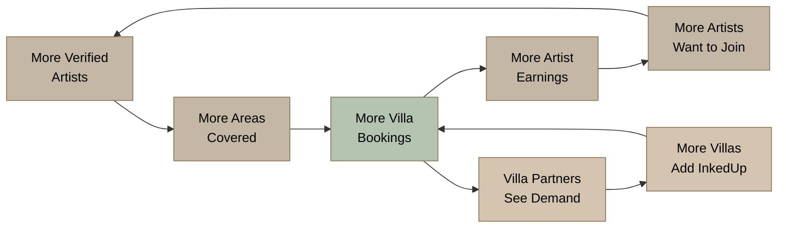

# 2. Market Opportunity

## 2.1 Why Bali Is the Right Market

### 2.1.1 Tourism at Record Scale

Bali welcomed 6.33 million international visitors in 2024, exceeding the pre-pandemic peak of 6.28 million recorded in 2019 and cementing the island's position as Southeast Asia's most resilient tourism economy.[^170^] The momentum carried into 2025: arrivals from January through May reached 2.64 million, a 9.0% increase over the same period in 2024, putting the island on a trajectory to surpass 6.5 million international visitors for the full year.[^10^] Total visitor volume — domestic plus international — reached 16.4 million in 2024, a figure that underscores the sheer density of human traffic moving through an island of just 5,780 square kilometers.[^170^]

These are not abstract statistics. They represent a captive audience of experience-seeking travelers with disposable income, time, and a demonstrated willingness to spend on discretionary activities. Tourism accounted for 21.75% of Bali's GDP in 2024 and supported 2.67 million jobs across hospitality, transport, and services.[^26^] The economic engine is running hot, and every sector that serves tourists — from beach clubs to wellness retreats — is capturing value from this inbound flow. The question is not whether enough people visit Bali, but whether any given service category has been optimized to serve them. Tattoo has not.

### 2.1.2 The Australian Pipeline

Australia is Bali's dominant source market by a wide margin. In 2024, 1.54 million Australians visited Bali, representing 24.78% of all international arrivals.[^10^] No other nationality comes close. This matters enormously for InkedUp because Australia is also one of the world's most tattoo-advanced cultures: three in ten Australians (30%) now have at least one tattoo, up from 20% in 2018, with prevalence reaching 42% among Millennials and 39% among Gen Z.[^156^] The same demographic that travels to Bali in the largest numbers is the demographic most likely to want a tattoo.

The behavioral overlap is striking. Hostelworld research found that close to 60% of Australians expressed keen interest in getting a tattoo the next time they travel — the highest rate of any nationality surveyed.[^194^] Australian-owned studios in Bali estimate that 85% of their clientele are Australians, with familiarity with Australian culture cited as a key success factor.[^71^] Rob Garcia of West Coast Ink put it plainly: "Tattoos in Bali are quite a bit cheaper than Australia, but I believe the artists are better too."[^71^]

The price arbitrage is undeniable. A small tattoo costing AUD $150-350 in Sydney runs AUD $50-150 in Bali — a 60-70% saving.[^12^] A medium piece priced at AUD $1,500+ in Australia can be completed for AUD $600 in Bali.[^3^] For the price of a single sophisticated tattoo back home, many visitors can fund the tattoo, their airfare, and a portion of their trip.[^34^] This is not incidental spending. It is a core motivation for travel, and it creates a natural customer for a service that removes friction from the transaction.

### 2.1.3 The Villa Revolution

Bali's accommodation market has undergone a structural shift that directly enables InkedUp's operating model. Tourists are choosing private villas over hotels in accelerating numbers, driven by demand for privacy, space, and personalized experiences. Villa occupancy reached 85-90% during the 2024 high season, significantly outperforming hotels at 53-60%.[^2^] The Bali Villa Association confirmed that villa guests prioritize "more private atmosphere and facilities" and the ability to "explore the island independently."[^1^]

The scale of the villa ecosystem is vast. Bali has 37,933 active Airbnb listings with an average daily rate of approximately $94 USD, and industry estimates place total villa inventory at over 70,000 listings by early 2025 — up 17.5% year-over-year.[^36^] Average annual occupancy sits at 52-65%, with significant variation by location.[^36^] In Canggu and Pererenan — InkedUp's core target areas — villa saturation is described as "critical," with year-on-year listing growth exceeding 40%.[^38^]

This oversupply creates a differentiation imperative. Villa owners who once competed on price are now competing on experience — private chefs, in-villa spa treatments, floating breakfasts, yoga sessions, and personal drivers.[^37^] The villas that survive and thrive are those offering "a complete guest experience, not just a place to sleep."[^37^] Yet despite this arms race of amenities, one premium service category remains entirely absent from every villa concierge menu: tattoo.

## 2.2 The Tattoo Market in Bali

### 2.2.1 Market Size

Bali's tattoo market generates an estimated USD $25-40 million annually in service revenue, derived from 280-1,000 studios serving both tourist and domestic demand.[^26^] The range reflects the opacity of a market where formal registration (280-306 registered studios) captures only a fraction of actual operations; industry insiders estimate as many as 1,000 studios function on the island, many unregistered and operating informally.[^3^][^33^][^71^]

To triangulate this estimate, studio-level economics provide a useful cross-check. The average tattoo shop globally generates $150,000-$400,000 in annual revenue, with solo studios at the lower end ($80,000-$180,000) and large operations with 6+ artists at the upper end ($500,000+).[^75^] Applying these benchmarks to Bali's studio count yields a conservative estimate of ~USD $28 million (280 studios at $100,000 average) and a moderate estimate of ~USD $40 million (500 studios at $80,000 average).[^75^]

| Metric | Value | Source Triangulation |
|--------|-------|---------------------|
| Registered studios | 280-306 | [^3^] [^33^] |
| Estimated total studios | ~1,000 | [^71^] |
| Annual market size (conservative) | USD $25-28M | Studio count x avg. revenue |
| Annual market size (moderate) | USD $35-40M | Industry insider estimates |
| Avg. revenue per studio (small) | $80,000-$180,000 | [^75^] |
| Avg. revenue per studio (mid) | $200,000-$400,000 | [^75^] |
| Profit margin range | 15-35% | [^75^] |

*Table 1: Bali Tattoo Market Sizing Framework. The $25-40M estimate represents service revenue only; upstream revenue from ink, equipment, aftercare products, and conventions adds a further 10-15%.*

This is not a niche market. It is a substantial, cash-generating industry that has grown organically without central coordination, quality standards, or brand leadership. That absence is the opportunity.

### 2.2.2 The Tattourism Wave

The convergence of travel and tattoo acquisition — "tattourism" — is no longer anecdotal. It is a quantified global trend with direct applicability to Bali. Research by Hostelworld found that more than 40% of travelers aged 18-35 have gotten a tattoo while on a trip, and over 50% of that group traveled abroad specifically to get tattooed.[^194^][^192^] Among those who planned tattoo travel, one in three described the decision as spontaneous — made in-destination rather than pre-planned.[^194^]

The implications are profound. Tattourism transforms tattoo from a pre-trip decision into an in-trip impulse, and impulses favor convenience. A tourist who decides on day three of a ten-day Bali trip that they want a fine-line piece on their ribs is unlikely to spend an hour in Canggu traffic visiting three studios for comparisons. They will book the option that comes to them.

Timing behavior reinforces this. Tourists typically get tattooed at the end of their holidays to avoid sun, salt water, and chlorine damage to fresh ink.[^3^][^71^] This creates a natural demand concentration in the final 48-72 hours of a trip — precisely when travelers are least inclined to navigate Bali's notorious traffic to reach a studio. A mobile service that arrives at the villa on the last day removes the single biggest friction point in the entire transaction.

### 2.2.3 Global and Regional Growth Context

Bali's tattoo market operates within the fastest-growing regional context in the world. The Asia-Pacific tattoo market reached USD $495.47 million in 2024, representing approximately 23% of global revenue, and is projected to grow at a compound annual growth rate (CAGR) of 12.6% through 2031 — the highest rate of any region.[^26^] Southeast Asia specifically — the sub-region encompassing Bali — was valued at USD $34.19 million in 2024 and is projected to grow at 13.6% CAGR.[^26^]

The global tattoo market was valued at USD $2.43 billion in 2025 and is projected to reach USD $5.99 billion by 2034, exhibiting a CAGR of 10.67%.[^27^] Multiple research firms confirm a consistent 9.5-10.7% growth band, with Asia-Pacific outstripping the global average by 200-300 basis points.[^27^][^175^] The global tattoo convention tourism market alone — a subset of total tattoo spending — was valued at $1.8 billion in 2025 and is projected to reach $3.6 billion by 2033.[^138^]

Australia, InkedUp's source market, is growing in parallel. The Australian tattoo market was valued at AUD $41.40 million in 2025 and is expected to grow at 11.40% CAGR to reach AUD $121.86 million by 2035.[^193^] The broader Australian tattoo studios industry generated AUD $400.1 million in revenue in 2023-24.[^197^] Every trend line points upward, and they all converge on a single island where Australian tourists arrive by the million, villas outnumber hotels, and no platform connects the demand to the supply.

## 2.3 Why the Market Is Ready for Disruption

### 2.3.1 Fragmented Supply

Bali's tattoo market is structurally fragmented. Over 90% of studios are independent, unbranded operations with no chain affiliation, no quality standardization, and no central reputation system.[^130^] Two Guns Tattoo Bali, an industry veteran with fourteen years of operation, described 90% of Bali tattoo studios as "money making scams" rather than professional operations — studios that pay commissions to taxi drivers and touts who manipulate tourists into walk-in appointments.[^130^]

The competitive landscape reveals this fragmentation in detail. Celebrity Ink operates one studio in Kuta as its sole Bali presence — Asia-Pacific's largest chain with 25+ studios, yet barely present on the island where it should dominate.[^78^][^70^] ink.inc runs two luxury studios in Canggu and Seminyak, positioning at the premium end but remaining studio-based with no mobile offering.[^2^] Artful Ink, Mason's Ink, Social Ink House, LOFT N5, TNT Tattoo, Canggu Ink Club, Quiet Ink Studio, and a dozen others each carve out their own niche, their own clientele, and their own patch of Google Maps.[^1^][^176^] No brand owns more than a single-digit percentage of market awareness.

| Tattoo Size | Bali (AUD) | Sydney (AUD) | Savings |
|-------------|-----------|-------------|---------|
| Small (<5cm) | $48-145 | $150-350 | 50-70% |
| Medium (5-15cm) | $145-388 | $400-800 | 50-65% |
| Large (15cm+) | $388-970 | $1,000-2,000 | 50-60% |
| Full Sleeve | $970-2,420+ | $3,000-6,000+ | 60-70% |

*Table 2: Tattoo Price Comparison — Bali vs. Australia (2025-2026). Bali pricing sourced from Hustle Ink Tattoo and verified studio pricing pages.[^12^] Australian pricing represents Sydney metro averages.*

This fragmentation creates three exploitable vulnerabilities. First, no competitor has built a brand that transcends location. Tourists cannot name "the best tattoo studio in Bali" with any consensus because no studio has earned that position. Second, quality varies so dramatically that tourists arrive anxious — unsure who to trust, what to pay, or how to verify claims of "international standards." Third, the absence of a dominant player means no incumbent has the resources or incentive to build the technology layer (booking platform, artist verification, review aggregation) that would professionalize the market. InkedUp enters a field of individual combatants and introduces an organized system.

### 2.3.2 The Trust Deficit

Tourist fear is the single largest unaddressed pain point in Bali's tattoo market. The 2011 HIV transmission case linked to a Bali tattoo studio — widely reported in Australian media — created a permanent trust deficit that no industry body has systematically repaired.[^5^] Tourists today face a market with no government regulation, no licensing requirements, no mandatory hygiene inspections, and no recourse mechanism if something goes wrong.[^241^] Indonesia does not have a dedicated tattoo industry association or regulatory body; studios largely self-regulate through adherence to international hygiene standards that customers have no way to verify.[^241^]

The practical consequences are visible in tourist behavior. Over 90% of travelers read online reviews before making a booking decision, and 52% would never book a service with no reviews.[^33^] Tourists evaluate tattoo studios through Google ratings, Instagram portfolios, and TripAdvisor threads — signals that are easily gamed. Some cheaper shops use Google and Pinterest images in their portfolios rather than their own work,[^5^] and pricing opacity is so common that one premium studio (Quiet Ink) was publicly accused of doubling a quoted price upon arrival, blaming an "Instagram mistake."[^285^]

Bali traffic compounds the anxiety. A tourist staying in Uluwatu or Nusa Dua faces 45-60 minutes of unpredictable traffic to reach studios concentrated in Canggu, Seminyak, or Kuta.[^281^][^275^] The journey itself becomes a deterrent, particularly for travelers on short trips who would rather spend their final hours by the pool than in the back of a Gojek.[^275^]

### 2.3.3 The Missing Villa Service

The most compelling evidence that the market is ready is not what exists — it is what does not. Every premium in-villa service category that a villa guest might want is already available, bookable via WhatsApp, and normalized as part of the Bali experience. Private chefs prepare degustation dinners by the pool.[^7^] Mobile massage therapists bring portable tables and aromatherapy oils for same-day booking.[^9^] Yoga instructors, personal trainers, hair and makeup artists, and babysitters all travel to villas as a matter of routine.[^11^][^8^]

A comprehensive review of Bali's major concierge services — Bali Luxury Concierge, Bali Luxe Concierge, Bali Villa Escapes, and Bali Luxury Villas — confirms that tattoo and body art services appear on exactly zero menus.[^13^][^14^][^15^][^16^] These concierges offer VIP airport fast track, private chauffeurs, exclusive dining, spa treatments, fitness training, golf, diving, surfing, and babysitting — but not tattoo.[^13^][^16^] The service gap is not a minor omission. It is the only premium experiential category missing from the villa service ecosystem, and it exists because no supplier has built the infrastructure to deliver it safely and professionally to a private residence.

## 2.4 From Service to Marketplace

### 2.4.1 Two-Sided Marketplace Model

InkedUp is not a tattoo studio. It is a two-sided marketplace that connects verified tattoo artists (supply) with tourists in villas (demand), with the platform managing the trust, safety, and logistics layers that neither side can efficiently provide on its own.

On the supply side, the platform recruits, vets, and onboard artists who meet verified hygiene and portfolio standards. On the demand side, it captures tourists through villa partnerships, SEO, and concierge integrations, then converts them through a booking flow that eliminates the uncertainties that currently deter in-Bali tattoo purchases. The platform captures value through a commission on each booking — typically 20% in service marketplaces — while owning the customer relationship, the brand, and the quality assurance layer.

This model inverts the current power dynamic. Today, artists compete for walk-in traffic and Instagram visibility. Under a marketplace model, the platform competes for customers and allocates them to artists based on style match, availability, and location — creating a more efficient market where quality artists earn more and customers get better outcomes.

### 2.4.2 Network Effects

The marketplace flywheel is straightforward and self-reinforcing. More verified artists on the platform enable coverage of more villa areas, which increases the probability that any given tourist can book an artist to their specific location, which drives more bookings, which attracts more artists who want access to the demand pool. This is a classic local network effect, and in a geographically constrained island like Bali, the density required to reach critical mass is achievable within months, not years.

Villa partnerships amplify the effect. Each villa management company that adds InkedUp to its concierge menu exposes every guest to the service — a zero-marginal-cost distribution channel that scales with villa inventory rather than advertising spend. With 70,000+ villa listings and counting,[^36^] the addressable distribution base is already larger than any competitor's customer list.

*Chart 1: InkedUp Marketplace Flywheel — The self-reinforcing loop between artist supply, geographic coverage, villa partnerships, and booking volume. Each cycle strengthens the platform's competitive position and increases switching costs for both sides.*

### 2.4.3 Expansion Path

Bali is the beachhead, not the destination. The operational playbook developed on the island — artist verification, villa logistics, WhatsApp-native booking, trust architecture — is directly transferable to other Southeast Asian tourism markets with similar dynamics.

Phuket is the logical second market. Thailand's largest island receives 3-4 million international tourists annually, with Australians and Europeans comprising the core demographic.[^70^] Celebrity Ink started in Phuket in 2013 and now operates three studios there, including a 50-artist flagship on Bangla Road — proof that tattoo tourism scales in Thai beach destinations.[^70^] Bangkok follows as a third market: 20+ million annual visitors, an established tattoo culture, and a concentration of digital nomads and expats who represent repeat demand.

The Southeast Asia tattoo market was valued at USD $34.19 million in 2024 and is projected to grow at 13.6% CAGR — the fastest sub-regional rate globally.[^26^] Each market entry replicates the Bali model with localized artist recruitment and villa partnership development, while the technology platform, brand standards, and verification framework scale centrally. The result is a regional network where a tourist who books through InkedUp in Bali recognizes and trusts the same brand when they visit Phuket six months later — a brand continuity that no existing studio-based competitor can match.

The timing is specific and favorable. Bali's tourism economy is at record highs.[^170^] Tattoo prevalence in source markets is accelerating.[^156^] Villa culture has normalized in-villa service delivery.[^7^][^8^] The competitive landscape remains fragmented with no dominant brand.[^130^] And exactly one mobile competitor operates in Bali — a small operator with a dated website, minimal brand presence, and no marketplace technology.[^101^] The window is open. The question is who walks through it first.
