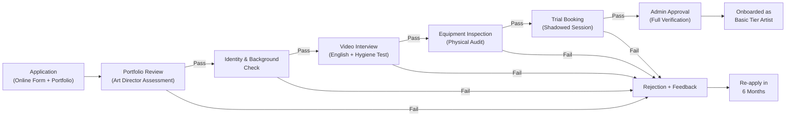

## 7. Artist Profile and Verification System

In a marketplace where 90% of Bali's tattoo studios are independent and unbranded, the quality of your supply side is not a feature — it is the foundation [^176^]. Tourists arrive with a single fear ranked above all others: safety. The 2011 HIV infection case linked to a Balinese tattoo studio still surfaces in travel forums, and anonymous online searches reveal that infection risk, not price, is the dominant barrier to booking [^5^]. InkedUp's artist verification system transforms this fear into a competitive moat. While competitors compete on "international standards" as a marketing slogan, InkedUp operationalises verified standards with documentation, insurance requirements, and a paper trail. This chapter details the profile architecture, the multi-stage verification pipeline, and the recruitment economics required to build a supply base that no competitor can replicate.

---

### 7.1 Artist Profile Structure

Every artist on the platform receives a public-facing profile that functions as both a portfolio and a trust instrument. The profile is organised across three layers — public identity, booking parameters, and verified status tiers — each designed to reduce the customer's decision friction and maximise the artist's booking conversion.

#### 7.1.1 Public Profile Layer

The public profile is what the customer sees during search and browsing. It must answer three questions in under ten seconds: *Who is this person? What do they do best? Can I trust them?*

The profile displays the artist's professional name, a high-resolution portrait photograph, and their primary specialty tags (e.g., fine line, blackwork, Japanese, realism). Years of active tattooing experience are shown prominently — data from competitor analysis shows that studios emphasising artist tenure command premium pricing, with LOFT N5 charging IDR 2,000,000 per hour and Two Guns Tattoo explicitly marketing artists with 15+ years of experience [^40^] [^130^]. The portfolio section contains a minimum of twenty high-resolution images segmented into two categories: fresh work (immediately post-session) and healed work (6+ weeks after healing). This dual-portfolio requirement addresses a critical gap in Bali's market, where cheaper shops have been known to display Google and Pinterest images rather than their own work [^150^]. Fresh photos prove execution quality; healed photos prove aftercare knowledge and technical durability — the two data points customers care about most.

A verified badge appears only after the full verification pipeline (Section 7.2) is completed. Language capabilities are listed with proficiency indicators — English fluency is non-negotiable for tourist-facing work, but multilingual ability (Mandarin, Russian, Japanese, Korean) unlocks access to under-served tourist segments. Location coverage is displayed as a service map showing which zones the artist serves, with call-out availability indicated per area.

#### 7.1.2 Booking Information Layer

The booking layer contains operational parameters that drive the matching algorithm. Available time slots are synchronised through a calendar integration, with minimum booking prices set by the platform to prevent a race to the bottom. Style tags enable cross-referencing — a customer searching "fine line tattoo Seminyak" must surface artists who specialise in that style. Customer reviews are collected through a dual-sided system modelled on Airbnb's architecture: both artist and customer submit reviews simultaneously, with publication occurring only after both parties submit or a 14-day window closes [^21^]. Airbnb's data shows that over 70% of stays generate a review, and each one-star increase in average rating produces a roughly 7% lift in booking likelihood [^21^]. InkedUp targets the same review rate and rating sensitivity.

Certifications are displayed with document thumbnails — blood-borne pathogen training, first aid certificates, and any international standards compliance (e.g., Australian HLTIN402C, the same qualification cited by Come To You Tattoo, Bali's only existing mobile competitor) [^101^]. An integrated Instagram link pulls recent work into the profile dynamically, ensuring portfolio freshness without requiring manual uploads.

#### 7.1.3 Verified Status Tiers

The tier system creates progressive incentive for artists to invest in their platform presence while giving customers a shorthand for quality assessment. The four tiers — Basic, Verified, Top Artist, and Ambassador — confer increasing visibility, booking priority, and platform support.

| Tier | Requirements | Visibility & Benefits | Target % of Roster |
|------|-------------|----------------------|-------------------|
| **Basic** | Completed profile, identity verified, portfolio reviewed (min. 20 photos), hygiene test passed | Standard listing, eligible for bookings | ~60% of active roster |
| **Verified** | 5+ completed bookings, 4.5+ star average, zero safety incidents, customer review quorum | "Verified" badge, priority in search results, featured on style-specific pages | ~25% of active roster |
| **Top Artist** | 20+ completed bookings, 4.7+ star average, 95%+ show rate, healed tattoo portfolio (10+ photos), client testimonial video | "Top Artist" badge, top-three search placement, homepage rotation, group booking eligibility | ~12% of active roster |
| **Ambassador** | Invitation only — industry recognition (10K+ Instagram following, competition awards, published work), exceptional artistry, brand alignment | "InkedUp Ambassador" badge, featured artist campaigns, media interviews, event bookings, co-branded content | ~3% of active roster |

*Tiers are mutually exclusive and progression is automatic once thresholds are met. Demotion occurs if rating or show-rate thresholds fall below tier minimums for 30 consecutive days.*

The tier structure mirrors Tattoodo's verified ranking system, where higher-ranked artists receive priority placement in search results [^11^]. However, InkedUp adds the "healed tattoo" requirement at the Top Artist level — a standard no competitor enforces but one that directly addresses tourist anxiety about long-term outcomes. The Ambassador tier serves a dual marketing function: these artists become content creators and brand advocates, generating organic reach that reduces paid acquisition costs. Only 3% of the roster reaches Ambassador status, maintaining exclusivity while creating aspiration for lower-tier artists.

---

### 7.2 The Verification Process

Indonesia has no tattoo-specific licensing requirement. No government body verifies artist competence, hygiene knowledge, or equipment standards [^5^]. This regulatory vacuum is the single greatest risk to customers — and the single greatest opportunity for InkedUp. The verification process fills this gap with an 11-point assessment administered across six stages. The target rejection rate is 30% or higher, matching Soothe's massage therapist vetting standard [^6^].

#### 7.2.1 The 11-Point Check

| # | Checkpoint | Assessment Method | Pass Criteria | Weight in Decision |
|---|-----------|-------------------|---------------|-------------------|
| 1 | **Identity Verification** | Government-issued photo ID (passport or KTP), cross-referenced against social media and studio employment records | Name, age, and photo match across all documents; no identity red flags | Required (gate) |
| 2 | **Years of Experience** | Portfolio review, reference calls to previous studios, Instagram archive analysis | Minimum 2 years professional tattooing with documented evidence; 5+ years for premium tier | 15% |
| 3 | **Portfolio Quality** | Independent review by InkedUp art director; assessment of line work, shading, colour saturation, composition, and consistency | 20+ high-resolution images meeting minimum quality score (7/10 rubric); no trace work or unoriginal designs | 20% |
| 4 | **Previous Work Authenticity** | Reverse image search on all portfolio submissions; reference checks with former clients where possible | Zero instances of stolen or uncredited work; all portfolio pieces attributable to the applicant | Required (gate) |
| 5 | **Customer Reviews** | Collection of 5+ verifiable reviews from previous clients (Google, Instagram DMs, or studio platforms); reference calls to 2+ former customers | Minimum 4.0/5 average rating; no unresolved complaints about safety or professionalism | 10% |
| 6 | **Professional Background** | Employment history verification (studio names, dates, responsibilities); reference calls to 2+ studio owners or managers | Continuous professional employment with no unexplained gaps; positive references from supervisors | 10% |
| 7 | **Communication Level** | Structured video interview in English; assessment of explanation ability, active listening, and cultural sensitivity | Conversational English proficiency; ability to explain aftercare, design limitations, and healing process clearly | 10% |
| 8 | **Hygiene Knowledge** | Written test covering: blood-borne pathogen protocols (HIV, hepatitis B/C), cross-contamination prevention, sterilisation standards (autoclave use), single-use needle policy, skin preparation, waste disposal | 85%+ score on 30-question exam; demonstration of current BBP certificate preferred | 15% |
| 9 | **Equipment Standards** | Physical inspection of tattoo machine, power supply, needle cartridges, ink brands, and aftercare supplies; all equipment must meet international safety standards | Professional-grade rotary or coil machine; disposable needle cartridges; recognised ink brands (Intenze, Eternal, Fusion Ink, etc.); sealed, in-date supplies only | 10% |
| 10 | **Reliability Assessment** | Background check for criminal history; verification of punctuality and attendance at previous roles | Clean criminal record (minor offences reviewed case-by-case); positive reliability references | Required (gate) |
| 11 | **Certifications** | Documentation review of: blood-borne pathogen training, first aid/CPR certification, any international standards compliance (e.g., Australian TAFE, UK apprenticeship certificates) | At least one formal health/safety certification; preference for internationally recognised credentials | 10% |

*The 11-point check is administered over six sequential stages. An applicant failing any "Required (gate)" checkpoint is automatically rejected without proceeding to subsequent stages. Weighted checkpoints contribute to an overall composite score; applicants scoring below 75% composite are rejected.*

The hygiene knowledge test (Point 8) is the highest-weighted non-gate item at 15% because visible hygiene practice is the number-one trust signal for international tourists [^5^] [^46^]. The equipment standards inspection (Point 9) ensures that artists arrive at villa bookings with professional-grade supplies — no exceptions. The portfolio authenticity check (Point 4) uses reverse image search to detect stolen work, a known problem among budget studios in Bali [^150^]. This gate criterion alone eliminates a significant portion of applicants.

#### 7.2.2 Multi-Stage Approval Pipeline

The verification pipeline is designed to filter applicants progressively, minimising administrative cost while maintaining rigour. The six stages unfold as follows:

*Stage 1 — Application:* The artist submits an online form including personal details, work history, equipment inventory, and a 20-image portfolio. An automated check flags incomplete submissions and runs reverse image search on all portfolio photos.

*Stage 2 — Portfolio Review:* InkedUp's art director scores each submission against a 7-point rubric assessing line precision, colour saturation, composition, consistency across styles, and photographic quality. The director also evaluates whether the applicant's style specialisation aligns with current platform demand. This stage rejects approximately 35% of applicants.

*Stage 3 — Identity and Background Check:* Government ID is verified against facial recognition from the video interview. Criminal background checks are conducted through Indonesian legal databases and, where the applicant has international experience, through relevant foreign databases.

*Stage 4 — Video Interview and Hygiene Test:* A 45-minute structured interview assesses English communication skills, professional demeanour, and customer-service orientation. The 30-question hygiene exam is administered immediately after. Applicants must score 85% or higher to proceed. The combined interview and test take approximately 90 minutes and are conducted via video call.

*Stage 5 — Equipment Inspection:* The applicant presents their full equipment kit via live video or in-person audit. Inspectors verify machine quality, needle cartridge sterility, ink brand authenticity, and aftercare supply adequacy. Counterfeit or expired supplies result in immediate rejection.

*Stage 6 — Trial Booking:* The final filter is a real-world shadowed session. A verified InkedUp artist or quality inspector accompanies the applicant on a discounted booking with a consenting customer. The inspector evaluates: setup protocol, customer interaction, tattoo execution, hygiene practice during the session, and aftercare explanation. The trial booking is the only stage that assesses performance under actual villa-service conditions — and it is the stage that catches issues no interview can surface.

Only after passing all six stages does the artist receive Basic tier status and platform access. The entire pipeline, from application to approval, is designed to complete within 14-21 days — fast enough to maintain recruitment momentum, rigorous enough to enforce standards.

#### 7.2.3 Re-Verification and Ongoing Quality Monitoring

Verification is not a one-time event. The annual re-verification cycle requires all artists to re-submit their hygiene certification, update their portfolio with 10+ new works, and pass a shortened hygiene refresher exam. Artists who fail re-verification are suspended from new bookings until deficiencies are corrected.

Between annual cycles, quality monitoring operates through three channels. First, every booking generates a customer review across five dimensions: artistry, professionalism, cleanliness, communication, and value. Artists falling below 4.3 stars on any dimension for three consecutive reviews trigger a quality alert and mandatory coaching session. Second, random spot-checks — approximately 5% of bookings per quarter — involve unannounced observation by a quality inspector. Third, safety incidents (cross-contamination, equipment failure, customer injury) trigger immediate suspension pending investigation. The artist bears the burden of proof for reinstatement.

---

### 7.3 Artist Onboarding

The artist supply constraint is the real operational bottleneck. Only 10-15% of Bali's estimated 1,000 tattoo studios meet premium standards, and the verification process will reject a projected 70-80% of individual applicants based on mobile service marketplace benchmarks [^6^]. The platform's first 90 days must therefore prioritise artist recruitment over customer acquisition — without artists, there is nothing to market.

#### 7.3.1 Recruitment Strategy: Target Premium Studios

The most efficient recruitment channel is not open application — it is targeted poaching from studios that have already invested in quality. ink.inc (3,347 Google reviews, 5.0 rating), LOFT N5 (IDR 2,000,000/hour artist collective), Artful Ink (Bali's original international boutique studio since 2012), Social Ink House (Australian-owned, 7+ years), and Two Guns Tattoo (PTAA member, 15+ year artists) have already solved the quality problem [^176^] [^40^] [^11^] [^131^]. Artists from these studios enter the verification pipeline with significantly higher pass rates because their employers have already enforced hygiene standards, portfolio quality, and professional conduct.

The recruitment pitch is built on economics, not branding. The average tattoo artist in Bali earns IDR 115,543,815 annually — approximately IDR 9.6 million per month [^22^]. At the standard studio-artist split of 60/40, the artist keeps roughly 60% of revenue while the studio captures 40% for rent, utilities, and front-desk staff [^20^]. At InkedUp, artists retain 80% of the booking fee — a 33% relative increase in take-home pay. For an artist billing IDR 30 million monthly at a studio (IDR 18 million take-home), the same billings on InkedUp yield IDR 24 million — an additional IDR 6 million per month. This delta is the core recruitment weapon.

The offer structure for launch-phase recruitment is:

- **0% platform commission for the first 3 months** (artist keeps 100% of booking fee, minus payment processing)
- **Guaranteed minimum income** of IDR 5 million for Month 1 if booking volume falls short
- **Portfolio photography session** (professional headshots and portfolio shots at platform cost)
- **WhatsApp Business profile setup** and ongoing customer communication support

This subsidised onboarding addresses the classic marketplace chicken-and-egg problem: without artists, there are no bookings; without bookings, artists won't join. Uber solved the same dilemma by paying drivers guaranteed hourly rates before demand existed [^17^]. InkedUp's 0% commission period serves the same function — it de-risks artist participation while the platform builds its initial customer base.

#### 7.3.2 Anchor Artist Program: The First 15

Before any marketing spend targets tourists, InkedUp must recruit 15 anchor artists who represent the platform's quality floor. These 15 artists are not merely early sign-ups — they are the supply foundation that makes demand-side marketing credible. The anchor program targets five artists per priority zone: Seminyak/Canggu (highest tourist density), Uluwatu/Jimbaran (luxury villa concentration), and Ubud (wellness retreat segment).

Each anchor artist receives enhanced terms: 0% commission extended to 6 months, guaranteed homepage placement for 90 days, professional portfolio photography and video content production, and priority allocation for group bookings (which generate the highest per-trip revenue). In exchange, anchor artists commit to maintaining 4.8+ star ratings, 20+ available hours per week, and participation in platform marketing content (photographed sessions, testimonial videos, style guide features).

The anchor program is supply-constrained by design. Fifteen verified artists serving 20 hours each yields 300 artist-hours of weekly availability — sufficient to serve 60-80 medium-tattoo bookings per week at launch without creating the quality dilution that comes from rapid roster expansion. Only after the anchor cohort demonstrates consistent 4.7+ star ratings and 90%+ show rates does the platform open general recruitment.

#### 7.3.3 Artist Retention: Beyond the First Booking

Recruitment without retention is a revolving door, and in a two-sided marketplace, artist churn destroys customer trust. The retention strategy addresses the four reasons artists leave platforms: insufficient income, scheduling inflexibility, lack of growth, and poor platform support.

**Income protection.** The 80% artist payout rate (versus 40-60% at most studios) is the headline retention tool [^20^]. But retention requires income predictability, not just rate generosity. InkedUp's deposit collection system (25-30% of estimated tattoo cost, collected upfront and held in escrow) ensures artists are compensated for blocked time even when customers no-show [^42^]. Platforms with deposit systems report 60-75% fewer no-shows than those relying on penalty fees alone [^40^]. For mobile artists who invest 30-60 minutes in travel per booking, this protection is meaningful.

**Flexible scheduling.** Unlike studio employment, which typically requires fixed shifts or minimum hour commitments, InkedUp artists set their own availability through the platform calendar. This autonomy is especially valuable for artists who maintain studio affiliations alongside platform work — they can accept InkedUp bookings during downtime without violating studio contracts.

**Professional development.** Top-tier artists stagnate without growth. InkedUp funds quarterly masterclasses — guest artists from international studios teaching advanced techniques, colour theory, and cover-up specialisation — exclusively for Verified-tier artists and above. The professional development budget is funded by a 2% allocation from platform commission revenue. This investment produces direct returns: artists with advanced certifications can command higher booking prices, increasing platform revenue per transaction.

**Marketing support.** Most independent artists in Bali rely on Instagram for client acquisition but lack the skills or time for consistent content creation. InkedUp's in-house content team produces professional photos and short-form video from shadowed sessions (with client consent), distributing the content across the platform's social channels with artist tags and booking links. This service effectively outsources the artist's marketing function — a significant value-add for artists who would otherwise spend hours weekly on content rather than tattooing.

The combined retention package is designed to achieve 80%+ twelve-month artist retention — a rate that would place InkedUp in the top quartile of service marketplaces globally. High retention produces compounding benefits: experienced artists generate higher ratings, repeat customers, and word-of-mouth referrals, all of which reduce customer acquisition costs over time. In a marketplace where 89% of consumers believe the model is based on trust between providers and users, artist stability is not a back-office metric — it is the product [^28^].

