## 8. Customer Booking Flow

A marketplace lives or dies at the moment of transaction — the sequence of decisions, inputs, and confirmations that transforms a browsing tourist into a deposited booking. In Bali's service economy, that sequence runs through WhatsApp, not a web checkout cart. Research across villa concierges, mobile massage operators, and tattoo studios confirms that WhatsApp is the dominant business channel in Bali: villa managers coordinate chef bookings via WhatsApp groups, tourists click Instagram bio links that open chat windows, and even premium service businesses like Soothe supplement their apps with SMS-based coordination [^40^]. InkedUp's booking flow must therefore be WhatsApp-native at every stage, with the website serving as a discovery and capture front-end that funnels intent into a conversational, high-touch closing process.

This chapter maps the complete customer journey from first website visit to healed tattoo review, specifying the systems, scripts, and decision points that govern each transition.

---

### 8.1 Discovery Phase

#### 8.1.1 Landing Page to Intent Capture

The discovery phase begins when a tourist — typically 2-14 days before their Bali arrival, or already in-villa — lands on an InkedUp page. The entry point is usually a high-intent search query: "fine line tattoo Seminyak" or "tattoo artist to my villa Canggu" (see Chapter 4 for the full location and service SEO architecture). The landing page has one job: convert curiosity into a WhatsApp conversation.

The page structure follows a proven hierarchy. Hero section with social proof (artist count, review average, "verified" badge density), followed by a browsable artist grid filtered by style and location. Each artist card displays their tier badge (Basic, Verified, Top Artist, or Ambassador), years of experience, primary styles, and three portfolio thumbnails. Clicking through opens the full profile: expanded portfolio (fresh and healed work), customer reviews across five dimensions (artistry, professionalism, cleanliness, communication, value), language capabilities, and a prominent "Book This Artist" button that triggers a WhatsApp Business chat pre-populated with the artist's reference code [^21^].

The critical design principle here is *captured intent*. Every portfolio view, filter selection, and scroll depth is tracked to inform the matching conversation. If a customer browses three fine-line artists in Seminyak but doesn't initiate WhatsApp, a retargeting pixel triggers Instagram story ads featuring those specific artists' work within 24 hours — re-engaging warm prospects before they book elsewhere.

#### 8.1.2 Lead Qualification: Size, Placement, and Budget

Once the WhatsApp conversation opens, the InkedUp admin (or automated flow) conducts structured lead qualification. The objective is to collect four qualifying data points before any artist is assigned: tattoo size, body placement, reference imagery, and budget range.

Size selection uses a visual guide — not abstract centimetre measurements, but comparative imagery (palm-sized, hand-sized, forearm-sized, sleeve) that eliminates the ambiguity that plagues tattoo consultations. Placement is captured via a body diagram with hotspot selection, triggering automatic alerts for difficult locations (ribs, feet, inner bicep) that require specialist artists. Reference images are uploaded directly through WhatsApp — the artist'sInstagram screenshots, Pinterest saves, or original concepts — and stored against the booking record for portfolio-matching analysis.

Budget qualification uses bracketed ranges rather than open-ended questions. Research on tattoo marketplace platforms confirms that deposits of 20-50% of estimated total cost, collected upfront, represent industry standard practice and serve as the single most effective no-show deterrent [^15^] [^40^]. InkedUp's budget brackets align with its published pricing tiers: IDR 650K-2M (small), IDR 1.9M-5M (medium), IDR 5M-12M (large), and IDR 12M+ (sleeve/multi-session). The customer's selection determines both deposit amount and artist tier matching.

> **WhatsApp Qualification Script (Admin):**
> *"Hi [Name]! Thanks for your interest in InkedUp. To match you with the perfect artist for your tattoo, I just need a few quick details: (1) Approximate size — palm, hand, or larger? (2) Where on your body? (3) Do you have reference images you can share? (4) What's your budget range? Our artists start from IDR 650,000. Once I have these, I'll send you 2-3 artist portfolios within 10 minutes."*

#### 8.1.3 Logistics Capture: Villa Location, Date, and Time

The final discovery inputs are logistical. Location capture requires the specific villa or hotel name — not just "Seminyak" — because the platform must determine call-out zone (Zone 1 free, Zone 2 IDR 100K-150K, Zone 3 IDR 200K-300K) and route the nearest available artist. Preferred date and time are collected with flexibility indicators: tourists often have fluid itineraries, so capturing "preferred" and "backup" slots increases matching success by an estimated 30-40%.

The discovery phase concludes when all four qualification domains (design, body, budget, logistics) are complete. At this point, the booking enters the matching queue — typically a 10-15 minute turnaround during business hours (08:00-20:00 WIB), with after-hours inquiries held for morning processing unless marked as express (within 48 hours, carrying the IDR 200,000 urgency premium detailed in Chapter 13).

---

### 8.2 Matching and Confirmation

#### 8.2.1 Design Consultation and Artist Matching

The matching engine — operated by InkedUp admin in the launch phase, automated via style-tag algorithms at scale — evaluates three matching dimensions: artistic fit (style specialisation alignment with customer reference images), availability (calendar overlap with preferred date/time windows), and logistics (artist's base location relative to villa, accounting for Zone 1-3 travel times).

Artistic fit is the highest-weighted dimension. An artist who specialises in fine-line minimalism but receives a request for full-colour Japanese irezumi is automatically excluded, regardless of availability or proximity. The platform's style taxonomy — fine line, blackwork, realism, Japanese, traditional, geometric, floral, lettering, cover-up — maps directly to artist profile tags from Chapter 7. Top Artist and Ambassador tier artists receive matching priority for high-budget bookings (IDR 5M+), creating a natural incentive for quality improvement across the roster.

The admin review serves a second, unspoken function: fraud and feasibility screening. Requests for facial tattoos, hand tattoos on first-time clients, or cover-ups without adequate reference photos trigger a consultation hold. The admin explains limitations, sets realistic expectations, and in some cases declines the booking — preserving artist time and platform reputation.

#### 8.2.2 Artist Confirmation and Price Estimate

Once the matching engine selects 2-3 candidate artists, availability confirmation is requested via WhatsApp. Artists have 30 minutes to accept or decline a matched booking before it rotates to the next candidate — a timeout mechanism that prevents appointment gridlock. Upon artist acceptance, the admin compiles a price estimate.

The estimate includes four line items: tattoo price (based on size × hourly rate for the matched artist's tier), call-out fee (zone-determined), express fee (if applicable), and group discount (if applicable). The total is presented as a range (e.g., IDR 2,500,000-3,000,000) to accommodate design complexity adjustments during the session.

> **Price Estimate Template (WhatsApp):**
> *"Great news — [Artist Name] is available for [Date] at [Time]! Here's your estimate: Tattoo (medium fine-line forearm): IDR 2,000,000-2,500,000. Call-out (Seminyak — Zone 1, free): IDR 0. Total estimated: IDR 2,000,000-2,500,000. Deposit to secure (25%): IDR 500,000-625,000. Ready to lock this in?"*

#### 8.2.3 Customer Approval and Deposit Payment

Customer approval of the artist and time slot triggers the deposit invoice. The deposit is 25% of the estimated price — standardised across the platform based on data showing that deposits in the 20-50% range reduce no-shows by 60-75% while maintaining 90%+ booking conversion rates [^31^] [^40^]. The deposit is non-refundable but transferable to a rescheduled appointment with 48+ hours' notice, with a maximum of two reschedules per deposit before forfeiture [^30^] [^41^].

Payment is processed through Xendit or Midtrans, supporting credit cards (2.9% + flat fee), e-wallets (GoPay, OVO at 3-5%), and QRIS (0.7%) [^33^]. The payment link is delivered via WhatsApp and must be completed within 2 hours to hold the matched artist — a scarcity mechanism that reduces abandoned bookings. Upon payment confirmation, the platform holds the deposit in escrow until service completion, releasing to the artist minus the 20% platform commission only after client confirmation of satisfaction [^42^].

---

### 8.3 Pre-Session

#### 8.3.1 Booking Confirmation Pack

Deposit receipt triggers an automated WhatsApp confirmation pack containing five elements: (1) receipt with booking reference number, (2) artist profile card (photo, name, specialty, languages, years of experience, tier badge), (3) session checklist (what to prepare, what to expect), (4) location and timing reconfirmation, and (5) cancellation/rescheduling policy summary.

The session checklist addresses the most common pre-session anxiety points identified across mobile service marketplaces: "Do I need to prepare anything?" (no alcohol 24 hours prior, eat a full meal, wear comfortable clothing allowing access to the placement area), "What does the artist bring?" (all equipment, sterile supplies, disposable covers, aftercare kit), "How long will it take?" (size-dependent estimate with 30-minute buffer), and "Can I bring friends?" (yes, the villa setting accommodates spectators naturally).

#### 8.3.2 Pre-Arrival Coordination

For villa bookings, coordination extends beyond the customer to the property infrastructure. The admin contacts the customer 24 hours before the session to confirm: villa access (gate code, security notification, parking for scooter or car), setup space (covered outdoor area preferred for natural light; indoor backup for rain), power outlet availability, and any villa-specific rules (noise restrictions in shared complexes, pool deck usage policies).

This coordination addresses a friction point unique to mobile tattoo: unlike massage or beauty services, tattooing requires consistent lighting, a stable work surface, and 2-3 hours of uninterrupted space. The 24-hour coordination call — conducted via WhatsApp voice or text at the customer's preference — eliminates day-of surprises and reduces session delays by an estimated 40%.

#### 8.3.3 Automated Reminder System

The reminder system operates on a three-pulse cadence modelled on the most effective schedule across appointment-based service businesses: immediate confirmation upon deposit, a 48-hour reminder with preparation instructions, and a 24-hour reminder with timing and logistics reconfirmation [^40^].

> **48-Hour Reminder (WhatsApp):**
> *"Hi [Name] — your tattoo with [Artist] is in 2 days! Quick reminders: Eat a good meal before your session. No alcohol for 24 hours prior. Wear loose clothing for easy access to your [placement]. Your artist will arrive at [Villa] at [Time] with all equipment. Need to reschedule? Reply here — changes within 48 hours may affect your deposit."*

> **24-Hour Reminder (WhatsApp):**
> *"Tomorrow's the day! [Artist] will arrive at [Villa] at [Time]. Please confirm: (1) Villa access sorted? (2) Preferred setup area ready? (3) Any itinerary changes? Reply YES to confirm, or let us know if anything has changed."*

The 24-hour reminder requires an explicit customer response. Non-responses trigger an escalation sequence: second message at 18 hours, voice call at 12 hours, and booking hold alert to admin at 6 hours — protecting the artist from no-shows.

---

### 8.4 Session and Follow-Up

#### 8.4.1 Tattoo Session: Artist Arrival to Aftercare

The session itself is the moment of truth — where all platform promises (verification, professionalism, safety) are tested against reality. The artist arrives 15 minutes early for setup, a buffer built into scheduling to ensure the customer's booked time is entirely devoted to tattooing. Setup includes: sterile field preparation (disposable barriers on work surface), equipment unsealing in customer's view (needles from sterile packaging, ink from sealed bottles), skin preparation and stencil application, and a final design confirmation before needle contact.

During the session, the artist follows the hygiene protocol validated through the 11-point verification system (Chapter 7): blood-borne pathogen precautions, cross-contamination prevention, single-use needle cartridges, and recognised ink brands only. The customer observes these practices directly — a trust-building moment that no studio walk-in replicates with the same intimacy.

Upon completion, the artist delivers verbal aftercare instructions (supplemented by a printed card and WhatsApp follow-up) and photographs the fresh tattoo for the platform portfolio. The artist then departs, leaving the customer with a sealed aftercare kit containing: fragrance-free moisturiser, cling film for initial protection, written aftercare instructions in English (and the customer's native language where available), and a 24-hour emergency contact number.

#### 8.4.2 Payment: Remaining Balance Collection

The remaining balance (total price minus deposit) is collected immediately post-session. The artist initiates payment collection through the InkedUp app, generating a payment link sent to the customer's WhatsApp. Settlement follows the commission structure from Chapter 13: 20% platform commission is deducted from the gross booking value, with the artist receiving 80% of the tattoo price (plus 100% of any tip). For a IDR 3,000,000 booking with IDR 750,000 deposit already paid, the remaining IDR 2,250,000 is collected, the platform retains IDR 600,000 total commission (20% of IDR 3,000,000), and the artist receives IDR 2,400,000 — a payout ratio that exceeds the 60/40 studio industry standard by 33% [^20^] [^21^].

#### 8.4.3 Aftercare Follow-Up: The 30-Day Nurture Sequence

Aftercare is where InkedUp separates from every competitor in Bali. No studio — mobile or fixed — operates a systematic post-session follow-up. InkedUp's automated WhatsApp sequence runs for 30 days, delivering timed aftercare guidance and healing checkpoints.

| Day | Message Content | Purpose |
|-----|----------------|---------|
| 1 (24 hours) | "How's the tattoo feeling? Remove cling film today, wash gently with unscented soap, apply a thin layer of moisturiser. Reply with a photo if you have concerns." | Immediate care guidance, early problem detection |
| 3 | "Day 3 check-in: The tattoo may start peeling — this is normal. Do not pick at scabs. Keep moisturising 2-3x daily. Avoid swimming and sun exposure." | Peeling phase guidance |
| 7 | "One week in: Scabbing should be mostly done. Continue moisturising. Light activities are fine, but no direct sun or submersion yet. How's it looking?" | Mid-healing checkpoint |
| 14 | "Two weeks: Your tattoo should be mostly healed on the surface. Continue light moisturising. You can resume normal activities, but sunscreen (SPF 50+) is essential when the tattoo is exposed." | Surface-healing confirmation |
| 30 | "Your tattoo should be fully healed by now! We'd love to see a healed photo for our portfolio. Plus, if you're happy with your experience, a Google review helps other travellers find safe tattoo artists in Bali." | Portfolio photo request + review prompt |

This sequence serves three business functions. First, it dramatically reduces infection and poor-healing incidents — the dominant source of negative reviews and refund disputes in tattoo tourism. Second, it generates healed tattoo photos that no competitor systematically collects, creating a portfolio asset that drives conversion ( healed work is the strongest trust signal in tattoo selection) [^11^]. Third, the Day 30 message captures Google reviews at the optimal moment — the customer is home, healed, and reflective on a positive experience.

#### 8.4.4 Review Collection and Portfolio Building

The Day 30 message includes two links: a Google Business review link and a healed photo upload portal (simple web form or WhatsApp image reply). Reviews are collected through a dual-sided system modelled on Airbnb's architecture: both artist and customer submit reviews simultaneously, with publication occurring only after both parties submit or a 14-day window closes [^21^]. This prevents retaliation reviews and encourages honest feedback — critical in a market where 89% of consumers believe the marketplace model is built on trust between providers and users [^28^].

Rating dimensions mirror the artist profile structure from Chapter 7: artistry (technical execution), professionalism (punctuality, conduct), cleanliness (hygiene standards observed), communication (language, explanation quality), and value (price-to-quality ratio). Reviews with photos — fresh or healed — receive a "Verified with Photo" badge, increasing their display weight by 2x in the review sorting algorithm. Artists achieving consistent 4.7+ ratings across 20+ reviews advance to Top Artist tier, unlocking homepage placement and group booking eligibility.

---

### The Complete Booking Flow: Visual Summary

```mermaid
flowchart TD
    A["Customer lands on InkedUp<br/>landing page (SEO/IG/Word)"] --> B{"Clicks 'Book' or<br/>'Chat on WhatsApp'"}
    B --> C["WhatsApp Business chat opens<br/>Intent captured: artist browsed,<br/>style, landing page source"]
    C --> D["Lead Qualification<br/>(Admin/Bot): Size, placement,<br/>reference images, budget"]
    D --> E["Logistics Capture:<br/>Villa name, date, time,<br/>zone calculation"]
    E --> F["Matching Queue:<br/>Style + availability +<br/>location algorithm"]
    F --> G["Admin reviews request,<br/>screens for feasibility"]
    G --> H["2-3 artist portfolios<br/>sent to customer via<br/>WhatsApp"]
    H --> I{"Customer selects<br/>artist + time?"}
    I -->|No / Hesitation| J["Admin offers consultation<br/>or alternative artists"]
    J --> H
    I -->|Yes| K["Price estimate sent:<br/>tattoo + call-out +<br/>any premiums"]
    K --> L["Deposit invoice (25%)<br/>sent via payment link"]
    L --> M{"Deposit paid<br/>within 2 hours?"}
    M -->|No| N["Booking hold released,<br/>artist rotated back<br/>to pool"]
    M -->|Yes| O["Booking confirmed:<br/>receipt + artist details<br/>+ session checklist"]
    O --> P["24-hour pre-arrival<br/>coordination: villa access,<br/>setup, parking, timing"]
    P --> Q["48-hour reminder:<br/>preparation instructions"]
    Q --> R["24-hour reminder:<br/>logistics confirmation"]
    R --> S["Artist arrives,<br/>setup, sterile procedure,<br/>tattoo session"]
    S --> T["Remaining balance<br/>collected via payment link"]
    T --> U["Aftercare kit + verbal<br/>instructions delivered"]
    U --> V["Day 1: WhatsApp<br/>aftercare check-in"]
    V --> W["Day 3: Peeling<br/>phase guidance"]
    W --> X["Day 7: Mid-healing<br/>checkpoint"]
    X --> Y["Day 14: Surface healing<br/>+ sun protection reminder"]
    Y --> Z["Day 30: Healed photo<br/>request + Google review<br/>prompt + upsell"]
    Z --> AA["Review published<br/>Dual-sided, 14-day window"]
    AA --> AB["Artist tier evaluation<br/>Quarterly re-assessment"]
```

---

### Booking Stage Summary Table

| Stage | Customer Action | InkedUp Action | Artist Action | Key System/Tool | Output |
|-------|----------------|----------------|---------------|-----------------|--------|
| **Discovery** | Lands on website, browses artists, clicks WhatsApp link | Tracks page behaviour, triggers retargeting if no conversion | — | Website + WhatsApp Business API + Facebook Pixel | Qualified lead in CRM |
| **Qualification** | Answers size, placement, budget, reference image questions via WhatsApp | Admin (or bot) collects data, assigns booking ID | — | WhatsApp Business + Custom CRM | Completed booking brief with 4 qualification domains |
| **Matching** | Reviews 2-3 artist portfolios sent via WhatsApp | Admin runs matching algorithm (style + availability + zone), requests artist confirmation | Confirms availability within 30-minute window | Matching dashboard + WhatsApp | Artist assigned, price estimate generated |
| **Confirmation** | Approves artist and time slot | Sends deposit invoice (25%), holds artist slot for 2 hours | Prepares design concepts based on brief | Xendit/Midtrans payment link + WhatsApp | Deposit collected, booking confirmed |
| **Pre-Session** | Receives confirmation pack, confirms villa logistics | Sends 48-hour and 24-hour reminders, coordinates villa access | Reviews customer brief, prepares equipment | Automated WhatsApp sequences + Admin coordination | Customer prepared, artist equipped, logistics confirmed |
| **Session** | Receives tattoo, observes sterile protocol, pays balance | Processes payment, releases deposit from escrow minus commission | Executes tattoo, delivers aftercare, photographs work | Payment gateway + Escrow system | Tattoo complete, payment settled, portfolio photo captured |
| **Aftercare** | Replies to check-ins, sends healed photo | Sends Day 1, 3, 7, 14, 30 automated WhatsApp messages; monitors for infection flags | Available for emergency consultation | Automated WhatsApp + Emergency hotline | Healed tattoo, portfolio asset, potential review |
| **Review** | Submits Google review + healed photo | Publishes dual-sided review after 14-day window or mutual submission | Submits client review, tier advancement evaluated | Review platform + Tier management system | Public review, artist tier re-assessment |

The booking flow is designed around a single operational insight: in Bali's service economy, trust is built through conversation, not automation. Every WhatsApp message, every reminder, every follow-up reinforces the platform's core promise — that getting tattooed in your villa can be as safe, professional, and memorable as the villa itself. The automation handles timing and consistency; the human touch (admin consultation, artist direct communication, personalised aftercare) handles the moments that matter.

