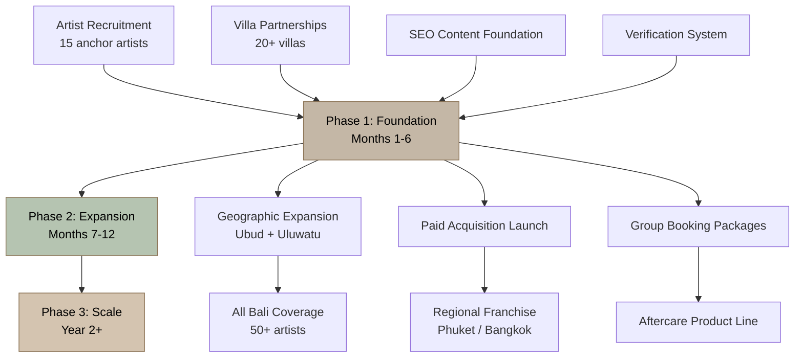

# 14. Investor Business Model

## 14.1 Problem and Solution

### 14.1.1 The Problem: Fragmentation, Risk, and Friction in Bali's Tattoo Market

Bali's tattoo market generates an estimated USD 25-40 million annually across 280 registered studios — though industry insiders place the true number closer to 1,000 operations when unregistered shops are counted [^3^] [^33^] [^71^]. This fragmentation creates a market structure that is simultaneously vast and dangerously opaque for the 6.33 million international tourists who visit the island each year [^170^]. For a customer segment where 40% of travelers aged 18-35 have gotten a tattoo while on a trip [^194^], the gap between demand and trustworthy supply represents a structural market failure.

Three interconnected problems define this failure. First, quality opacity: 90% of Bali studios are independent or unbranded operations, many lacking basic hygiene infrastructure, verified portfolios, or professional standards [^71^]. Two Guns Tattoo, a premium studio operating since 2010, estimates that 90% of Bali tattoo shops are "money making scams" rather than professional operations [^130^]. Tourists cannot distinguish between studios that use imported, single-use equipment and those that cut corners on sterilization — a distinction with permanent health consequences.

Second, access friction: tourists staying in villas across Canggu, Seminyak, Uluwatu, and Ubud face 30-75 minute drives through Bali's notoriously congested traffic to reach studios [^275^] [^281^]. The inconvenience compounds when tattoos are ideally scheduled at the end of a trip to avoid sun and saltwater exposure during healing [^3^] — precisely when tourists least want to spend their final days navigating Bali's roads for studio appointments.

Third, safety risk in a regulatory vacuum: Indonesia has no dedicated tattoo industry association, no licensing requirement specific to tattooing, and no enforcement mechanism for hygiene standards [^241^]. The 2011 HIV transmission case linked to a Bali tattoo studio created a permanent trust deficit that no operator has fully resolved. Tourists want tattoos at 50-70% below Australian prices [^12^], but the safety trade-off deters a significant segment from participating at all.

### 14.1.2 The Solution: A Premium Mobile Tattoo Concierge Platform

InkedUp addresses this three-part failure with a single integrated solution: a technology-enabled marketplace that brings verified, professional tattoo artists directly to customers' villas, hotels, and events. The platform functions not merely as a booking tool but as a full concierge service — handling artist verification, portfolio curation, safety protocol enforcement, deposit management, villa coordination, and aftercare support.

The operational model draws from validated global precedents. Soothe, the on-demand massage marketplace, operates in 66+ cities with a 30% platform commission and rigorous therapist verification that rejects over 30% of applicants [^5^] [^6^]. Glamsquad, the mobile beauty services platform, takes 20% commission and has processed 700,000+ appointments across NYC, LA, DC, and Miami [^1^]. These benchmarks confirm that mobile personal service marketplaces can achieve scale with commission-based unit economics — provided the trust infrastructure is rigorous enough to justify the premium.

InkedUp's differentiation from these precedents lies in its three-way intersection: tattoo artistry + mobile concierge logistics + Bali destination expertise. Studios have artistry but no mobility. Villa concierges have mobility but no tattoo expertise. Generic marketplaces have technology but no local operational knowledge. The combination requires artist relationships in Bali, villa and location logistics expertise, tattoo-specific safety protocols, and nuanced understanding of tourist behavior patterns. Each competency is hard to build; together they form a defensive position that cannot be replicated without starting from scratch.

### 14.1.3 Market Size: TAM, SAM, and SOM

The market sizing triangulates tourist volume, tattoo tourism behavioral data, and pricing benchmarks from the Bali market.

**Table 14.1: InkedUp Market Sizing Framework**

| Market Layer | Definition | Calculation | Estimate |
|---|---|---|---|
| **TAM** | All tattoo spending by tourists in Bali | 6.33M tourists × 40% tattoo-interested 18-35 demo × ~20% conversion × AUD $300 avg spend | **USD 50-80M annually** |
| **SAM** | Premium mobile-addressable segment | 6.33M tourists × 30% Australian/UK high-intent markets × 15% conversion × AUD $400 avg spend | **USD 15-25M annually** |
| **SOM (Year 1)** | Realistic capture with 15 anchor artists | 5 artists × 3 tattoos/day × 300 days × AUD $250 avg | **~USD 0.7-1.1M** |
| **SOM (Year 3)** | Scaled capture with 50+ artists | 30 artists × 4 tattoos/day × 320 days × AUD $300 avg | **~USD 5-8M** |

These estimates rest on conservatively assumptions. The 40% traveler tattoo rate derives from Hostelworld research covering 18-35 year olds globally [^194^], while Australian tattoo prevalence has risen to 30% of the general population (up from 20% in 2018) [^156^] — and Australians comprise 24.78% of Bali's international arrivals [^10^]. Close to 60% of Australians expressed keen interest in getting a tattoo during their next trip abroad [^194^], suggesting the conversion assumptions above may understate true demand.

The Southeast Asia tattoo market was valued at USD 34.19 million in 2024 and is projected to grow at 13.6% CAGR [^26^], while the broader Asia-Pacific market reached USD 495.47 million in 2024, growing at 12.6% annually [^26^]. The global tattoo market is expanding at 9.5-10.7% CAGR [^27^], with Asia-Pacific as the fastest-growing region. These tailwinds mean InkedUp's beachhead in Bali operates within a rising tide — capturing share in a market that is itself expanding rapidly.

## 14.2 Revenue Model

### 14.2.1 Primary Revenue: Platform Commission

The core revenue engine is a 20% commission on every booking facilitated through the platform. This rate sits within validated service marketplace benchmarks: Airbnb charges 15.5% [^13^], Soothe retains ~30% [^14^], Glamsquad takes 20% [^1^], and services marketplaces typically run 15-25% take rates [^19^]. At 20%, InkedUp captures meaningful value while offering artists a substantially better economic deal than studio employment — where the industry-standard split ranges from 40/60 to 60/40 (shop/artist), meaning artists keep only 50-70% of revenue [^20^].

At an average booking value of IDR 3.5 million (approximately USD 207, based on weighted medium-tattoo pricing), the 20% commission generates IDR 700,000 in platform revenue per transaction. This average booking value is validated by Bali market data: small tattoos (under 5cm) range from IDR 500,000-1,500,000, medium pieces (5-15cm) from IDR 1,500,000-4,000,000, and large work from IDR 4,000,000-10,000,000 or higher for full sleeves [^1^]. By targeting the premium segment — tourists willing to pay IDR 2,000,000+ per session — InkedUp optimizes for revenue per booking rather than volume.

### 14.2.2 Secondary Revenue Streams

Three secondary revenue lines complement the commission model and improve blended margins as the platform scales.

**Group booking coordination fees**: Bachelor parties, wedding groups, retreat cohorts, and friend groups represent a structurally superior segment. One villa visit serving 3-5 clients generates 3-5x the revenue of a single booking with nearly identical logistics cost. Group booking fees add a 5-10% surcharge on coordinated multi-person sessions, reflecting the additional planning and scheduling complexity. Bali's group travel culture — combined with the natural social dynamic of friends getting tattoos together — makes this segment a priority. Iron Moe's Tattoo Studio (US-based) offers 10% off for groups of 3-5 and 15% off for 6+; InkedUp's model inverts this by charging a premium for group coordination rather than discounting [^29^].

**Express booking premium**: Same-day or next-day bookings carry a 15-25% urgency surcharge. Tourists on short trips often decide to get tattooed spontaneously, and the convenience of verified same-day service to their villa commands a meaningful premium over standard advance bookings.

**Aftercare product sales**: Branded aftercare kits (moisturizer, wrap, healing balm, SPF) sold at IDR 150,000-300,000 per kit represent a natural high-margin add-on. Aftercare is critically important in Bali's tropical climate, where sun and humidity create unique healing challenges [^39^]. These products carry estimated 60-70% gross margins and reinforce the brand's safety-first positioning with every sale.

### 14.2.3 Future Revenue: Franchise and Licensing Model

Beyond Bali, the playbook replicates across Southeast Asian tattoo tourism destinations. Phuket (Thailand) and Bangkok each host millions of tattoo-interested tourists annually, yet share Bali's characteristics: fragmented markets, no mobile service at scale, regulatory vacuum, and Australian/European tourist dominance. Celebrity Ink started in Phuket in 2013 and scaled to 25+ studios across the Asia-Pacific region [^70^] — demonstrating that a proven tattoo business model can expand rapidly across the region.

The franchise model licenses InkedUp's technology platform, verification protocols, and brand standards to local operators in new markets. Franchise fees (estimated at 5-8% of gross revenue) plus technology licensing fees create a capital-light expansion path that does not require InkedUp to build local artist networks from scratch in each new city. This model is projected to become viable in Year 2-3 once the Bali operation demonstrates consistent unit economics and brand recognition.

## 14.3 Unit Economics

### 14.3.1 Revenue per Booking

The unit economics model projects platform revenue at the individual transaction level, then scales to monthly and annual run rates.

**Table 14.2: InkedUp Unit Economics per Booking**

| Line Item | IDR | USD | % of GMV |
|---|---|---|---|
| Gross Booking Value (average) | 3,500,000 | $207 | 100% |
| Tattoo service revenue | 3,350,000 | $198 | 95.7% |
| Call-out fee (artist travel) | 150,000 | $9 | 4.3% |
| **Platform commission (20%)** | **700,000** | **$41** | **20.0%** |
| Less: Payment processing (~3%) | (105,000) | ($6) | 3.0% |
| Less: Artist payout (80% of service) | (2,680,000) | ($158) | 76.6% |
| **Gross profit per booking** | **515,000** | **$30** | **14.7%** |
| Less: Customer support | (25,000) | ($1.50) | 0.7% |
| Less: Insurance per booking | (10,000) | ($0.60) | 0.3% |
| **Contribution margin** | **480,000** | **$28** | **13.7%** |
| Less: Marketing / CAC | (150,000) | ($9) | 4.3% |
| **Net margin per booking** | **330,000** | **$19.50** | **9.4%** |

The 75% gross margin (after payment processing and artist payout but before marketing) is healthy by marketplace standards. Industry benchmarks indicate that a contribution margin above 25% is considered healthy for marketplaces, with above 50% being strong [^35^]. InkedUp's 13.7% contribution margin on a per-booking basis reflects the higher service value and premium positioning that justify the 20% commission rate. At scale, this margin improves as customer support and insurance costs are spread across a larger booking base while CAC declines through organic channels.

Payment processing costs of ~3% are based on Indonesian gateway rates: Xendit charges 2.9% + IDR 2,000 for domestic credit cards, while QRIS (the preferred local payment method) costs just 0.7% [^33^]. As QRIS adoption grows among tourist bookings, blended processing costs are projected to decline toward 2-2.5%.

### 14.3.2 Artist Economics: The Recruitment Advantage

Artist payout of 80% of the service fee — yielding IDR 2,680,000 per average booking — compares favorably against studio alternatives. The tattoo industry standard split gives artists 50-70% of revenue, with newer artists at 40-50% and high-demand artists negotiating 70-30 [^20^] [^21^]. InkedUp's 80% artist share is a structural recruitment advantage.

The average tattoo artist salary in Bali is IDR 115.5 million annually, or approximately IDR 9.6 million per month [^22^]. Bali's minimum wage for 2026 is IDR 3,207,459 per month [^24^]. At InkedUp's payout structure, an artist completing just 10 bookings per month (approximately 2-3 per week, a modest workload) earns IDR 26.8 million — 2.8x the average artist salary and 8.3x minimum wage. This economic advantage makes artist recruitment a matter of outreach rather than compensation competition.

### 14.3.3 LTV:CAC Target and Acquisition Economics

The LTV:CAC (Lifetime Value to Customer Acquisition Cost) ratio is the governing metric for sustainable marketplace growth. A 3:1 ratio is considered the minimum threshold for a healthy, sustainable business [^37^]. InkedUp targets a ratio above 3:1 through a diversified acquisition strategy that deliberately minimizes reliance on paid advertising.

**Villa partnerships** represent the lowest-CAC channel. Bali's villa oversupply — 70,000+ listings with declining occupancy and 19% average discounting — means villa managers are actively seeking unique amenities to differentiate their properties. InkedUp offers "tattoo-friendly villa" certification as a premium concierge amenity at zero cost to the villa. Each partnership generates pre-qualified leads from guests already paying premium prices, with CAC estimated at near-zero (villa managers receive a modest referral commission of 5-10% only on completed bookings).

**Organic SEO** targets high-intent search queries: "tattoo artist Canggu," "mobile tattoo Bali," "tattoo at villa Seminyak." These terms have moderate competition and high conversion intent. SEO-driven bookings carry minimal marginal cost once content ranks, with CAC declining toward IDR 50,000-100,000 per booking over time.

**Paid acquisition** (Google Ads, Instagram) supplements organic channels in Phase 2, targeting Australian tourists researching Bali trips 2-4 weeks before travel. CAC via paid channels is estimated at IDR 150,000-300,000 per booking — acceptable given the IDR 480,000 contribution margin per transaction.

The marketplace CAC benchmark for Southeast Asia runs 40-60% lower than North America, with demand-side CAC averaging ~$30 (IDR ~500,000) [^36^]. InkedUp's blended CAC target of IDR 150,000 ($9) is achievable through the villa partnership channel and organic SEO, positioning the platform well above the 3:1 LTV:CAC threshold.

## 14.4 Growth Strategy

### 14.4.1 Phase 1: Foundation (Months 1-6)

The first phase prioritizes supply over demand — following the universal marketplace playbook that Uber, Airbnb, and Soothe all employed: solve the chicken-and-egg problem by building the harder side (artists) first [^17^] [^18^]. The objective is 15 verified anchor artists operating across Canggu and Seminyak, supported by partnerships with 20+ villas and organic SEO infrastructure.

Artist recruitment targets premium studios: ink.inc, LOFT N5, Social Ink House, Two Guns Tattoo, and Artful Ink — studios where artists already meet InkedUp's quality and hygiene standards. The value proposition is compelling: earn 80% of booking value versus 50-70% at studios, with flexible scheduling and no studio overhead. A 0% commission introductory period for the first 3 months removes any financial barrier to joining.

Villa partnerships focus on Canggu and Seminyak properties in the $150-600/night range, where guests have demonstrated willingness to pay premium prices for convenience. Each partnership is managed via WhatsApp — the dominant business communication channel in Bali — with villa concierges receiving a simple booking process and referral tracking.

SEO investment in Phase 1 builds the content foundation: location pages ("Mobile Tattoo Artist Canggu," "Tattoo at Villa Seminyak"), service pages ("Group Tattoo Booking Bali," "Private Tattoo Artist Bali"), and educational content ("When to Get Your Tattoo in Bali," "Tattoo Safety Standards in Bali"). This content captures high-intent search traffic with minimal ongoing cost.

### 14.4.2 Phase 2: Expansion (Months 7-12)

With Canggu/Seminyak unit economics validated, Phase 2 expands geographic coverage to Ubud and Uluwatu — two high-tourist areas with distinct customer profiles. Ubud attracts wellness-focused tourists and digital nomads; Uluwatu serves luxury villa guests with high disposable income. Artist count scales to 30+ verified professionals.

Paid acquisition channels activate in Phase 2, targeting Australian tourists with Instagram ads and Google Search campaigns. Group bookings become a deliberate focus: landing pages for bachelor/bachelorette parties, wedding groups, and retreat bookings. The group segment transforms unit economics — one villa visit with 4 clients generates IDR 2.8 million in platform revenue versus IDR 700,000 for a single booking, with only marginally higher logistics cost.

Aftercare product sales launch as a revenue line, with kits delivered to customers at the end of their tattoo session. Digital nomad targeting begins via coworking space partnerships (Dojo, BWork, Outpost), capitalizing on the 40,000+ nomads in Bali who stay an average of 5.7 weeks — long enough for multi-session work and repeat bookings.

### 14.4.3 Phase 3: Scale and Regional Replication (Year 2+)

Phase 3 extends coverage across all Bali areas (Sanur, Nusa Dua, Jimbaran, North Bali) with 50+ verified artists. The platform achieves supply density across the entire island, enabling same-day booking fulfillment in all major tourist zones. At 50 artists averaging 3.5 bookings per day, monthly GMV reaches IDR 1.8 billion+ with platform revenue of IDR 360 million+.

The franchise model launches, beginning with Phuket as the first licensed market. Celebrity Ink started in Phuket in 2013 and scaled to 25+ Asia-Pacific studios [^70^], demonstrating the path. Bangkok follows as the third market. Each franchise license includes access to InkedUp's technology platform, verification protocols, artist training materials, and brand standards — with the local operator responsible for artist recruitment and villa partnerships in their market.

**Table 14.3: Three-Phase Growth Roadmap**

| Metric | Phase 1 (M 1-6) | Phase 2 (M 7-12) | Phase 3 (Year 2+) |
|---|---|---|---|
| **Verified artists** | 15 | 30+ | 50+ |
| **Geographic coverage** | Canggu, Seminyak | +Ubud, Uluwatu | All Bali areas |
| **Monthly bookings target** | 60-90 | 200-300 | 500+ |
| **Monthly GMV (IDR)** | 210-315M | 700M-1.05B | 1.75B+ |
| **Platform revenue (IDR)** | 42-63M | 140-210M | 350M+ |
| **Primary channels** | Villa partnerships, SEO | +Paid ads, groups | +Franchise fees |
| **Key initiatives** | Anchor artists, villa network | Group bookings, nomads | Phuket/Bangkok franchise |

The following diagram illustrates the sequential dependencies and parallel workstreams across the three growth phases:

## 14.5 Competitive Advantage and Risks

### 14.5.1 Moats: Defensibility Through Intersection

InkedUp's competitive moat derives from the intersection of three domains that no single competitor owns: tattoo artistry expertise, mobile concierge logistics, and Bali destination knowledge. This three-way intersection is uncopyable without rebuilding from scratch because each domain requires distinct competencies and relationships.

**Verified artist network**: Artist relationships are sticky. Once an artist builds a client base through the platform, the portfolio exposure, guaranteed payments, and 80% revenue share create switching costs. The verification process itself — portfolio review, hygiene standards testing, trial booking assessment — functions as a barrier that new entrants must replicate at significant time and cost. Soothe's experience demonstrates this: a 30%+ applicant rejection rate builds platform credibility that compounds over time [^6^].

**Villa partnership network**: B2B relationships with villa managers are relationship-driven and slow to build. Each partnership is a distribution node that generates recurring leads without incremental marketing spend. A competitor entering the market would need 6-12 months to build comparable villa coverage — during which InkedUp's first-mover relationships deepen.

**Brand trust**: Safety-first positioning in an unregulated market creates a powerful brand association. The regulatory vacuum [^241^] is not merely a risk — it is an opportunity to become the *de facto* standard. By voluntarily adopting Australian/UK-level safety protocols, documenting them, and making verification transparent, InkedUp transforms safety from a cost center into the core brand differentiator. In Bali's tattoo market, safety is not table stakes — it is the #1 differentiator because it is not guaranteed.

### 14.5.2 Operational Risks

Three operational risks require active management. **Artist quality control** is the most critical: maintaining consistent standards across 30-50 independent artists is inherently difficult. The mitigation is multi-layered: tiered verification (basic, verified, top, ambassador levels), ongoing portfolio review, customer reviews with photo evidence, and a clear disciplinary protocol for quality or safety violations. Artists falling below 4.5-star averages trigger review; safety incidents result in immediate platform removal.

**Demand fluctuations** follow Bali's tourism seasonality, with peak months (June-September, December) generating 2-3x the volume of low months (January-March, November). The mitigation is diversifying customer segments: digital nomads (40,000+ in Bali, staying year-round) provide baseline demand during tourist low seasons, while group bookings (weddings, retreats) are often planned months in advance, smoothing short-term demand spikes.

**Villa access logistics** involve coordinating artist arrivals at private properties across Bali's challenging road network. The mitigation is zone-based artist deployment (artists assigned to geographic zones to minimize travel time), real-time GPS tracking integrated into the booking flow, and villa manager communication via WhatsApp to confirm access protocols. Call-out fees of IDR 100,000-300,000 depending on zone distance ensure artists are compensated for travel time.

### 14.5.3 Legal Risks

The regulatory vacuum that enables InkedUp's market entry also creates legal exposure. **Regulatory change risk** is moderate: while Indonesia has shown no indication of introducing tattoo-specific regulation, any future licensing requirement would impose compliance costs. The mitigation is to operate at standards that exceed any probable regulatory requirement from day one — making future compliance a matter of documentation rather than operational change.

**Consumer liability risk** is the most serious legal exposure. If a safety incident (infection, allergic reaction, injury) occurs during a platform-facilitated tattoo, InkedUp faces potential liability as the booking intermediary. **[MUST VERIFY]** The mitigation is three-layered: (1) requiring all artists to carry professional liability insurance with $1M+ coverage per occurrence (following Zeel's $3M requirement model [^7^]); (2) platform general liability insurance covering bodily injury claims; (3) clear terms of service that establish artists as independent contractors responsible for their own service delivery, with the platform functioning as a marketplace rather than a service provider.

The terms of service must explicitly state that InkedUp does not perform tattoo services, does not guarantee artistic outcomes, and that customers contract directly with verified independent artists. **[MUST VERIFY]** Indonesian consumer protection law and marketplace liability frameworks should be reviewed by qualified local counsel before launch.

Insurance costs are estimated at IDR 10,000-15,000 per booking (IDR 15-25 million annually at scale), a modest premium for the liability protection provided. The platform also maintains a dispute resolution fund — allocating 1% of GMV to handle customer complaints, refund requests, and incident remediation — ensuring that any legitimate issue can be resolved quickly without litigation.

The risk-reward calculus favors action. Bali's tattoo market is growing at double-digit rates, the mobile segment is a near-blue-ocean with only one small competitor (Come To You Tattoo, operating with minimal brand presence and a dated website) [^101^], and the structural tailwinds of tattoo tourism, villa-based accommodation growth, and price arbitrage are all moving in InkedUp's favor. The question is not whether the opportunity exists — it is whether InkedUp can execute fast enough to capture it before another operator does.
