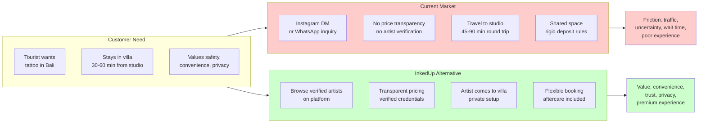

## 19. Competitor Analysis

The Bali tattoo market presents a paradox that is InkedUp's single greatest opportunity: over 30 verified studios generate tens of thousands of reviews and estimated billions of rupiah in annual revenue, yet not one has built a genuine mobile-to-villa service with verified artist credentials and transparent pricing. This chapter maps the competitive landscape across Canggu, Seminyak, and Kuta/Legian, and identifies the systematic weaknesses that create InkedUp's market entry path.

### 19.1 Canggu Competitors

Canggu is the epicentre of Bali's tattoo economy. The concentration of Australian, European, and North American tourists, combined with a high density of digital nomads and villa accommodations, has attracted the island's most ambitious studios. Four competitors dominate the landscape, each with distinct positioning and exploitable gaps.

#### 19.1.1 Social Ink House

Social Ink House operates on Jl. Pantai Batu Bolong, the busiest thoroughfare in Canggu, and has built its reputation on Australian ownership and international hygiene standards. Established for over seven years, the studio markets itself as "the premier studio renowned for unmatched customer experience and top-tier quality," offering styles ranging from traditional Balinese to realism. [^213^] Their hygiene positioning is deliberate and consistent — the website and third-party profiles both emphasize "strict adherence to international standards." [^1^]

The operational reality, however, reveals a studio bound by geography. Batu Bolong traffic is among the worst in Bali. Customers must navigate congested streets, find parking (nearly impossible after 10:00 AM), and wait in a studio that, while clean, offers no privacy for nervous first-timers. Social Ink House has no mobile service, no digital booking platform beyond Instagram DM, and no transparent pricing. For a customer staying in a villa in Berawa or Pererenan, the journey to Batu Bolong can consume 45 minutes each way — time that a premium traveller values at significantly more than the cost of a mobile service.

#### 19.1.2 LOFT N5

LOFT N5 occupies a distinctive niche as a five-artist collective located 300 metres from Canggu beach on Jl. Nelayan. Their pricing is the most transparent in the market: IDR 2,000,000 per hour (approximately USD 130), charged only for actual tattooing time with stencil application provided free. [^40^] This honesty-based pricing model, combined with their community-focused branding — "we don't compromise on our integrity or hygiene standards" — has earned them a loyal following among style-conscious tourists. [^43^]

The premium pricing, however, creates a natural ceiling. At IDR 2M per hour, LOFT N5 sits at the upper bound of what most tourists will pay in Bali, even for high-quality work. Their five-artist collective structure means limited availability during peak season, and like every Canggu competitor, they are studio-bound. The beach-proximity location is pleasant but irrelevant to the customer who wants service in their villa. LOFT N5's model validates that premium pricing works in Canggu — it does not, however, solve the convenience problem.

#### 19.1.3 Koloni Tattoo

Koloni Tattoo in Berawa positions around social impact, donating a portion of profits to the Happy Mattress Project benefiting Balinese children. [^35^] The studio offers both tattoos and piercings, drawing from a pool of international artists, and customer reviews consistently praise the welcoming atmosphere and artist patience. [^35^]

The weakness is reach. Koloni's Instagram following sits at approximately 3,400 followers — an order of magnitude below competitors like Inked Up Tattoo Parlour (55,000+). [^177^] Without mobile service or a strong digital presence, they rely on walk-ins and word-of-mouth. The charity angle is authentic but does not drive acquisition in a market where tourists book based on Google reviews and Instagram portfolios. Koloni demonstrates that community focus alone is insufficient to scale.

### 19.2 Seminyak Competitors

Seminyak represents the established, older tier of Bali's tattoo industry. Studios here have longer histories, stronger brand recognition among repeat visitors, and more rigid operational models — making them slower to adapt to new service concepts.

#### 19.2.1 Artful Ink

Artful Ink bills itself as "the studio that put Bali on the international tattoo map," established in 2012 with locations in Seminyak and Ubud (the latter closed for relocation as of February 2026). [^11^] Session prices start from IDR 1.8 million. [^141^]

The operational friction, however, is severe. Artful Ink's deposit policy is the most punitive in the market: all deposits are non-refundable and non-transferrable, valid for only one year. Freehand work may be charged from the moment the pen touches skin, and full-day sessions carry a four-hour minimum charge. [^11^] For tourists whose plans shift, these policies create real financial risk — compounded by their studio-only model and the Ubud closure.

#### 19.2.2 TNT Tattoo

TNT Tattoo Studio carries 20 years of industry experience and multiple awards, operating on Jl. Raya Taman in Seminyak. [^83^] Their minimum charge of IDR 1,000,000 (AUD 100) places them in the accessible mid-range, and they offer both custom freehand and digital design work. [^186^] For tourists seeking a budget-friendly option with credible experience, TNT represents a safe choice.

The brand, however, shows its age. TNT's digital presence is limited — moderate Instagram following, a website not optimized for mobile booking, and cancellation policies that withhold deposits for any cancellation not attributed to emergency or illness. [^186^] TNT's aging digital footprint reduces discoverability among first-time visitors who research entirely through social platforms.

#### 19.2.3 Mason's Ink

Mason's Ink has relocated from its original Seminyak location (established 2014) to Batu Bolong in Canggu, where it now commands 3,148 Google reviews with a 5.0 rating. [^176^] [^79^] The studio positions itself as a "groundbreaking sanctuary" and "trailblazer" with 45+ artists, specialising in fine line, floral, and delicate work that appeals to first-timers. [^91^] Their family atmosphere and walk-in-friendly approach have made them one of Bali's most recognised names.

The scale that enables their volume is also their constraint. With 45+ artists, consistency is a genuine challenge — the high-volume model prioritises throughput over personalised service. Mason's Ink offers no mobile service and no individual artist verification. A customer booking through Instagram has no guarantee of which artist they will receive, creating the exact trust gap InkedUp's verified profiles are designed to fill.

### 19.3 Kuta/Legian Competitors

Kuta and Legian represent the mass-market segment of Bali's tattoo economy — higher volume, lower average spend, and greater tourist foot traffic. The competitors here are larger, more established, and more brand-recognised, but also more entrenched in studio-based, walk-in models.

#### 19.3.1 Two Guns Tattoo

Two Guns Tattoo has operated since 2010, originally Australian-owned and now under New Zealand ownership. They are members of the Professional Tattoo Association of Australia (PTAA) and emphasise hygiene standards that exceed Australian requirements. [^131^] With 1,189 Google reviews at a 4.9 rating, they have built a devoted repeat clientele for larger, ambitious pieces — half sleeves, full sleeves, and cover-ups. [^254^] Artist Rinton, in particular, commands a loyal following of return visitors. [^254^]

Their premium pricing reflects this positioning — one reviewer noted Two Guns is "more expensive than a usual Bali tattoo studio but for good reason," citing over 15 years of artist experience and high cleanliness standards. [^130^] Yet they remain a single-location studio in Legian with no mobile service. For a tourist in a Canggu villa 45 minutes away, quality is irrelevant if the friction of getting there outweighs the benefit.

#### 19.3.2 Celebrity Ink

Celebrity Ink Kuta Bali is the volume leader by review count, with 4,530 Google reviews and a 5.0 rating — the highest of any Bali studio. [^176^] [^128^] As part of a global franchise chain, they specialise in realism, black and grey, and custom tattoos, offering free consultations and emphasising an English-speaking team. [^128^] Their Australian-owned positioning and clear consultation process make them accessible to international travellers who may face language barriers at local studios.

The franchise model, however, creates the cookie-cutter problem — consistent but impersonal, the same experience available in Australia or Thailand without the local flavour Bali's premium segment demands. Their Kuta location on Jalan Legian subjects customers to the island's worst traffic, and like every competitor analysed, they offer no villa service, no verified artist profiles, and no transparent pricing.

#### 19.3.3 Get Inked At Bali Ink

Get Inked At Bali Ink is one of the oldest Australian-owned operations, established in March 2008 with dual locations in Kuta and Seminyak. [^125^] Their customer loyalty metrics are remarkable: over 50% of customers are returnees, and another 40% are recommended by returnees. [^125^] They follow Australian standard medical sterilisation and maintain a clean, professional work environment. [^119^]

Despite this loyalty base, Get Inked has not evolved its model. Their positioning remains walk-in focused with no premium tier, no mobile service, and limited brand differentiation beyond "Australian-owned since 2008." In a market where ink.inc builds luxury brands and LOFT N5 charges IDR 2M per hour with transparent pricing, Get Inked's lack of innovation leaves them vulnerable to a mobile-first competitor offering both convenience and trust verification.

### 19.4 Competitor Landscape at a Glance

The following table synthesises the nine primary competitors across key dimensions that determine InkedUp's positioning strategy.

| Dimension | Social Ink House | LOFT N5 | Koloni Tattoo | Artful Ink | TNT Tattoo | Mason's Ink | Two Guns | Celebrity Ink | Get Inked |
|---|---|---|---|---|---|---|---|---|---|
| **Location** | Canggu | Canggu | Canggu (Berawa) | Seminyak | Seminyak | Canggu | Legian | Kuta | Kuta + Seminyak |
| **Est.** | 7+ yrs | ~5 yrs | ~4 yrs | 2012 | 20+ yrs | 2014 | 2010 | Franchise | 2008 |
| **Google Reviews** | N/A | N/A | N/A | N/A | N/A | 3,148 (5.0) | 1,189 (4.9) | 4,530 (5.0) | N/A |
| **Pricing** | Premium (undisclosed) | IDR 2M/hr [^40^] | Premium (undisclosed) | From IDR 1.8M [^141^] | Min IDR 1M [^186^] | Premium (undisclosed) | Above avg [^130^] | Undisclosed | Undisclosed |
| **Mobile Service** | No | No | No | No | No | No | No | No | No |
| **Transparent Pricing** | No | Yes | No | Partial | Yes | No | No | No | No |
| **Digital Booking** | IG DM | IG DM | IG DM | Email/Form | WhatsApp | IG DM | Email | Form/Walk-in | Walk-in |
| **Verified Artist Profiles** | No | Partial (5 artists) | Partial | No | No | No (45+ artists) | No | No | No |
| **Trust Verification** | Self-reported | Self-reported | Self-reported | Self-reported | Self-reported | Self-reported | PTAA member [^131^] | Franchise std | Self-reported |
| **Cancellation Flexibility** | Unknown | Unknown | Unknown | Non-refundable [^11^] | Strict [^186^] | Unknown | Unknown | Unknown | Unknown |

**Analytical interpretation:** Across nine competitors representing the most visible brands in Bali's tattoo market, zero offer true mobile-to-villa service. Only two — LOFT N5 and TNT Tattoo — publish transparent pricing. Only one — Two Guns Tattoo — holds an external verification credential (PTAA membership). None offer individual artist verification beyond self-reported claims, and all rely on informal booking channels (Instagram DM, WhatsApp, or walk-in) rather than a structured digital platform. This is not a competitive market; it is a collection of independent operators with shared blind spots.

### 19.5 Strategic Weaknesses Across All Competitors

The competitor analysis reveals three structural gaps universal across the Bali tattoo market — fundamental business model failures that InkedUp is designed to exploit.

#### 19.5.1 The Mobile Service Gap: Zero True Villa Delivery

Not a single competitor among the nine profiled offers genuine mobile tattoo service to villas or hotels. The only operation attempting mobile service is Come To You Tattoo Studio Bali, a small operator with a dated website, minimal portfolio, and virtually no brand awareness or social following. [^101^] [^278^] Their existence validates the concept; their execution reveals the gap.

Some studios offer partial solutions. Inked Up Tattoo Parlour provides free airport pickup and drop-off. [^84^] Two Guns Tattoo and Anchor Tattoo offer hotel pickup in some packages. [^3^] But pickup is not mobile service — it is transportation to a studio. The customer still travels, still waits in a shared space, and still loses the privacy and convenience of their villa environment.

Bali traffic makes this gap economically significant. A customer staying in Uluwatu reported taking 45 minutes to reach their studio appointment. [^281^] Bali's traffic is "notoriously bad around tourist areas, with development outpacing road infrastructure." [^275^] For a tourist paying USD 150-500 per night for a villa, spending two hours in traffic for a tattoo appointment undermines the entire value proposition of a premium Bali holiday.

#### 19.5.2 The Trust Gap: Unverified Claims, Opaque Pricing, No Insurance

Every competitor makes hygiene and safety claims — "international standards," "Australian health standards," "hospital-grade sterilisation" — yet none provide verifiable documentation. [^1^] [^131^] [^125^] There is no third-party audit, no insurance transparency, no certification a customer can review before booking.

The consequences are real. Quiet Ink Studio Canggu, despite 2,646+ Google reviews, was accused of doubling a quoted price upon arrival, blaming an "Instagram mistake" — the customer waited nearly an hour before being informed. [^285^] Canggu Ink Club has complaints about being "overwhelming with the amount of bookings," with one reviewer waiting 30 minutes past their appointment. [^255^] [^256^]

The pricing opacity compounds the trust problem. Tattoo prices in Bali range from IDR 300,000 for small pieces to IDR 15,000,000 for full-day sessions, with hourly rates spanning IDR 800,000 to IDR 3,000,000. [^12^] Most studios do not publish pricing, requiring an in-person consultation — a deliberate friction that forces commitment before disclosure. Tourists face a double uncertainty: they cannot verify quality before arrival, and they cannot determine cost before consultation.

#### 19.5.3 The Technology Gap: WhatsApp and Instagram as "Booking Systems"

Every competitor in this analysis relies on the same booking infrastructure: WhatsApp messages, Instagram direct messages, or walk-in availability. [^84^] There is no marketplace platform, no artist comparison tool, no secure payment system, and no review system tied to individual artists rather than studios.

This technology gap has operational consequences. Customers cannot browse verified artist portfolios with filtering by style, experience, and price, or compare artists across studios without managing multiple WhatsApp conversations. Studio-level reviews on Google Maps aggregate feedback across dozens of artists, making it impossible to evaluate individual quality.

The deposit and cancellation policies reflect this primitive infrastructure. Most studios require non-refundable deposits of 20-50% of the tattoo price. [^5^] Artful Ink's deposits expire after one year. [^11^] TNT Tattoo withholds deposits if a customer cancels to visit a different studio. [^186^] These punitive policies exist because without a digital booking system, last-minute cancellations create real operational costs that studios cannot absorb. A mobile marketplace with dynamic scheduling, waitlists, and artist reallocation can offer flexibility that studio-based operators structurally cannot match.

**The strategic implication is direct:** Bali's tattoo market is not overcompeted — it is underinnovated. The top nine competitors by brand recognition, review volume, and market presence all share the same three structural weaknesses: no mobility, no verification, and no technology. Each of these weaknesses is individually exploitable. Together, they create a competitive entry path that no single incumbent can easily close without rebuilding their entire operational model. A studio with 45 artists, a 5.0 Google rating, and 3,000+ reviews cannot pivot to mobile service without cannibalising its foot-traffic revenue, retraining its entire workforce, and redesigning its cost structure. InkedUp enters the market with none of these legacy constraints — built mobile-first, verification-first, and platform-first from day one.
